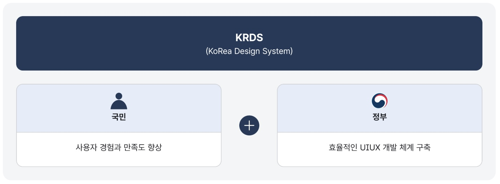
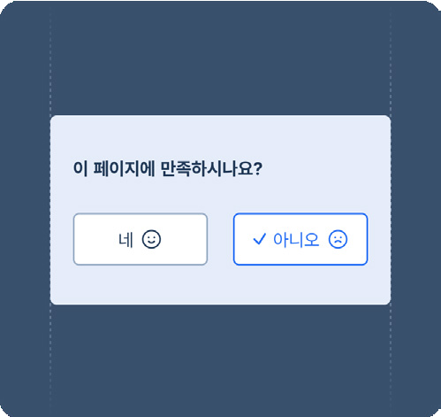
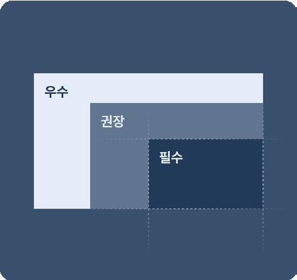

'디지털 정부서비스 UI/UX 가이드라인'은 디지털 서비스를 구성하는 여러 사용자 인터페이스(User Interface; UI) 요소 중 사용 빈도가 높고 사용자 경험(User Experience; UX) 품질에 큰 영향을 주는 공통 구성 요소, 핵심 과업에 대한 설계·구현 가이드 등 「전자정부법」, 「행정기관 및 공공기관 정보시스템 구축·운영 지침」, 「전자정부 웹사이트 품질관리 지침」에 따라 행정기관 및 공공기관이 준수해야 할 디지털 정부서비스 UI/UX에 대한 세부 사항을 제시한다.
## 도입 배경

대한민국 디지털 정부서비스는 그간 디지털 기술을 적극적으로 수용하여 세계적인 수준의 전자 정부 서비스를 구현하였다. 이러한 디지털 서비스에 기반하여 행정서비스 이용 방법은 점차 대면에서 온라인으로 변화하고 있으며, 국민의 공공서비스 이용 효율성과 생산성은 크게 향상되었다. 그러나 2022년 전자정부서비스 이용 실태조사 결과 등에 따르면 이용자 입장에서 디지털 정부 웹·앱의 이용은 복잡하고 어려워 개선이 필요한 것으로 나타났다.

주요 디지털 정부서비스 웹·앱에 대한 사용자 이용 경험 조사 결과와 UI/UX 분석 결과에 따르면 이용 불편의 주요 원인은 동일한 행동을 반복적으로 요청하거나 직관적이지 않고 불명확한 설명으로 인해 스스로 문제를 해결할 수 없는 것, 유사한 목적과 기능을 제공함에도 불구하고 서비스별로 이용 절차와 표현 방식에 일관성이 없어 혼란스럽고 학습이 필요한 데 있었다.

위와 같은 문제를 해결하기 위해 디지털 정부서비스 구축 및 운영에 참여하는 많은 사람이 끊임없이 노력을 기울이고 있으나, 수많은 디지털 정부 웹·앱의 UI/UX를 기관 또는 부서별로 각각 개발하면서 공공 웹·앱 전반을 고려한 UX 최적화와 수준 향상이 한계에 도달한 실정이다. 이에 국민이 다양한 공공 웹·앱을 직관적이고 일관성 있게 사용함으로써 불필요한 시간 낭비를 줄이고, 범정부 차원에서 효율적인 UI/UX 개발 체계를 구축하기 위한 기준을 마련하기 위해 본 가이드라인을 개발하게 되었다.

## 목적

본 가이드라인의 개발 목적은 다음과 같다.

첫째, 사용자 경험의 제고와 이용자 만족도 향상 모든 디지털 정부서비스의 UI/UX를 일관된 기준에 따라 설계함으로써 사용자가 편리하고 효과적으로 디지털 정부서비스를 이용할 수 있도록 만든다.

둘째, 사용자 경험을 향상하기 위한 접근 방법과 지침 제시 모든 디지털 정부서비스의 UI/UX를 일관된 기준에 따라 설계함으로써 사용자가 편리하고 효과적으로 디지털 정부서비스를 이용할 수 있도록 만든다.

셋째, UI/UX 개발 및 관리에 투입되는 비용 절약 본 가이드라인은 디지털 정부서비스를 개발하는 데 참고할 수 있는 일관된 기준을 제시하여 참여자들 간 소통을 지원하고 의사결정에 필요한 노력을 줄여준다. 또한 잘못된 설계로 인한 수정·보완을 최소화하여 비용 절감에 도움을 줄 수 있다.
## 개발 과정

본 가이드라인은 주요 디지털 정부 웹·앱에 대한 UI/UX 현황 분석 결과에 기반하여 개발되었다.

### 1. 분석 대상 선정

여러 유형의 디지털 서비스와 이용 환경에 참고 및 적용이 가능하도록 정보 전달, 민원 신청 등 가능한 한 다양한 디지털 정부서비스를 분석 대상으로 선정하였다.

### 2. UI/UX 현황 분석

관련 분야 전문가에 의한 평가 외에도 실증적인 사용자의 행동 데이터와 국민 평가 의견을 바탕으로 수행되었다.

### 3. 가이드라인 개발 범위 도출

종합적인 결과 분석을 통해 여러 서비스에서 빈번하게 사용되는 구성 요소, 반복적으로 발견되거나 서비스 이용을 단절시키는 UI/UX 문제를 선별하여 가이드라인의 개발 범위를 도출했다. 분석 과정에서 확인된 UI/UX 문제를 해결하기 위한 방안을 중심으로 가이드의 세부 내용을 구성하되 각 구성 요소를 사용할 때 일반적으로 준수해야 할 사항 역시 포함하였다.

### 4. 가이드라인의 구성과 내용 확정

최종적으로 분야별 전문가, 실제 디지털 정부서비스의 운영자·개발자로부터의 검토 의견 수렴과 가이드라인에 따라 개발된 사용자 인터페이스에 대한 사용성 평가가 실시되었다. 이 결과를 토대로 수정/ 보완을 거쳐 가이드라인의 구성과 내용을 확정하였다.
## 이용 대상

본 가이드라인은 디지털 정부서비스 기획·구축·운영·관리에 참여하는 모든 이들을 위해 개발되었다. 디지털 정부서비스 운영자, 관리자, 기획자, 디자이너, UI/UX 디자이너, 퍼블리셔, 개발자는 프로젝트의 상황과 목적에 맞게 본 가이드라인을 참고할 수 있다.

## 주요 특징

본 가이드라인의 주요 특징을 파악해 두면 가이드라인의 구성과 활용 방법, 제2장부터 제공되는 가이드라인 본문 내용을 더 쉽게 이해할 수 있다.

### 1. 사용자 관점의 핵심 UI/UX 문제를 해결할 수 있는 실질적인 방안 제시

- ▪ VOC, 국민평가, 사용성 및 접근성 진단 등 실제 사용자가 디지털 정부서비스 이용 시 겪게 되는 불편과 어려움을 분석
- ▪ 사용자 데이터 분석 결과를 기반으로 사용성 가이드라인, 접근성 가이드라인, 상호작용 가이드라인을 제시
- ▪ 구성 요소 및 단일 화면을 넘어 서비스 이용 목적 달성을 위한 사용자 여정을 고려하여 사용자 경험을 향상할 수 있는 구체적인 가이드라인을 제시

### 2. 가이드라인 적용의 실효성을 높이기 위한 콘텐츠 구성

- ▪ 원칙 - 디지털 정부서비스 UI/UX의 방향성과 설계 기준이 되는 상위 원칙
- ▪ 스타일 - 컴포넌트, 기본 패턴을 시각적으로 일관성 있게 표현하기 위한 규칙
- ▪ 컴포넌트 - 사용자 인터페이스의 가장 작은 단위로 과업에 상관 없이 일관성 있게 사용되는 공통 요소에 대한 가이드
- ▪ 기본 패턴 - 컴포넌트 요소들이 조합되어 핵심 과업을 수행하는 데 반복적으로 함께 사용되는 사용자 인터페이스 집합에 대한 가이드

- ▪ 서비스 패턴(핵심 과업 패턴) - 디지털 정부 웹·앱에서 제공하는 핵심 서비스에 대한 표준 절차와 사용자 경험 설계 가이드

### 3. 포용적인 UI/UX 설계 및 구현을 위한 구체적인 안내 제공

- ▪ 스타일, 컴포넌트, 기본 패턴, 서비스 패턴 등 구성 요소별 접근성 가이드라인 제공
- ▪ 웹 콘텐츠 접근성 관련 국제 표준(WCAG 2.1)의 적합도 수준 AA를 달성할 수 있는 기준 마련

### 4. 디지털 정부서비스로의 일관성을 확보하기 위한 가이드 제시

- ▪ 디지털 정부서비스 UI/UX 설계의 방향성과 목표 공유를 위한 디자인 원칙 명시
- ▪ 디지털 정부서비스 아이덴티티 요소 및 재사용 가능한 구성 요소 기반의 가이드 제공

### 5. 서비스별 고유한 특성과 유형을 고려한 유연한 기준 마련

- ▪ 기관 유형에 따라 선택 가능한 스타일 적용 기준 마련
- ▪ 디지털 정부서비스 분석에 기반하여 유형화된 구성 요소 설계 가이드 제공
- ▪ 서비스 운영 주체의 상황에 맞게 적용 가능하도록 서비스 패턴에 '필수(Do)

- 권장(Better) - 우수(Best)' 3단계의 적용 수준 제시

### 6. 가이드에 대한 이해도 향상과 정확한 적용을 위한 참고 예제 제공

- ▪ 핵심 서비스 패턴 가이드의 이해를 돕기 위한 표준 프로토타입
- ▪ 구성 요소별 용례와 유형, 구조를 파악할 수 있는 이미지 예제
- ▪ 사용성 가이드라인의 정확한 적용을 위한 모범 사례, 피해야 할 사례 이미지

### 적용 대상 및 기준

행정/공공기관이 구축 운영하는 모든 웹사이트, 모바일 웹·앱은 본 가이드라인의 원칙을 비롯하여 스타일, 컴포넌트, 기본 패턴, 서비스 패턴의 세부 가이드를 준수하여 UI/UX를 설계 및 구현해야 한다.

서비스 패턴의 사용성 가이드라인은 '필수-권장-우수' 3단계의 적용 수준 중 필수 항목을 우선 준수하고, 서비스 상황에 맞게 단계적 계획을 수립하여 권장, 우수 항목 순으로 적용 수준을 확장해 나간다.

### 1. 중앙행정기관 (대표)

| 구분 | 내용 |
|---|---|
| 대상 | 정부상징 로고를 사용하는 중앙행정기관(부/처/청) 및 소속기관 등의 대표 웹사이트, 모바일 웹·앱 |
| 적용 기준 | 1) 디지털 정부서비스 아이덴티티 요소의 사용 - 공식 배너 제공 - 헤더, 푸터의 스타일, 배치  2) 스타일 가이드 준수 - 색상, 서체, 형태, 배치, 아이콘 요소의 세부 가이드  3) 컴포넌트, 기본 패턴, 서비스 패턴의 세부 가이드 준수 |
| 예외 사항 | 정부상징 로고를 사용하지 않는 서비스는 중앙행정기관(운영서비스·시스템) 유형의 스타일 적용 기준을 따름 |

### 2. 중앙행정기관 (운영서비스·시스템)

| 구분 | 내용 |
|---|---|
| 대상 | 독자적 로고(브랜드)를 사용하는 중앙행정기관 소관의 서비스, 시스템, 포털 등의 웹사이트, 모바일 웹·앱 |
| 적용 기준 | 1) 디지털 정부서비스 아이덴티티 요소의 사용 - 공식 배너 제공 - 헤더, 푸터의 배치 - 운영기관 식별자 표시(선택)  2) 스타일 가이드 준수 - 색상, 서체, 형태, 배치, 아이콘 요소의 세부 가이드  3) 컴포넌트, 기본 패턴, 서비스 패턴의 세부 가이드 준수 |
| 예외 사항 | 정부상징 로고를 사용하는 웹사이트는 중앙행정기관(대표) 유형의 스타일 적용 기준을 따름 |

### 3. 공공기관 (대표·운영서비스·시스템)

| 구분 | 내용 |
|---|---|
| 대상 | 공공기관에서 운영하는 대표 웹사이트 및 서비스, 시스템, 포털 등의 웹사이트, 모바일 웹·앱 |
| 적용 기준 | 1) 디지털 정부서비스 아이덴티티 요소의 사용 - 헤더, 푸터의 배치 - 공식 배너 제공(선택) - 운영기관 식별자 표시(선택)  2) 스타일 가이드 준수 - 색상, 서체, 형태, 배치, 아이콘 요소의 세부 가이드  3) 컴포넌트, 기본 패턴, 서비스 패턴의 세부 가이드 준수 |

### 4. 지방자치단체

| 구분 | 내용 |
|---|---|
| 대상 | 지방자치단체에서 운영하는 대표 웹사이트 및 서비스, 시스템, 포털 등의 웹사이트, 모바일 웹·앱 |
| 적용 기준 | 1) 디지털 정부서비스 아이덴티티 요소의 사용 - 공식 배너 제공 - 헤더, 푸터의 배치 - 운영기관 식별자 표시(선택)  2) 스타일 가이드 준수 - 색상, 서체, 형태, 배치, 아이콘 요소의 세부 가이드  3) 컴포넌트, 기본 패턴, 서비스 패턴의 세부 가이드 준수 |

### 적용 수준 (서비스 패턴)

본 가이드라인의 구성 항목 중 서비스 패턴의 사용성 가이드라인은 사용자 관점에서의 중요도와 만족도를 기준으로 하여 3개의 적용 수준으로 구분되어 있다. 핵심 서비스에 대한 사용자 경험의 향상을 위해서는 기본적으로 최하위 적용 수준인 필수 수준의 가이드라인을 준수해야 한다.

적용 수준을 참고할 때는 가장 높은 수준의 적용 수준을 준수하였다고 해서 하위 적용 수준의 가이드라인 준수가 보장되지 않음에 유의해야 한다. 대부분의 최상위 적용 수준 가이드라인은 하위 수준의 가이드라인이 준수된 상태에서 효과를 나타내도록 구성되었다.
### 적용 수준 구분

가이드를 준수했을 경우

- 보편적인 기대 수준까지만 만족도가 증가할 수 있음 (기본적인 경험)

가이드를 준수하지 않았을 경우

- 작업 실패로 직접 이어짐
- 문제가 발생하면 사용자는 스스로 작업을 완료할 방법이 없음

필수

가이드를 준수했을 경우

- 더 많은 사용자의 만족도가 증가할 수 있음 (실용적인 경험)

가이드를 준수하지 않았을 경우

- 사용자의 작업 난도는 높아지지만 작업 실패를 초래하지는 않음
- 문제가 발생하더라도 사용자 스스로 해결 방법을 고안할 수 없음

권장

가이드를 준수했을 경우

- 제대로 적용되면 만족도가 기하급수적으로 커질 수 있음 (매력적인 경험)

가이드를 준수하지 않았을 경우

- 사용자는 불편을 느끼거나 비효율적인 절차를 경험할 수 있음
- 사용자마다의 다른 상황에 대한 최적의 경험을 제공하기 어려움

우수

## 활용 범위

본 가이드라인은 웹사이트, 모바일 웹·앱의 UI/UX 설계 및 개발에 참고할 수 있도록 개발되었다. 그러나 모바일 디바이스 운영 체제별로 지원되는 네이티브 사용자 인터페이스 컴포넌트와 상호작용 방식, 모바일 앱에 특화된 화면과 탐색 모델은 고려하지 않았다. 따라서 모바일 앱 설계 및 개발을 위해 본 가이드라인을 활용하는 경우에는 '모바일 서비스의 UI/UX 개선'을 참고하여 상황에 맞게 가이드라인을 활용하시기 바랍니다.

## 관련 법령

| 법령/지침 | 소관부처 |
|---|---|
| 전자정부법 | 행정안전부 |
| 행정기관 및 공공기관 정보시스템 구축·운영지침 | 행정안전부 |
| 전자정부 웹사이트 품질관리 지침 | 행정안전부 |
| 행정·공공기관 웹사이트 구축·운영 가이드 | 행정안전부 |
| 한국형 웹 콘텐츠 접근성 지침 | 과학기술정보통신부, 국립전파연구원 |
