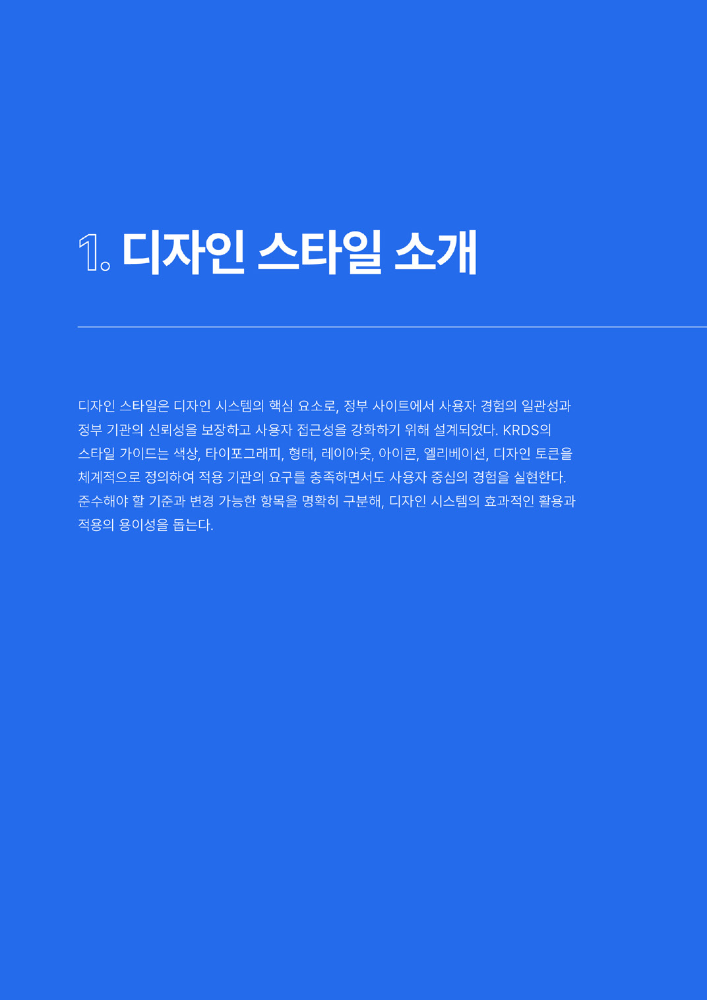
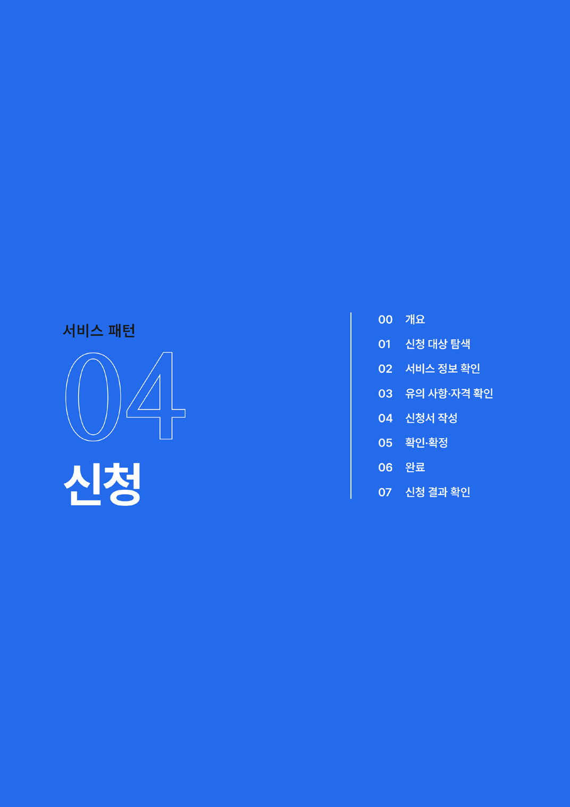
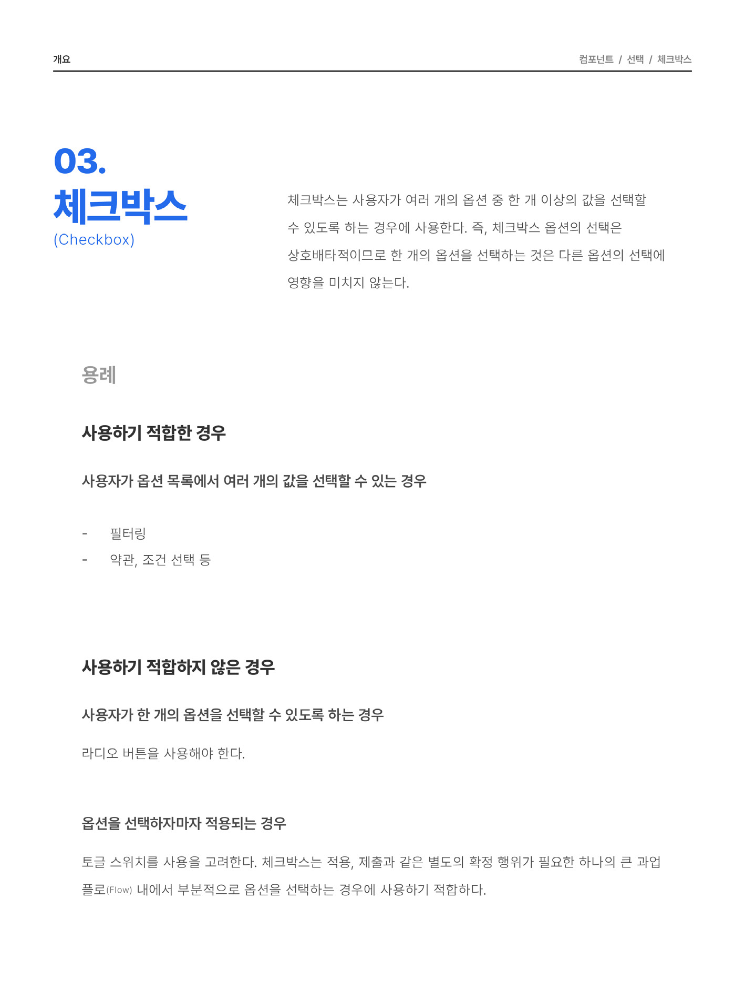
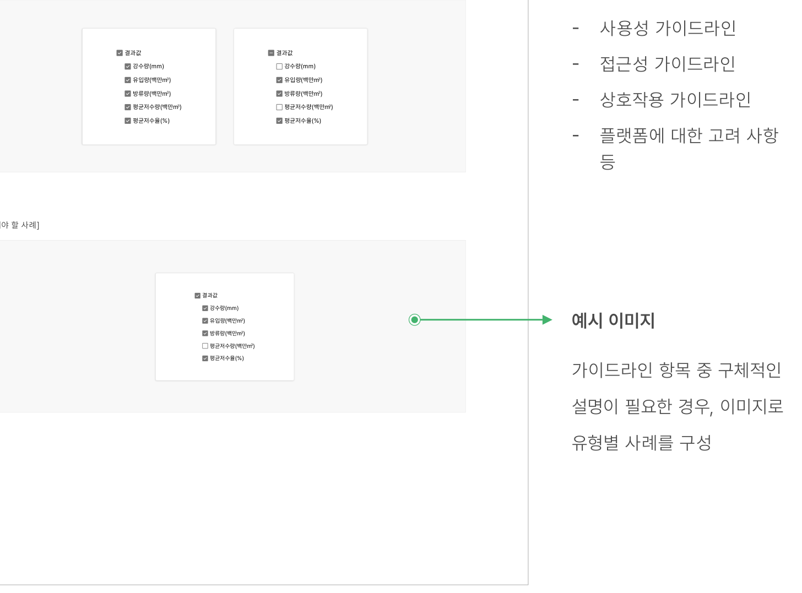
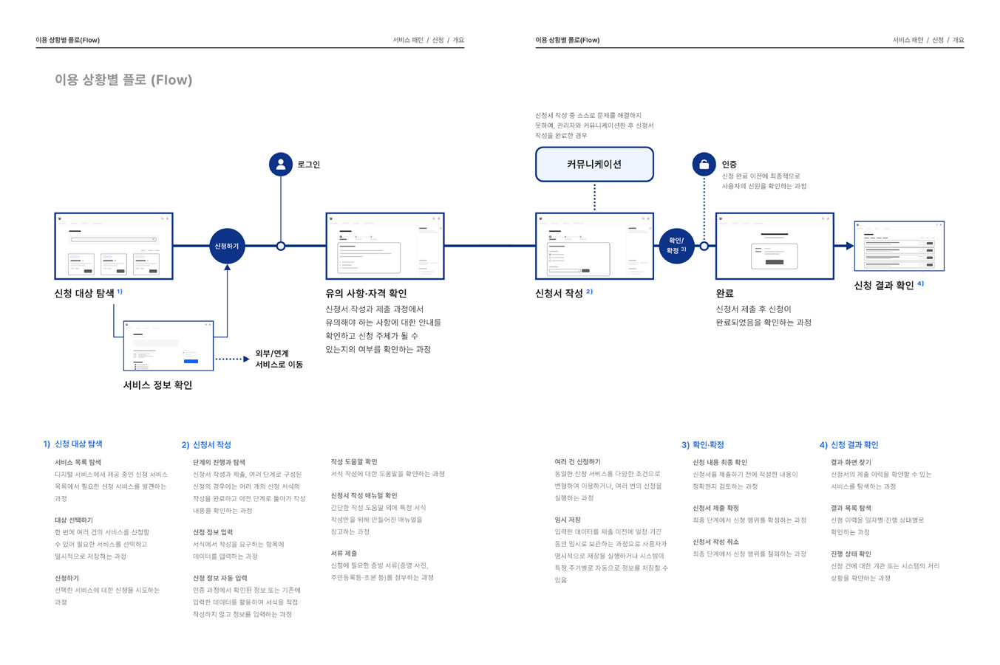

### 가이드라인의 구조

본 가이드라인은 5개의 수준으로 구성되어 있다. 이 중 '원칙'은 나머지 수준의 가이드라인을 포괄하며 디지털 정부서비스 UI/UX 설계에 대한 전체적인 방향성을 안내한다. 나머지 수준의 가이드라인은 UI/UX를 구성하는 세부 구성 요소이다.

디지털 정부서비스 UI/UX의 방향성과 설계 기준이 되는 상위 원칙

- ▪ 누구나 더 쉽고 편리한 디지털 정부서비스로서의 방향성과 UI/UX 혁신을 지향
- ▪ 각 원칙의 의미와 이유, 원칙을 따르기 위한 주요 방안을 제시

원칙

컴포넌트, 기본 패턴을 시각적으로 일관성 있게 표현하기 위한 규칙

- ▪ 일관성 있는 시각적 경험을 위해 사용자에게 가장 효과적으로 인지될 수 있는 스타일 요소
- ▪ 정부상징의 사용 여부에 따라 유연하게 활용할 수 있는 역할과 규칙 기반의 스타일 정의

스타일

사용자 인터페이스의 가장 작은 단위로 과업에 상관없이 일관성 있게 사용되는 공통 요소에 대한 가이드

- ▪ 보편적인 UI 요소를 바탕으로 디지털 정부서비스의 과업에서 빈번하게 사용되는 공통 구성 요소
- ▪ 각 컴포넌트의 특성과 상태, 역할에 따른 유형을 정의하고 사용하기에 적합한 용례를 제시
- ▪ 사용성 가이드라인, 접근성 가이드라인, 상호작용 가이드라인, 플랫폼에 대한 고려 사항 기술

컴포넌트

컴포넌트 요소들이 조합되어 핵심 과업을 수행하는 데 반복적으로 함께 사용되는 사용자 인터페이스 집합에 대한 가이드

- ▪ 디지털 정부서비스의 과업에서 공통으로 사용되는 과업 패턴을 선정
- ▪ 각 패턴이 사용되는 과업 유형을 정의하여 상황에 따라 유연하게 선택할 수 있도록 제시
- ▪ 사용성 가이드라인, 접근성 가이드라인, 상호작용 가이드라인, 플랫폼에 대한 고려사항 기술

기본 패턴

디지털 정부서비스에서 제공하는 핵심 과업에 대한 사용자 여정 기반의 사용자 경험 설계 가이드

- ▪ 사용자 분석 데이터를 기반으로 디지털 정부서비스의 핵심 과업을 선정
- ▪ 핵심 과업별 사용자 여정을 정의하고, 각 여정 단계에서 사용자 경험을 향상하기 위한 가이드와 모범적으로 설계된 표준 프로토타입을 제시
- ▪ 사용성 가이드라인, 접근성 가이드라인, 상호작용 가이드라인, 플랫폼에 대한 고려 사항 기술
- ▪ 서비스 상황별로 적용의 우선순위를 정할 수 있도록 '필수(Do) 권장(Better) - 우수(Best)' 3단계의 적용 수준 제시

서비스 패턴
### 구성 항목별 핵심 내용

### 문서의 탐색 방식

본 가이드라인의 구조와 항목을 쉽게 이해하고 탐색할 수 있도록 요소별로 세부 구성 목차를 배치하고,페이지마다 현재 위치를 표시하였다.





구성 항목의 구조

구성 항목의 타이틀 각 구성 요소의 설명

각 구성 항목의 구조를 쉽게 파악할 수 있도록 위계를 표시

세부 구성 목차

세부 항목의 순서와 내용을 확인할 수 있도록 목록을 배치


## 사용성 가이드라인

- 01 본문 콘텐츠의 제목을 신청 서비스명으로 제공한다.
- 02 상세 정보 콘텐츠는 간결하며 이해하기 쉽게 작성한다.
- 03 상세 정보는 정확하고 최신화된 상태로 제공한다.
- 04 서비스를 신청할 수 있는 모든 채널과 제약 사항에 대한 정보를 제공한다.
- 05 온라인으로 신청할 수 없는 상황에 대해 명확하게 인지 가능하도록 표현한다.
- 06 사용자가 신청 과업을 완료하는 데 필요한 모든 서식과 서류에 대해 안내하고 빠르게 접근할 수 있는 수단을 제공한다.
- 07 신청 과정과 처리 절차에 대한 정보를 제공한다.
- 08 일반적으로 신청 과정에 소요되는 기간 정보를 절차별로 안내한다.
- 09 사용자에게 도움을 줄 수 있는 다양한 부가 정보를 제공한다.
- 10 기본 정보는 한 화면에 확인 가능하도록 제공한다.
- 11 기본 정보는 첫 번째 탭에서 확인 가능하도록 제공한다.
- 12 부가 정보는 사용자가 필요에 따라 상세 내용을 확인할 수 있게 제공하는 방안을 고려한다.
- 13 모든 링크는 실행하였을 때, 링크 레이블에 명시된 적절한 화면으로 이동해야 한다.
- 14 목록 이동 버튼을 누르거나 사용자 에이전트에서 뒤로가기 동작을 실행하였을 때 사용자의 탐색 맥락이 유지되어야 한다.

현재 위치 표시

현재 보고 있는 페이지가 어떤 구성 요소의 콘텐츠인지 빠르게 파악할 수 있도록 정보 구조 표시

사용성 가이드라인 목록

가이드라인의 상세 내용을 확인하기 전에 전체 항목을 먼저 살펴보거나, 필요시 체크리스트로 활용 가능하도록 가이드라인 목록을 배치
### 가이드 콘텐츠의 구성

구성 요소별 가이드 콘텐츠 영역은 디지털 정부서비스로서의 공통된 경험을 제공하면서도 개별 서비스의 특성을 고려할 수 있도록 구성하였다.

구성 요소의 정의와 설명



구성 요소의 제목

용어 해석의 혼동을 방지하기 위해 국문과 영문을 병기

구성 요소의 속성

상황에 적합한 구성 요소의 선택이 가능하도록 용례, 유형, 구조를 설명
사용성 가이드라인


### 전체 선택 옵션이 제공되는 경우 중간 상태를 명확하게 표현한다.

하위 옵션의 일부만 선택되었음에도 불구하고 상위 옵션이 선택 상태로 유지되면 사용자에게 혼동을 줄 수 있다.

[모범 사례]



**사례 텍스트 보완**

```text
하위 옵션의 일부만 선택되었음에도 불구하고 상위 옵션이 선택 상태로 유지되면 사용자에게 혼동을 줄 수 있다.
```
[피해야 할 사례]

가이드라인 상세

해당 구성 요소 사용 시 참고해야 할 가이드라인의 구체적인 설명 제시

- 사용성 가이드라인
- 접근성 가이드라인
- 상호작용 가이드라인
- 플랫폼에 대한 고려 사항

등

예시 이미지

가이드라인 항목 중 구체적인 설명이 필요한 경우, 이미지로 유형별 사례를 구성
### 콘텐츠 간 연결 및 참조

서비스 패턴의 가이드를 기반으로 핵심 과업의 UI/UX를 설계하려면 관련 컴포넌트와 기본 패턴의 가이드를 함께 참고하는 것이 효과적이다. 본 가이드라인은 핵심 과업의 사용자 여정과 서비스 패턴의 연결, 구성 요소별 관련 항목 참조, 프로토타입 기반의 구조 설명 등을 통해 구성 요소 간의 연계성을 쉽게 이해하고 참조할 수 있도록 구성하였다.



사용자 플로(Flow)

과업을 수행하는 사용자 여정 기반으로 정의된 서비스 패턴의 이해를 돕기 위해 다양한 상황을 고려한 사용자 플로(Flow) 배치


### 관련 구성 요소

### 컴포넌트

관련 구성 요소

구조화 목록 링크 페이지네이션

콘텐츠 간 연계성을 쉽게 이해할 수 있도록 해당 구성 요소와 관련성이 높은 항목을 제시

### 기본 패턴

목록 탐색 필터링·정렬


## 구조

- 1 정렬 컨트롤: 검색 결과 목록의 순서를 변경하는 데 사용되는 컨트롤
- 2 필터 컨트롤: 검색 결과 목록을 특정 주제, 범주, 속성으로 제한하는 데 사용되는 컨트롤
- 3 스코프 필터: 웹사이트의 섹션 또는 콘텐츠 카테고리로 검색을 제한할 수 있음
- 4 고급 검색 버튼/링크: 정렬, 필터 컨트롤에서 제공되지 않는 보다 복잡한 검색 조건 설정에 접근할 수 있는 수단


### 관련 구성 요소

### 컴포넌트

구조화 목록 링크 페이지네이션

### 기본 패턴

목록 탐색 필터링·정렬

화면 UI의 구조

가이드라인이 적용된 모습에 대한 이해를 돕기 위해 세부 여정의 구조를 표준 프로토타입의 화면으로 제공

표준 프로토타입

해당 서비스 패턴의 가이드라인을 준수하여 제작된 프로토타입 배치

### 적용 기준과 수준의 표시

디지털 정부서비스를 구축하고 운영하는 과정에서 본 가이드라인의 모든 항목을 준수하려면 많은 시간과 노력이 필요할 수 있다. 가이드라인 적용의 실효성을 높일 수 있도록 본 가이드라인을 준수하기 위해 이해해야 할 각급 기관별 적용 기준과 서비스 패턴 사용성 가이드라인의 '필수-권장-우수' 항목 등에 관한 적용 수준을 명시하였다.


### 2. 중앙행정기관 (운영서비스·시스템)

구분 내용

적용 기준 대상 기관 및 서비스 유형에 따른 적용 기준을 명시

독자적 로고(브랜드)를 사용하는 중앙행정기관 소관의 서비스, 시스템, 포털 등의 웹사이트, 모바일 웹·앱

대상

- 1) 디지털 정부서비스 아이덴티티 요소의 사용
- 공식 배너 제공
- 헤더, 푸터의 배치
- 운영기관 식별자 표시(선택)
- 2) 스타일 가이드 준수
- 색상, 서체, 형태, 배치, 아이콘 요소의 세부 가이드
- 3) 컴포넌트, 기본 패턴, 서비스 패턴의 세부 가이드 준수

적용 기준

정부상징 로고를 사용하는 웹사이트는 중앙행정기관(대표) 유형의 스타일 적용 기준을 따름

예외 사항

적용 수준

사용자 관점에서의 중요도와 만족도를 기준으로 한 3개의 적용 수준 제시(필수 - 권장 우수)


### 검색 과업 맥락에서 벗어나 다른 페이지 또는 다른 탐색 수단에 빠르게 접근할 수 있도록 해야 한다.

사용자는 검색 결과에서 필요한 정보를 발견한 경우에 검색을 종료하기도 하지만, 다른 방식을 사용하여 서비스 정보 구조를 탐색하기로 결정한 경우 검색 과업의 맥락에서 벗어나기를 시도할 수 있다. 후자의 상황을 고려하여 검색 결과 화면에도 메인 메뉴, 사이트맵 같은 탐색 인터페이스를 제공해야 한다.

[모범 사례]

[피해야 할 사례]
