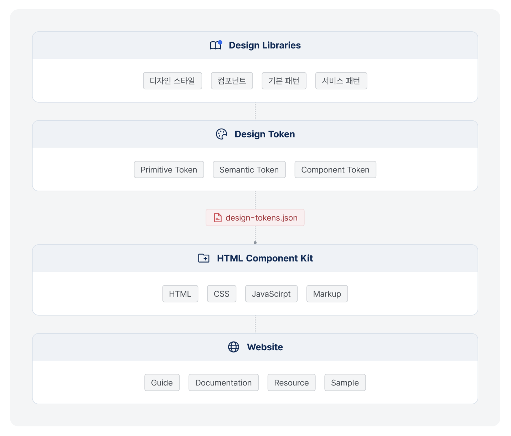
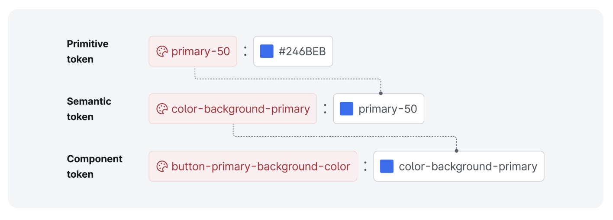

대한민국 디지털 정부서비스의 편의성, 일관성, 접근성, 사용성을 보장하기 위해 설계된 디자인 시스템이며, KRDS는 공공 서비스 웹사이트 및 애플리케이션에서 일관된 사용자 경험(UX)과 사용자 인터페이스(UI)를 제공하며, 다양한 디지털 정부서비스의 표준화를 목적으로 한다.

### 필요성

KRDS는 디자인 요소를 코드화(디자인 토큰)하여 디자이너, 개발자 등 실무자 간의 의사소통의 문제점과 작업 프로세스를 최소화하여 효율적인 과업 수행이 가능해진다.

KRDS의 디자인 라이브러리, 디자인 토큰, 그리고 HTML 컴포넌트 kit를 연동하는 작업은 공공 웹·앱 구축 및 운영에 필요한 디자인을 효율적으로 관리하고 일관성을 유지하는 핵심 과정이다.

### 1. 디자인 프로세스 효율화

### 2. 디자인 일관성 유지

### 3. 실무자 간 협업 개선

디자인 리소스와 컴포넌트를 체계 화하여 디자인 요소의 재생성 제고 등 작업 효율성 향상

색상, 타이포그래피, 간격 등의 디자 인 속성 코드화를 통한 중앙 집중화 관리 및 디자인 일관성 유지

디자인 토큰 네이밍 규칙을 코드로 정의하여 디자이너와 개발자가 동일 한 언어사용으로 커뮤니케이션 향상
## 구성 요소

KRDS 디자인 시스템은 디지털 정부서비스의 공공 프로젝트에 맞춘 디자인 시스템으로, 일관된 사용자 경험(UX)을 제공하고 효율적인 디자인 및 개발 프로세스를 지원하기 위해 정의된 규칙, 원칙, 컴포넌트, 스타일 가이드, 패턴 및 도구들의 모음이다.

## 역할

### 디자인 라이브러리

디자인 라이브러리는 UI/UX 디자이너가 사용하는 공통 컴포넌트를 정의하고 관리하는 공간이며, 이를 통해 UI 요소의 일관성과 재사용성을 유지할 수 있으며, 디자이너와 개발자가 동일한 기준을 이해하고 사용할 수 있도록, 모든 시각적 요소(예: 버튼, 색상 팔레트, 타이포그래피 등)를 체계적으로 정리한 것이다.

- 디자인 스타일 : 컴포넌트, 기본 패턴을 시각적으로 일관성 있게 표현하기 위한 규칙(색상, 서체, 형태 등)

- 컴포넌트 : 사용자 인터페이스의 가장 작은 단위로 과업에 상관없이 일관성 있게 사용되는 공통 요소(아이덴티티, 탐색, 선택 등)

- 기본 패턴 : 컴포넌트 요소들이 조합되어 핵심 과업을 수행하는 데 반복적으로 함께 사용되는 사용자 인터페이스 집합(입력폼, 도움, 동의 등)

- 서비스 패턴 : 디지털 정부서비스에서 제공하는 핵심 과업에 대한 사용자 여정 기반의 표준 프로토타입(방문, 로그인, 신청 등)
### 디자인 토큰

디자인 시스템에서 반복적으로 사용되는 디자인 속성을 효율적으로 관리하기 위한 일종의 추상화된 값을 변수로 정의한 코드이다. 색상, 글자, 간격, 그림자 등과 같은 스타일의 속성을 정의하고, 이를 코드로 변환하여 디자인 시스템 전반에 걸쳐 일관된 스타일을 유지할 수 있게 도와준다.

KRDS 디자인 토큰은 디지털 취약계층을 고려하여 설계된 스타일 가이드 토큰으로, 표준형 스타일을 준수하는 기관은 바로 적용할 수 있다. 확장형 스타일 가이드를 준수하는 기관은 각 부처의 특성에 맞는 색상과 모양을 테스트하고 적용할 수 있으며, 접근성 기준을 준수하기 쉽게 설계되어 있다.

- 프리미티브 토큰 (primitive token) : color, typo, space, radius 등 기본적인 디자인 속성을 정의하는 토큰 레벨이다.

- 시멘틱 토큰 (Semantic token) : 특정 맥락에서 의미를 가지는 속성으로 primitive tokens를 참조하여 정의하며 주로 특정 상태나 역할을 나타내는 데 사용한다.

- 컴포넌트 토큰 (Component token) : 특정 UI 컴포넌트(버튼, 입력필드, 카드 등)에 직접적으로 적용되는 구체적인 표현의 디자인 속성으로 semantic tokens을 참조하여 스타일을 정의한다.
### HTML 컴포넌트 kit

HTML 컴포넌트 kit는 디자이너가 정의한 UI 컴포넌트를 개발자가 쉽게 구현하고 재사용할 수 있도록 HTML, CSS, JavaScript로 구성된 웹 UI 컴포넌트 집합이며, 개발자가 HTML 컴포넌트 kit을 설치하여 디자인 시스템을 쉽게 적용할 수 있도록 가이드라인을 제공한다.

HTML 컴포넌트 kit를 사용하면 개발자는 기본적인 UI 요소를 직접 만드는 대신 재사용 가능한 컴포넌트를 활용하여 개발 속도를 높이고, 일관된 디자인을 유지할 수 있다.

특징

- 재사용 가능성 : 버튼, 폼, 모달, 네비게이션 바 등의 컴포넌트를 쉽게 코드화할 수 있다.

- 디자인 일관성 : 스타일이 통일된 컴포넌트를 제공하여 일관된 사용자 경험을 유지할 수 있다.

- 반응형 지원 : 많은 컴포넌트 kit는 모바일 및 다양한 화면 크기를 지원하도록 설계되어 있다.

- 확장 가능성 : 사용자 정의가 가능하여 프로젝트의 디자인 및 기능 요구 사항에 맞게 변경할 수 있다.

구성

- HTML 템플릿 : 구조적인 마크업으로 컴포넌트를 정의한다. (버튼, 텍스트 입력 필드, 페이지네이션 등)

- CSS 스타일 : 시각적 디자인과 레이아웃 등을 정의한다. (색상, 서체, 형태 등)

- JavaScript/JS : 동적 기능을 추가하여 상호작용을 가능하게 한다. (메인 메뉴, 모달, 콘텐츠 내 탐색 등)
### 웹사이트 (문서화 사이트, www.krds.go.kr)

KRDS 웹사이트는 디지털 정부서비스 UI/UX에 대한 철학을 전달하는 중심 허브로서, 디자인 시스템의 사용 방법, 목적, 규칙, 코드 샘플 등을 문서화하여 사용자(디자이너, 개발자, 정부 관계자 등)가 쉽게 참고할 수 있도록 디자인 시스템의 가이드와 예제를 제공한다. 또한, 위의 모든 것이 프로젝트팀과 유기적으로 연결되어 일관성과 효율성을 극대화할 수 있도록 커뮤니케이션 창구 역할을 수행한다.

웹사이트에서 제공하는 디자인 라이브러리를 통해 시각적 가이드와 디자인 자산을 제공하고, 디자인 토큰은 이를 코드화하여 개발자가 사용할 수 있도록 하며, HTML 컴포넌트 kit를 활용하여 실제로 동작하는 UI 컴포넌트를 만들 수 있도록 지원한다.

학습 도구 및 협업 촉진

- 사용자(디자이너, 개발자 등) 간 협업 지원

- 사용자의 온보딩 기반의 학습 프로세스

- 사용자별 활용 방법 등의 튜토리얼 제공

디지털 포용(접근성)

- 구성 요소별 접근성 가이드라인

- 디지털 취약계층 특화 구성 요소

- 접근성 참고 자료

디자인 리소스 제공

- 디지털정부 UI/UX 가이드라인

- 디자인 스타일 리소스(Figma, XD, Sketch)

- HTML 컴포넌트 kit

리소스 버전 관리

- 피그마 라이브러리 버전 관리

- HTML 컴포넌트

패키지(NPM) 버전관리
- 가이드라인 변경 이력 관리

가이드 및 코드 문서화

- 사용성 가이드라인 체크리스트

- 접근성 및 상호작용 가이드라인

- 코드(HTML, CSS, JS) 문서화

FAQ 및 적용 사례 제공

- 헬프데스크 운영 FAQ 제공
- 공공기관 모범사례 제시
- 문의 및 건의 등 커뮤니티

운영
