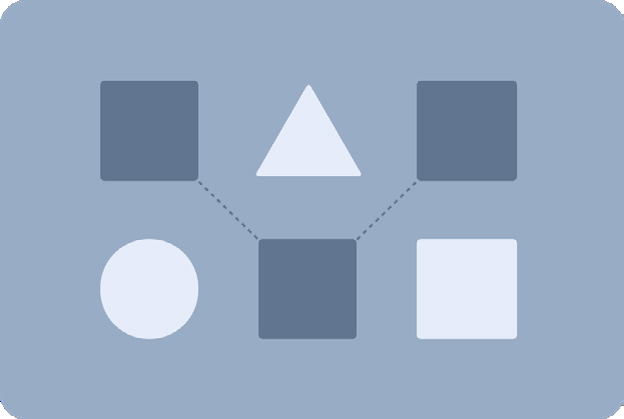
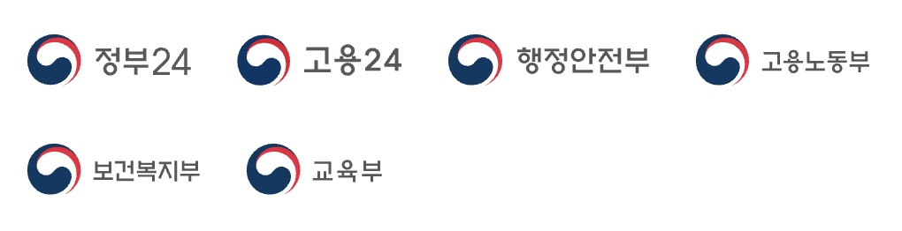
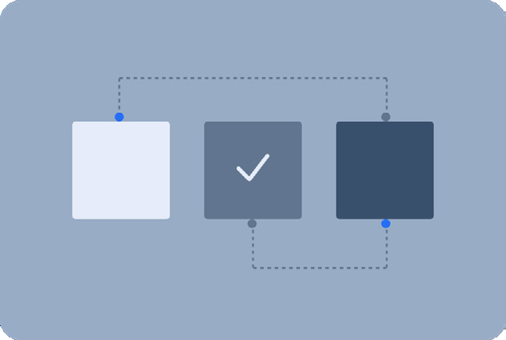
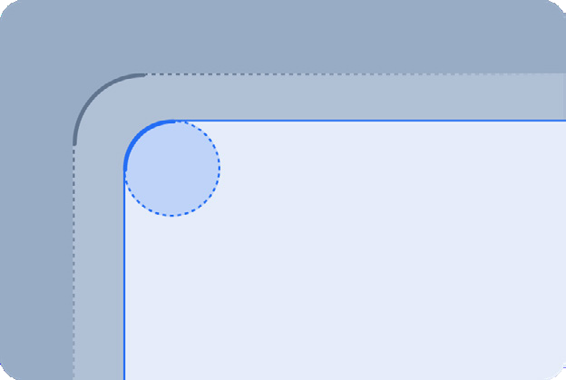
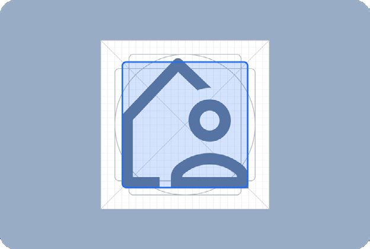

디자인 스타일은 디자인 시스템의 핵심 요소로, 정부 사이트에서 사용자 경험의 일관성과 정부 기관의 신뢰성을 보장하고 사용자 접근성을 강화하기 위해 설계되었다. KRDS의 스타일 가이드는 색상, 타이포그래피, 형태, 레이아웃, 아이콘, 엘리베이션, 디자인 토큰을 체계적으로 정의하여 적용 기관의 요구를 충족하면서도 사용자 중심의 경험을 실현한다. 준수해야 할 기준과 변경 가능한 항목을 명확히 구분해, 디자인 시스템의 효과적인 활용과 적용의 용이성을 돕는다.
### 스타일 가이드

스타일 가이드는 공공 서비스의 디자인 품질과 신뢰성을 강화하며, 사용자 중심의 경험을 제공하기 위해 설계된 체계적인 지침이다. 핵심 디자인 요소를 기반으로 일관성, 접근성, 효율성을 실현하도록 지원한다.

### 일관성

모든 디자인 요소를 통해 시각적 정체성을 유지하고, 통일된 사용자 경험과 신뢰를 제공한다.

### 접근성

전자정부 웹사이트 품질관리 지침과 W3C 웹 콘텐츠 접근성 지침(WCAG) 레벨 AA 기준을 기반으로 모든 사용자가 불편 없이 정보를 이용할 수 있도록 한다.

### 효율성

다양한 개발 환경을 고려하여 적용이 용이한 표준 규칙과 규격을 제공하여 작업의 시간을 절약하고 효율성을 극대화한다.
### 기관 적용 항목

디자인 스타일은 표준형 스타일 (Standard Style Guide)과 확장형 스타일(Adaptive Style Guide)로 구분된다. 표준형 스타일은 일관성과 접근성을 최우선으로 하며, 정부 상징성을 기반으로 디자인 시스템의 모든 스타일 요소를 준수해야 한다. 확장형 스타일은 기본 규칙을 준수하면서 기관의 고유 정체성을 반영할 수 있는 유연성을 제공한다. 두 스타일은 각각의 적용 대상과 범위를 명확히 정의하며, 적용 기관은 지침을 철저히 준수해야 한다.
### 표준형 스타일 (Standard Style Guide)

대상 정부 상징 로고를 사용하는 중앙행정기관(부/처/청), 특별지방행정기관, 부속기관 등의 대표 웹사이트, 기타 운영 웹사이트, 모바일 웹/앱

적용 기준 표준형 스타일은 색상, 타이포그래피, 형태, 레이아웃, 아이콘, 엘리베이션 등 스타일 요소와 모든 규칙을 필수적으로 준수하며, 일관된 시각적 정체성을 유지한다.

### 확장형 스타일 (Adaptive Style Guide)

대상 독자적인 로고를 사용하는 중앙기관 (운영 서비스·시스템) 및 공공기관 (대표·운영서비스·시스템) 등의 대표 웹사이트, 기타 운영 웹사이트, 모바일 웹/앱

적용 기준 확장형 스타일은 색상, 타이포그래피, 형태, 레이아웃, 아이콘, 엘리베이션의 사용 규칙을 준수하며, 필요에 따라 기관의 특성을 반영한 확장 적용이 가능하다.

## 적용 항목

스타일 가이드는 색상, 타이포그래피, 형태, 레이아웃, 아이콘, 엘리베이션으로 구성되어 있으며, 각 항목의 세부 사항은 개별 페이지에서 확인할 수 있다. 해당 항목들을 통해 디자인 시스템의 일관성과 접근성을 유지하며, 효율적인 디자인 작업이 가능하다.

### 색상

- 색상 팔레트
- 색상 시스템
- 주요 색상
- 투명도
- 강조 색상
- 그래픽 색상
- 시스템 색상
- 색상 적용
- 전체 색상 팔레트
- 사용 가이드

- 타이포그래피
- 서체
- 글자 두께
- 줄 간격
- 기본 사이즈
- 표현 단위
- 글자 스케일
- 특정 역할의 토큰
- 계층
- 글자 색상 (접근성)
- 사용 가이드

- 형태
- 형태가 주는 이미지
- 래디어스
- 래디어스 적용
- 사용 가이드

- 레이아웃
- 그리드 요소
- 브레이크포인트
- 콘텐츠 영역
- 서브 페이지 레이아웃
- 간격
- 간격 적용
- 사용 가이드

- 아이콘
- 시스템 아이콘
- 사이즈
- 키라인
- 두께
- 둥글기 값
- 디테일 요소
- 아이콘 색상
- 사용 가이드

- 엘리베이션
- 엘리베이션
- 표준형 스타일 엘리베이션
- 그림자로 엘리베이션 표현
- 색사용으로 엘리베이션 표현
- 딤드 효과
- 경계라인을 이용
- 엘리베이션 적용
- 사용 가이드
## 자체 검증

스타일 가이드를 적용하기 전에 색상, 타이포그래피, 형태, 아이콘, 레이아웃, 엘리베이션 등 모든 요소를 상세 페이지에서 확인하고 준수해야 한다. 주요 접근성 요소인 글자 크기, 색상 대비, 아이콘 크기, 글줄 높이 등을 점검하여 접근성을 보장하는 디자인을 구현해야 하며, 자체 검증 체크리스트를 활용해 가이드 적용 여부를 확인할 수 있다. 리스트는 색상, 타이포그래피, 형태를 기반으로 제공되지만, 기타 요소의 세부 지침은 각 스타일 가이드 페이지에서 확인할 수 있다.
## 정보 변경 내역

현재 스타일 가이드에서 사용하는 주요 카테고리는 색상(color), 타이포그래피(typography), 레이아웃(layout), 엘리베이션(elevation), 아이콘(icon), 디자인 토큰(Design tokens)이며, 이 중 디자인 토큰과 아이콘은 영문 표기 그대로 사용하고 있다.

이는 디자이너와 개발자 모두 이해할 수 있고, 보다 직관적이고, 보편적으로 사용되는 용어인 영문 표기가 효과적이기 때문이다. 컴포넌트에서도 한글로 표현할 수 없는 스피너, 브레드크럼, 페이지네이션, 탭바 등 한글로는 외래어를 대체할 수 없기 때문에 영문 표기를 하고 있는 것과 동일하다.
### 상태

| krds v0 (디지털 정부서비스 UI/UX 가이드라인) | krds v1 (범정부 UI/UX 디자인시스템) | 비고 |
|---|---|---|
| 색상 (color) | 색상 (color) | (고도화) 색약자 고려, 일반 모드와 선명한 화면 모드 구분에 따른 색상 적용 |
| 서체 (Typography) | 타이포그래피 (Typography) | (고도화) 글자 설정에 따른 간격 수정, 글자 스케일 영역 재설정 |
| 형태 (Shape) | 형태 (Shape) | (고도화) 래디어스 밸류값 비율로 계산하여 수정 |
| 배치 (Layout) | 레이아웃 (Layout) | (고도화) 브레이크포인트에 따른 레이아웃 설정값 추가 |
| - | 디자인 토큰 (Design token) | 스타일가이드 요소 추가 |
| - | 엘리베이션 (elevation) | 스타일가이드 요소 추가 |
| - | 선명한 화면 모드 | 스타일가이드 요소 추가 |
