타이포그래피는 정보를 효과적으로 전달하고 일관된 사용자 경험을 제공하는 데 필수적인 요소이다. 글꼴, 크기, 두께, 간격, 계층 구조를 정의하여 가독성을 높이고, 내용을 중요도에 따라 시각적으로 표현한다. 가이드에 맞춘 타이포그래피는 명확한 정보 전달을 가능하게 하며, 다양한 화면에서도 일관된 경험을 제공한다.

### 서체

표준형 스타일은 국문과 영문 모두 Pretendard GOV 서체(typeface)를 기본으로 사용한다.

Pretendard GOV는 Pretendard를 기반으로 만들어졌으며 공공기관에서의 접근성과 가독성에 초점을 맞춰, 정부 웹사이트나 공식 문서 등에서 쉽게 읽히고 이해될 수 있도록 설계되었다.

### 확장형 스타일

확장형 스타일은 가독성이 높은 고딕 계열 서체를 권장한다.

자체 개발 폰트가 고딕 계열이 아니거나 가독성이 낮다면 디스플레이나 배너 등 특정 영역에서만 제한적으로 사용하고, 본문과 제목에는 가독성을 위해 고딕 계열 서체를 사용한다.

- 추천 고딕 계열 폰트: 노토 산스, 나눔 고딕, 스포카 한 산스
Typeface

### 글자 두께

표준형 스타일은 글자 간의 명확한 대비를 위해 regular(400)와 bold(700) 두 가지 두께(font-weight)를 사용한다. 각 두께는 저시력자를 포함한 대부분의 사용자에게 명확한 대비를 주는 굵기로 regular는 주로 본문에 사용하여 기본 가독성을 보장하고, bold는 강조가 필요한 제목이나 중요한 내용에 사용한다.

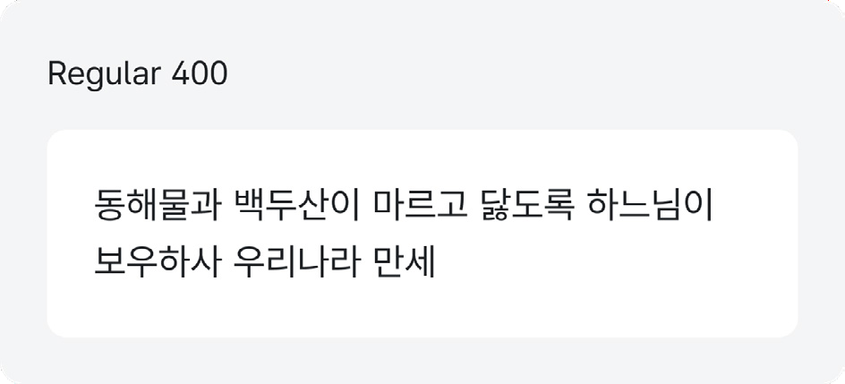

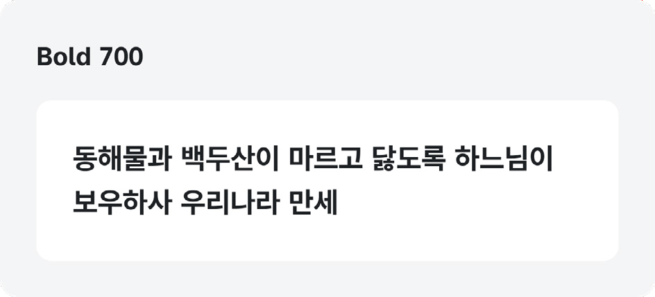

이상적인 글자 두께

글자의 두께는 화면 크기와 사용자 특성에 따라 가독성에 영향을 미친다. 지나치게 얇은 두께(light, thin)는 배경과의 구분이 어렵고, 지나치게 두꺼운 두께(extra bold)는 시각적 피로를 유발할 수 있다.

텍스트의 두께 사용은 최대 4가지 정도로 제한하는 것이 이상적이며, 너무 많은 두께의 종류를 이용하면 사용자가 정보의 중요도를 혼동할 수 있으므로 주의한다

󰀁 이상적인 텍스트 두께: regular(400), medium(500), bold(700)
Type scale

### 줄 간격

줄 간격(line-height)은 가독성과 접근성을 위해 최소 150% 이상으로 설정하여, 시각적 피로를 줄이고 시각장애나 난독증 사용자의 읽기 편의를 높인다. 다양한 글자 크기에 대응하기 위해 px 단위가 아닌 em 또는 % 등 상대적 단위를 사용한다.

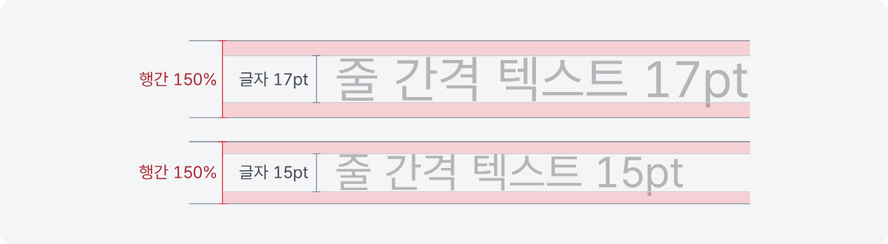
Figma vertical trim

Figma에서 Vertical Trim은 type settings에서 텍스트 컴포넌트의 세로 간격을 조정하는 방식으로, 폰트 전체의 높이를 기준으로 계산한 standard와 텍스트의 대문자 상단(Cap height)과 기준선(Baseline) 사이를 기준으로 계산한 Cap height to baseline이 있다.

표준형 스타일은 디자인과 개발 환경 간의 텍스트 정렬 불일치를 방지하고, 더 나은 일관성을 유지하기 위해 Vertical Trim을 "Standard"로 설정한다.

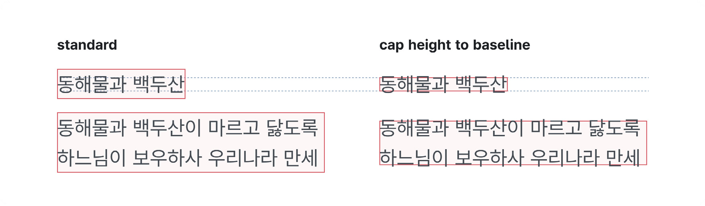

Standard

󰀁 Standard는 폰트의 전체 높이를 기준으로 삼아 CSS의 line-height와 구조적으로 유사해, 예상치 못한 레이아웃 오류를 줄일 수 있다.

󰀁 글자의 상단 요소와 하단 요소가 모두 포함되어 간격 설정에 유의해야 한다.

Cap height to baseline

󰀁 Cap height to baseline 설정은 텍스트의 대문자 상단과 기준선만을 기준으로 하여, 텍스트가 컴포넌트나 레이아웃 그리드와 정확히 맞아떨어지도록 하기 위해 활용된다.

󰀁 실제 개발 환경에서의 line-height 계산과 다르게 보일 수 있으니 주의해야 한다.
### 기본 사이즈

본문 폰트 크기는 모든 사용자가 쉽게 읽을 수 있도록 최소 16px 이상으로 설정한다. 적절한 글자 크기는 정보 접근성을 보장하는 중요한 요소로, 특히 디지털 취약계층을 고려하여 설정해야 한다.

표준형 스타일의 Pretendard GOV는 다른 서체에 비해 상대적으로 크기가 작아 17px을 기본 크기로 사용한다.

서체별 특성

같은 크기의 글자도 폰트 특성상 글자 크기가 다르게 느껴질 수 있다. 16px의 같은 사이즈도 '나눔고딕'은 크기가 상대적으로 커 보이는 반면, 'pretendard GOV'는 크기가 작게 느껴질 수 있어 시각적으로 균형 잡힌 크기로 설정해야 한다.

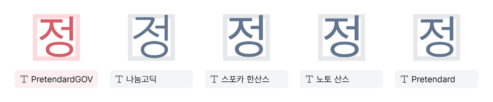

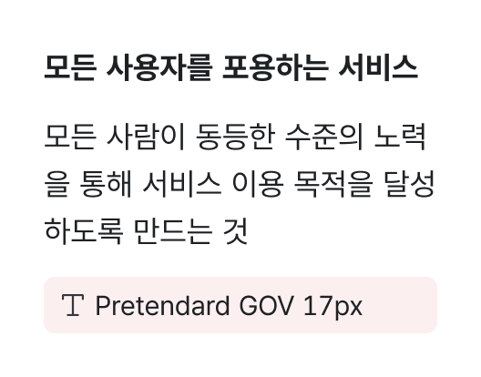

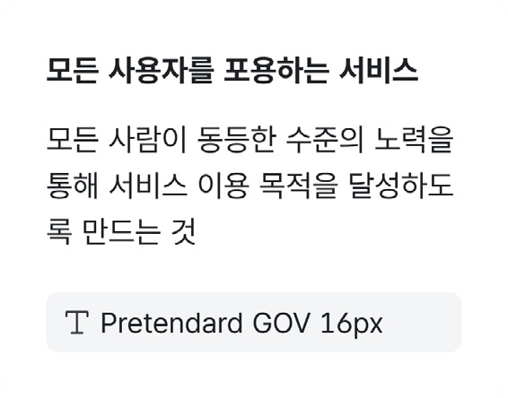

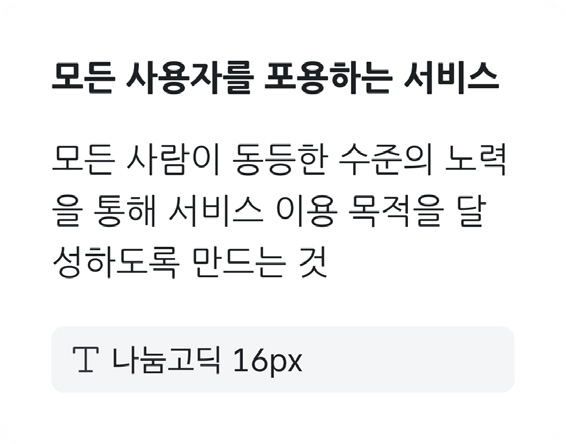
### 표현 단위(rem)

글자 크기와 반응형 디자인을 고려하여 개발 시 코드에서 rem 단위로 변환해 사용한다. rem은 루트 요소에 따라 조정되는 상대 단위로, 사용자가 브라우저 크기에 따라 텍스트 크기를 조정할 수 있어 접근성과 반응성이 향상된다. rem 기본값은 10px 또는 62.5%로 설정하여 px로 환산해 설정한다.

| rem의 기본값 | % 기준 | px 기준 |
|---|---|---|
| 시스템 기본 폰트 크기 | 100% | 16px |
| 16px 기준 | 62.5% | 10px |
도식 라벨: 50% / 8px

### 글자 스케일

글자 스케일(type scale)은 정보 전달과 체계적인 글자 사용을 위해 계층에 맞는 글자 크기를 정의한다. 표준형 스타일은 display, heading, body의 구조를 사용하며, 각 영역의 목적에 맞게 글자 크기를 설정한다.

표준형 스타일은 display, heading, body의 구조를 사용하며, 각 영역의 목적에 맞게 글자 크기를 설정한다.

명확한 크기 차이를 설정해 사용자가 정보를 체계적으로 이해하도록 돕는다.

이상적인 heading과 body 간의 글자 크기 차이는 1.25~1.5배로 설정하여 시각적 흐름을 자연스럽게 유지한다.

󰀁 Type-scale을 재설정할 경우 기본 글자 사이즈를 기준으로 비율을 설정한다.
### Display

디스플레이(Display)는 화면에서 가장 큰 텍스트로 주로 배너와 같은 마케팅 용도로 사용하며, 자유롭게 변형할 수 있으나 과도한 크기 사용은 지양한다.

| Style | Size(pc) | Size(mobile) | Font weight | Line height | Letter spacing |
|---|---:|---:|---:|---|---|
| large | 60 | 44 | 700 | 150% | 1px |
| medium | 44 | 32 | 700 | 150% | 1px |
| small | 36 | 28 | 700 | 150% | 1px |

### Heading

헤딩(Heading)은 페이지 단위의 타이틀과 모듈 단위의 역할을 강조하는 데 사용하며, h1부터 h5까지 계층을 설정한다.

- xlarge-xxsmall까지 h1-h2-h3-h4-h5의 계층 설정하여 사용한다.
- 콘텐츠의 정보 구조가 단순할 경우 heading 요소를 단순화하여 사용할 수 있다.
- 본문 사이즈와 헤딩의 폰트 사이즈가 같아지는 영역은 주의하여 사용한다.

| Style | Size(pc) | Size(mobile) | Font weight | Line height | Letter spacing |
|---|---:|---:|---:|---|---|
| xlarge | 40 | 28 | 700 | 150% | 1px |
| large | 32 | 24 | 700 | 150% | 1px |
| medium | 24 | 22 | 700 | 150% | 0px |
| small | 19 | 19 | 700 | 150% | 0px |
| xsmall | 17 | 17 | 700 | 150% | 0px |
| xxsmall | 15 | 15 | 700 | 150% | 0px |

### 계층별 사용

| 구조 | 범위 | 사용 |
|---|---|---|
| h1 | xlarge-large | 페이지나 섹션의 가장 중요한 제목으로, 주요 주제를 강조하는 데 사용한다. |
| h2 | large-medium | 콘텐츠의 주요 섹션을 구분하여 H1보다 작은 부제목 역할을 한다. |
| h3 | medium-small | 세부 섹션을 나타내는 제목으로, H1과 H2보다 작은 크기로 사용한다. |
| h4 | small-xsmall | 본문과 비슷한 크기의 제목으로, 세부적인 콘텐츠에 대한 설명에 사용한다. |
| h5 | xsmall-xxsmall | 가장 작은 제목으로, 부차적인 정보나 보조 설명을 위해 사용한다. |
### Body

본문과 기본 콘텐츠에 적용된다.

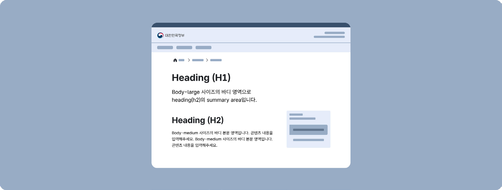

| Style | Size(pc) | Size(mobile) | Font weight | Line height | Letter spacing |
|---|---:|---:|---:|---|---|
| large-bold | 19 | 28 | 700 | 150% | 0px |
| medium-bold | 17 | 24 | 700 | 150% | 0px |
| small-bold | 15 | 22 | 700 | 150% | 0px |
| xsmall-bold | 13 | 19 | 700 | 150% | 0px |
| large | 19 | 19 | 400 | 150% | 0px |
| medium* | 17 | 17 | 400 | 150% | 0px |
| small | 15 | 15 | 400 | 150% | 0px |
| xsmall | 13 | 13 | 400 | 150% | 0px |

### 계층별 사용

| 범위 | 사용 |
|---|---|
| large | 전체 글에 대한 써머리 또는 중요한 정보를 전달할 때 사용된다. |
| medium | 본문 텍스트에 사용되는 표준 크기로 전체적인 UI 요소에서 사용된다. |
| small | 덜 중요한 정보나 부가적인 설명 문구에 사용되며, 작은 크기로 가독성에 주의해야 한다. |
| xsmall | 가장 작은 크기로, 주석, 보조 설명 또는 부가적인 정보에 사용되며, 가독성이 떨어질 수 있으므로 신중하게 사용해야 한다. |
### 특정 역할의 토큰

특정 영역에서 반복적으로 사용되는 글자를 시멘틱 토큰으로 설정하면 다양한 화면에서 스타일의 일관성을 유지하고 유지보수가 용이하다. 시멘틱 토큰(semantic token)은 표준형 스타일의 글자 스케일에서 사용하며 heading과 body의 사이즈로 적용된다.

표준형 스타일은 navigation과 label을 특정 역할 토큰으로 사용한다.

### Navigation

Navigation은 사이트 내 이정표 역할을 하는 컴포넌트 내에서 사용한다.

Header Main menu Side menu In page navigation

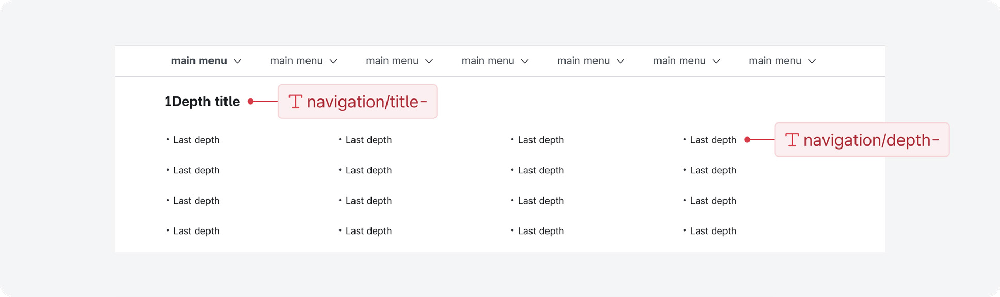
| Style | Size(pc) | Size(mobile) | Font weight | Line height | Letter spacing |
|---|---:|---:|---:|---|---|
| title-large | 24 | 22 | 700 | 150% | 0px |
| title-small | 19 | 17 | 700 | 150% | 0px |
| depth-medium-bold | 17 | 17 | 700 | 150% | 0px |
| depth-medium | 17 | 17 | 400 | 150% | 0px |
| depth-small-bold | 15 | 15 | 700 | 150% | 0px |
| depth-small | 15 | 15 | 400 | 150% | 0px |
### Label

컴포넌트 구성 내 label, placeholder 등에 사용한다.

적용 예: `Button`, `Input`, `Check box`, `Radio button`

| Style | Size(pc) | Size(mobile) | Font weight | Line height | Letter spacing |
|---|---:|---:|---:|---|---|
| large | 19 | 19 | 400 | 150% | 0px |
| medium | 17 | 17 | 400 | 150% | 0px |
| small | 15 | 15 | 400 | 150% | 0px |
| xsmall | 13 | 13 | 400 | 150% | 0px |

### 계층

타이포그래피 계층(hierarchy) 구조는 display, heading, body로 구성되며, 사용자에게 정보의 중요도를 명확히 전달하는 역할을 한다. 계층 구조를 명확히 하면 정보 흐름이 자연스러워지며, 사용자는 타이틀을 중요한 정보로 인식해 효율적으로 접근할 수 있다.

타이틀은 본문보다 더 눈에 띄어야 하며, 사용자는 타이틀이 중요한 정보라는 인식을 갖는다. 계층 구조를 명확히 하면 정보의 흐름이 자연스럽고, 사용자가 중요 정보를 혼동하지 않고 접근할 수 있다.
### 콘텐츠 영역

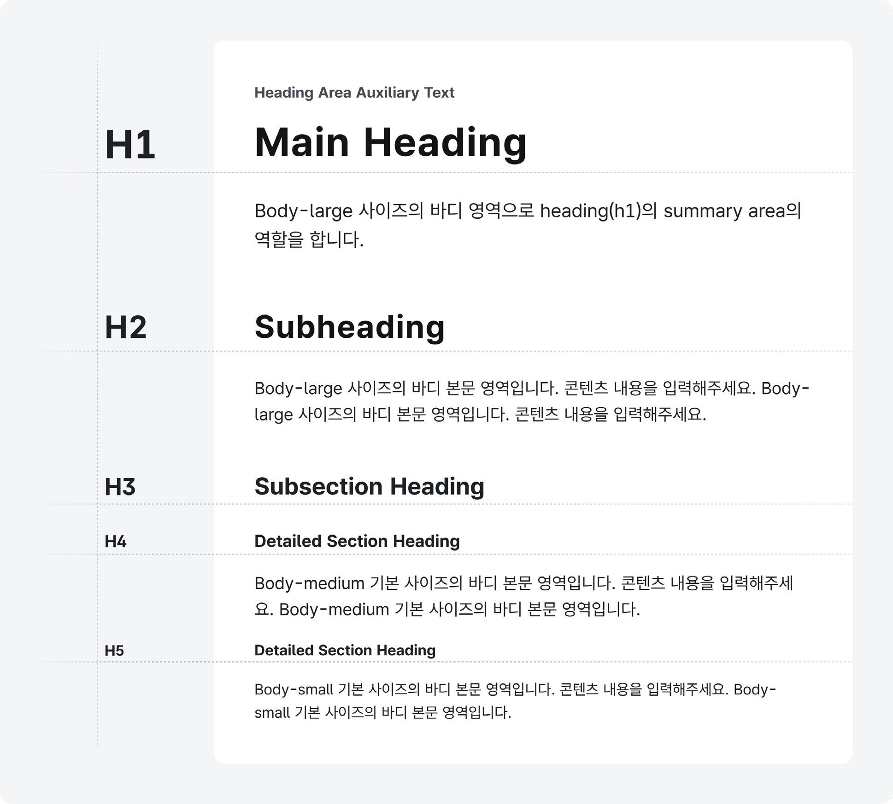
정보 구조가 깊은 경우

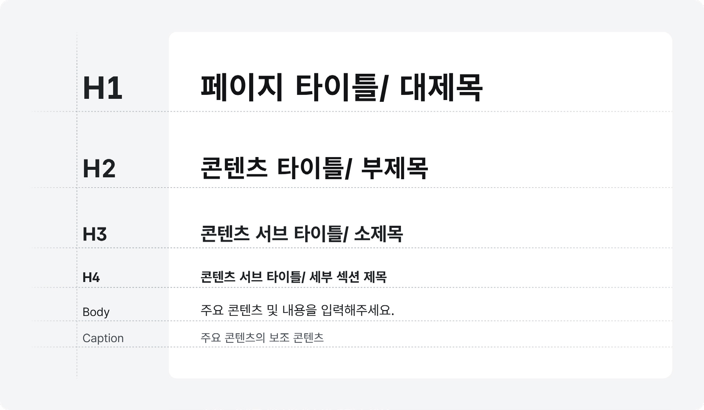

목록이 있는 경우

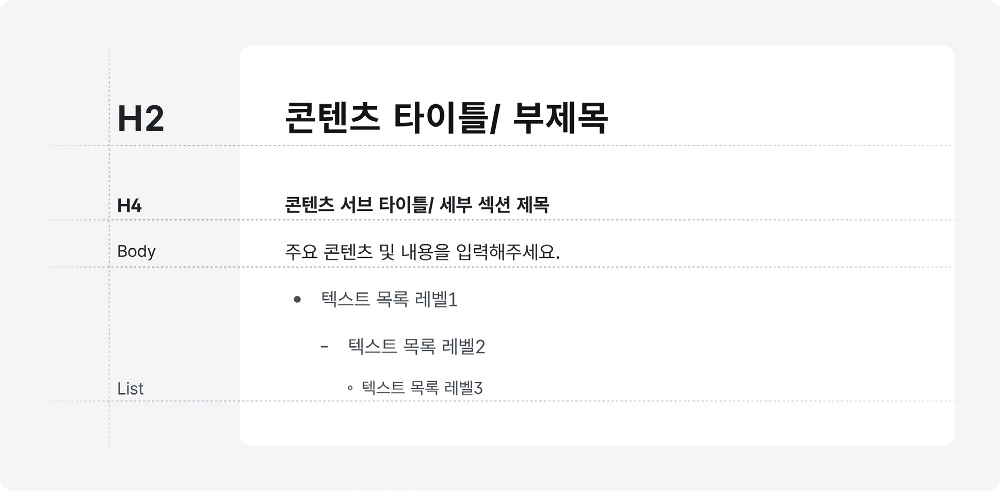
### 배너에 사용되는 경우

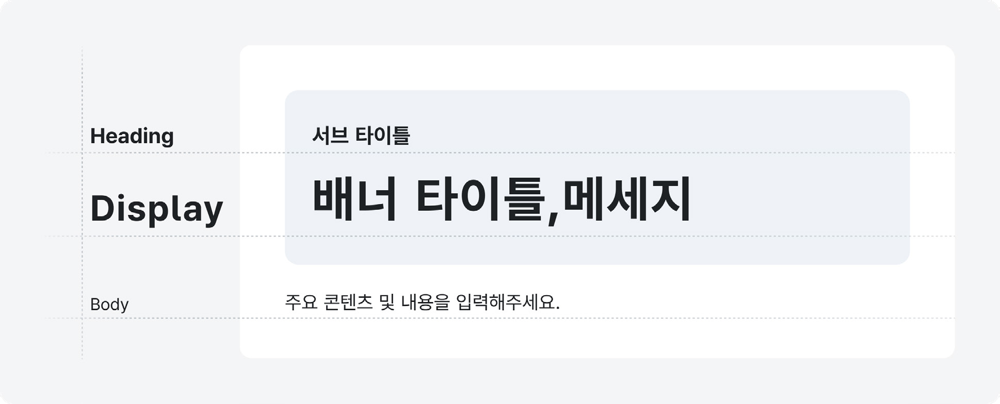
### 글자 색상

글자 색상은 가독성과 접근성을 고려해 사용한다. 본문에서는 주로 그레이 계열을 유지하며, 주요 동작에는 primary, secondary, point, system 색상을 사용할 수 있다. 이때 명도 대비를 준수하여 시각적 접근성을 확보한다.

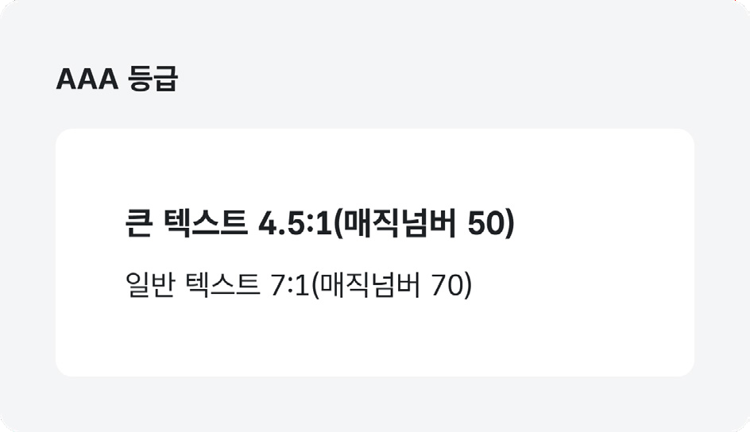

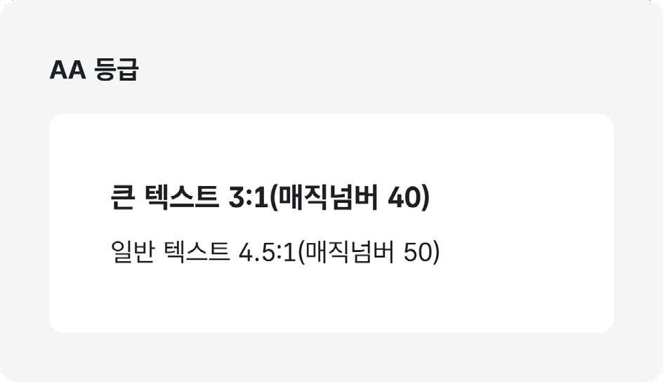

| 등급 | 큰 텍스트 | 일반 텍스트 | 대비율 |
|---|---|---|---|
| AA | 3:1 (매직넘버: 40) | 4.5:1 (매직넘버: 50) | 최소 |
| AAA | 4.5:1 (매직넘버: 50) | 7:1 (매직넘버: 70) | 강화 |

| 텍스트 크기 | pt(point) 단위 | px(pixel) 단위 |
|---|---|---|
| 큰 텍스트 | 18pt 이상, 굵게 표시된 경우 최소 14pt 이상 | 24px 이상, 굵게 표시된 경우 최소 18.66px 이상 |
| 일반 텍스트 | 18pt 이하, 굵게 표시된 경우 14pt 미만 | 24px 이하, 굵게 표시된 경우 18.66px 미만 |

접근성 표기 1pt(point)=1.333px(pixel)

1pt = 1.333px 14pt = 18.66px, 18pt = 24p

- pt (point): pt는 인쇄 및 타이포그래피에서 주로 사용하는 단위로, 1pt는 1/72인치이다. 주로 인쇄 매체에서 많이 사용된다.

- px (pixel): px는 디지털 화면에서 사용되는 단위로, 화면 해상도에 따라 상대적인 크기가 달라진다. 1px는 모니터의 한 점을 의미하며, 디스플레이의 픽셀 밀도에 따라 시각적으로 다른 크기로 보일 수 있다.

### 선명한 화면 모드 명도 대비

선명한 화면 모드에서는 본문의 가독성을 위해 15:1의 고대비 명도 대비를 준수한다.

- 본문 텍스트: 15:1

- 헤딩, 레이블 등의 텍스트와 아이콘: 7:1

- 시각적 보조 수단: 4.5:1
### 사용 가이드

### 줄 간격

줄 간격이 좁을수록 시각적 피로를 느끼게 하며 정보 전달의 효율성이 떨어지므로 150% 이상으로 설정한다.

모범 사례 피해야 할 사례

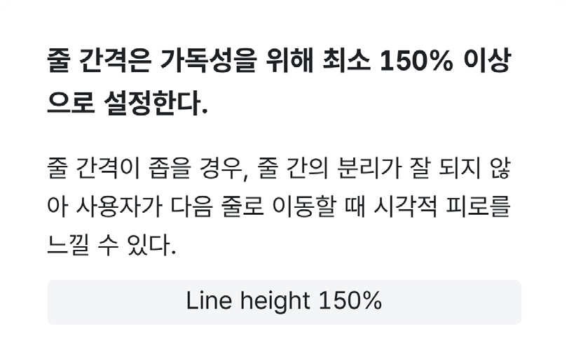

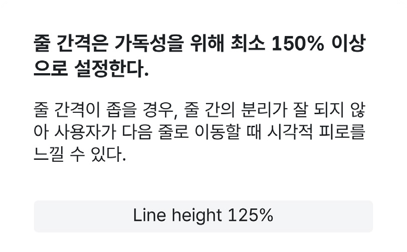

### 타이틀-본문 구분

타이틀과 본문은 시각적 위계가 유지될 수 있도록 한다. 대체로 본문보다 타이틀의 글자 크기를 크게 사용하거나, 타이틀과 본문이 글자 크기가 같을 경우 두께를 이용하여 중요도를 시각적으로 반영한다.

### 모범 사례 피해야 할 사례

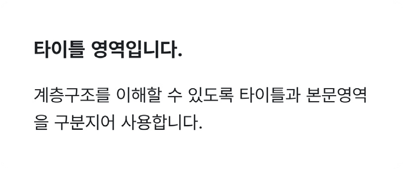

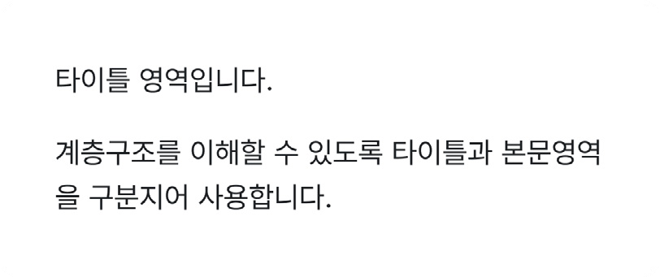
### 밑줄

밑줄은 텍스트 링크에만 사용하며 강조하는 부분에서 사용하지 않는다. 강조 표현은 색상이나 굵기를 이용한다.

모범 사례 피해야 할 사례

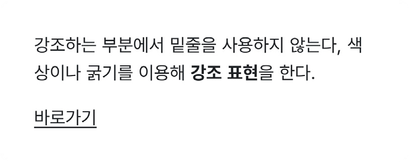

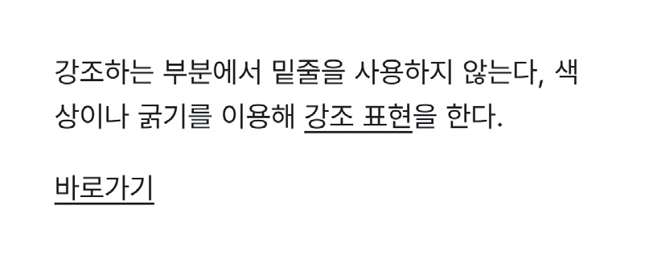

### 자체 개발한 폰트

고딕 계열이 아닌 경우, 해당 폰트는 시각적 효과를 극대화할 수 있는 디스플레이나 배너에만 사용하는 것이 좋다.

### 모범 사례 피해야 할 사례

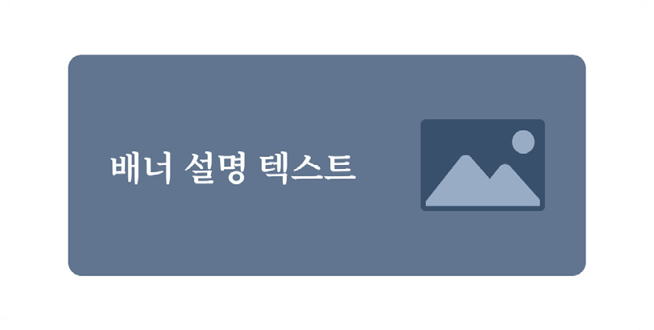

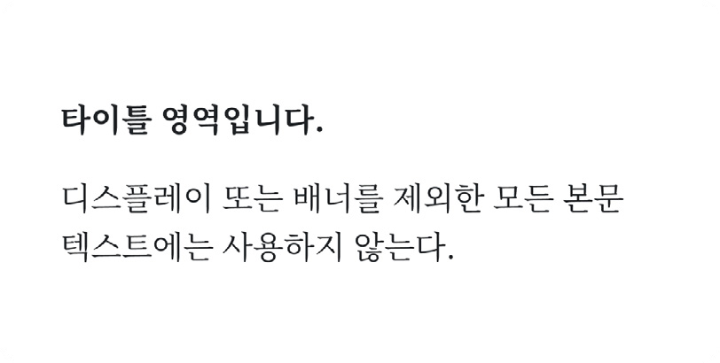
