형태는 브랜드의 시각적 아이덴티티를 표현하는 중요한 요소로, UI 요소에 적용되는 둥글기 값인 래디어스(radius)를 통해 버튼, 카드, 컨테이너, 이미지 등에 고유한 느낌과 분위기를 만들어낸다.
### 형태가 주는 이미지

디자인 시스템에서 컴포넌트의 형태(shape)는 브랜드의 시각적 아이덴티티를 형성하는 핵심 요소이다. 형태의 변형에 따라 사용자가 해당 서비스나 기관에 느끼는 감정과 인식이 달라질 수 있다. 둥근 모서리와 각진 모서리는 각각 다른 이미지를 전달하며, 이를 통해 각 기관의 아이덴티티를 표현할 수 있다.

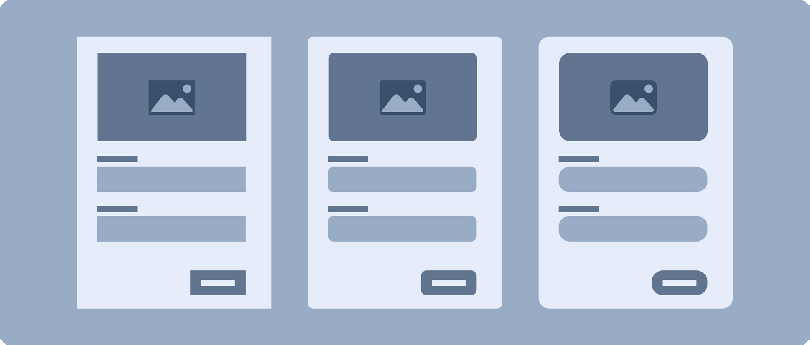
### 각진 형태와 둥근 형태가 주는 이미지

각진 형태

심리학적 연구에서는 각진 모서리(Angular or Square Shapes)가 사람들에게 신뢰성과 효율성을 전달한다고 보고하며, 사람들은 직선과 각을 체계적이고 정확한 것으로 인식하는 경향이 있다.

- 전문성: 각진 형태는 정확하고 전문적인 느낌을 주어, 신뢰감을 전달한다.

- 효율성: 각진 디자인은 깔끔하고 효율적인 인상을 주며, 복잡한 정보를 깔끔하게 전달하는 데 주로 사용된다.

둥근 형태

심리학적 연구에서 둥근 형태(Rounded Shapes)는 긍정적인 감정과 연결된다고 한다. 둥근 모서리는 위협적이지 않고 안정적인 느낌을 주어, 사람들이 그 형태에 더 편안함을 느끼도록 한다.

- 친근함: 둥근 모서리는 부드럽고 친근한 인상을 주며, 따뜻한 사용자 경험을 유도한다.

- 안정감: 둥근 모서리는 안정감과 보호받는 느낌을 제공하여 긍정적인 감정을 유도한다.
### 래디어스

### 표준형 스타일

표준형 스타일은 xsmall-small-medium-large-xlarge 5단계로 구성되며, 각 레벨은 컴포넌트의 사이즈로 구분되된다. 각 레벨은 함께 사용할 빈도가 높은 컴포넌트의 묶음으로 같은 형태의 래디어스(radius) 적용이 필요하다.

표준형 스타일은 2px~12px의 래디어스 값을 사용하며, 이는 정부가 주는 신뢰감과 안정감, 친근함을 표현하기 위한 래디어스 값이다. 과하게 둥근 형태로 변형되는 것을 방지하기 위해 래디어스 최댓값을 12px로 설정한다.

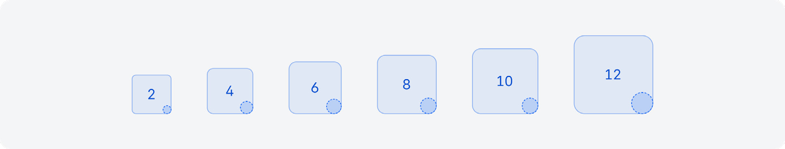
| Level | Usage | Container size | Radius size | Apply components |
|---|---|---|---|---|
| Xsmall | 컴포넌트 레벨에서 가장 작은 크기로 인디케이터, 배지, 프로그레스 바 같은 초소형 크기에 사용한다. * 온전한 원형의 형태를 사용하는 경우 radius-max token을 사용한다. | 8*8 | 2px | Element |
도식 라벨: 12*12 / 2px
도식 라벨: 16*16 / 2px
| Small | 태그, 칩 같은 작은 컴포넌트에서 사용한다. | 20*20 | 4px | Chips |
도식 라벨: 24*24 / 4px / Checkbox Radio button
도식 라벨: 32*32 / 4px / Switch Tag
| Medium | 기본이 되는 값으로 주로 버튼, 인풋 등에서 사용한다. | 40*40 | 6px | Button |
도식 라벨: 48*48 / 6px / Text input Textarea
도식 라벨: 56*56 / 6px / Select Carousel-Number
도식 라벨: 64*64 / 6px / Step indicator Pagination
| Large | 주로 카드와 같은 큰 컴포넌트에 사용한다. | 72*72 | 10px | Card |
도식 라벨: 80*80 / 10px / Dialog
| Xlarge | 가장 큰 값으로 주로 배너, 바텀 시트 같은 화면을 차지하는 비율이 큰 컴포넌트에 사용한다. | 96*96 | 12px | Banner |
도식 라벨: 120*120 / 12px (max) / Dialog Bottom sheet
| Xlarge | 가장 큰 값으로 주로 배너, 카드, 바텀 시트 같은 화면을 차지하는 비율이 큰 컴포넌트에 사용한다. | 96*96 | 12px | Banner Card |
도식 라벨: 120*120 / 12px / Dialog Bottom sheet
### 표준형 스타일 래디어스 계산법

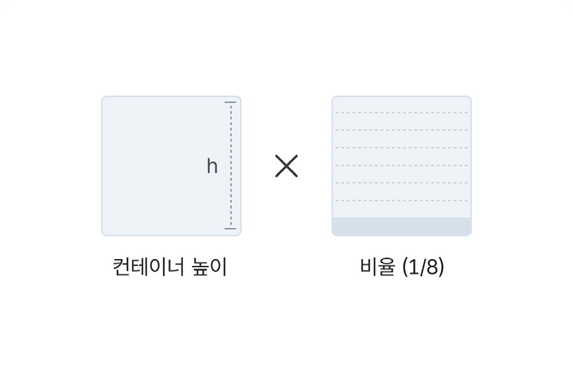

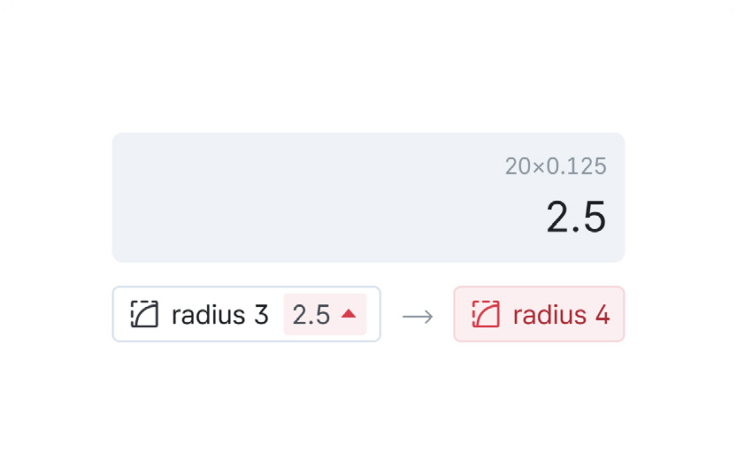

1. 컨테이너 높이 X 비율 1/8 (0.125) = radius 2. radius 결과 반올림

계산 시 주의 사항

계산한 radius 값을 반올림했을 때 홀수인 경우, 숫자가 더 높은 짝수로 변경한다. 높이(12) x 비율(0.125) = 1.5일 때 radius는 2로 적용한다. 높이(20) x 비율(0.125) = 2.5일 때 radius는 4로 적용한다. 높이(120) x 비율(0.125) = 15일 때 radius는 max 값인 12로 적용한다.

### 확장형 스타일

각 기관의 아이덴티티에 맞게 커스터마이즈된 래디어스 값을 설정할 수 있다. 1px 이상의 래디어스 값을 사용할 때는 표준형 스타일의 계층 구조를 참고하여 일관성을 유지한다.

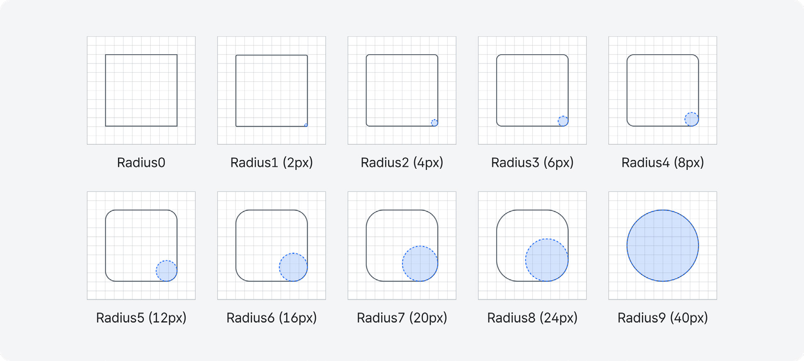
Hierarchy

### 래디어스 비율에 맞게 적용하는 방법

컨테이너 높이 x 비율 = 래디어스 값

1. 기준이 되는 컴포넌트를 기관에 맞는 래디어스 값을 테스트하여 비율 값을 찾는다.
2. 그 비율로 사용되는 컴포넌트 높이 값 기준으로 래디어스 값을 적용한다.

예시

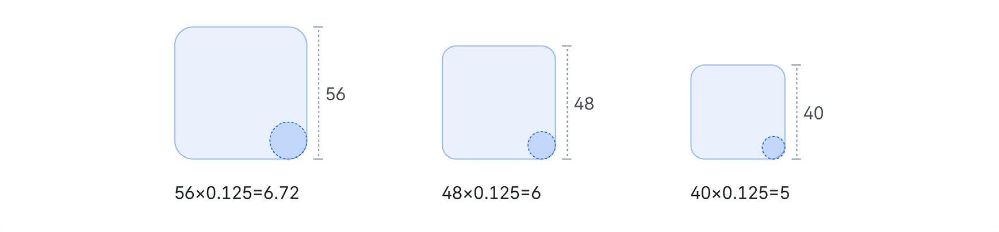

- 디자인 시스템에서 래디어스 값은 짝수로 사용하는 것을 권장한다.

- 컨테이너와 비율을 계산 후 나온 수치가 홀수이거나 소수점으로 나올 시 함께 사용될 컴포넌트를 고려하여 근사치에 맞게 올림 하여 짝수의 값을 사용한다.
### 표현 방법

래디어스 값은 px와 % 단위로 설정할 수 있다.
- px 값 사용: 버튼이나 입력 필드 같은 요소는 크기에 맞는 일관된 둥글기 설정이 중요하므로 px 단위로 설정한다.
- % 값 사용: 프로필 사진처럼 완전한 원형이 필요한 경우 % 값을 사용하여 더 직관적으로 설정할 수 있다.

### 전체 래디어스를 % 설정 시 주의 사항

- 비율 변동: 컴포넌트마다 크기 비율이 달라지므로 래디어스 값 조정이 어려울 수 있다.

- 텍스트 일관성 부족: % 단위로 설정하면 UI 요소마다 래디어스 값이 일정하지 않아 디자인의 일관성을 유지하기 어렵다.

- 작은 컴포넌트: 작은 컴포넌트에 50%를 적용하면 지나치게 둥글어져 의도와 다른 디자인 결과가 나올 수 있다.
### 래디어스 적용

함께 사용이 되는 비슷한 크기의 구성 요소는 래디어스 값을 동일하게 적용하는 것이 좋다.

### 함께 배치되는 컴포넌트의 일관된 래디어스

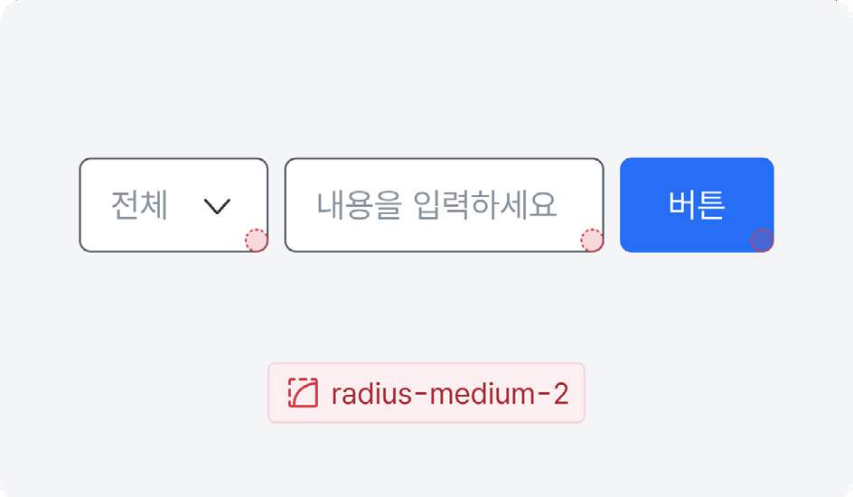

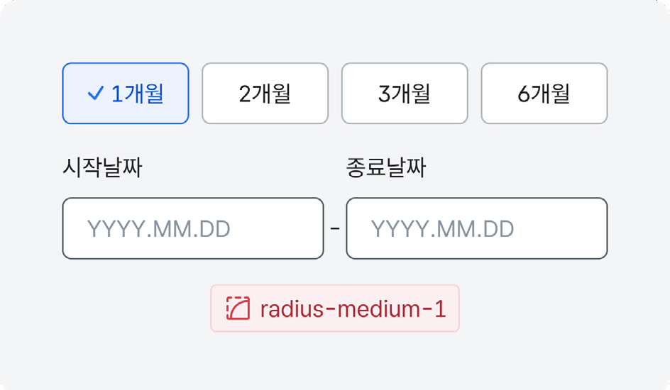
### 화면 구성 요소 간의 래디어스 조화

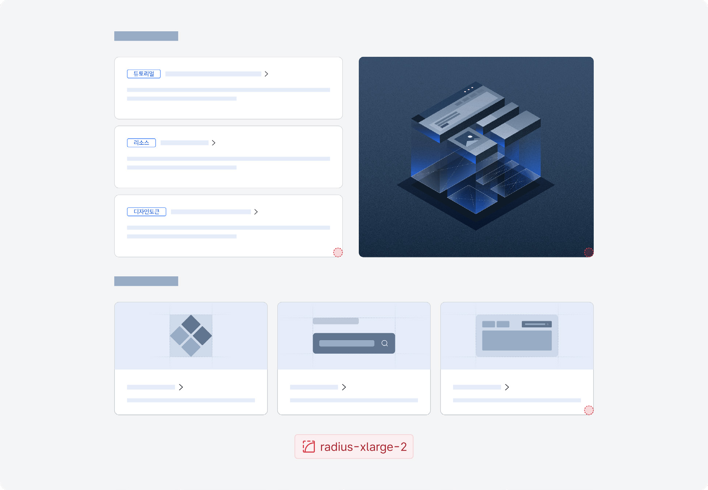
### 사용 가이드

### 비율

컨테이너 사이즈가 커지면 래디어스값도 비율에 맞게 적용한다.

모범 사례 피해야 할 사례

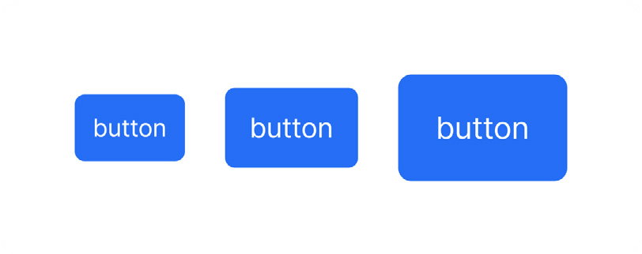

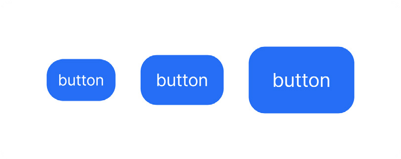

### 동일한 래디어스 적용

비슷한 크기의 구성 요소는 동일한 래디어스를 적용하면 디자인의 통일성과 조화로움을 높일 수 있다.

모범 사례 피해야 할 사례

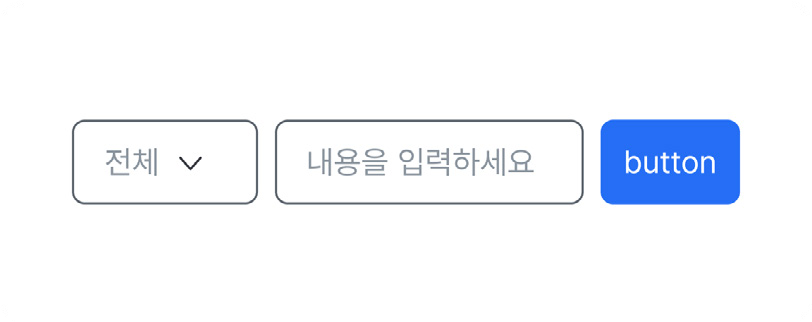

### 콘텐츠 영역 침범

과한 래디어스 값 적용으로 콘텐츠에 영향을 주지 않는다. 둥근 형태를 사용할 땐 내부 패딩값을 충분히 준다.

모범 사례 피해야 할 사례

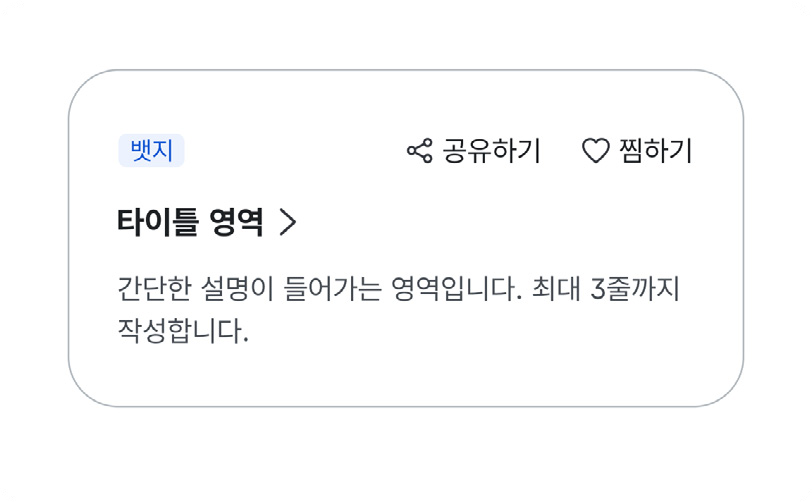

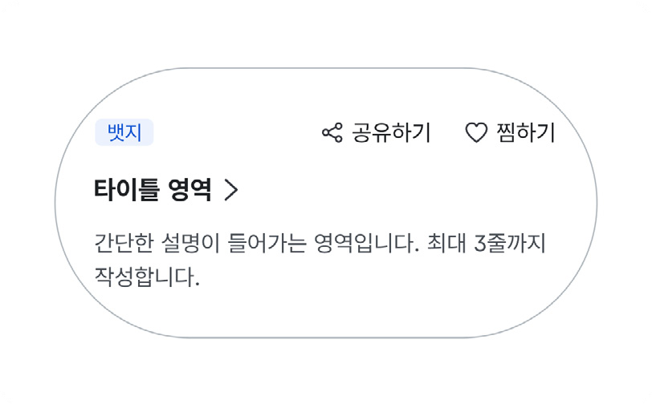

### % 사용

작은 컴포넌트에서 50%를 적용하면 모서리가 지나치게 둥글어져 의도와 다른 디자인 결과가 나올 수 있다.

모범 사례 피해야 할 사례

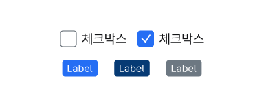

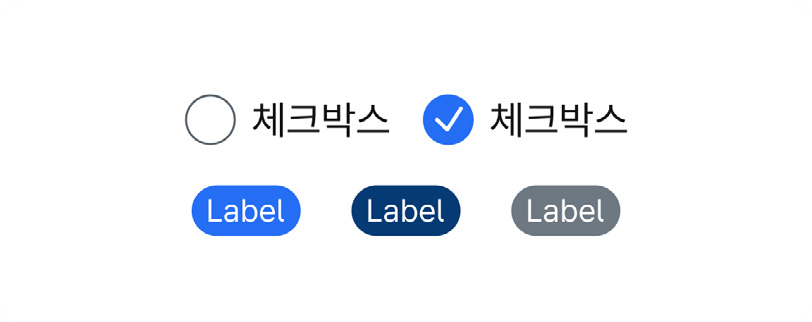
