레이아웃(Layout)은 정보 구조와 시각적 흐름을 체계적으로 구성하여 사용자가 콘텐츠를 쉽게 이해할 수 있도록 한다. 레이아웃 가이드는 그리드, 브레이크포인트, 간격 설정을 통해 일관된 사용자 경험을 제공하며, 시각적 일관성과 정보 전달 효과를 높인다.
Grid

### 그리드 요소

그리드 시스템은 UI에서 요소의 배치와 정렬을 지원하여 시각적 일관성과 질서를 유지하고, 균형 잡힌 레이아웃을 구현한다. 주요 그리드 구성 요소로는 칼럼(column), 마진(margin), 가터(gutter)가 있으며, 이를 통해 화면 내 시각적 일관성을 강화하고 다양한 디바이스에서 최적의 사용자 경험을 제공한다.

### Screen margin

화면의 양쪽 가장자리의 사이의 공간

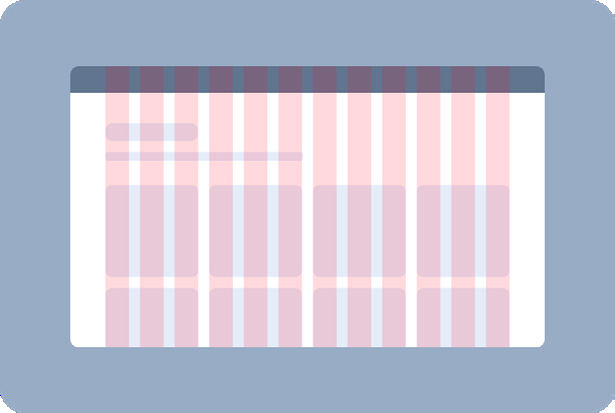

### Column

콘텐츠 영역의 수직으로 분할한 영역

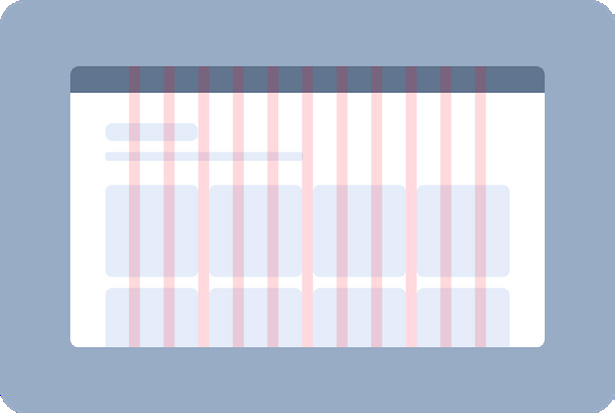

### Gutter

컬럼 사이의 간격
### 스크린 마진

스크린 마진(screen margin)은 화면의 양쪽 끝에 여백을 제공해, 콘텐츠가 화면 가장자리에 너무 가까워지지 않도록 한다. 이는 사용자에게 안정감과 일관성을 제공하며, 특히 터치 기반의 모바일 환경에서 가장자리 근처에 위치한 요소들이 오작동하지 않도록 한다.

- 브레이크포인트별 최소 스크린 마진을 준수하여, 화면 크기에 맞는 적절한 마진을 유지한다.
- 모바일 환경에서 가장자리 요소 터치 오류 방지를 위해 최소한의 마진을 필수로 설정한다.

- large: 최소 24px
- medium: 최소 24px
- small: 최소 16px

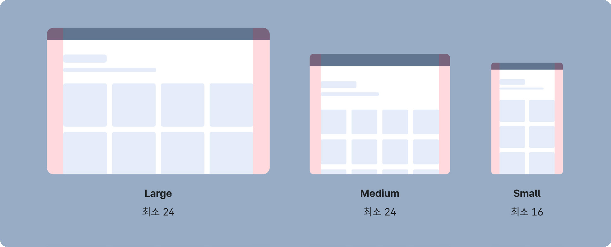

### 칼럼

칼럼(column)은 UI 내 요소를 수직으로 정렬할 수 있는 분할 영역으로, 콘텐츠를 체계적이고 일관되게 배치할 수 있게 돕는다. 칼럼 수는 화면 크기에 맞춰 유동적으로 변경되며, 고정값 대신 백분율로 설정해 다양한 화면 크기에서 레이아웃이 유연하게 반응한다.

- 동일 화면에서 칼럼 수를 혼용하지 않도록 하여, 시각적으로 일관된 레이아웃을 유지한다.

- large: 12
- 16개
- medium: 8
- 12개
- small: 4
- 6개

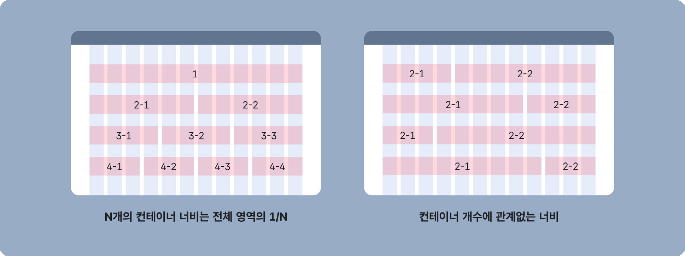

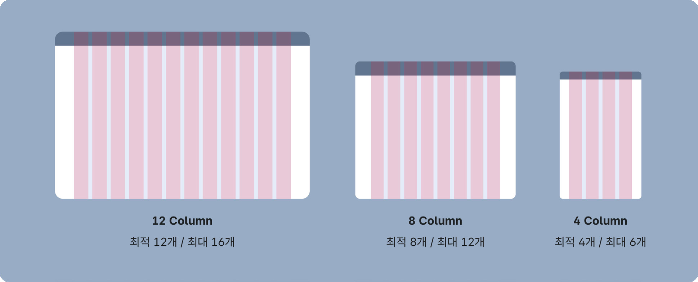

### 가터

가터(gutter)는 칼럼 사이의 간격을 의미하며, 요소 사이의 여백을 제공하여 시각적 혼잡을 줄이고 사용자가 콘텐츠에 집중할 수 있도록 한다.

- 가터 크기는 칼럼 너비의 절반 이하로 설정해 과도하게 넓거나 좁아지지 않도록 한다.
- 가터 간격은 요소 간 구분을 도와 시각적 여유와 정돈된 레이아웃을 유지한다.

- large: 최소 16px, 최적 24px
- medium: 최소 16px, 최적 24px
- small: 최소 16px, 최적 16px

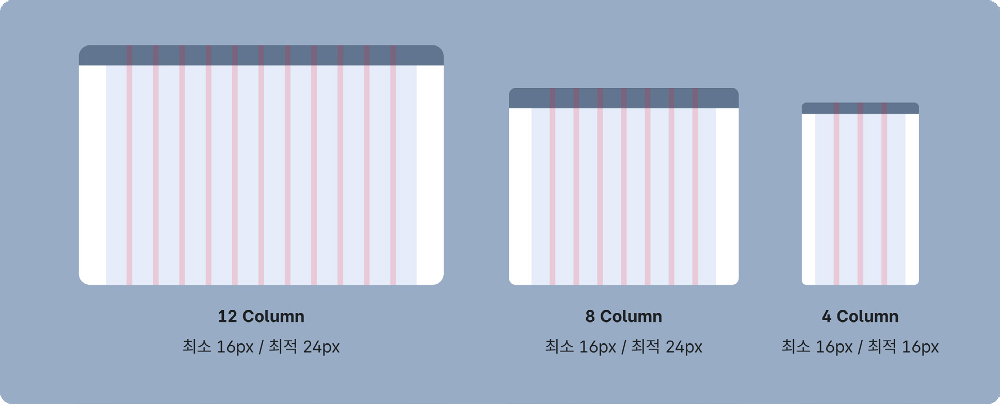

### 브레이크포인트

브레이크포인트(breakpoint)는 화면 크기에 따라 레이아웃이 변경되는 지점으로, 인터페이스가 다양한 화면 크기에 맞춰 자연스럽게 적응할 수 있게 한다.

브레이크 포인트의 단계는 최소 3단계에서 6단계로 설정하여 사용한다. 브레이크 포인트 단계가 적을수록 관리와 개발이 용이하지만 세분화가 어려울 수 있고, 단계가 많아질수록 디자인 세분화가 가능하지만 복잡성은 증가한다.

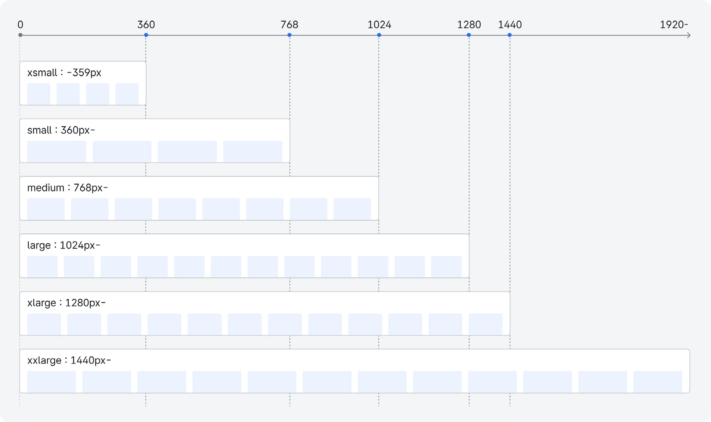

|브레이크포인트|뷰포트 칼럼|수 (적정-최대)|가터 너비 (최소-적정)|최소 스크린 마진|
|---|---|---|---|---|
|xsmall|-359px 4-6|4-6|16-16|16px|
|small|360px4-6|4-6|16-16|16px|
|medium|768px-|8-12|16-24|24px|
|large|1024px-|12-16|16-24|24px|
|xlarge|1280px-|12-16|16-24|24px|
|xxlarge|1440px-|12-16|16-24|24px|

### 표준형 스타일

고정된 콘텐츠 영역을 사용하는 표준형 스타일은 small부터 xlarge까지 총 4단계의 브레이크 포인트를 적용한다.

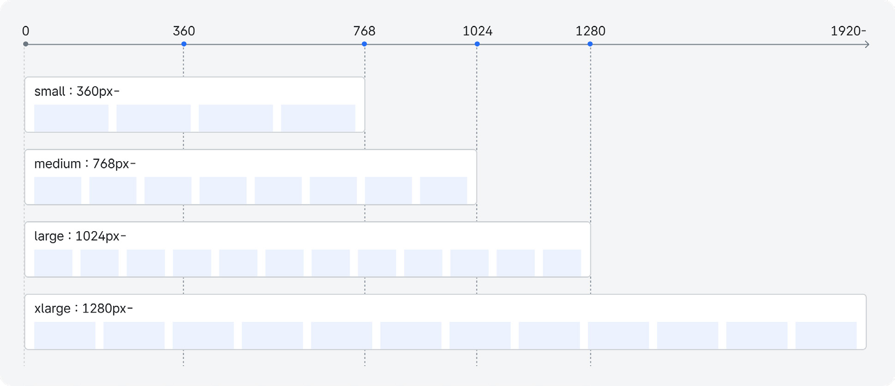

| name | Viewport | 칼럼 수 (적정-최대) | 가터 너비 (최소-적정) | 최소 스크린 마진 |
|---|---|---:|---:|---|
| small | 360px- | 4 | 16 | 16px |
| medium | 768px- | 8 | 16 | 24px |
| large | 1024px- | 12 | 24 | 24px |
| xlarge | 1280px- | 12 | 24 | 24px |

표준형 스타일은 xsmall의 디바이스는 최적화에 포함되지 않는다.

### 확장형 스타일

자유로운 콘텐츠 확장이 필요한 경우 3~6단계의 브레이크 포인트를 적용하여 다양한 화면에 유연하게 대응한다. 단, 브레이크포인트의 뷰포트와 칼럼 수와 가터, 최소 스크린 마진 값을 지켜서 사용한다.

### 콘텐츠 영역

콘텐츠 영역(contents-area)은 콘텐츠가 실제로 배치되는 공간으로, 고정형과 가변형으로 구분된다. 고정형은 기준 디바이스 사이즈 이상에서 일정한 폭을 유지하며, 가변형은 화면 크기에 따라 유동적으로 변화한다.

### 제한된 콘텐츠 영역 (고정형)

일정 해상도 이상에서 폭을 고정해 가독성과 안정감을 유지한다. 표준형 스타일은 제한된 콘텐츠 영역을 사용하며 최대 1200px의 콘텐츠 영역을 사용해 가독성을 높인다.

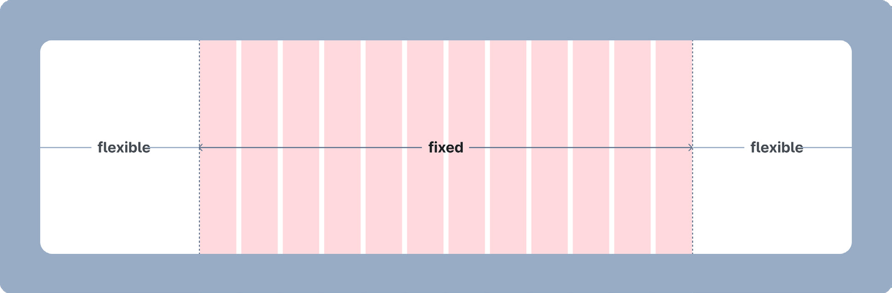

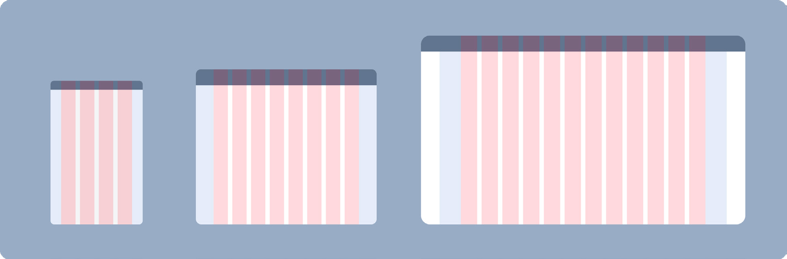

### 표준형 스타일의 경우

- 스크린 마진(24px) + 콘텐츠 너비(1200px) > 디바이스 1248px: 콘텐츠 영역 유지

- 스크린 마진(24px) + 콘텐츠 너비(1200px) < 디바이스 1248px: 콘텐츠 영역 축소

### 풀 반응형 그리드/ 유연한 콘텐츠 영역 (가변형)

화면 크기에 따라 유동적으로 변화하여 다양한 기기에서 최적의 레이아웃을 제공한다. 큰 화면에서 콘텐츠 영역이 지나치게 넓어지지 않도록 가독성과 정보 전달력을 고려하여 레이아웃을 조정한다

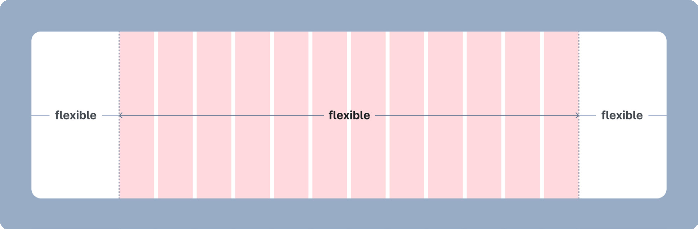

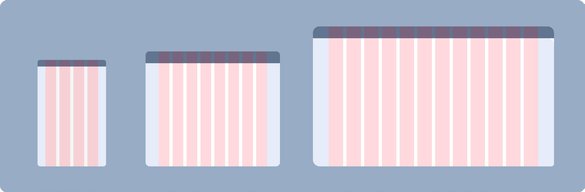

### 서브 페이지 레이아웃

서브 페이지 레이아웃(sub page layout)은 브레이크포인트 large 이상(1024px 이상) 디바이스에서 정보 구조에 따라 변형하여 사용한다.

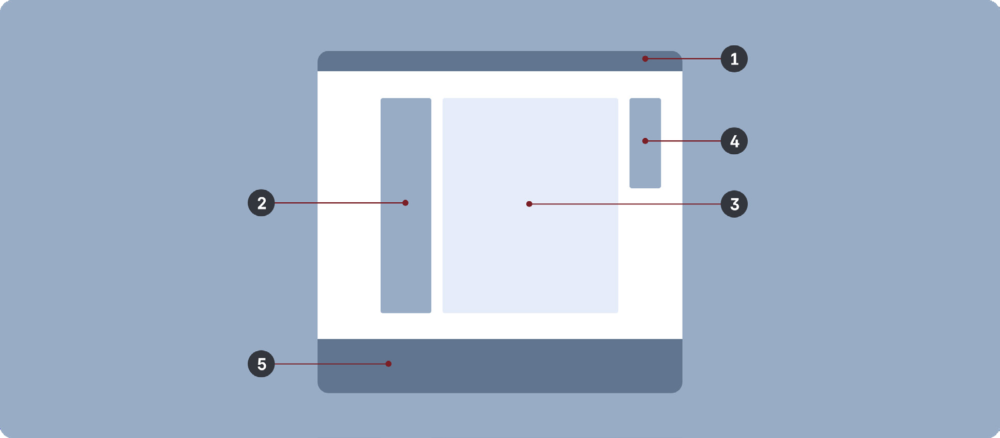

- 1 Header: 사용자가 웹사이트에 접속하자마자 마주하게 되는 화면의 최상단 영역
- 2 Left menu: 서브 화면 내에서의 이동을 위해 사용하는 메뉴 선택사항
- 3 Main contents: 사용자가 본문의 구조를 훑어보고 원하는 콘텐츠로 빠르게 이동할 수 있도록 하는 탐색 수단
- 4 Right menu: 사용자가 본문의 구조를 훑어보고 원하는 콘텐츠로 빠르게 이동할 수 있도록 하는 탐색 수단 선택사항
- 5 Footer: 화면을 구성하는 가장 마지막 요소로 헤더와 본문에서 원하는 정보를 찾지 못하였거나 사이트 구조 탐색 중에 길을 잃은 사용자들이 대면하게 되는 정보
### 왼쪽 메뉴를 사용하는 경우

왼쪽 메뉴는 주로 사이드 메뉴 영역으로 사용하며, 깊은 계층 구조의 탐색에 적합하여 IA 구성이 복잡한 화면에 활용된다.

표준형 스타일은 사이드 메뉴를 포함한 최대 콘텐츠 너비를 1200px으로 사용한다.

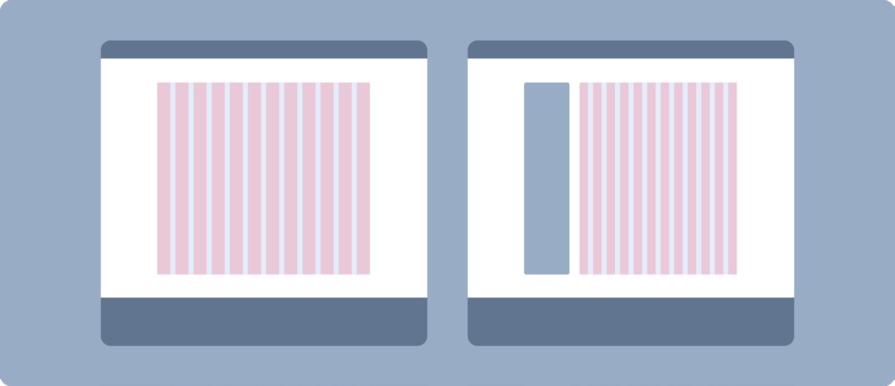

### 오른쪽 메뉴를 사용하는 경우

오른쪽 메뉴는 콘텐츠 내 탐색, 도움 패널이나 빠른 메뉴 등 부가적 정보 제공에 사용된다.

표준형 스타일의 콘텐츠 내 탐색은 콘텐츠 영역 밖에서 플로팅 되며, 도움 패널은 우측에서 펼쳐져 나오는 형태로 사용한다.

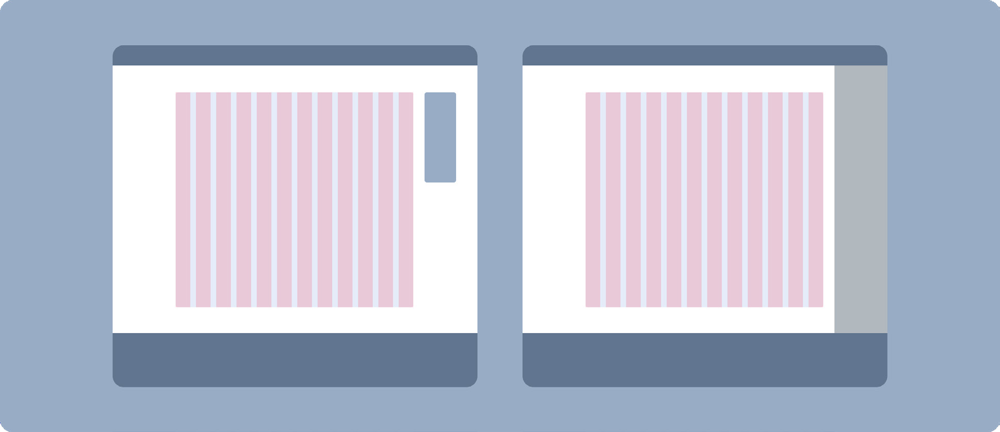

### 양쪽 메뉴를 사용하는 경우

왼쪽 메뉴(예: 사이드 메뉴) 와 오른쪽 메뉴(예: 콘텐츠 내 탐색)를 함께 사용할 경우로 큰 화면에서는 문제없으나, 작은 화면에서 사용 시 콘텐츠 가독성을 위해 메뉴 배치를 조정한다.

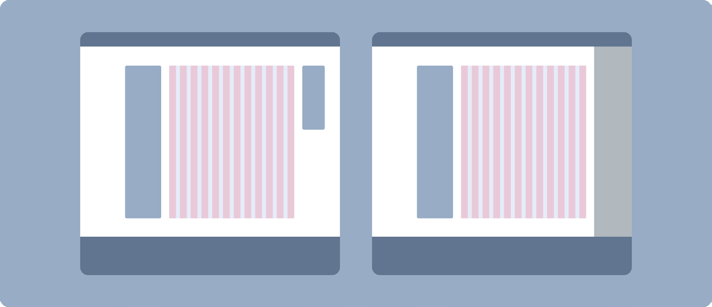

### 간격

간격(spacing)은 UI 디자인에서 요소와 요소 간의 공간을 의미하며, 사용자에게 정보를 쉽게 탐색하고 직관적으로 이해할 수 있는 경험을 제공한다. 모든 간격은 8-point grid system을 기준으로 설정하여 일관성을 유지하며, 페이지 레이아웃에서 시각적 흐름이 자연스럽게 이어지도록 한다.

간격에는 요소 사이의 갭(Gap), 요소 내부의 패딩(Padding), 그리고 다양한 화면 크기에 대응하는 반응형 간격이 포함된다. 간격의 요소는 primitive token인 number에서 사용된다.

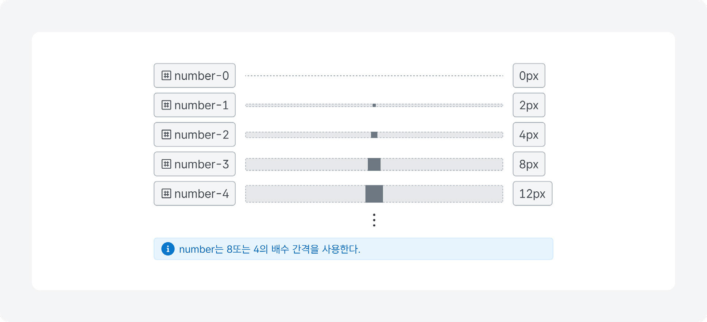

### 갭

갭(gap)은 컴포넌트 사이의 간격을 의미한다. 예를 들어 카드, 리스트 항목, 그리드 레이아웃과 같은 컴포넌트 간의 여백을 조정하여 정보 밀도와 시각적 구성을 제어할 수 있다.

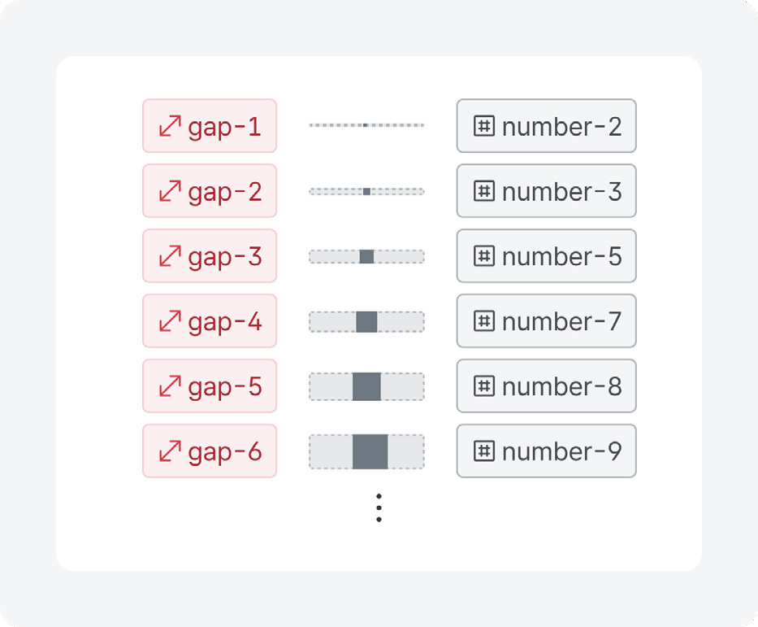

### 패딩

패딩(padding)은 컴포넌트 내부의 여백을 의미하며, 주로 요소의 내용과 경계선 사이의 공간을 조정하는 역할을 한다. 이를 통해 컴포넌트의 가독성을 높이고, 사용자에게 명확한 콘텐츠 구분을 제공한다.

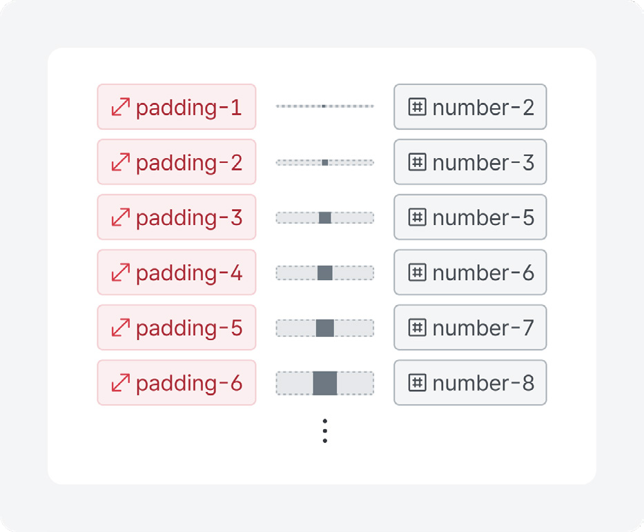

### 반응형 간격 설정

디바이스 사이즈에 따라 적절한 간격을 설정하여 사용한다. 화면 사이즈가 큰 곳에서는 여유있는 간격이 필요하지만 디바이스 사이즈가 작아질수록 간격을 줄여야 화면 공간을 효율적으로 사용할 수 있다.

표준형 스타일은 PC와 모바일 두 가지 주요 디바이스 유형에 대한 간격을 설정하며, 레이아웃 간격이나, 텍스트 사이의 간격, 카드 내부 패딩값 등을 제공한다.

| 모드 | 범위 | 뷰포트 | 기준 사이즈 (콘텐츠 영역) | 사용 |
|---|---|---|---|---|
| Mobile | small | 360px 이상 | 348px | 태블릿을 포함한 소형 디바이스에 지원 |
| Mobile | medium | 768px 이상 | 348px | 태블릿을 포함한 소형 디바이스에 지원 |
| PC | large | 1024px 이상 | 1200px | 일반적으로 데스크탑 및 대형 화면을 지원 |
| PC | xlarge | 1280px 이상 | 1200px | 일반적으로 데스크탑 및 대형 화면을 지원 |

### 간격 적용

간격은 큰 틀의 레이아웃 간격, 타이포 계층 간격, 콘텐츠의 간격, 컴포넌트 내부 요소로는 패딩, 높이 값 등 전반적인 요소에 사용된다.

### Layout

기본 구조에서 사용되는 사이 간격

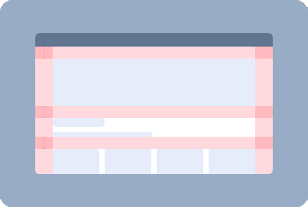

### Contents

콘텐츠의 계층 구조를 위한 간격

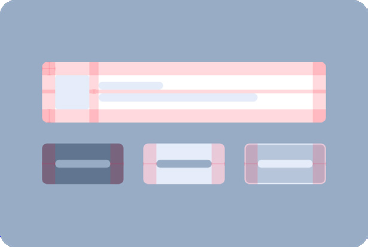

### Padding

컴포넌트 내부에 사용되는 패딩값
### 레이아웃

일관성을 유지하기 위해 큰 화면의 레이아웃 요소의 간격을 정의한다. 기본 구조는 header-body-footer의 영역으로 나누어지며, 필요에 따라 영역을 분리하여 사용한다.

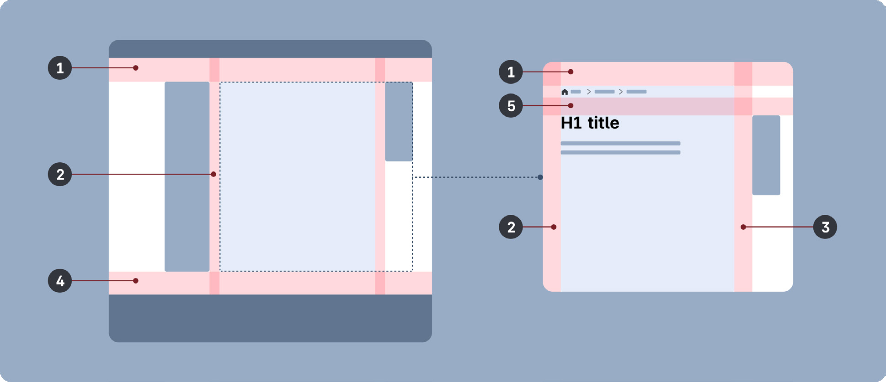

| 브레이크포인트 | 뷰포트 | 칼럼 수 (적정-최대) |
|---|---|---|
| 1. Header-breadcrumb | 24px (-number10) | 24px (-number10) |
| 2. Left-contents | 64px (-number18) | - |
| 3. Contents-right | 40px (-number14) | - |
| 4. Contents-footer | 64px (-number18) | 40px (-number14) |
| 5. Breadcrumb-contents(h1) | 40px (-number14) | 32px (-number11) |
### 콘텐츠 계층 (텍스트 계층)

- 타이포그래피 계층 구조인 h1부터 h5까지의 콘텐츠 사이의 간격으로 계층 구조를 준수하여 사용한다.

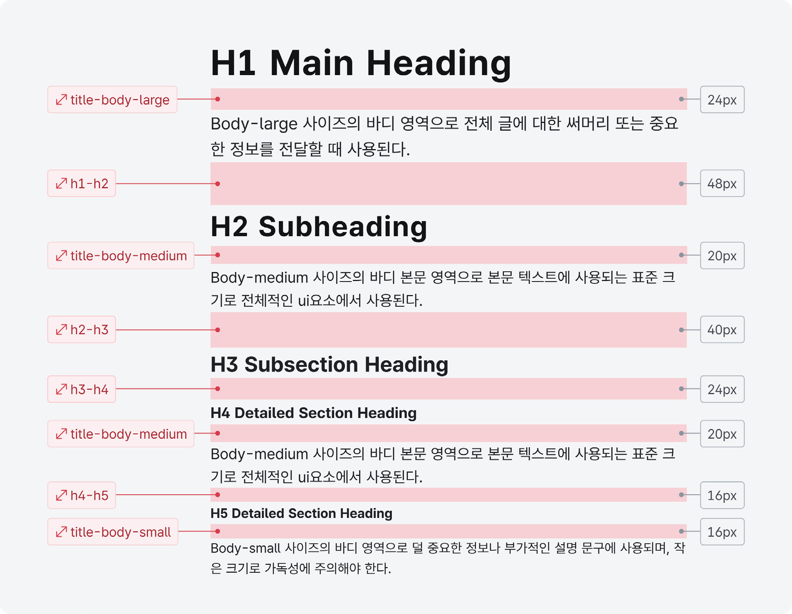

### 컴포넌트 리스트

컴포넌트 사이의 간격과 리스트 간격을 정의한다.

### 카드 리스트

카드 세로형, 가로형, 모듈형 간격은 모두 gap-7(24px)을 사용한다. 대체로 세로형 카드 리스트의 간격은 gutter값으로 적용한다.

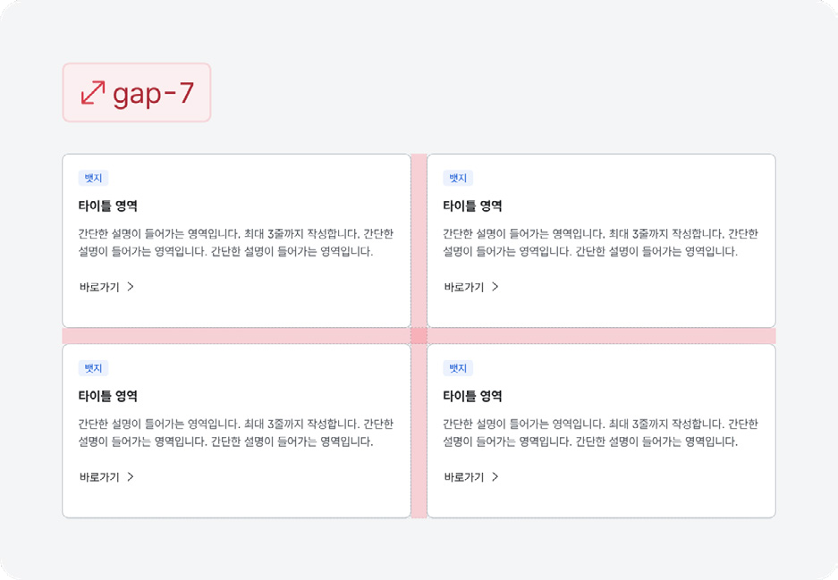

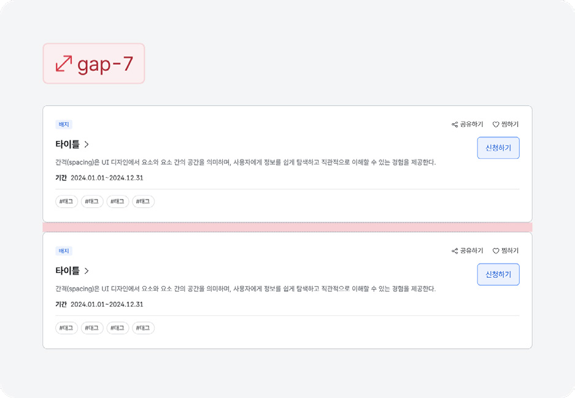

### 인풋

인풋과 인풋, 카드, 셀렉트 등 가로형으로 조합할 경우의 사이 간격은 gap-5(16px) 토큰을 사용하고, 인풋과 인풋을 세로형으로 조합하는 경우는 인풋의 사이즈에 따라 gap-5~gap-7(16px~24px)의 토큰을 사용한다.

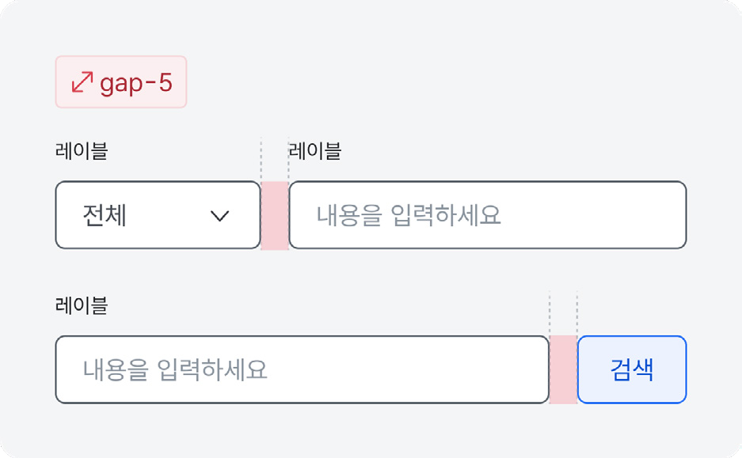

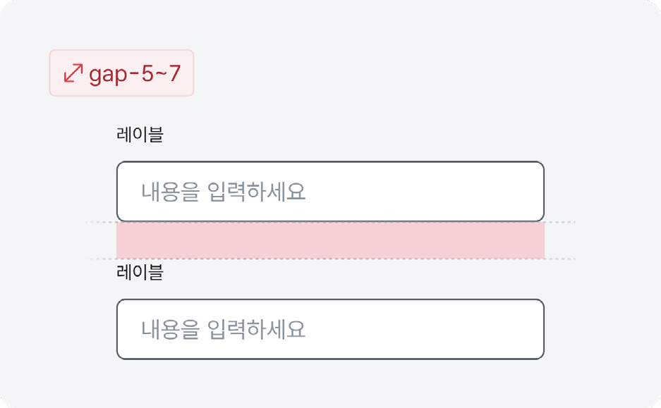
### 체크박스, 라디오버튼

체크박스나 라디오 버튼을 리스트 형태로 사용 시 컴포넌트 사이즈에 따라 gap5-gap7(16px-24px)의 토큰을 사용한다. 또한 가로형을 사용해야 하는 경우 간격을 gap7(24px)이상의 토큰을 사용하여 충분한 간격을 유지한다.

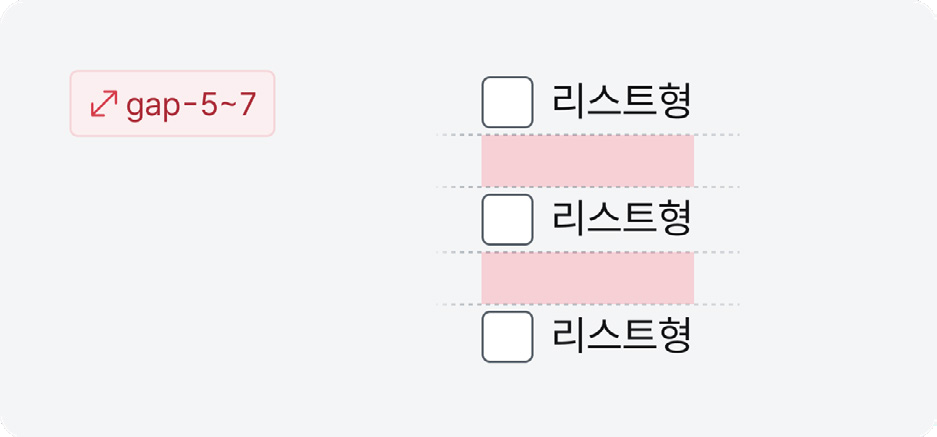

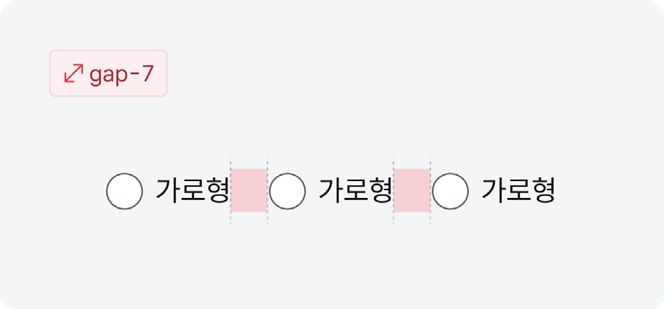

### 컴포넌트 내 패딩

컴포넌트 내부의 패딩값을 정의한다. 기능과 크기에 맞는 패딩과 간격을 일관되게 사용하여 통일감과 가독성을 유지한다.

### 카드

카드, 모달, 인포박스, 알럿 등의 컨테이너는 일관된 레이아웃 유지를 위해 padding-card (padding8-10) 토큰을 사용한다. PC는 넉넉한 여백을, 모바일은 공간 제약을 반영하여 패딩 크기를 다르게 적용한다.

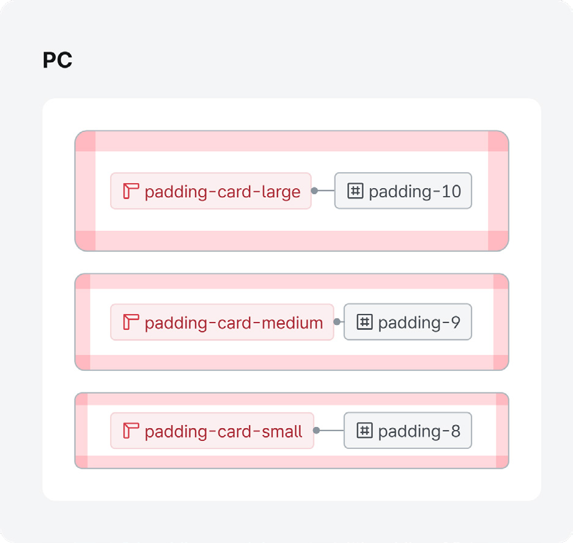

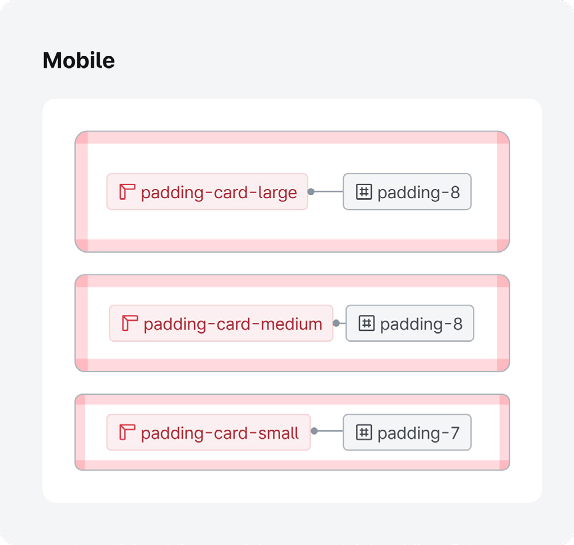
### 텍스트 입력 필드

텍스트 입력 필드(Text input)는 레이블, 부가 설명, 입력 박스, 시스템 메시지 순으로 정렬되며, 각 요소 간의 간격인 gap-3(8px)과 입력 박스의 패딩값인 padding-6(16px)를 유지하여 사용한다.

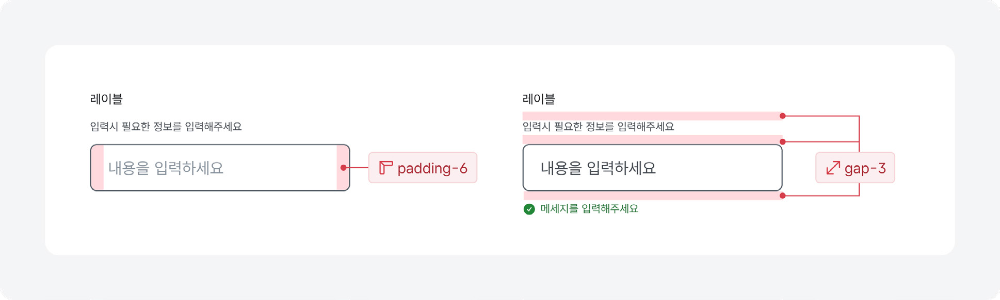
### 사용 가이드

### 스크린 마진 최솟값 유지

디바이스별 스크린 마진 최소값을 유지한다. 모바일에서 디바이스 끝부분에 여백이 없으면 터치가 어려울 수 있다.

모범 사례 피해야 할 사례

