아이콘 가이드는 시스템 아이콘을 중심으로 하며 모든 기관이 동일한 시각 언어와 일관된 사용자 경험을 제공하는 것을 목표로 한다.

브랜드 아이덴티티에 따른 일반 아이콘은 기관마다 다르게 사용할 수 있지만, 시스템 아이콘을 통일적으로 사용함으로써 사용자가 정보를 빠르게 인지하고, 각 기관의 서비스에서 일관된 경험과 신뢰성을 느낄 수 있도록 한다.
### 시스템 아이콘

시스템 아이콘은 화면에서 주요 기능과 정보를 직관적으로 전달하여 사용자 경험의 일관성을 유지하는 데 중요한 역할을 한다.

표준형 스타일을 준수하여 모든 기관에서 동일한 의미와 형태로 시스템 아이콘을 사용하면, 통일된 시각 언어를 통해 사용자가 아이콘을 쉽게 인식하고 기억할 수 있다. 이를 통해 사용자 학습 비용이 줄어들고, 다양한

- 사이트나 서비스에서도 동일한 의미로 즉각 이해할 수 있어 더 명확하고 일관된 경험을 제공한다.

시스템 아이콘은 일관성, 접근성, 가독성을 최우선으로 고려하여 사용한다.

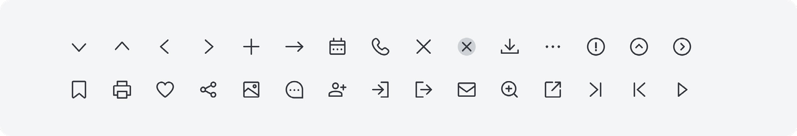

### 확장자

시스템 아이콘은 일관성 있는 품질과 효율적인 관리를 위해 SVG 파일 형식을 사용한다. SVG는 벡터 기반 확장자로, 화질 저하 없이 다양한 크기로 확대 및 축소가 가능하여 고해상도 화면에서도 선명한 품질을 유지한다. 또한, 파일 크기가 가벼워 로딩 속도를 향상시키고, CSS로 스타일링이 가능해 유연한 디자인 적용이 가능하다.
### 사이즈

시스템 아이콘은 24px을 기준 사이즈로 정의하며, 주요 크기로 16px, 20px, 24px, 32px, 40px를 사용한다.

- 24px은 대부분의 인터페이스에서 사용되는 기본 사이즈로, 일반적으로 일관된 시각 경험을 제공하기에 적합하다.
- 32px과 40px은 강조가 필요하거나 넓은 공간에서 사용할 때 적합하다.
- 아이콘 사이즈는 4px 또는 8px 배수로 설정해 화면 간 시각적 통일성을 유지한다.

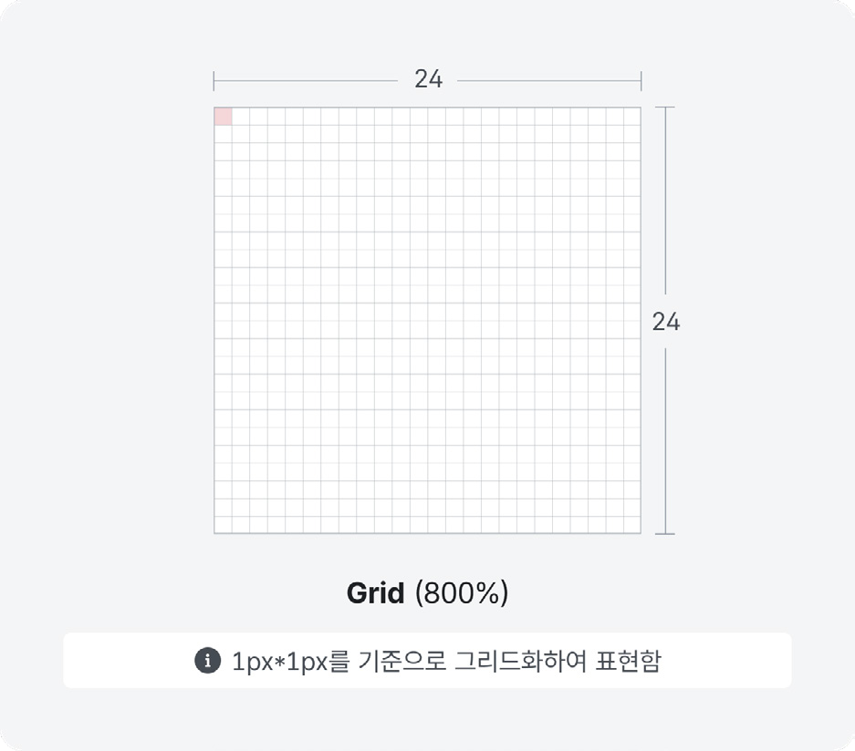

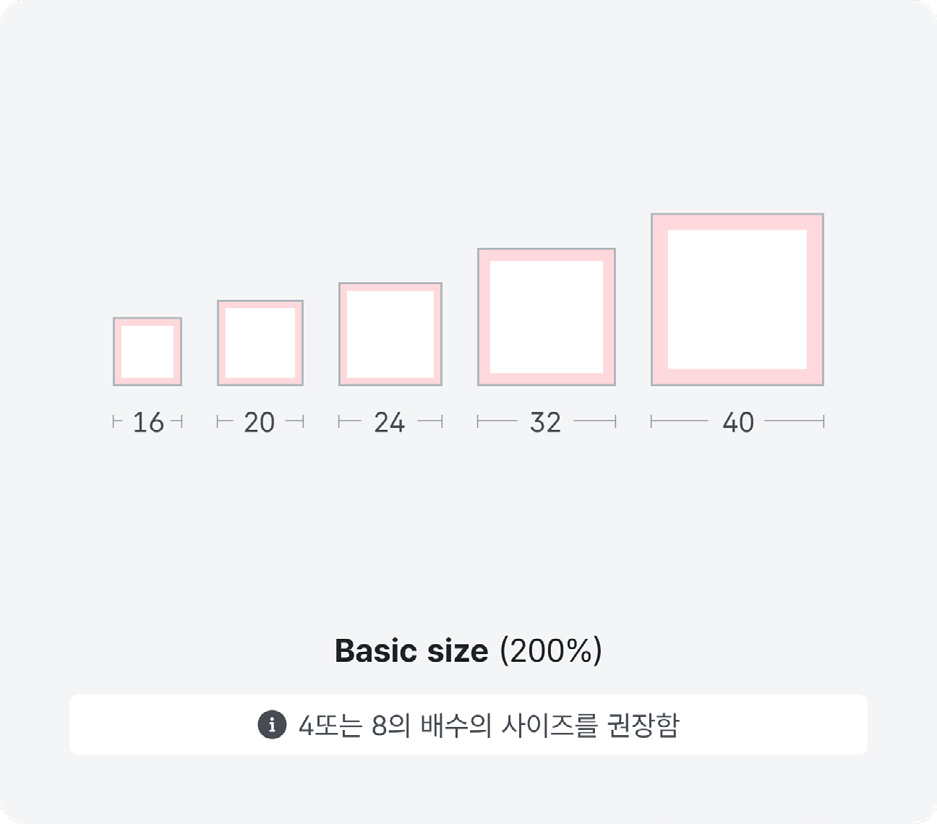
### 키라인

### 레이아웃

- 아이콘은 Live Area(실제 아이콘이 그려지는 영역)와 Padding(주변 여백)으로 구성된다. 키라인은 이 두 영역을 통해 아이콘이 배치되는 기본적인 구조를 제공해, 모든 아이콘이 동일한 비율로 정렬되도록 돕는다.

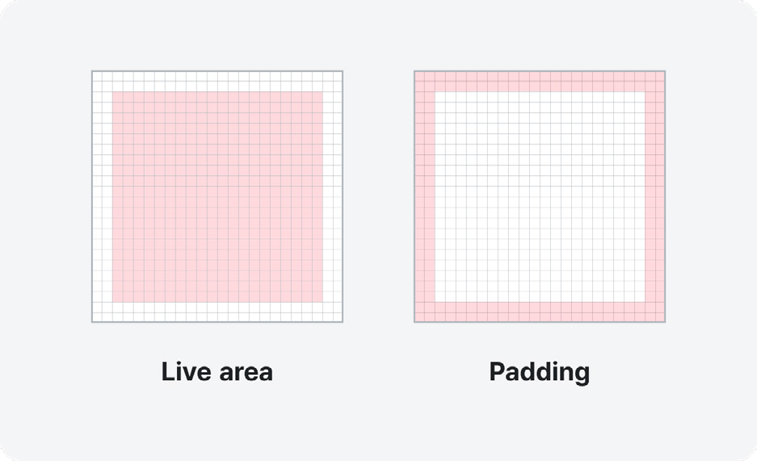

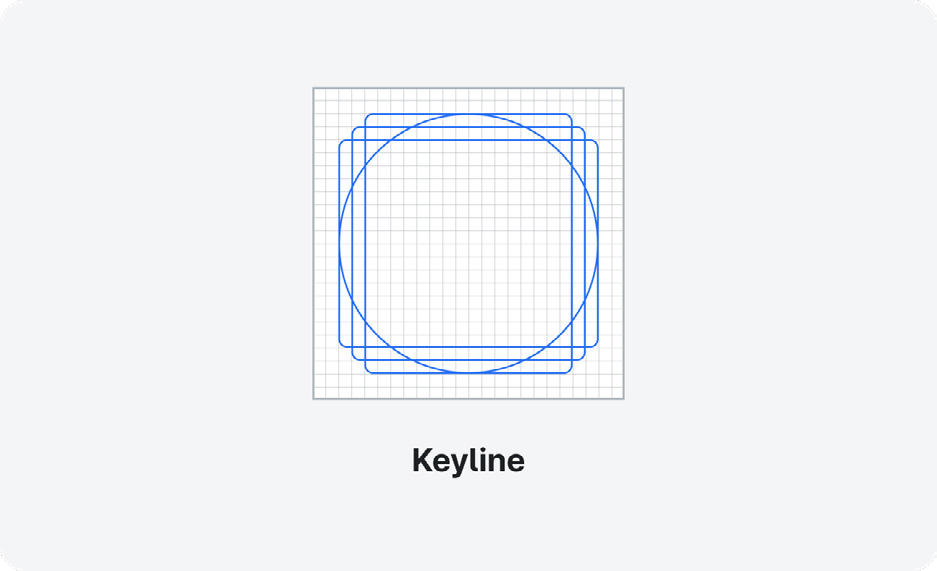
### 키라인 쉐입

키라인 쉐입(keyline shapes)을 기준으로 시각적 균형을 맞추어 사용한다. 키라인은 같은 크기에서 정사각형, 원형, 직사각형 아이콘이 시각적으로 동일한 면적으로 보이도록 도와준다.

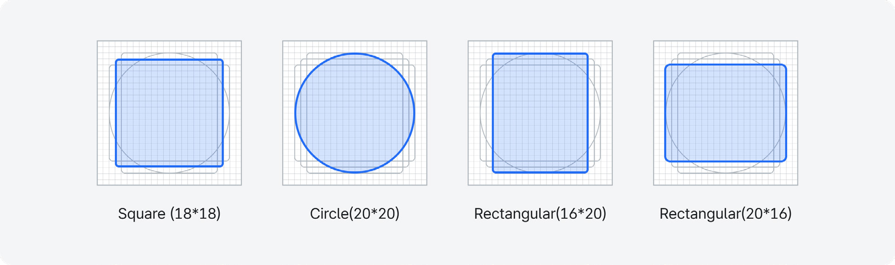

- 24x24의 1000% 사이즈 Keyline이며, 사이즈별 비율에 맞게 변형하여 사용한다.
- 아이콘의 시각적 균형을 맞추기 위해 keyline을 기준으로 일부 요소가 살짝 길거나 짧게 조정이 가능하다.

### 두께

- 아이콘 두께는 아이콘의 가독성과 명확성을 결정하는 중요한 요소로, 24x24px 사이즈의 아이콘 두께로 1.5px~2px 범위를 권장한다.

표준형 스타일에서는 24px 사이즈의 아이콘을 기준으로 두께를 1.6px로 설정하고, 비율에 따라 크기를 조정하여 일관된 시각적 균형을 유지한다.

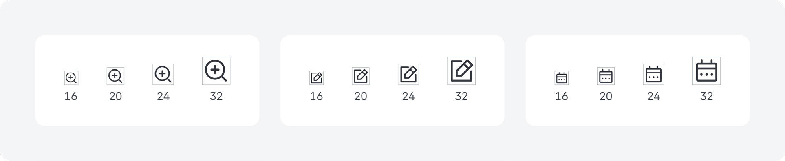
### 일정한 두께의 아이콘 만드는 방법

1. 한 사이즈로 비율로 조정하기

- 기본 크기(24px)를 기준으로 퍼센트로 조정하여 다양한 사이즈로 확장한다. 한 가지 사이즈로 관리 할 수 있다.

2. 각 사이즈 별로 최적화하기

- 각 크기에 맞는 최적화된 굵기 비율을 정의하여 사용한다. 동일한 비율로 다양한 화면에서 일관된 아이콘을 구현할 수 있다.
### 모서리 둥글기 값

시스템 아이콘은 인지하기 작은 사이즈로 가독성을 위해 모서리의 둥글기 값(radius)을 제한적으로 사용한다. 24px 아이콘 기준 래디어스 5px이상을 사용할 경우 형태에 무리가 없는지 유의하며 사용한다.

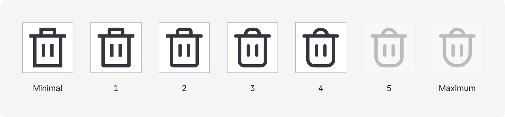

### 표준형 스타일

표준형 스타일에서는 24px 사이즈의 아이콘을 기준으로 두께를 1.6px로 설정하고, 비율에 따라 크기를 조정하여 일관된 시각적 균형을 유지한다.

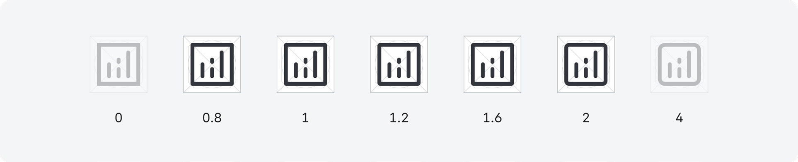
### join으로 둥근 모서리 설정

Stroke setting - Join

형태의 모서리를 표현하는 방법으로 join 설정이 있다. 이 둥글기 값은 대략 0.8px의 래디어스 값과 동일하다.

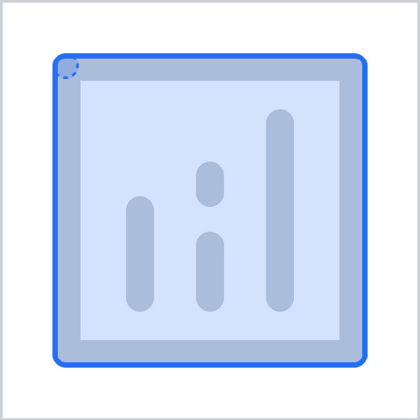

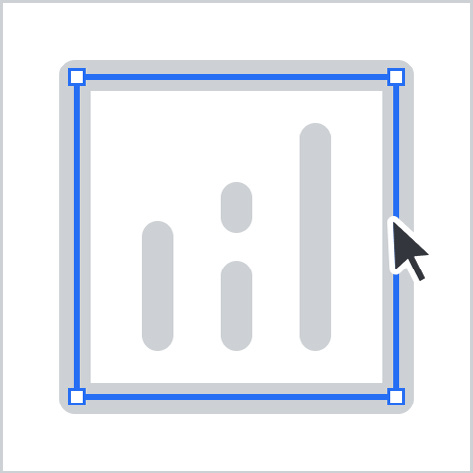

join: miter radius: 0.8

join: round radius: 0

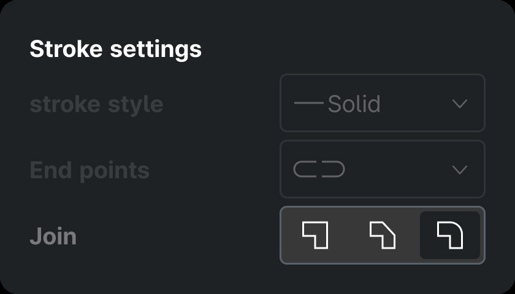
### 디테일 요소

### 라인 모서리(end cap)

라인 모서리(end cap)는 선의 끝의 모양을 설정할 수 있으며 아이콘 형태에 따라 통일하여 사용하는 것이 좋다.

표준형 스타일은 end cap의 둥근 형태로 사용한다.

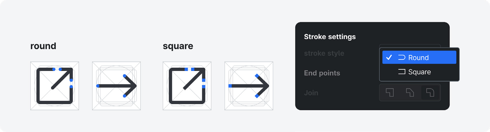

### 꺼짐 (‘off’ slash)

꺼짐 또는 불가 표시를 설명하는 ‘off’ slash의 방향을 통일하여 표현하여 인지가 쉽게 한다.

표준형 스타일은 좌측 상단에서 우측 하단 방향으로 표현하며, 오브제와 슬래시의 여백은 선 두께의 1/2(0.8px)로 사용한다.

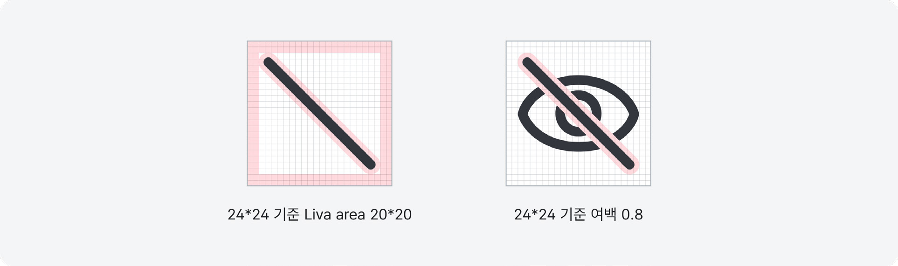
### 겹친 형태(stack)

오브제와 오브제가 결합된 아이콘은 겹쳐진 위치와 여백을 동일하게 표현하는 것이 좋다.

표준형 스타일은 좌측에서 우측으로 쌓는 순서를 통일하며 겹쳐진 여백은 1.6px로 사용한다.

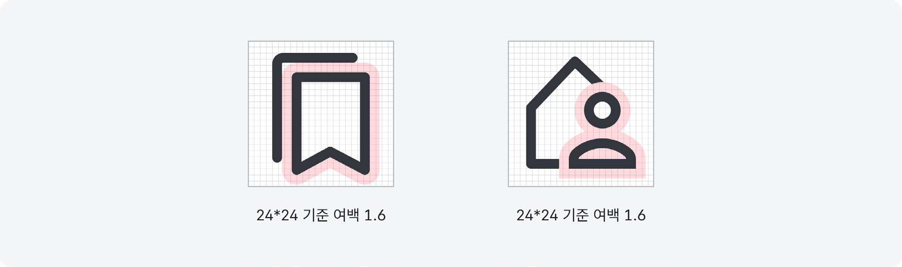

### 아이콘 색상

아이콘 색상은 시각적 일관성과 상태 전달을 위해 명확히 구분되는 색상을 사용하여 가독성을 높인다. 기본 모드에서의 아이콘은 비텍스트로 인접 색상과 최소 3:1, 선명한 화면 모드에선 7:1의 대비율을 갖는다.

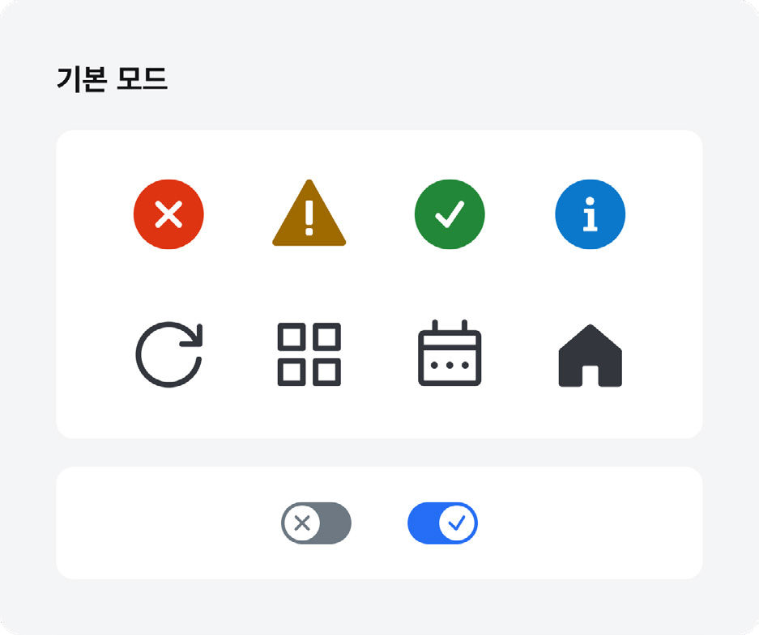

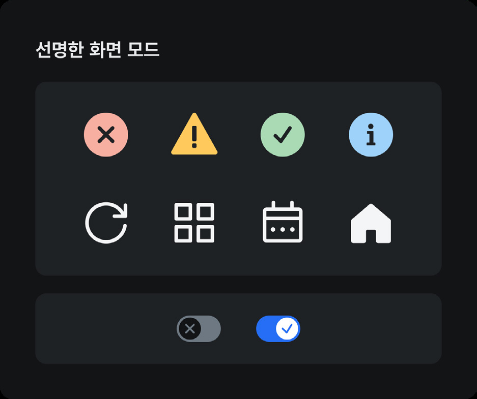
### 사용 가이드

### 단순한 형태

아이콘 색상은 시각적 일관성과 상태 전달을 위해 명확히 구분되는 색상을 사용하여 가독성을 높인다. 기본 모드에서의 아이콘은 비텍스트로 인접 색상과 최소 3:1, 선명한 화면 모드에선 7:1의 대비율을 갖는다.

모범 사례 피해야 할 사례

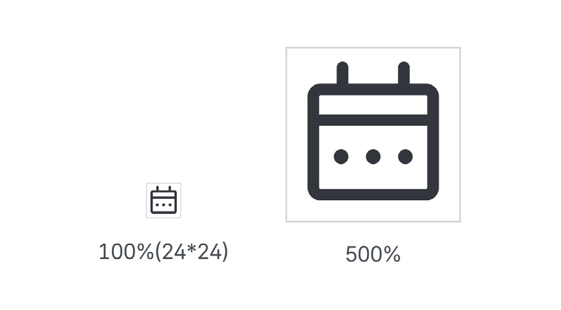

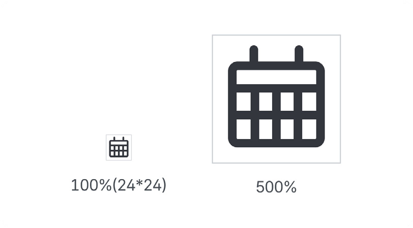
### 두께

너무 굵거나 가는 선은 가독성이 떨어지므로 사용하지 않는다.

모범 사례 피해야 할 사례

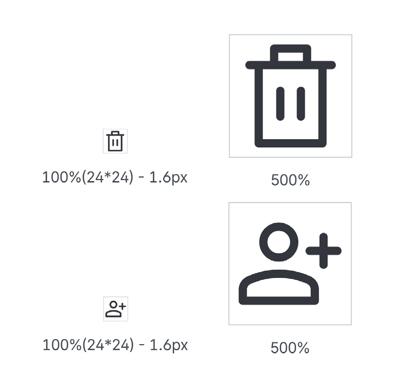

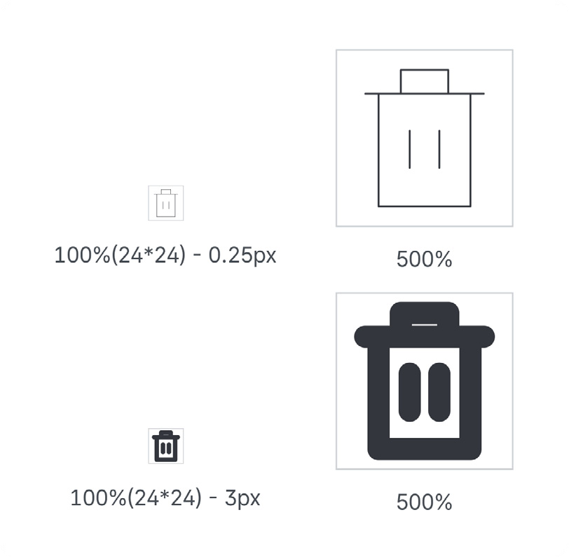

### 일관성

같은 크기의 아이콘을 표현할 때 한 가지의 두께만 사용한다.

모범 사례 피해야 할 사례

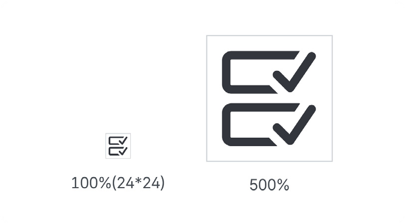

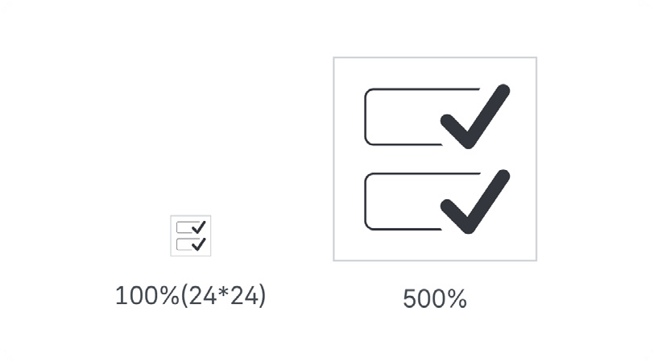
- 사이즈 별 래디어스
- 아이콘의 크기에 따라 시각적으로 적절한 래디어스 값을 맞춰 사용한다. 아이콘을 담는 컨테이너가 커질수록 래디어스 값도 커진다.

모범 사례 피해야 할 사례

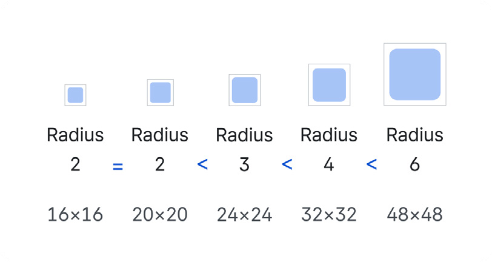

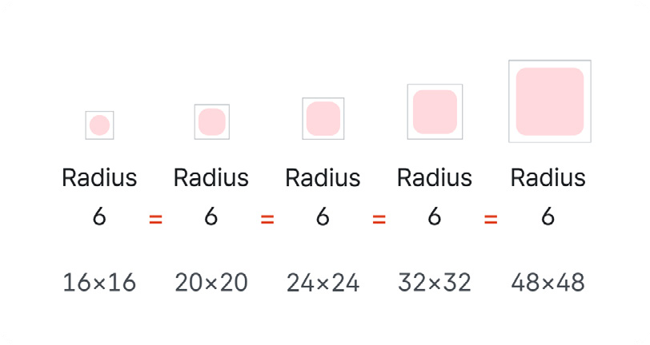

### 색상

아이콘의 색상은 아이콘 동작의 중요성을 반영해야 하며, 텍스트와 동일한 색상 대비율을 가져야 한다.

모범 사례 피해야 할 사례

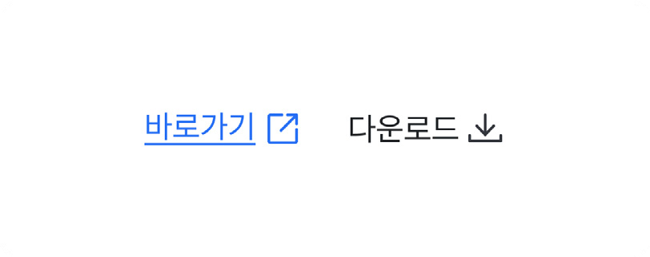

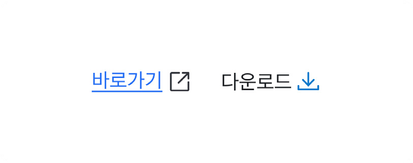
### 시점

아이콘의 시점을 Perspective view가 아닌 Front view로 제작한다.

모범 사례 피해야 할 사례

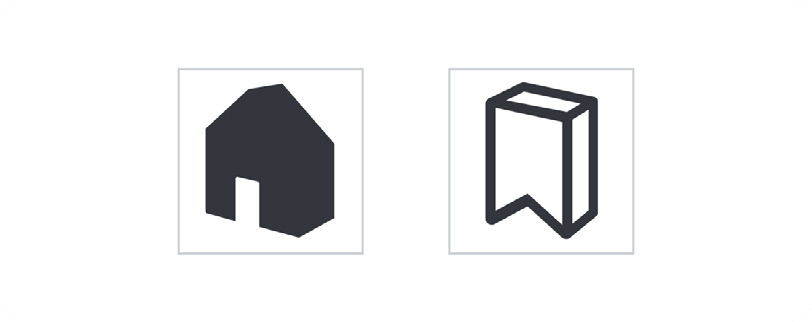

### 타입 (Line, Fill)

Line type과 Fill type을 구분하여 사용한다.

모범 사례 피해야 할 사례

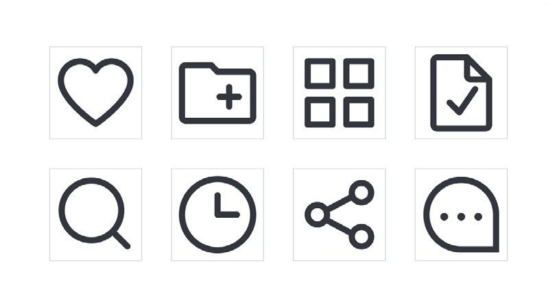

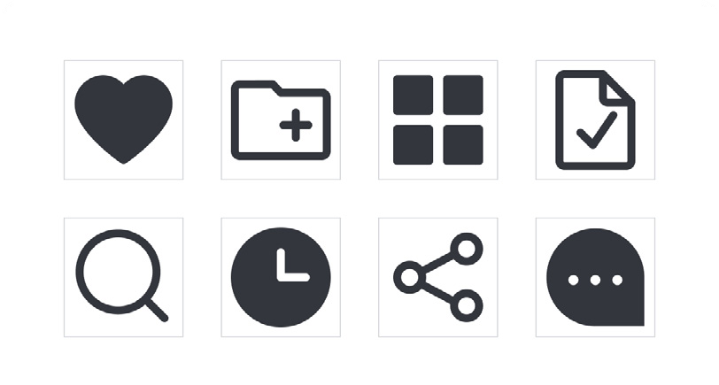
### 정렬

텍스트와 함께 사용할 경우 텍스트와 중앙 정렬한다.

모범 사례 피해야 할 사례

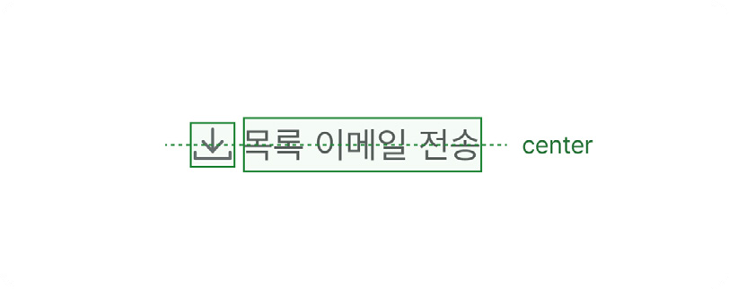

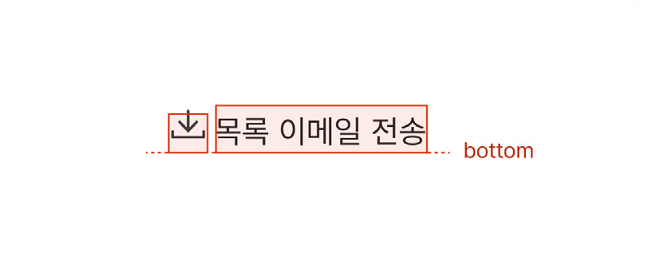

### 텍스트와 사용하는 경우

텍스트와 함께 아이콘을 사용하는 경우 매칭된 사이즈만 사용한다.

모범 사례 피해야 할 사례

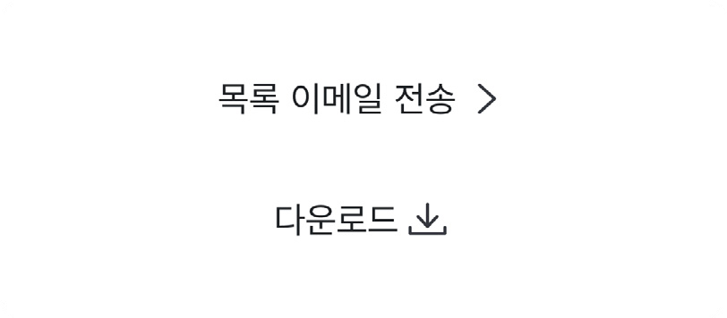

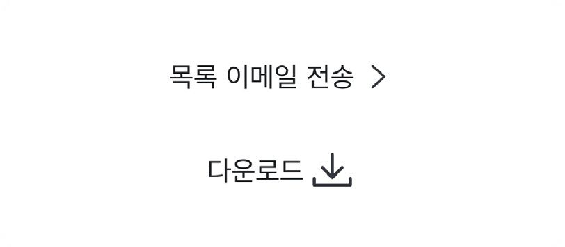
