다크 모드와 유사한 선명한 화면 모드는 시각 기능에 제약이 있는 사용자, 저조도 환경의 사용자를 위해 콘텐츠의 가독성과 가시성을 높인 화면 스타일이다. 어두운 배경과 밝은 전경의 색상 팔레트 사용을 기본으로 하여 중요 정보에 보조적인 시각 단서를 제공함으로써 쉽고 편안한 읽기 경험을 제공한다.
### 스타일

디지털 정부서비스 디자인 시스템의 선명한 화면 모드를 표현하는 데 핵심이 되는 스타일 요소는 색상, 대비, 상태, 계층 구조, 시각 보조이다. 요소별 상세 구현 방안은 관련 가이드와 디자인 토큰을 참조하면 된다.

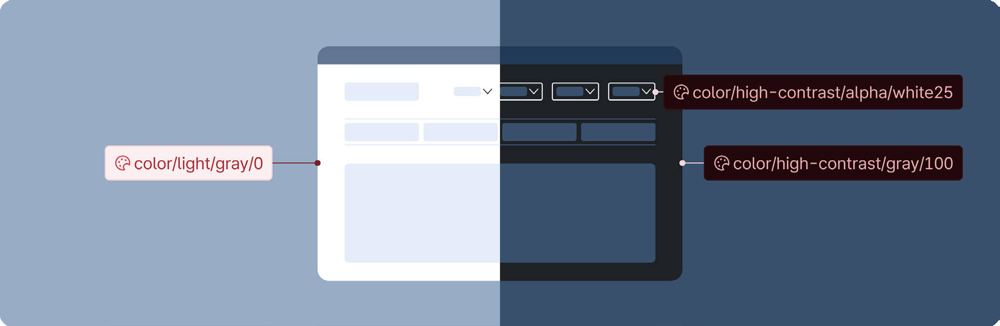

### 색상

선명한 화면 모드로 전환되었을 때, 색상 체계는 색상 팔레트에 정의된 규칙에 따라 선명한 화면 모드 팔레트로 일괄 전환된다.
### 대비

선명한 화면 모드는 기본 모드에 비해 높은 대비의 콘텐츠를 제공해야 한다. 높은 대비 확보를 위해 콘텐츠의 기본 명도 대비를 7:1 이상으로 제공한다. 정보의 위계 수준과 용도에 따라 아래와 같이 명도 대비를 조정할 수 있다.

### 상태

요소의 표현 방식에 따라 선명한 화면 모드에서 더 잘 인지될 수 있도록 상태의 표현을 변경해야 할 수도 있다. 텍스트, 아이콘 아래 영역의 배경색은 대부분 모드에 상관없이 일관된 색상 상태 규칙을 사용한다. 텍스트, 아이콘, 컴포넌트의 윤곽선에 색이 사용되었다면, 선명한 화면 모드에서는 일반 모드와 반대의 방식으로 정의된 상태 규칙을 사용한다.

### 계층 구조

일반적으로 어두운 배경에서는 밝은 배경과 다르게 면의 깊이에 따라 레이어 배경면은 점차 밝아지도록 표현한다. 따라서 선명한 화면 모드에서는 기본 모드보다 시각적으로 계층 구조가 보다 명확하게 드러나므로 사용자의 콘텐츠 탐색에 도움을 줄 수 있다.

|콘텐츠 구분|기본 모드|선명한 화면 모드|
|---|---|---|
|본문 텍스트|7:1 이상|15:1 이상|
|헤딩, 레이블 등의 텍스트|4.5:1 이상|7:1 이상|
|아이콘, 시각 보조|3:1 이상|4.5:1 이상|
### 시각 보조

인지적 능력 수준으로 인해 어떤 사용자는 화면에서 어떤 행동을 해야 하는지를 판단하는 데 어려움을 겪을 수 있다. 또 어떤 사용자는 시력이 좋지 않아 단순 텍스트와 링크, 버튼을 구분하지 못할 수도 있다. 시각 보조는 예시와 같은 상황에 놓인 사용자가 대화형 요소를 보다 쉽게 발견하고 조작할 수 있도록 기본 컴포넌트에 부가적인 시각 단서를 제공한다.

그러나 모든 대화형 요소에 동일한 표현의 시각 보조를 제공하였을 때 오히려 시각적 복잡도가 증가하거나 콘텐츠의 강조 수준이 부적절하게 변경될 수 있다. 따라서 디지털 정부서비스 가이드라인은 콘텐츠의 특성과 이용 맥락을 고려하여 헤더, 푸터, 본문 내 특정 요소에 시각 보조를 제공한다.

- 헤더: 유틸리티 링크에 윤곽선/배경색을 표시한다.

- 푸터: 푸터 내 모든 링크에 밑줄을 표시한다.

- 액션, 선택, 입력: 버튼, 입력, 선택 컴포넌트의 외곽선, 링크 밑줄을 기본 모드에서 보다 굵게 제공하고 명도 대비를 높인다. 본문에 사용된 모든 인라인 유형의 링크에는 밑줄을 표시한다.
## 사용성 가이드라인

스타일 가이드와 디자인 토큰에 정의된 규칙에 따라 스타일을 표현한다.

디자인 토큰에 정의된 규칙에 따라서 모든 스타일 체계가 선명한 화면 모드로 전환되도록 한다.

흰 배경 색상을 가진 요소의 사용에 유의한다.

어두운 화면에 넓은 면적의 흰 배경을 가진 요소를 사용했을 때 눈부심을 유발하거나 지나치게 강조되어 표현될 수 있으므로 색상 팔레트에서 조금 더 어두운 색상을 사용하여 요소를 표현한다.
모범 사례

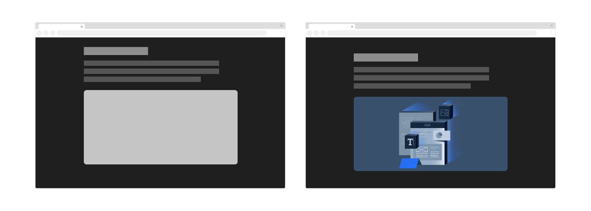

피해야 할 사례

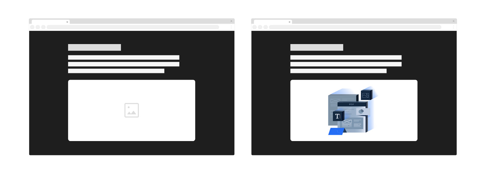
일반 모드와 선명한 화면 모드에서 잘 식별되는 이미지를 사용한다.

일반 모드에서 선명한 화면 모드로 전환되었을 때 모든 이미지가 문제없이 표시되는지 확인해야 한다. 가장 좋은 방법은 일반 모드와 선명한 화면 모드에 잘 호환되는 이미지를 사용하는 것이다. 그러나 상황에 따라 특정한 이미지를 선명한 화면 모드에서 알아보기 어렵다면 각 모드별로 제공될 이미지를 준비해야 한다.

래스터(Raster) 이미지(JPEG, PNG, GIF 등)는 두 가지 모드에 대응 가능하도록 별도 버전을 준비한다. 벡터(Vector) 이미지(SVG 등)는 디자인 토큰의 색상 규칙에 따라서 적용될 수 있도록 구현한다.

모범 사례

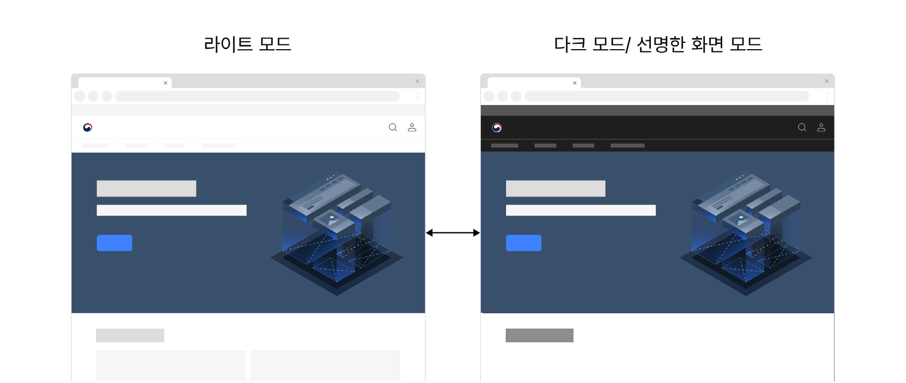

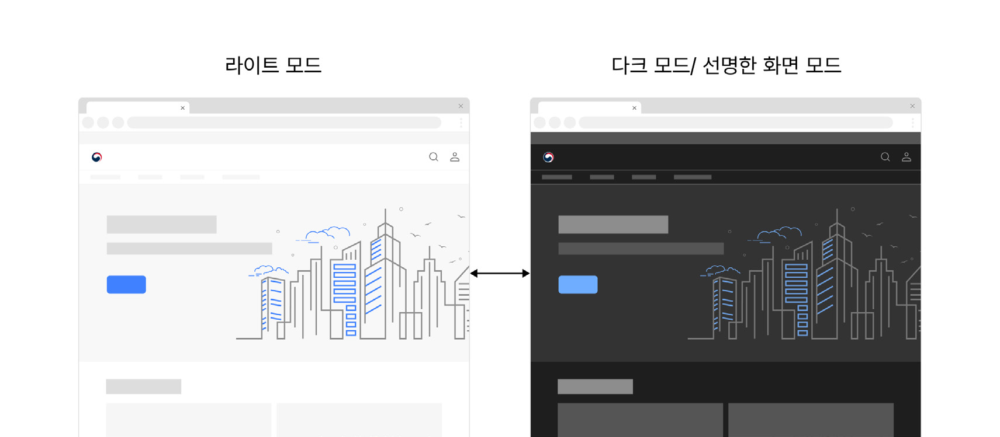
### 피해야 할 사례

### 피해야 할 사례 2

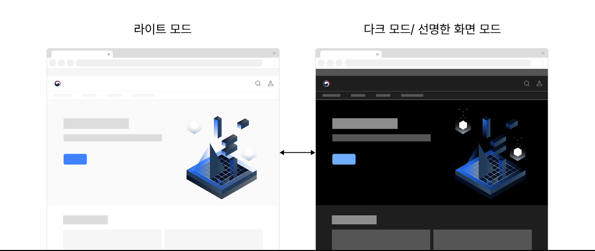

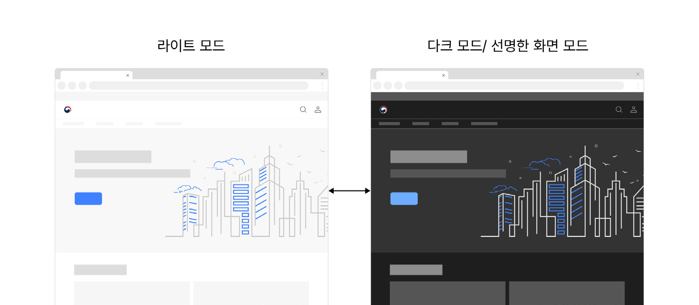
한 화면에서 다른 화면으로 이동하거나 서비스 채널이 변경될 때 모드 일관성을 유지한다.

선명한 화면 모드는 하나의 스타일 주제이므로 한 서비스 내에서 모든 화면과 요소는 일관된 주제로 표현되어야 한다. 모바일 애플리케이션에서 웹 페이지를 여는 것과 같은 채널/플랫폼 간 전환이 발생하는 경우에도 가능한 스타일 모드의 일관성이 유지되도록 한다.

모범 사례

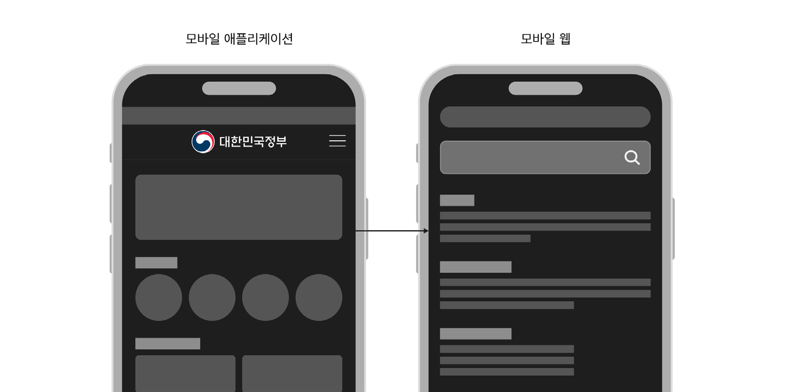

피해야 할 사례

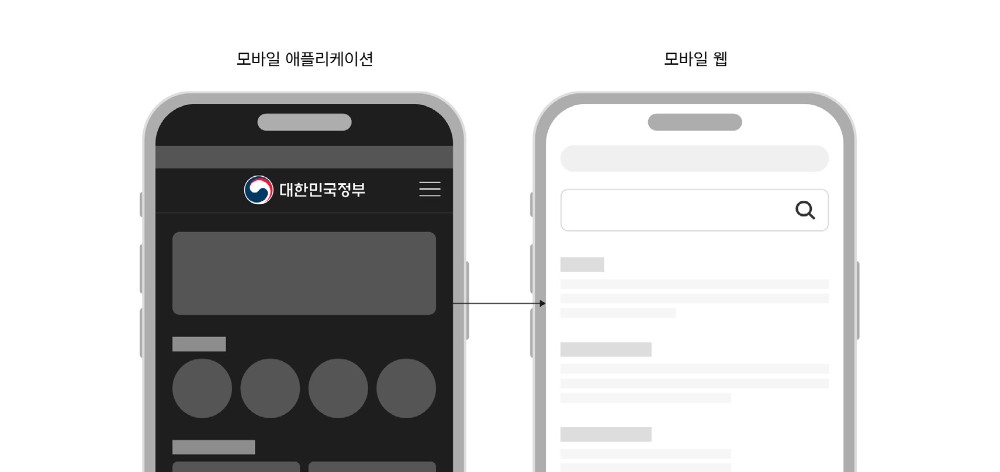
프레임으로 제공되는 요소에는 별도의 스타일을 지정한다.

프레임으로 포함된 문서는 부모 화면의 스타일 속성을 상속하지 못한다. 만약 프레임 요소가 선명한 화면 모드 또는 다크 모드를 지원한다면, 부모 화면이 선명한 화면 모드로 전환되었을 때 프레임 요소도 어두운 배경으로 표시되도록 한 화면 내에서의 스타일 일관성이 유지되도록 한다.
모범 사례

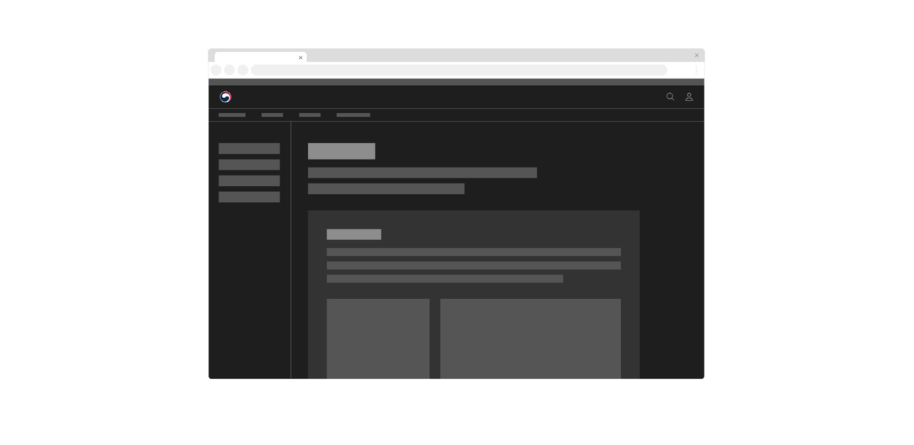

피해야 할 사례

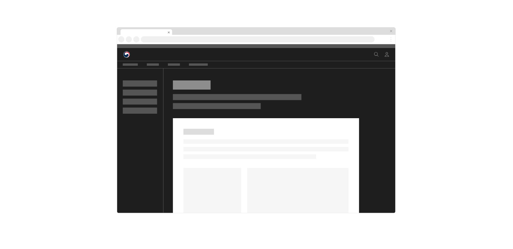
## 접근성 가이드라인

선명한 화면 모드에서 정보를 전달하기 위한 콘텐츠의 전경과 배경 간 명도 대비가 4.5:1 이상을 충족하는지 확인한다.

선명한 화면 모드는 기본 모드에 비해 향상된 콘텐츠의 대비를 목표로 한다. 정보를 전달하는 모든 콘텐츠는 배경과의 명도 대비를 최소 4.5:1 이상으로 제공하며, 가능하면 7:1 이상의 명도 대비를 갖도록 표현하는 것이 좋다.

- WCAG 2.1 Contrast (Minimum) (AA)

- WCAG 2.1 Contrast (Enhanced) (AAA)

선명한 화면 모드로 전환되었을 때 콘텐츠나 기능이 손실되지 않도록 한다.

선명한 화면 모드는 일반 모드 화면과 동일한 정보와 기능을 제공해야 한다.

- WCAG 2.1 Contrast (Minimum) (AA)

- WCAG 2.1 Contrast (Enhanced) (AAA)

- WCAG 2.1 Non-text Contrast (AA)
