디자인 시스템의 스타일 가이드 요소인 색상, 글자, 간격의 스타일 속성을 변수로 정의하여 코드화한 것이다.
### 디자인 토큰은?

디자인 토큰(Design Tokens)은 디자인 시스템에서 반복적으로 사용되는 디자인 속성을 효율적으로 관리하기 위한 일종의 추상화된 값을 변수로 정의한 코드이다. 색상, 글자, 간격, 그림자 등과 같은 스타일의 속성을 정의하고, 이를 코드로 변환하여 디자인 시스템 전반에 걸쳐 일관된 스타일을 유지할 수 있게 도와준다.

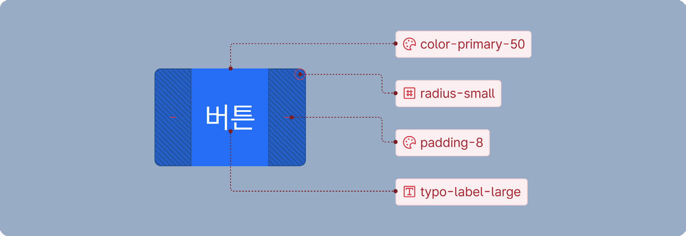

### 토큰을 사용하는 이유

KRDS 디자인 토큰은 디지털 취약계층을 고려하여 설계된 스타일 가이드 토큰으로, 표준형 스타일을 준수하는 기관은 바로 적용할 수 있다. 확장형 스타일 가이드를 준수하는 기관은 각 부처의 특성에 맞는 색상과 모양을 테스트하고 적용할 수 있으며, 접근성 기준을 준수하기 쉽게 설계되어 있다.
일관성 유지

토큰을 통해 핵심 디자인 요소를 코드화하여 관리함으로써 기본적인 일관성을 유지한다.

- 표준형 스타일을 준수하는 기관은 디자인 토큰 요소를 그대로 사용한다.

- 확장형 스타일을 준수하는 기관은 자유도가 있는 디자인을 적용할 수 있지만, KRDS의 스타일 가이드와 적용된 토큰을 기반으로 관리하면 스타일 설계 원칙을 준수하며 사용할 수 있다.

협업 강화

디자인 속성을 코드화하여 공통 언어로 변환된 토큰을 사용함으로써 디자이너와 개발자가 같은 방식으로 디자인을 이해하고 적용할 수 있게 한다.

접근성 및 표준화 지원

명도 대비 관련 요소를 표준화한 토큰으로 접근성 기준을 쉽게 준수할 수 있도록 도와준다.
### KRDS의 디자인 토큰 흐름

디자인 툴의 토큰을 JSON으로 추출하여 CSS 변수로 변환한 후 HTML에 적용한다.

디자인 툴 또는 CSS에서 토큰 값을 수정할 시 변경된 토큰 값으로 HTML에 바로 반영 가능하다.

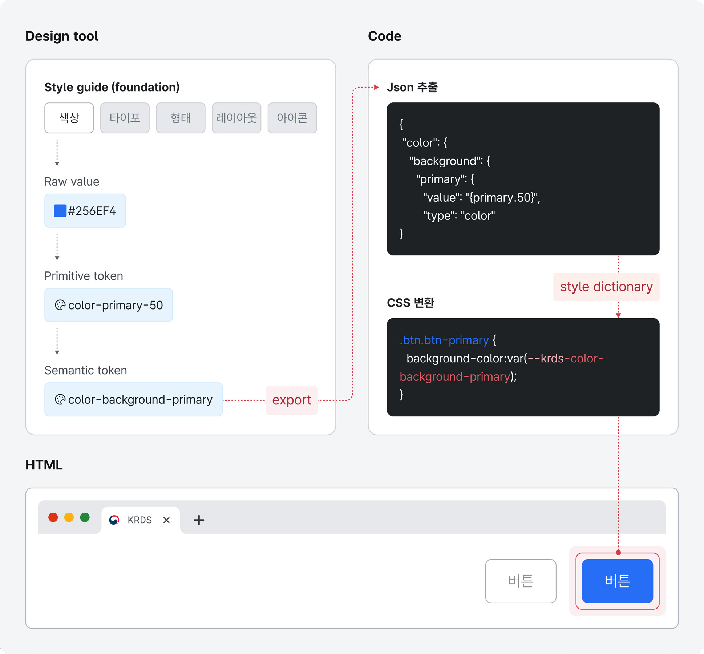
### 디자인 토큰 레벨

디자인 토큰은 세 가지 레벨로 구분되며 기본적인 스타일 속성을 정의하는 primitive token, 구체적인 의미를 부여한 semantic token, 그리고 특정 컴포넌트에 적용되는 component token으로 정의한다.

이 레벨 구조로 primitive token의 value 값을 변경하면 모든 관련 스타일이 자동으로 업데이트되어, 시스템 전반에서 일관된 스타일을 유지하고, 유지보수를 간편하게 할 수 있다.

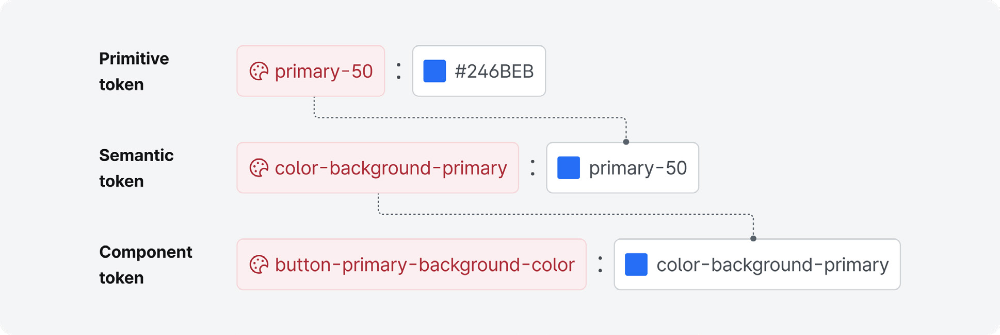
### 프리미티브 토큰 (primitive token)

Primitive 토큰은 color, typo, space, radius 등 기본적인 디자인 속성을 정의하는 토큰 레벨이다. 이 레벨의 디자인 요소의 기본 토큰일 뿐 직접적인 사용은 하지 않는다.

primary, secondary, gray의 0-100까지의 색상 팔레트, 타이포그래피의 서체, 굵기, 사이즈, 간격의 기본 4, 8, 16, 20 등의 수치가 primitive token에 해당한다.

* 다른 토큰의 참고 요소이므로 직접적인 사용은 하지 않는다.

예시 primary-50, gray-5, number-4

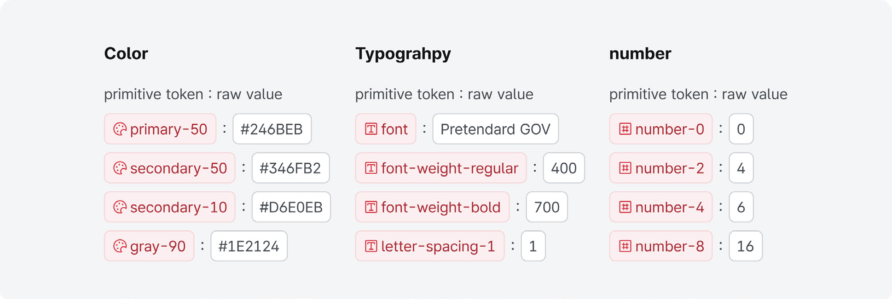
### 시멘틱 토큰 (Semantic token)

특정 맥락에서 의미를 가지는 속성으로 primitive tokens를 참조하여 정의하며 주로 특정 상태나 역할을 나타내는 데 사용한다.

배경에 사용되는 색상, 아이콘에 사용되는 색상, 카드 내부 패딩값, 작은 사이즈 컴포넌트의 래디어스 등이 해당된다.

예시 color-icon-primary, color-border-gray-light

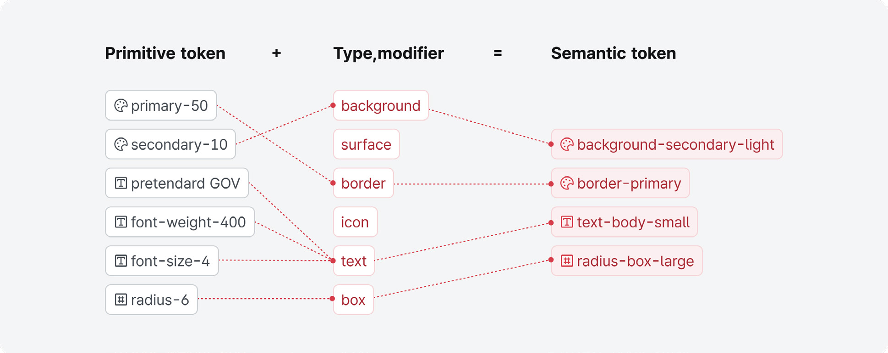
### 컴포넌트 토큰 (Component token)

특정 UI 컴포넌트(버튼, 입력 필드, 카드 등)에 직접적으로 적용되는 구체적인 표현의 디자인 속성으로 semantic tokens을 참조하여 스타일을 정의한다.

버튼에 들어가는 색상, 버튼에 들어가는 라인 색상, 인풋에 들어가는 래디어스등 특정 UI를 표현하는 데 사용한다.

예시 --namespace-component--theme-type-size-modifier

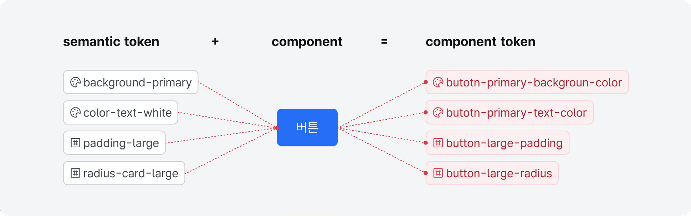

### 컴포넌트 토큰 사용 유의 사항

KRDS의 디자인 토큰 시스템에서는 디자인 툴에서 시멘틱 토큰까지만 정의하며, 컴포넌트 토큰은 코드에서 정의하여 사용한다. 이는 디자인 툴과 코드 간의 역할 분리를 통해 효율성을 극대화하고 일관된 관리가 가능하도록 하기 위함이다.

- 디자인 툴에서의 예외적인 토큰: 디자인 툴에서 선언된 일부 토큰(예: input, button 등)은 컴포넌트 이름을 사용하지만, 이는 특정 컴포넌트 자체를 정의하는 것이 아니라 맥락적인 의미를 부여한 시멘틱 토큰으로 간주한다.

- 컴포넌트 토큰의 역할 분리: 디자인 툴에서는 사용자의 이해를 돕는 시멘틱 토큰을 정의하며, 컴포넌트 토큰은 해당 시멘틱을 기반으로 한 구체적인 구현 속성을 코드에서 작성한다.
### 디자인 토큰 표기

디자인 토큰은 명확한 규칙에 따라 정의되며, 큰 개념에서 세부 요소로 좁혀가는 방식으로 구조화한다. 이는 일관성과 가독성을 유지하고, 개발자와 디자이너가 동일한 언어로 토큰을 이해할 수 있도록 돕는다. 시멘틱 토큰과 컴포넌트 토큰의 표기 방식은 각각의 목적과 사용 방식에 따라 구분된다.

### 시멘틱 토큰 (Semantic token)

시멘틱 토큰은 시스템의 네임스페이스, 테마, 카테고리, 속성, 변형 상태 등을 포함하여 디자인 툴에서 정의된다. 이는 재사용 가능성과 유연성을 높이기 위한 기반이 된다.

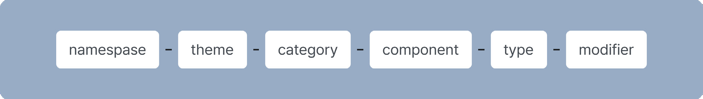
### 컴포넌트 토큰 (Component token)

컴포넌트 토큰은 버튼, 인풋 등 개별 컴포넌트의 세부 속성을 정의하며, 코드에서 작성 및 관리된다. 시멘틱 토큰과 달리, 컴포넌트 명칭을 기준으로 속성을 그룹화하고 구조적으로 정의한다.

- 컴포넌트 토큰 작성 시 컴포넌트 명을 다른 속성보다 먼저 표기하며 컴포넌트명 뒤에 대시 2개 (—)를 붙여 다른 속성과 구분한다.

- 속성 작성 시 디자인 토큰 네이밍 규칙을 준수하되, 새로운 속성을 추가하는 경우 되도록 css에서 사용하는 속성 명을 차용한다.

- padding, margin 등의 속성 중 좌/우 또는 상/하 값이 동일한 경우에는 -x(좌우 동일) / -y(상하 동일)로 표현한다. 예) padding 좌우값이 동일한 경우: --namespace-component--typepadding-x

### 컴포넌트 토큰 사용 예시

css variable로 바로 정의

- 컴포넌트 토큰은 css variable 형식으로 정의하며, 정의할 속성이 많거나 공통된 규칙을 가지고 있는 경우(사이즈별/ 컬러별 정의가 필요한 경우 등) scss 배열 형식을 사용하여 정의할 수 있다.

scss 배열을 사용하여 토큰 정의 후 @each 문으로 배열 값 css variable로 출력

- 컴포넌트 토큰은 각 CSS 컴포넌트 클래스 안에 정의하여 컴포넌트별로 독립적으로 관리한다.

- KRDS에서 정의한 컴포넌트 중 레이아웃형 컴포넌트(헤더, 푸터 등) 및 외부 플러그인을 사용한 컴포넌트(캐러셀)는 컴포넌트 토큰을 따로 정의하지 않고 시멘틱 토큰을 이용하여 디자인 토큰을 반영한다.
### 모드 전환

향상된 콘텐츠의 대비를 제공하는 선명한 화면 모드와 디바이스 사이즈에 맞게 전환되는 반응형 모드가 제공된다.

### 피그마 툴에서 모드 전환

Figma에서 제공하는 라이브러리(local variable)는 모드 전환이 가능하다.

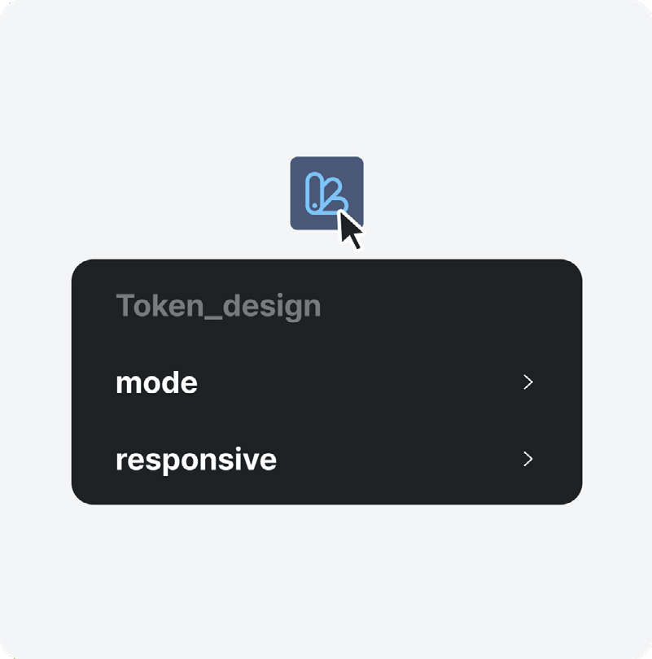

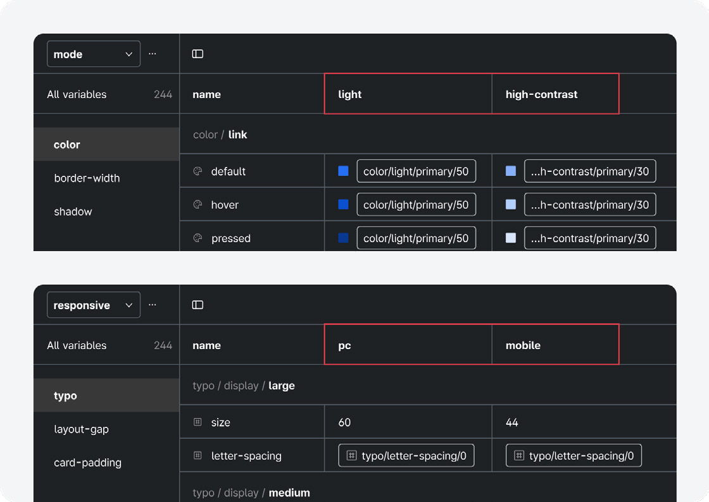
### 선명한 화면 모드 (mode)

기본 모드와 선명한 화면 모드로 코튼 적용이 되어있으며, 선명한 화면 모드의 고대비 명도 기준을 준수하도록 한다.

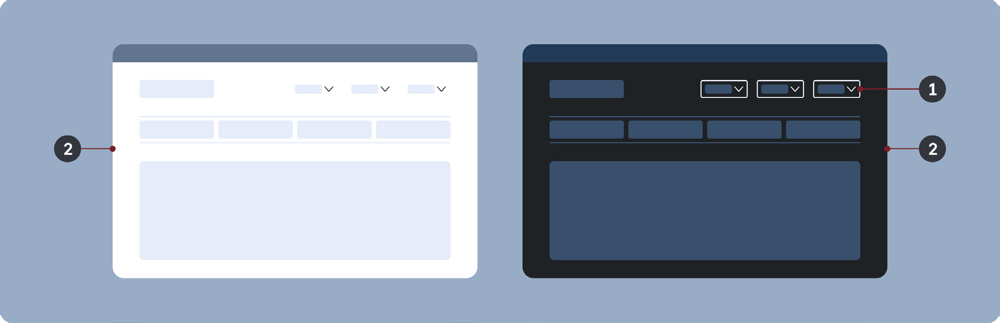

- 1 보더 값
- 2 색상

### 반응형 모드 (responsive)

디바이스 사이즈에 맞게 변할 수 있는 모드로 디바이스 large와 small 사이즈를 대응한다.

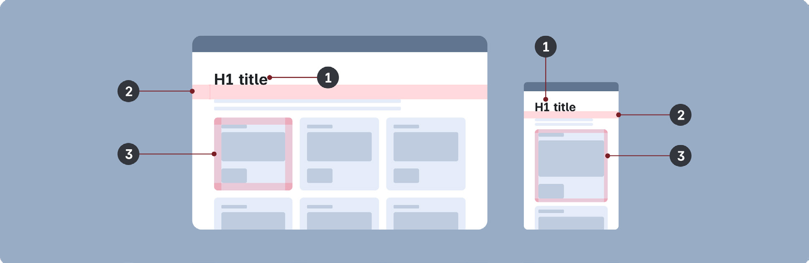

- 1 글자 사이즈
- 2 간격
- 3 카드 패딩값
