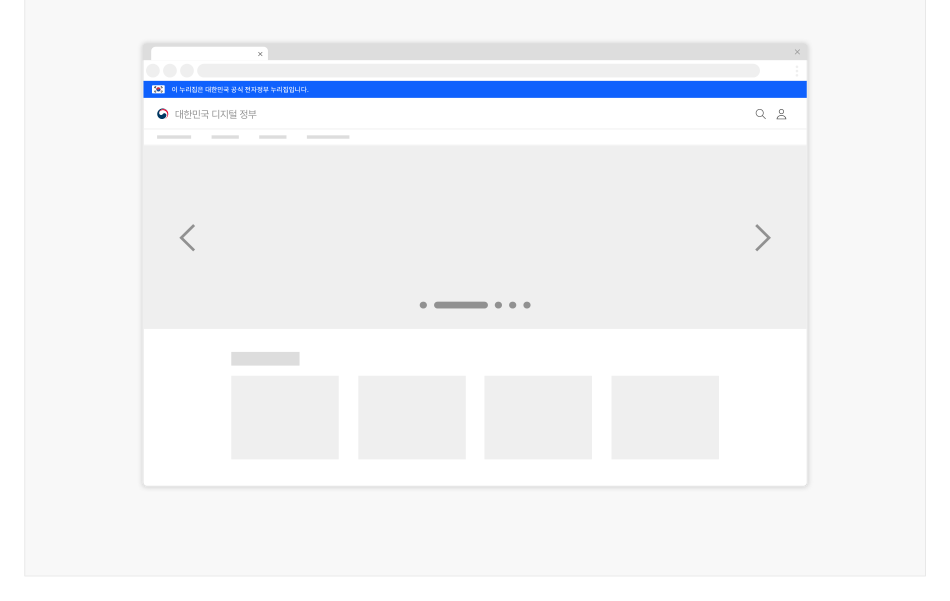
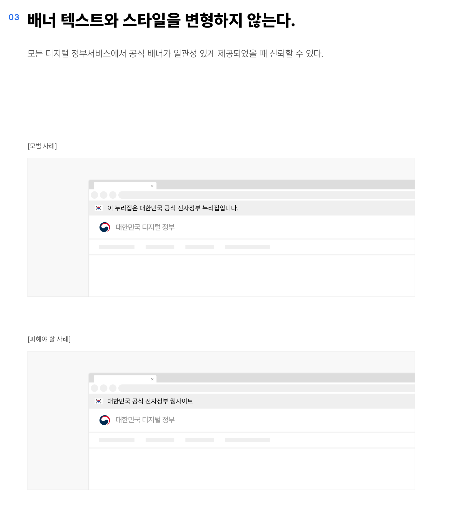

### 공식 배너


공식 배너는 사용자가 대한민국 정부 조직 및 관련 기관에서 운영·관리하는 디지털 정부서비스임을 식별할 수 있도록 제공하는 정보 배너이다.

## 구조

- 1 컨테이너: 배너 정보가 제공되는 영역
- 2 텍스트: 공식 디지털 서비스임을 안내하는 문구


## 사용성 가이드라인

- 01 배너는 모든 화면의 최상단에 제공한다.
- 02 배너가 지나치게 주의를 끌지 않도록 표현한다.
- 03 배너 텍스트와 스타일을 변형하지 않는다.
- 04 공식 디지털 정부서비스가 아닌 사이트에서는 배너를 사용하지 않아야 한다.
### 01. 배너는 모든 화면의 최상단에 제공한다.

공식 정부 배너 영역은 사용자가 해당 디지털 서비스를 신뢰할 수 있는 기준이 되며, 디지털 정부서비스에 대한 일관성 있는 사용자 경험의 출발점이므로 모든 서비스에서 동일한 위치에 동일한 형태와 스타일로 제공한다.

배너의 위치가 일관성 없거나 특정 화면에만 제공될 경우 사용자에게 혼동을 줄 수 있다.
### 02. 배너가 지나치게 주의를 끌지 않도록 표현한다.

서비스의 디자인 주제에 적합한 컨테이너 배경색을 사용한다. 화면 상단 영역에서 사용자가 가장 먼저 집중해야 하는 정보는 헤더 내부의 내비게이션과 기능 버튼이다.

[모범 사례]

[피해야 할 사례]



**사례 텍스트 보완**

```text
이 누리집은 대한민국 공식 전자정부 누리집입니다.
대한민국
디지털
정부
```


**사례 텍스트 보완**

```text
이 누리집은 대한민국 공식 전자정부 누리집입니다.
대한민국
디지털
정부
```

### 03. 배너 텍스트와 스타일을 변형하지 않는다.

모든 디지털 정부서비스에서 공식 배너가 일관성 있게 제공되었을 때 신뢰할 수 있다.

[모범 사례]

[피해야 할 사례]
### 04. 공식 디지털 정부서비스가 아닌 사이트에서는 배너를 사용하지 않아야 한다.

정부의 공식 서비스가 아닌 곳에서 배너를 사용하게 될 경우 사용자에게 혼동을 줄 수 있으므로 배너를 사용하지 않아야 한다.


## 접근성 가이드라인

### 01. 건너뛰기 링크는 공식 배너 이전에 제공한다.

공식 배너는 모든 화면에서 반복되는 영역이므로 스크린 리더 사용자와 키보드 사용자가 이를 건너뛸 수 있도록 건너뛰기 링크를 가장 첫 요소로 제공해야 한다.

▪ KWCAG 2.2 반복 영역 건너뛰기 ▪ WCAG 2.1 Bypass Blocks (A)


