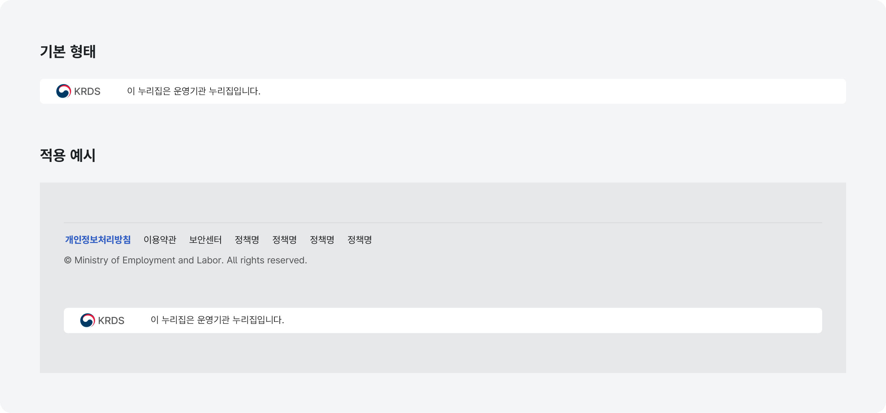
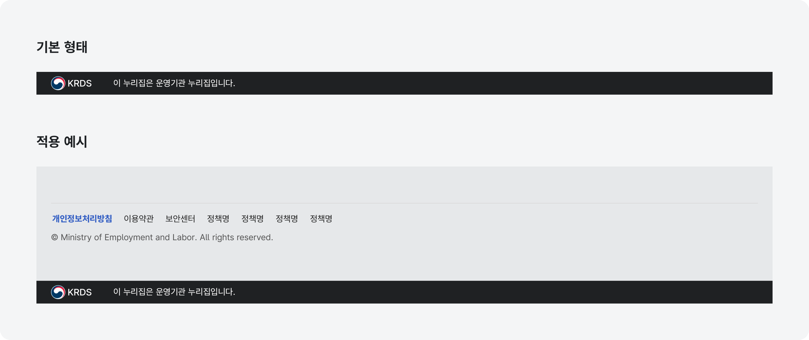
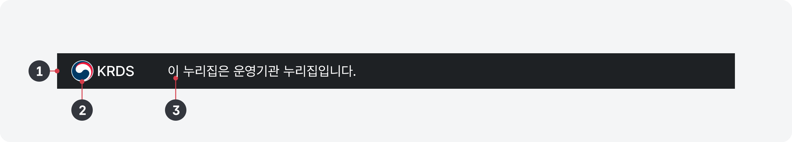

운영기관 식별자는 디지털 정부서비스에 대한 신뢰성을 위해 서비스 운영 기관을 안내하는 요소로 공식 배너, 푸터와 함께 서비스의 일관성, 브랜드를 확인할 수 있는 핵심 요소이다.

## 유형

라이트

### 다크

## 구조

- 1 컨테이너: 식별 정보가 제공되는 영역
- 2 운영기관 로고: 서비스 운영을 최종적으로 책임지는 기관의 로고
- 3 안내 텍스트: 운영기관의 관리를 받고 있음을 안내하는 정보

### 01. 식별자가 지나치게 주의를 끌지 않도록 표현한다.

서비스의 디자인 주제에 적합한 컨테이너 배경색을 사용한다. 화면 하단 영역에서 사용자가 가장 먼저 집중해야 하는 정보는 푸터 내부의 정보와 링크이다.

### 02. 로고 영역에는 서비스의 로고가 아니라 서비스 운영 주체와 관련된 기관의 로고를 제공한다.

식별자는 서비스 운영을 책임지는 기관을 안내하기 위한 것이므로 서비스를 운영하는 기관의 로고가 제공되어야 하며 서비스 로고는 푸터에 배치되어야 한다.
### 03. 안내 텍스트와 요소의 배치를 변경하지 않는다.

모든 디지털 정부서비스에서 식별자가 일관성 있게 제공되었을 때 신뢰도를 높일 수 있다. 안내 텍스트 예시: (운영기관 로고) 이 누리집은 [운영기관명]에서 운영하는 누리집입니다.

### 04. 공식 디지털 정부서비스가 아닌 사이트에서는 식별자를 사용하지 않아야 한다.

정부의 공식 서비스가 아닌 곳에서 식별자를 사용하게 될 경우 사용자에게 혼동을 줄 수 있으므로 식별자를 사용하지 않아야 한다.

## 접근성 가이드라인

### 01. 식별자 영역은 구조적으로 푸터 내부에 포함되도록 제공한다.

푸터가 항상 문서의 마지막 요소로 제공되어야 하므로 식별자 영역은 &lt;section&gt;이나 &lt;article&gt;로 제공하고 푸터 내부의 가장 마지막 구획으로 포함시킨다.

▪ WCAG 2.1 Info and Relationships (A)

### 02. 로고 이미지에 대체 텍스트를 제공한다.

이미지 로고를 사용하는 경우 스크린 리더를 위한 대체 텍스트를 제공해야 한다.

- ▪ KWCAG 2.2 적절한 대체 텍스트 제공
- ▪ WCAG 2.1 Non-text Content (A)
