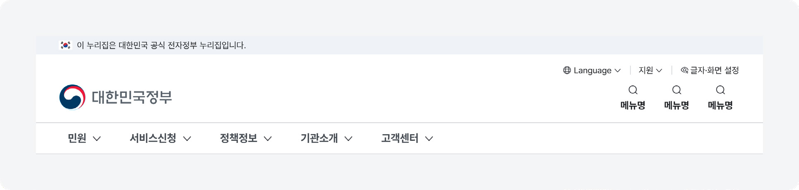
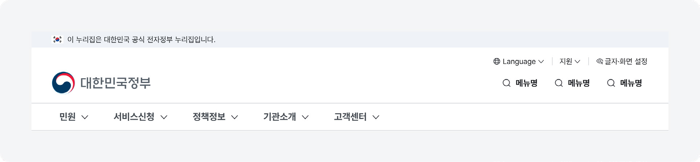
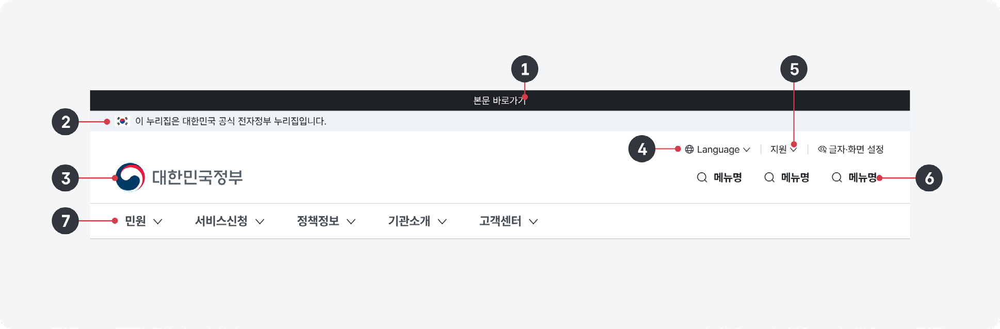
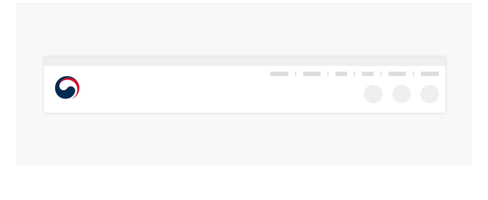
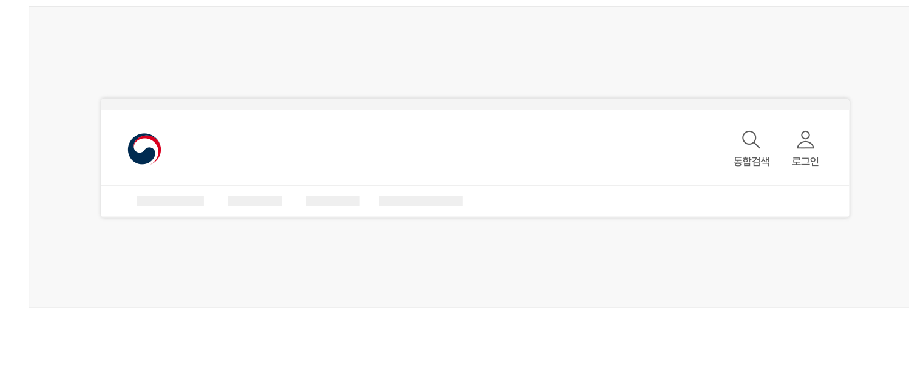
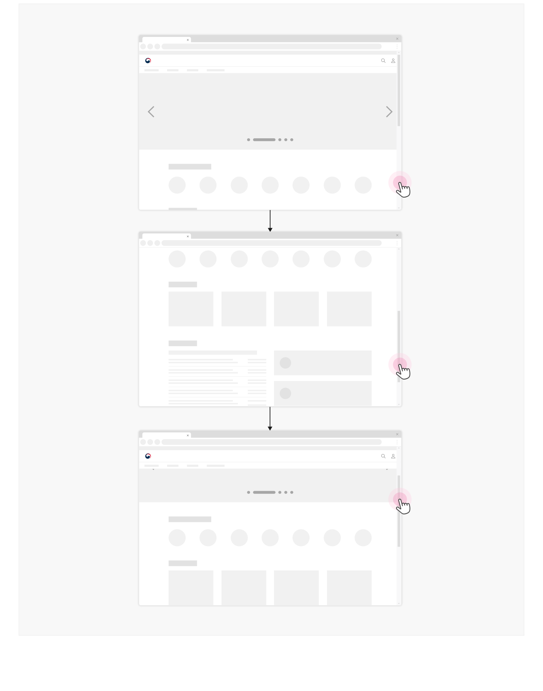
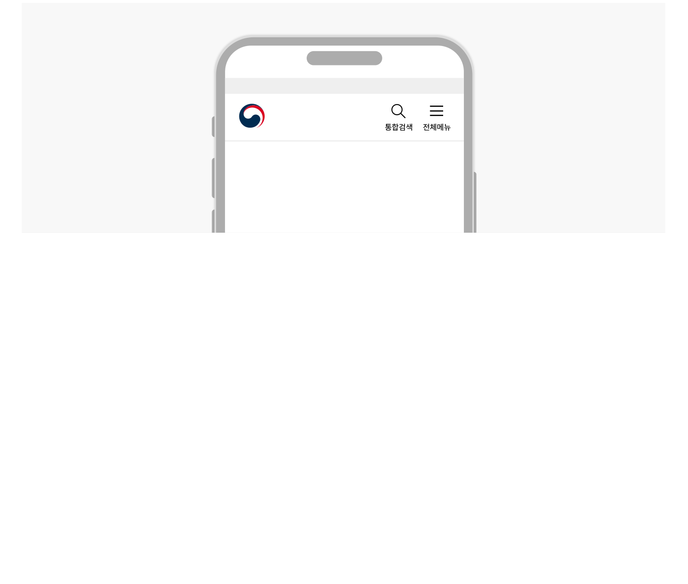

### 헤더


헤더는 사용자가 웹사이트에 접속하자마자 마주하게 되는 화면의 최상단 영역으로 디지털 정부서비스의 브랜드 이미지를 전달하는 핵심 영역이다. 모든 화면에 일관성 있게 배치되며 통합검색, 메인 메뉴 등 서비스 정보를 탐색하고 이동할 수 있는 핵심 탐색 수단을 제공한다.

## 유형

헤더 유형은 아이콘 링크/버튼과 레이블 구조를 기준으로 나뉘며, 기관의 필요에 따라 적절한 방식으로 선택하여 적용할 수 있다.

세로형



가로형




## 구조

- 1 건너뛰기 링크: 마우스 대신 키보드를 주 입력 인터페이스로 활용하는 사용자를 위한 보조적인 정보 구조 탐색 수단
- 2 공식 배너: 대한민국 정부 조직 및 관련 기관에서 운영·관리하는 디지털 정부서비스임을 식별할 수 있도록 제공하는 정보 배너
- 3 서비스 아이덴티티: 기관/서비스 로고 및 슬로건을 배치하여 디지털 서비스 운영 주체의 정체성을 전달함
- 4 유틸리티 링크 그룹: 서비스의 주요 탐색 도구와 다르게 부차적이지만 대부분의 화면에서 빈번하게 사용되는 기능이 제공되는 영역
- 5 드롭다운 메뉴: 유틸리크 링크가 5개 이상 필요할 때 사용됨
- 6 아이콘과 레이블: 통합검색 레이어/화면을 실행하는 버튼을 포함하여 로그인, 회원가입, 개인 메뉴와 같이 서비스 이용에 핵심적인 기능을 실행하거나 화면으로 이동하는 아이콘 버튼 및 텍스트 레이블
- 7 메인 메뉴: 사이트를 일차적으로 탐색하기 위해 사용되는 탐색 인터페이스


## 사용성 가이드라인

- 01 헤더의 스타일 수정을 최소화한다.
- 02 정부 로고는 항상 헤더의 왼쪽 상단에 제공한다.
- 03 헤더의 내부 컴포넌트를 일관된 순서로 배치한다.
- 04 핵심적인 정보만 간결하게 제공한다.
- 05 유틸리티 링크 그룹은 헤더 우측 상단에 제공한다.
- 06 유틸리티 링크 그룹을 디바이더로 구분하여 표현한다.
- 07 유틸리티 링크가 5개 이상 필요한 경우 드롭다운 메뉴를 사용한다.
- 08 언어 설정을 위한 드롭다운 메뉴에 국기를 사용하지 않는다.
- 09 아이콘 버튼/링크에 텍스트 레이블을 제공한다.
- 10 메인 메뉴와 검색의 위치는 웹사이트의 목적에 적합한 형태로 제공한다.
- 11 화면을 스크롤 했을 때 헤더를 뷰포트 상단에 고정할 수 있다.
### 01. 헤더의 스타일 수정을 최소화한다.

헤더의 일관성을 유지하는 것은 정부 브랜드 인지도와 사용자 신뢰를 구축하는 데 필수적이다.

### 02. 정부 로고는 항상 헤더의 왼쪽 상단에 제공한다.

정부 로고는 정부와의 연결을 강화하며, 디지털 서비스 전반에 걸쳐 일관된 경험을 제공할 수 있다.

### 03. 헤더의 내부 컴포넌트를 일관된 순서로 배치한다.

헤더에서 건너뛰기 링크가 항상 가장 먼저 제공되어야 한다. 그다음으로 서비스 아이덴티티, 유틸리티 그룹/ 드롭다운 메뉴, 검색 버튼, 메인 메뉴 순으로 컴포넌트 요소들 간 상대적인 순서가 일관성을 가지도록 배치한다.

### 04. 핵심적인 정보만 간결하게 제공한다.

헤더에 포함되는 요소 중 필수적인 항목을 간결하게 배치해야 한다. 헤더에 불필요한 꾸밈이나 과다한 정보가 배치되면, 사용자가 모든 화면에서 이용에 어려움을 겪을 수 있다.
### 05. 유틸리티 링크 그룹은 헤더 우측 상단에 제공한다.

헤더 우측 상단은 일반적으로 사용자들이 유틸리티 그룹을 발견할 수 있을 것으로 예측하는 공간이다.

### 06. 유틸리티 링크 그룹을 디바이더로 구분하여 표현한다.

서로 관련되지 않은 링크가 시각적으로 명확하게 변별될 수 있도록 여러 가지 형태의 디바이더를 활용하여 구분해야 한다.
### 07. 유틸리티 링크가 5개 이상 필요한 경우 드롭다운 메뉴를 사용한다.

유사한 목적을 가진 링크를 하나의 드롭다운 메뉴로 제공함으로써 사용자는 관련 있는 기능을 더 빠르게 인지할 수 있으며, 헤더를 간결하게 유지함으로써 보다 중요한 정보에 집중하는 데 도움이 된다.

[모범 사례]



**사례 텍스트 보완**

```text
인증 센터
전체 메뉴
```
[피해야 할 사례]


**사례 텍스트 보완**

```text
원본 PDF의 UI 배치·상태·다이어그램을 보존한 시각 자료입니다.
```
플랫폼에 대한 고려 사항


### 08. 언어 설정을 위한 드롭다운 메뉴에 국기를 사용하지 않는다.

한 국가 내에서도 다양한 언어가 사용될 수 있기 때문에 국기 대신 언어의 이름을 해당 언어로 제공해야 한다.
접근성 가이드라인


### 09. 아이콘 버튼/링크에 텍스트 레이블을 제공한다.

아이콘에 표현된 정보가 명확하지 않거나 정보 해석에 많은 시간 소요되는 사용자는 아이콘만 제공되었을 때 컨트롤의 기능을 이해하지 못할 가능성이 높다. 검색, 로그인처럼 대부분의 사용자가 의미를 이해할 수 있고 아이콘이 간결한 경우에는 텍스트 레이블을 생략할 수 있다.

[모범 사례]



**사례 텍스트 보완**

```text
통합검색
로그인
```
### 10. 메인 메뉴와 검색의 위치는 웹사이트의 목적에 적합한 형태로 제공한다.

메인 메뉴의 길이와 검색의 복잡도, 이용 빈도에 따라 적절한 레이아웃의 메인 메뉴와 통합검색 버튼 스타일을 결정한다.

- [모범 사례 1]

도식 라벨: PC Mobile

- [모범 사례 2]

도식 라벨: PC Mobile
### 11. 화면을 스크롤 했을 때 헤더를 뷰포트 상단에 고정할 수 있다.

헤더가 간결하게 구성되어 있다면 사용자가 긴 화면을 스크롤 하면서도 헤더에서 제공하는 탐색 및 유틸리티에 계속 접근 가능하도록 헤더를 고정하여 제공할 수 있다.

만약 2행을 초과하는 헤더를 고정하고자 한다면, 사용자가 현재 화면에서의 과업에 집중할 수 있도록 사용자가 스크롤을 내릴 때에는 헤더를 고정하지 않는다. 스크롤을 올릴 때에는 헤더를 화면 상단에 고정하여 메인 화면으로 이동하거나 메뉴를 탐색하고자 하는 사용자의 행동을 도울 수 있다.

헤더가 고정될 때에는 공식 배너를 제외한 전체 헤더가 고정되어야 한다.
### [모범 사례]



**사례 텍스트 보완**

```text
원본 PDF의 UI 배치·상태·다이어그램을 보존한 시각 자료입니다.
```
### 플랫폼에 대한 고려 사항

화면 너비가 충분하지 않아 메인 메뉴를 표시할 수 없을 때 햄버거 메뉴 형태로 제공할 수 있다.

### 작은 화면에서는 사용자가 본문 콘텐츠에 집중할 수 있도록 메인 메뉴 막대를 숨기고 햄버거 메뉴 버튼과 메뉴 레이어를 사용할 수 있다.

[모범 사례]



**사례 텍스트 보완**

```text
통합검색
전체메뉴
```
## 접근성 가이드라인

### 01. 건너뛰기 링크를 최상단에 배치한다.

웹 페이지의 반복되는 영역을 건너뛰어 본문 등의 주요 영역으로 이동하는 데 사용되는 건너뛰기 링크는 배너 영역 이전에 제공되어야 한다.

▪ KWCAG 2.2 반복 영역 건너뛰기 ▪ WCAG 2.1 Bypass Blocks (A)

### 02. 로고 이미지에 대체 텍스트를 제공한다.

이미지 로고를 사용하는 경우 스크린 리더를 위한 대체 텍스트를 제공해야 한다. 헤더의 로고는 메인 화면으로 이동하는 링크로 사용되므로 대체 텍스트에 '로고'라는 단어가 포함되지 않도록 유의해야 한다.

- ▪ KWCAG 2.2 적절한 대체 텍스트 제공
- ▪ WCAG 2.1 Non-text Content (A)
