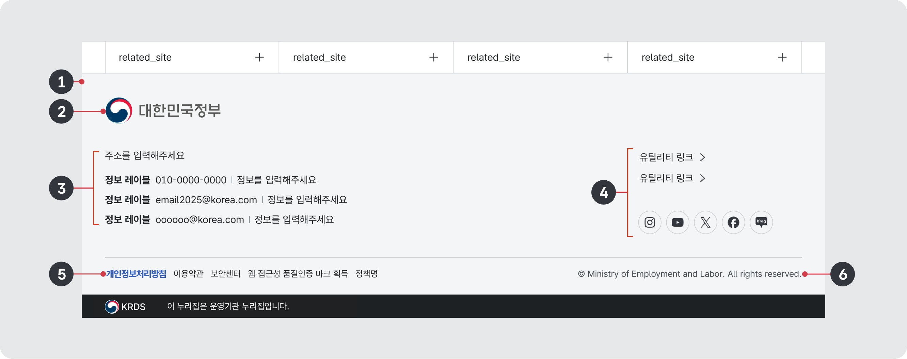
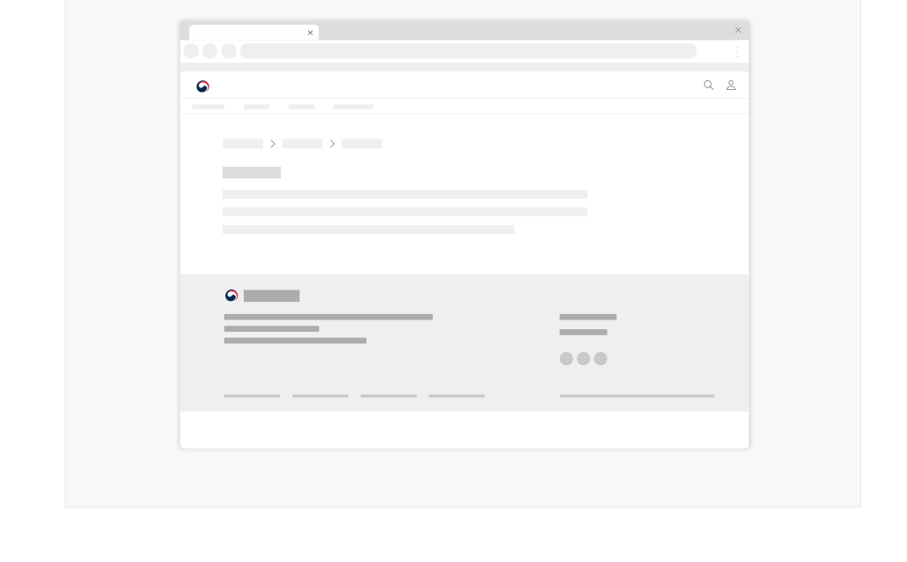

푸터는 화면을 구성하는 가장 마지막 요소로 헤더와 본문에서 원하는 정보를 찾지 못하였거나 사이트 구조 탐색 중에 길을 잃은 사용자들이 대면하게 되는 정보이다. 따라서 푸터에는 사용자가 서비스를 탐색할 수 있는 추가적인 수단, 문제를 해결하는 데 참고할 수 있는 유용한 링크가 제공되어야 한다.

## 구조

- 1 컨테이너: 푸터가 제공되는 영역
- 2 서비스 로고: 기관/서비스 로고를 통해 디지털 서비스 운영 주체의 정체성을 전달하는 요소
- 3 연락처: 주소, 이메일 주소, 대표 전화번호, 민원 전화번호 등 연락 수단 정보
- 4 유틸리티 링크: 오시는 길, 관련 기관 웹사이트 가기 링크, 소셜 채널 바로가기 링크 등이 제공됨
- 5 정책 링크: 웹 접근성, 개인정보처리방침과 같은 각종 정책 링크가 제공됨
- 6 저작권 정보: 디지털 정부서비스의 저작권을 명시한 텍스트

## 사용성 가이드라인

- 01 모든 화면에 푸터를 일관된 위치에 제공해야 한다.
- 02 모든 디지털 정부서비스에서 푸터 섹션의 정보는 일관된 순서로 제공한다.
- 03 개인정보처리방침을 반드시 표시한다.
- 04 전자상거래가 포함된 경우 이용약관을 반드시 표시한다.
- 05 사용자들이 빈번하게 찾는 링크를 배치한다.
- 06 푸터에 제공하는 서비스 내비게이션은 기본 내비게이션과 동일한 구조 및 레이블을 따라야 한다.
- 07 연락처 정보와 각종 링크는 항상 최신 상태로 유지한다.
### 01. 모든 화면에 푸터를 일관된 위치에 제공해야 한다.

푸터는 화면의 마지막 요소이므로 본문 하단에 배치해야 한다. 본문의 높이가 뷰포트 높이보다 짧은 경우 푸터가 뷰포트 하단에 고정되어 있는지 확인한다.

[모범 사례]

[피해야 할 사례]

### 02. 모든 디지털 정부서비스에서 푸터 섹션의 정보는 일관된 순서로 제공한다.

푸터 내 정보 배치 일관성을 유지하는 것은 디지털 정부서비스 브랜드 확립과 사용자 신뢰 구축에 매우 중요하므로 명확한 이유 없이 기본 순서를 변경해서는 안 된다. 푸터 섹션의 정보는 서비스 로고, 연락처, 유틸리티 링크, 정책 링크, 저작권 정보의 순으로 제공한다. 이때, 서비스 로고, 연락처, 유틸리티 링크는 하나의 그룹으로 인지될 수 있도록 표현해야 한다.

### 03. 개인정보처리방침을 반드시 표시한다.

개인정보 처리의 투명성을 알리기 위한 개인정보 처리방침은 반드시 웹사이트에 공개해야 한다. 또한 반드시 ‘개인정보 처리방침’이라는 명칭을 사용하고, 변경된 경우 그 사항을 반영해야 한다. 개인정보 처리방침은 글 자 크기를 달리하거나, 색상 또는 굵기(Bold) 등을 활용하여 다른 고지사항(이용약관, 저작권 안내 등)과 구 분하는 등 다양한 방법을 통해 정보 주체가 쉽게 확인할 수 있도록 한다.

### 전자상거래가 포함된 경우 이용약관을 반드시 표시한다.

인터넷쇼핑몰 등 전자상거래가 포함된 경우, 소비자가 안전하게 거래할 수 있도록 사업자의 신원, 거래 약관 등을 푸터에서 제공해야 한다.
### 05. 사용자들이 빈번하게 찾는 링크를 배치한다.

사이트맵을 비롯하여 사용자가 빈번하게 찾는 링크는 웹사이트의 하단에서도 쉽게 접근할 수 있도록 제공하는 것이 좋다. 웹사이트의 세로 길이가 길어질수록 다시 상단으로 이동하는 것보다 더 빠른 접근이 가능하기 때문이다. 필요하다면 목적별/유형별로 군집화하여 직관적으로 탐색할 수 있게 한다.

### 06. 푸터에 제공하는 서비스 내비게이션은 기본 내비게이션과 동일한 구조 및 레이블을 따라야 한다.

기본 내비게이션에 포함된 모든 최상위 화면 링크가 푸터 탐색에도 포함되어야 하며, 하위 화면 링크가 푸터에 포함된 경우 하위 화면 링크도 기본 탐색과 동일한 구조 및 레이블을 따라야 한다.

### 07. 연락처 정보와 각종 링크는 항상 최신 상태로 유지한다.

링크를 실행했을 때 존재하지 않는 사이트/페이지/화면으로 이동하거나 예상과 다른 목적지로 이동하지 않도록 점검하고 최신화해야 한다.
### 플랫폼에 대한 고려 사항

작은 화면 너비에서도 푸터의 정보 요소는 상대적으로 동일한 순서로 제공되도록 표현한다.

화면 너비가 충분하지 않아 병렬적으로 배치되었던 푸터 내부 요소가 수직 배열로 변경되더라도 서비스 로고, 연락처, 유틸리티 링크, 정책 링크, 저작권 정보의 순서로 배치한다.
플랫폼에 대한 고려 사항

## 접근성 가이드라인

### 01. 푸터 영역이 스크린 리더에 인지될 수 있는 방식으로 제공한다.

푸터의 모든 요소는 &lt;footer&gt; 내부에 배치하여 주요 랜드마크 정보가 스크린 리더로 전달될 수 있도록 해야 한다. 이를 통해 스크린 리더 사용자들은 화면의 구성을 빠르게 파악할 수 있다.

▪ WCAG 2.1 Info and Relationships (A)

### 02. 로고 이미지에 대체 텍스트를 제공한다.

텍스트가 아닌 이미지로 된 로고를 사용하는 경우 스크린 리더를 위한 대체 텍스트를 포함해야 한다.

- ▪ KWCAG 2.2 적절한 대체 텍스트 제공
- ▪ WCAG 2.1 Non-text Content (A)
