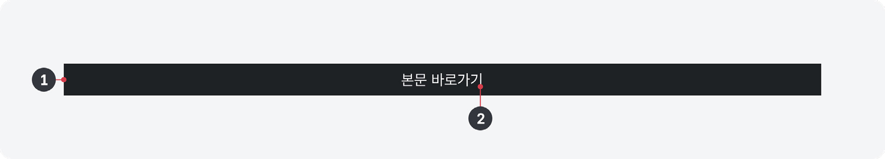

건너뛰기 링크는 웹사이트에서 웹 페이지의 주요 콘텐츠 섹션의 탐색을 도와주는 페이지 내부 링크이다. 키보드나 가상 초점을 이용하여 콘텐츠를 탐색하는 사용자는 건너뛰기 링크를 이용하여 대부분의 페이지에서 반복되는 콘텐츠 영역을 건너뛰고 주요 콘텐츠로 빠르게 이동할 수 있다.

## 용례

### 사용하기 적합하지 않은 경우

### 반복되는 영역이 없는 사이트 또는 화면

정보 구조 없이 단일 화면으로 구성된 사이트나 정보 구조상 문서 시작 부분에 메뉴 탐색을 위한 내비게이션이 제공되지 않는 페이지에서는 건너뛰기 링크를 사용하지 않아야 한다. 반복되는 영역이 없는 페이지에 건너뛰기 링크를 제공하게 되면 사용자에게 혼동을 줄 수 있으며, 탐색해야 할 요소가 늘어나므로 오히려 탐색 효율성을 저하시킬 수 있다.
## 유형

### 보이는 건너뛰기 링크

페이지 상단 영역, 즉 헤더 주변에 배치하여 항상 눈에 보이도록 하는 유형의 건너뛰기 링크이다. 별도의 행동 없이 존재 여부를 확인할 수 있어 직관적이고, 건너뛰기 링크를 통해 도움을 받을 수 있는 사용자가 쉽게 접근할 수 있다.

그러나 서비스 특성으로 인해 헤더에 많은 정보와 기능이 배치되어야 하는 경우, 보이는 건너뛰기 링크가 시각적 복잡성을 증가시킬 수 있으므로 일시적으로 숨긴 건너뛰기 링크를 사용하는 것이 적합하다.

### 일시적으로 숨긴 건너뛰기 링크

일시적으로 숨긴 건너뛰기 링크는 눈에 보이지 않게 숨겨두었다 키보드 탐색을 시도할 때 링크를 보여준다.
## 구조

1 컨테이너: 건너뛰기 링크 레이블이 제공되는 영역 2 레이블: 링크와 연결된 대상을 안내하는 텍스트

## 사용성 가이드라인

- 01 웹사이트의 모든 화면에 건너뛰기 링크를 제공한다.
- 02 건너뛰기 링크의 개수는 3개 이내로 제공한다.
- 03 건너뛰기 링크 외에 다른 콘텐츠 섹션 탐색 수단을 제공하는 방안을 고려한다.
- 04 건너뛰기 링크의 목적지를 적절하게 설정한다.
### 01. 웹사이트의 모든 화면에 건너뛰기 링크를 제공한다.

마우스를 사용하고 시력이 있는 사용자는 화면을 훑어보고 주요 콘텐츠의 위치를 파악할 수 있다. 그러나 키보드, 스크린 리더를 사용하여 화면을 탐색하는 사용자는 주요 콘텐츠에 접근하기까지 헤더의 수많은 요소를 거쳐야 한다. 웹사이트를 이용하는 동안 계속 이러한 반복 행동을 수행해야 한다면 탐색 효율성이 낮아지고 피로도가 증가할 수밖에 없다. 따라서 사용하기 적합하지 않은 상황을 제외하고 웹사이트의 모든 화면에는 건너뛰기 링크를 제공해야 한다.

### 02. 건너뛰기 링크의 개수는 3개 이내로 제공한다.

대부분은 화면의 핵심 영역, 즉 본문으로 건너뛰는 링크 1개만 제공해도 충분하다. 만약 콘텐츠의 구성과 구조가 복잡하다면 추가적인 건너뛰기 링크를 제공할 수 있다. 여러 개의 건너뛰기 링크를 제공하는 경우, 다른 링크보다 화면의 핵심 영역으로 이동하는 링크를 가장 첫 번째 항목으로 제공해야 한다.
### 03. 건너뛰기 링크 외에 다른 콘텐츠 섹션 탐색 수단을 제공하는 방안을 고려한다.

건너뛰기 링크의 목적은 키보드 탐색을 보다 효율적으로 만드는 것이다. 건너뛰기 링크의 개수가 늘어날수록 복잡해져 탐색 효율성이 저하될 수 있으므로 링크를 추가하는 것보다 다른 보조적 탐색 수단을 제공하는 방안을 고려한다. 예를 들어, 콘텐츠 내 탐색 컴포넌트를 제공하면 사용자는 건너뛰기 링크를 사용하여 본문에 접근한 다음 콘텐츠 내 탐색 링크를 활용하여 원하는 본문 섹션으로 이동할 수 있다.

### 04. 건너뛰기 링크의 목적지를 적절하게 설정한다.

건너뛰기 링크의 목적지에 반복되는 콘텐츠 영역이 포함되지 않도록 유의한다. 건너뛰기 링크의 핵심인 본문 바로가기 링크에는 목적지 섹션에 사이드 메뉴, 브레드크럼, 화면 유틸리티 버튼/링크가 포함되어 있어서는 안 된다.

### 플랫폼에 대한 고려 사항

모바일 애플리케이션에서는 건너뛰기 링크를 제공하지 않을 수 있다.

모바일 애플리케이션은 모바일 웹과 탐색 내비게이션의 구성 방식, 정보 구조, 화면 구성이 달라 건너뛰기 링크의 효용이 낮다.

## 접근성 가이드라인

### 01. 건너뛰기 링크 목록은 문서의 가장 첫 요소로 제공한다.

쿠키 배너, 화면의 맥락을 가린 모달이 제공되는 경우를 제외하고 건너뛰기 링크 목록은 웹 문서의 가장 첫 요소로 제공해야 한다.

- KWCAG 2.2 반복 영역 건너뛰기
- WCAG 2.1 Bypass Blocks (A)
- WCAG 2.1 Multiple Ways (AA)
- WCAG 2.1 Consistent Navigation (AA)
- WCAG 2.1 Consistent Identification (AA)

### 02. 건너뛰기 링크의 초점이 명확하게 구분되도록 표현한다.

특히 일시적으로 숨긴 건너뛰기 링크 형식에서 포커스링이 인접한 본문 영역과 중첩될 수 있음을 유의해야 한다. 건너뛰기 링크의 outline-offset 속성을 음수 값으로 지정하면 컨테이너 영역 안쪽으로 포커스링이 생성되어 변별이 쉬워진다.

- KWCAG 2.2 초점 이동과 표시
- WCAG 2.1 Focus Visible (AA)

### 03. 건너뛰기 링크 실행 시 스크롤 동작과 함께 연결된 목적지 섹션으로 Focus 이벤트가 발생해야 한다.

링크 실행 후 목표 지점으로 스크롤 동작만 발생하고 키보드 초점이 링크나 기타 요소에 머물러 있게 되면 건너뛰기 링크를 필요로 하는 사용자는 원하는 지점에서부터 탐색을 시작할 수 없다.

- KWCAG 2.2 초점 이동과 표시
- WCAG 2.1 Focus Order (A)

## 상호작용 가이드라인

### 목적지 섹션으로의 이동

### 콘텐츠 탐색

| 구분 | 내용 |
|---|---|
| Enter | 건너뛰기 링크가 초점을 가진 상태에서 Enter 키를 누르면 목적지 섹션으로 키보드 초점이 이동하고 화면이 스크롤 된다. |
| Tap | 건너뛰기 링크 영역을 Tap 하면 목적지 섹션으로 화면이 스크롤 된다. 만약 스크린 리더가 활성화된 상태라면 가상 초점이 목적지 섹션으로 이동한다. |

| 구분 | 내용 |
|---|---|
| Tab | 목적지 섹션으로 스크롤 된 상태에서 Tab 키를 누르면 이동한 섹션 내부 요소 중 상호작용이 가능한 첫 요소로 초점이 이동한다. |
| Swipe | 목적지 섹션으로 스크롤 된 상태에서 Swipe 동작을 실행하면 섹션 내부 요소 중 가장 첫 번째 요소로 가상 초점이 이동한다. |
