### 메인 메뉴


메인 메뉴는 사용자가 서비스의 정보 구조를 탐색할 때, 가장 많이 사용하는 유형의 메뉴이다. 일반적으로 헤더와 함께 거의 모든 화면에 제공되며, 사용자가 자주 방문하거나 중요도가 높은 화면으로 이동할 수 있는 링크가 포함되어 있다. 빈번하게 활용되는 사용자의 일차적인 이동 수단이기 때문에 사용하기 쉽게 설계해야 한다.

## 유형

### PC

### 단순 링크

하위 수준의 메뉴가 존재하지 않는 경우에 사용한다.

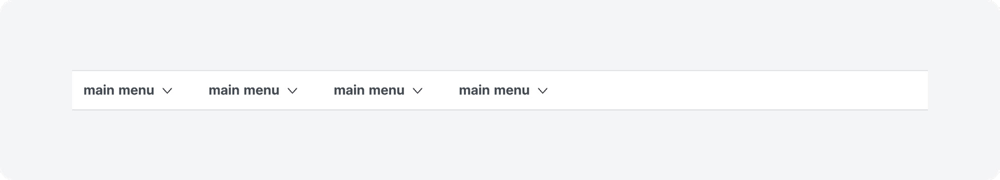
### 드롭다운

2~3수준의 메뉴가 존재하는 경우에 사용한다.

- 유형 1

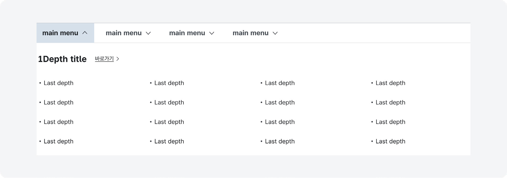

- 유형 2

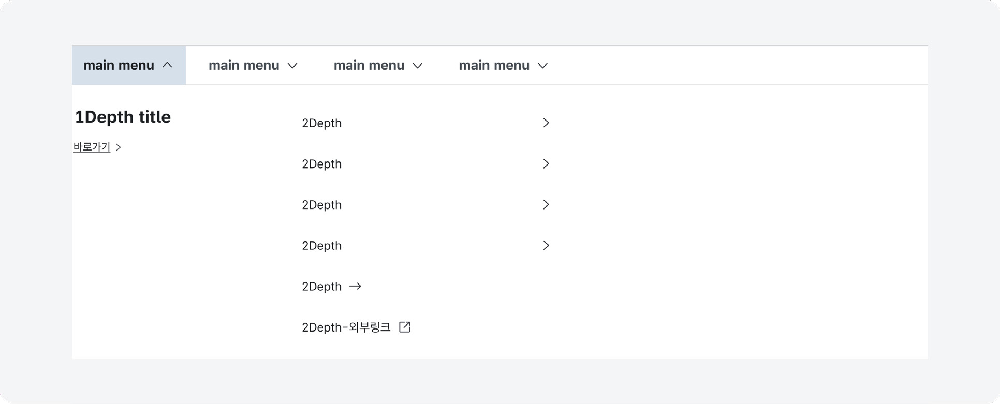
### 설명이 포함된 드롭다운

메뉴 레이블이 어려운 용어 또는 사용자에게 익숙하지 않은 단어로 제공된 경우나 메뉴 레이블을 통해 화면에서 제공되는 콘텐츠를 파악하기 어려운 경우에 사용한다.

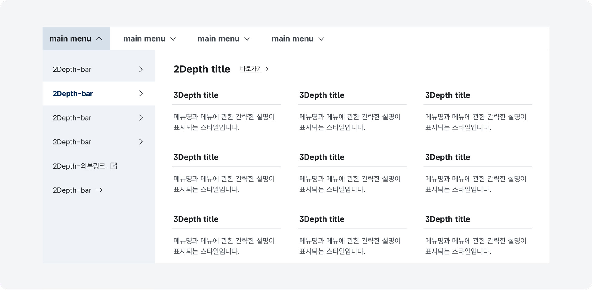
### Mobile

### 상단 탭

1~2수준의 메뉴로 구성된 경우에 사용한다.

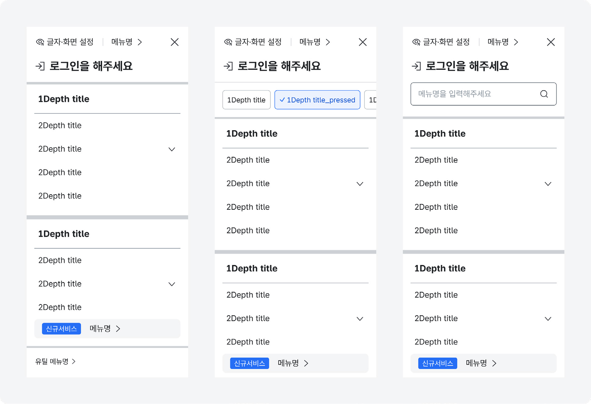
### 사이드 탭

2수준 이상의 메뉴로 구성된 경우에 사용한다.

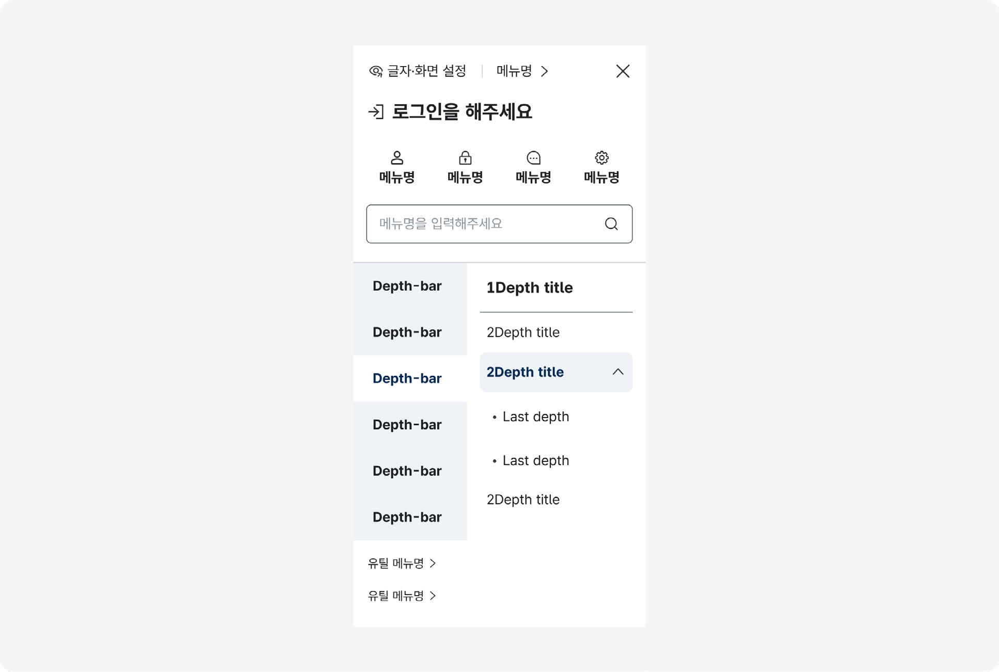
### 집중 탐색 레이어

사용자가 주로 특정 카테고리의 메뉴만 탐색하거나 3수준 이상의 정보 구조를 가진 경우에 사용한다. 사용자가 기본 화면에서 가장 하위 수준의 메뉴를 실행했을 때 해당 메뉴의 하위 수준 메뉴 목록만 볼 수 있는 화면으로 전환된다.

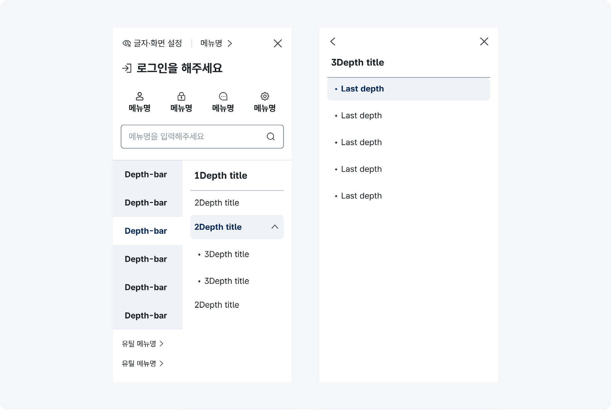
## 구조

### PC

- 1 레이블: 메뉴의 이름으로 하위 수준의 메뉴가 존재하지 않는 경우 링크로 작동하며 하위 수준이 존재하는 경우에는 버튼으로 작동함
- 2 꺾쇠 아이콘: 드롭다운 영역의 확장/축소 상태를 표시하는 아이콘
- 3 활성화된 메뉴 식별자: 드롭다운 영역이 확장된 메뉴의 변별성을 높이기 위한 시각적 단서
- 4 드롭다운 영역: 하위 수준의 메뉴가 제공되는 컨테이너
- 5 제목: 드롭다운 영역의 제목으로 최하위 수준 메뉴와 바로 연결된 요소가 제목으로 제공됨
- 6 설명: 레이블에 대한 이해를 돕기 위해 제공되는 간단한 설명 텍스트
- 7 유틸리티 링크: 활성화된 메뉴와 관련하여 사용자가 자주 찾은 메뉴, 도움이 될 만한 정보 및 링크가 제공됨

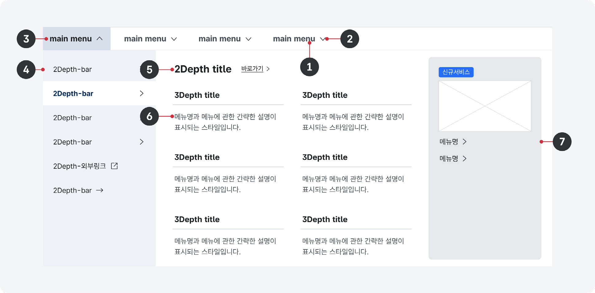
### Mobile

- 1 햄버거 아이콘: 메뉴 레이어를 활성화하는 데 사용되는 아이콘 버튼
- 2 유틸리티 링크: 화면 크기 조정, 언어 선택, 로그인, 자주 사용하는 메뉴 등의 링크가 제공됨
- 3 섹션 탐색 버튼: 메뉴 섹션의 구성을 확인하고 탐색하는 데 사용되는 버튼. 정보 구조의 깊이에 따라 레이어 상단에 고정되거나 왼쪽에 고정하여 제공할 수 있음
- 4 레이블: 메뉴의 이름으로 링크로 작동함
- 5 검색어 입력 필드와 검색 버튼: 메뉴의 수가 많거나 정보 구조의 깊이가 깊은 경우 사용자의 메뉴 탐색을 돕기 위해 사용되는 부분 검색 기능
- 6 상위 메뉴 이동 링크: 현재 표시된 하위 수준 메뉴 링크 목록에서 벗어나 기본 메뉴 레이어로 돌아가는 데 사용되는 버튼

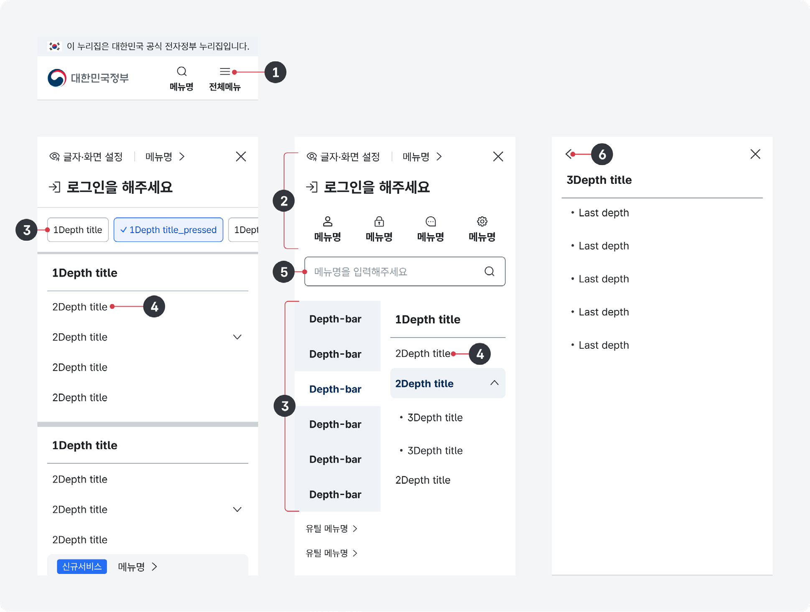
## 사용성 가이드라인

- 01 드롭다운 메뉴 영역 내에서 레이블은 좌측으로 정렬한다.
- 02 드롭다운 영역의 최대 높이는 뷰포트를 초과하지 않도록 하고 최대 높이를 초과하는 경우에 스크롤이 생성되도록 제공한다.
- 03 링크의 활성화 상태, 선택 상태가 명확히 구분되도록 표현한다.
- 04 드롭다운 영역에 제목을 제공한다.
- 05 링크의 개수를 최소화한다.
- 06 서비스 정보 구조를 적절하게 반영하여 메인 메뉴를 구성하고 최대 3수준의 메뉴를 사용한다.
- 07 링크명에 이해하기 쉬운 용어를 사용한다.
- 08 링크는 우선순위에 따라 배치한다.
- 09 마우스오버를 사용하여 드롭다운 목록을 확장하지 않는다.
### 01. 드롭다운 메뉴 영역 내에서 레이블은 좌측으로 정렬한다.

드롭다운 메뉴 영역은 본문 그리드를 기준으로 가장 왼쪽부터 하위 수준의 링크 목록이 배치되도록 표현하여 사용자가 항상 일관된 위치에서 정보를 스캔할 수 있도록 해야 한다.

[모범 사례]

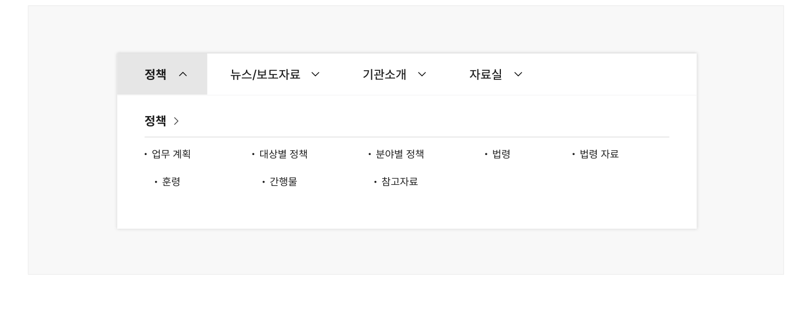

**사례 텍스트 보완**

```text
정책
뉴스/보도자료
기관소개
자료실
업무 계획
대상별 정책
분야별 정책
법령
법령 자료
훈령
간행물
참고자료
```
[피해야 할 사례]


**사례 텍스트 보완**

```text
정책
뉴스/보도자료
기관소개
자료실
업무 계획
대상별 정책
분야별 정책
법령
법령 자료
훈령
간행물
참고자료
```
### 02. 드롭다운 영역의 최대 높이는 뷰포트를 초과하지 않도록 하고 최대 높이를 초과하는 경우에 스크롤이 생성되도록 제공한다.

링크 목록의 수가 많아 뷰포트 높이를 넘어가는 경우 브라우저 기본 스크롤이 아니라 드롭다운 영역 스크롤을 통해 메뉴를 탐색할 수 있도록 해야 한다. 브라우저 기본 스크롤을 통해 메뉴를 탐색하는 경우, 1수준 링크 레이블을 클릭하거나 배경 마스크를 클릭하여 메뉴를 닫는 과정에서 많은 행동이 요구되며 메뉴를 닫았을 때 본문의 중간부터 콘텐츠를 탐색하게 되는 불편을 겪을 수 있다.

[모범 사례]

[피해야 할 사례]

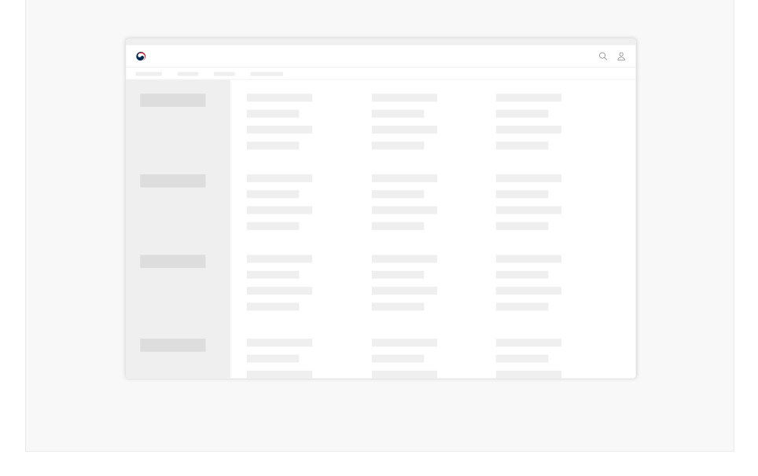
### 03. 링크의 활성화 상태, 선택 상태가 명확히 구분되도록 표현한다.

현재 탐색 중인 화면이 사이트 구조상 어디에 위치하는지를 알 수 있도록 활성화된 메뉴 링크를 명확하게 구분한다.

### 04. 드롭다운 영역에 제목을 제공한다.

드롭다운 영역에 제목을 제공하여 어떤 메뉴 하위의 메뉴 목록을 탐색하고 있는지를 사용자가 직관적으로 인지할 수 있도록 한다. 사이드 메뉴에 메인 화면이 존재하는 경우 제목은 링크로 사용될 수 있다.

### 05. 링크의 개수를 최소화한다.

반드시 필요한 링크만 제공하여 사용자가 빠르게 메뉴를 파악할 수 있게 만들고, 선택 과정에서의 혼동을 방지해야 한다.
### 06. 서비스 정보 구조를 적절하게 반영하여 메인 메뉴를 구성하고 최대 3수준의 메뉴를 사용한다.

정보 구조가 깊고 복잡한 경우, 메인 메뉴가 지나치게 간결하게 제공되면 사용자는 메인 메뉴를 통해 원하는 정보에 접근하기 어렵다.

### 07. 링크명에 이해하기 쉬운 용어를 사용한다.

링크명에 전문 용어 또는 일반적인 사람들에게 익숙하지 않은 용어를 사용할 경우, 의미를 이해하기 어려워 탐색에 많은 시간이 소요되거나 원하는 화면를 발견하지 못할 수도 있다.

### 08. 링크는 우선순위에 따라 배치한다.

이용 빈도가 높고 중요한 콘텐츠로 연결된 링크일수록 좌측에 배치하여 접근과 사용이 쉽게 만든다.

### 09. 마우스오버를 사용하여 드롭다운 목록을 확장하지 않는다.

일부 사용자에게는 작은 메뉴 링크 영역에 일정 시간 동안 마우스의 위치를 고정하는 상호작용이 어려울 수 있고 터치 스크린에서는 마우스오버 인터랙션은 작동하지 않는다. 이러한 상황을 고려하여 드롭다운은 클릭 또는 키보드 탐색을 통해 확장되어야 한다.


### 플랫폼에 대한 고려 사항

화면 너비가 충분한 경우에는 1수준 메뉴 전체를 확인할 수 있도록 표현한다.

### 모바일에서는 별도 페이지나 영역으로 메뉴를 숨기고 햄버거 아이콘을 눌러 메뉴를 확인할 수 있다.

[모범 사례]

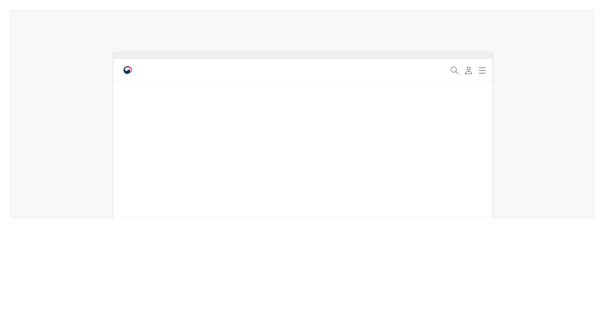

**사례 텍스트 보완**

```text
정책
뉴스/보도자료
기관소개
자료실
```
[피해야 할 사례]


**사례 텍스트 보완**

```text
원본 PDF의 UI 배치·상태·다이어그램을 보존한 시각 자료입니다.
```
## 접근성 가이드라인

### 01. 메뉴의 컨테이너가 내비게이션 섹션임을 스크린 리더에서 인지할 수 있도록 한다.

메뉴의 전체 컨테이너는 &lt;nav&gt;로 감싸거나 WAI-ARIA 영역을 role="navigation"으로 지정하여 스크린 리더에서 내비게이션 요소임을 인지할 수 있도록 제공해야 한다. 내비게이션 섹션에 aria-label="메인 메뉴"를 제공하면 스크린 리더 사용자는 메인 메뉴의 역할을 보다 명확하게 인지할 수 있다.

- KWCAG 2.2 제목 제공
- WCAG 2.1 Info and Relationships

### 02. 메뉴 링크의 계층 구조를 표현한다.

스크린 리더 사용자가 사이트의 정보 구조를 파악하는 데 도움을 줄 수 있도록 &lt;h2&gt;~&lt;h6&gt;, &lt;ul&gt;, &lt;li&gt; 태그를 활용하여 계층 구조로 정보를 제공해야 한다.

- KWCAG 2.2 제목 제공
- WCAG 2.1 Info and Relationships (A)

### 03. 활성화된 메뉴 정보가 스크린 리더로 전달될 수 있도록 한다.

인디케이터가 시각적으로만 구분되는 것이 아니라 스크린 리더로도 전달될 수 있도록 WAI-ARIA ariacurrent 속성을 제공한다. 드롭다운이 활성화된 상태에서는 aria-current="true"를, 현재 탐색 중인 화면에 대한 링크인 경우 aria-current="page" 속성을 추가한다.

- WCAG 2.1 Name, Role, Value (A)
### 04. 메뉴 링크는 키보드로 탐색할 수 있도록 한다.

메인 메뉴는 웹사이트의 주요 사이트로 접근할 수 있는 수단이므로 메뉴 링크는 반드시 키보드가 접근할 수 있도록 제공해야 한다. 사용자가 키보드를 이용하여 드롭다운을 실행하고 목록을 탐색할 수 있는지 점검해야 한다.

- KWCAG 2.2 키보드 사용 보장
- WCAG 2.1 Keyboard (A)
- WCAG 2.1 No Keyboard Trap (A)

### 05. 키보드의 초점은 메뉴의 계층 순서대로 이동하도록 한다.

키보드를 이용하여 메뉴를 탐색하는 경우, 키보드의 탐색 위치를 표시하는 초점이 메뉴의 계층 순서에 맞게 이동되도록 제공해야 한다. 문서에 메뉴의 계층 구조를 표현하지 않거나 임의로 키보드 초점의 이동 순서를 조작하면 보조 기술 사용자는 메뉴 탐색에 혼동을 느끼게 된다.

- KWCAG 2.2 초점 이동과 표시
- WCAG 2.1 Focus Order (A)


## 상호작용 가이드라인

### 메뉴 영역 확장 및 축소

### 메뉴 링크 탐색

| 구분 | 설명 |
|---|---|
| Click | 메뉴 링크를 Click 하였을 때 하위 수준 메뉴가 펼쳐진다. 활성화된 1수준 메뉴를 다시 Click 하거나 헤더와 메인 영역을 벗어나는 화면 영역을 Click 하였을 때 메뉴가 접힌다. |
| Enter | 메뉴 링크가 초점을 가진 상태에서 Enter 키를 눌렀을 때 하위 수준 메뉴가 펼쳐진다. 활성화된 1수준 메뉴에서 다시 Enter 키를 눌렀을 때 드롭다운 메뉴가 접힌다. |
| Esc | 펼쳐진 드롭다운 메뉴가 모두 축소되며 펼쳐졌던 메뉴의 상위 수준에 속하는 1수준 메뉴로 초점이 이동한다. |

| 구분 | 설명 |
|---|---|
| Tab | 1수준 메뉴 링크에 순차적으로 접근한다. |
| 방향키 ↑, ↓ | 초점을 받아 활성화된 메뉴의 하위 메뉴 목록을 순회한다. 목록 가장 첫 번째 항목에서 방향키 ↑를 누르면 가장 마지막 항목으로 초점이 이동하며, 가장 마지막 항목에서 방향키 ↓를 누르면 가장 첫 항목으로 초점이 이동한다. |
