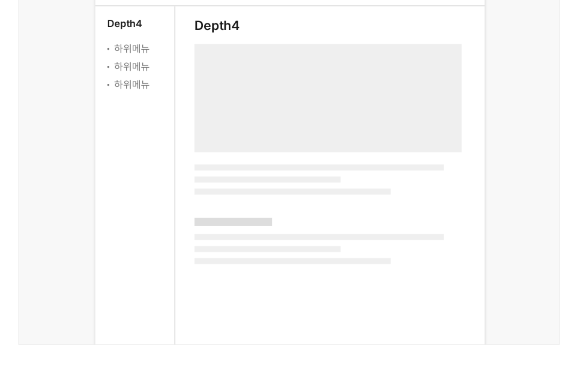
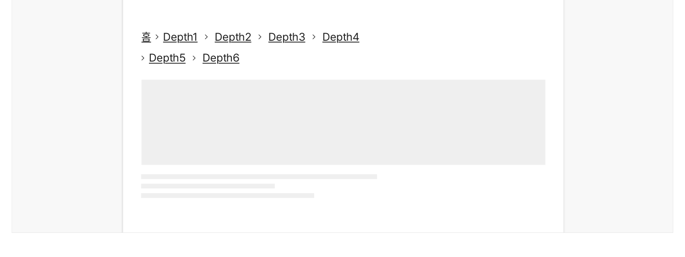
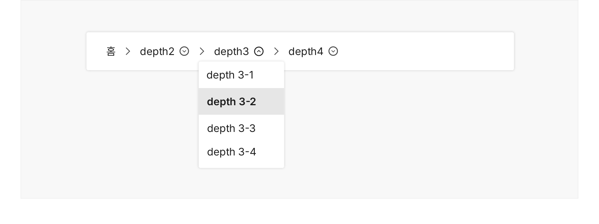
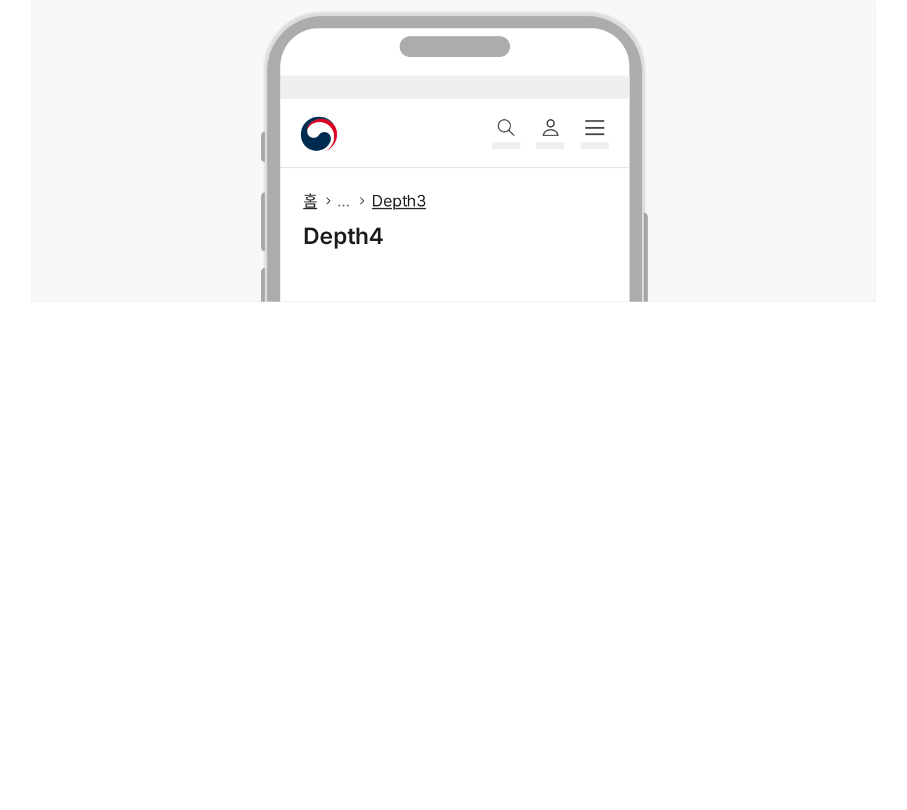

브레드크럼은 탐색 계층 구조를 표시하여 사용자가 현재 위치를 파악하고 계층 구조의 수준을 이동할 수 있게 해준다. 브레드크럼을 통해 사용자는 탐색 중인 화면의 상위 수준 화면으로 이동할 수 있다.

## 용례

### 사용하기 적합하지 않은 경우

- 탐색 계층 구조가 1수준인 사이트

탐색 구조의 깊이가 1단계인 사이트에는 탐색 경로가 존재하지 않으며, 메인 메뉴와 메뉴의 활성화 상태 표식자 정보를 통해 탐색 위치를 파악할 수 있으므로 탐색 수단으로 브레드크럼을 제공할 필요가 없다.

- 메인 화면, 랜딩 화면 메인 화면이나 랜딩 화면은 정보 구조의 최상위 수준이므로 브레드크럼을 사용하지 않는 것이 적절하다.
- 진행 상황 표시 진행 상황을 표시하고자 하는 경우에는 단계 식별자나 진행 상황 표시기를 사용해야 한다.
## 구조

- 1 경로

a. 홈 아이콘과 레이블: 브레드크럼 목록의 첫 번째 항목으로 메인 화면으로 이동하는 링크로 작동함 b. 상위 구조: 탐색 중인 화면의 상위 수준의 정보 구조를 표시하는 텍스트로 연결 가능한 페이지가

존재하는 경우 링크로 작동함

- 2 말줄임표: 페이지 링크 표시 개수를 초과하는 경우 축약된 경로가 있음을 안내하기 위해 제공됨. 말줄임표는 항상 홈 아이콘 링크 다음 요소로 제공됨
- 3 구분자: 브레드크럼 항목을 구분하기 위한 구분 기호. 화면 간의 시각적 계층 구조를 나타냄


## 사용성 가이드라인

- 01 브레드크럼 목록의 가장 첫 번째 항목으로 메인 화면 링크를 제공한다.
- 02 브레드크럼 목록의 가장 마지막 항목으로 현재 화면의 상위 화면 링크를 제공한다.
- 03 상위 화면으로 연결되는 링크가 없는 경우에도 항상 현재 화면의 전체 정보 계층 구조를 표시한다.
- 04 브레드크럼 텍스트 경로가 링크임을 인지할 수 있는 시각적 단서를 제공한다.
- 05 브레드크럼은 단일 행으로 제공한다.
- 06 브레드크럼은 항상 본문 제목의 왼쪽 상단에 표시한다.
- 07 브레드크럼 경로 링크 간 간격을 충분히 제공한다.
- 08 브레드크럼이 메인 메뉴나 사이드 메뉴를 대체해서는 안 된다.
### 01. 브레드크럼 목록의 가장 첫 번째 항목으로 메인 화면 링크를 제공한다.

브레드크럼 목록의 가장 첫 번째 항목은 메인 화면 링크여야 하며, 실제 사용자가 방문한 웹사이트의 메인 화면으로 연결되어야 한다.
### 02. 브레드크럼 목록의 가장 마지막 항목으로 현재 화면의 상위 화면 링크를 제공한다.

본문 상단에 명확한 본문 제목이 제공되고 있는 경우, 브레드크럼의 마지막 항목으로 현재 화면의 경로를 생략하고 상위 화면을 경로로 제공할 수 있다. 이때 브레드크럼과 본문 제목 사이에 다른 요소가 존재해서는 안 된다.

[모범 사례]

[피해야 할 사례]



**사례 텍스트 보완**

```text
Depth1
Depth2
홈
Depth3
```
### 03. 상위 화면으로 연결되는 링크가 없는 경우에도 항상 현재 화면의 전체 정보 계층 구조를 표시한다.

연결될 수 있는 상위 화면이 없는 경우에는 해당 텍스트가 링크로 작동하지 않도록 하고 링크를 변별하기 위한 밑줄, 마우스오버(Mouseover) 효과를 제거한다.

### 04. 브레드크럼 텍스트 경로가 링크임을 인지할 수 있는 시각적 단서를 제공한다.

텍스트 아래에 명도 대비 기준을 충족하는 밑줄을 제공하고 마우스오버(Mouseover) 효과를 적용하여 링크로 작동함을 사용자가 명확하게 인지할 수 있도록 해야 한다.

### 05. 브레드크럼은 단일 행으로 제공한다.

브레드크럼이 여러 줄로 제공되면 탐색 경로의 계층 구조를 적절하게 보여줄 수 없다. 화면 너비가 충분한 경우 브레드크럼은 메인 화면 링크를 포함하여 최대 4개의 링크를 표시한다. 경로가 5개 이상인 경우, 메인 화면 링크 다음 수준의 계층 구조를 말줄임표로 축약함으로써 브레드크럼이 한 줄로 구성되도록 한다. 만약 4개 이내의 경로만 표시하고 있음에도 줄 바꿈이 발생하는 경우 가장 마지막 링크를 축약할 수 있다.

[모범 사례]



**사례 텍스트 보완**

```text
Depth4 Depth3 Depth2 Depth1 홈
Dept... Depth3 Depth2 Depth1 홈
Depth5... 홈
```
[피해야 할 사례]


**사례 텍스트 보완**

```text
Depth Depth Depth Depth. 1
Depth Depth
```
### 06. 브레드크럼은 항상 본문 제목의 왼쪽 상단에 표시한다.

브레드크럼을 제목 상단에 배치함으로써 브레드크럼의 가장 마지막 경로 텍스트와 현재 화면의 제목 텍스트가 탐색 경로로 자연스럽게 이어질 수 있다. 또한 모든 화면에서 일관성 있는 영역에 배치되므로 탐색 경로를 보다 효과적으로 인지할 수 있다.

### 07. 브레드크럼 경로 링크 간 간격을 충분히 제공한다.

다양한 화면 크기를 고려하여 클릭 또는 터치 가능한 충분한 영역을 제공하고 인접한 경로 링크를 실수로 실행하지 않도록 적절한 간격을 제공해야 한다.
### 08. 브레드크럼이 메인 메뉴나 사이드 메뉴를 대체해서는 안 된다.

브레드크럼은 탐색 중인 화면의 상위 경로로 이동하는 데 사용되는 탐색 수단으로서 메인 메뉴와 사이드 메뉴를 대체하여 사용할 수 없다. 또한 브레드크럼 형태의 내비게이션에 메인 메뉴나 사이드 메뉴 역할과 기능을 동시에 제공하는 경우 사용자가 혼동할 수 있으므로 혼용하여 사용하지 않는 것이 적절하다.

[피해야 할 사례]



**사례 텍스트 보완**

```text
depth3 
홈
depth2 
depth4 
depth 31
depth 32
depth 33
depth 34
```
### 플랫폼에 대한 고려 사항

화면 너비가 충분하지 않은 경우 첫 번째 경로와 마지막 경로만 표시한다.

### 첫 번째 경로는 메인 화면 링크, 마지막 링크는 현재 화면의 상위 화면 링크로 일관성 있게 제공한다. 이때, 첫 번째 경로와 마지막 경로 사이에 말줄임표를 제공함으로써 탐색 경로가 축약되어 있음을 사용자가 인지할 수 있도록 해야 한다.

[모범 사례]



**사례 텍스트 보완**

```text
홈
...
Depth3
Depth4
```
플랫폼에 대한 고려 사항


## 접근성 가이드라인

### 01. 경로 목록을 &lt;nav&gt; 구획으로 감싸고 적절한 구획 제목을 제공한다.

브레드크럼 목록을 &lt;nav&gt; 구획으로 감싸고 구획 태그에 aria-label="브레드크럼"으로 구획 제목을 제공함으로써 스크린 리더로 구획을 빠르게 탐색하고 정보 역할을 인지할 수 있도록 해야 한다.

- KWCAG 2.2 제목 제공
- WCAG 2.1 Info and Relationships (A)

### 02. 순서 있는 목록을 사용한다.

목록과 항목을 &lt;ol&gt;, &lt;li&gt;로 마크업하여 스크린 리더에서 계층 구조와 깊이를 빠르게 탐지할 수 있도록 제공한다.

- KWCAG 2.2 제목 제공
- WCAG 2.1 Info and Relationships (A)

### 03. 구분자는 배경과 3:1 이상의 명도 대비를 갖도록 표현한다.

구분자는 경로 항목 간 계층 구조가 존재함을 시각적으로 안내하는 정보이기 때문에 인접한 배경과 최소 3:1 이상의 명도 대비를 가져야 한다.

- KWCAG 2.2 텍스트 콘텐츠의 명도 대비
- WCAG 2.1 Non-text Contrast (AA)
### 04. 스크린 리더에서 구분자 정보가 탐지되지 않도록 한다.

&lt;ol&gt;, &lt;li&gt; 구조를 통해 계층 구조 정보를 파악할 수 있으므로 정보가 중복되지 않도록 스크린 리더에서 숨겨야 한다.

- WCAG 2.1 Non-text Content (A)
## 상호작용 가이드라인

### 탐색

### 관련 화면으로 이동

| 구분 | 설명 |
|---|---|
| Tab, Shift + Tab | Tab 키와 Shift + Tab 키를 누르면 브레드크럼 링크를 순차적으로 탐색한다. |

| 구분 | 설명 |
|---|---|
| Click | 링크인 경로 텍스트를 Click 하면 연결된 화면으로 이동한다. |
| Enter | 링크에 초점이 있는 상태에서 Enter 키를 누르면 연결된 화면으로 이동한다. |
