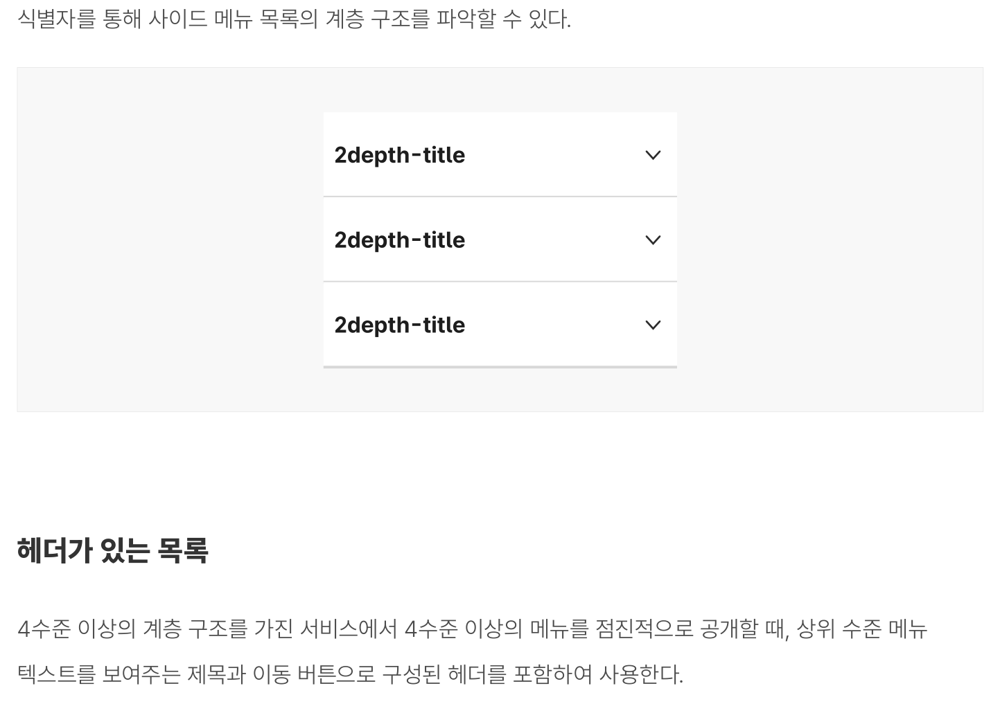
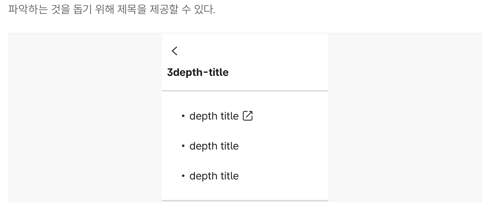
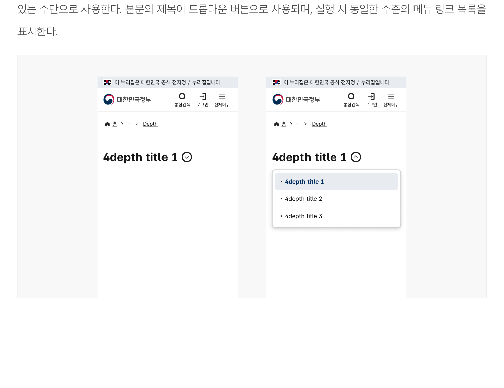
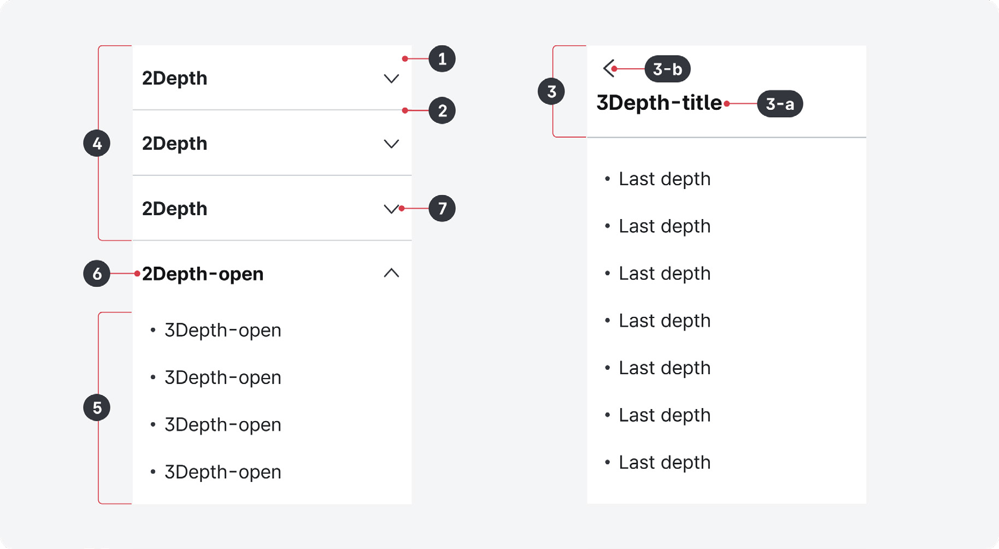
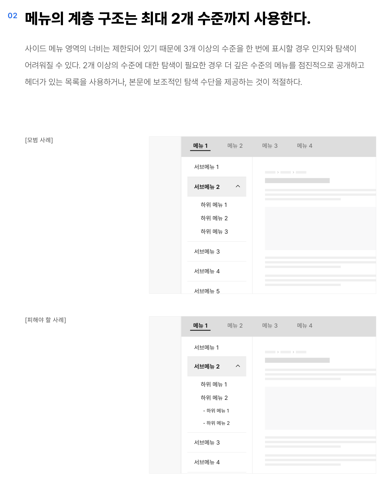
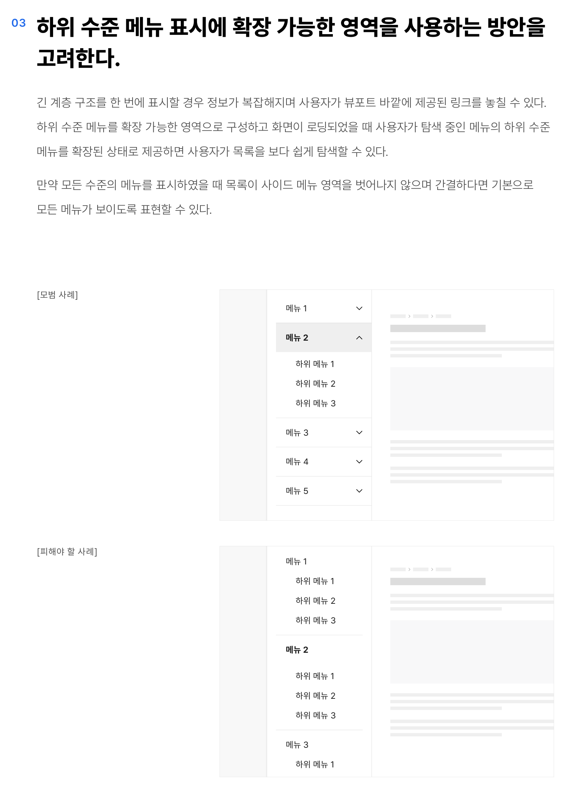
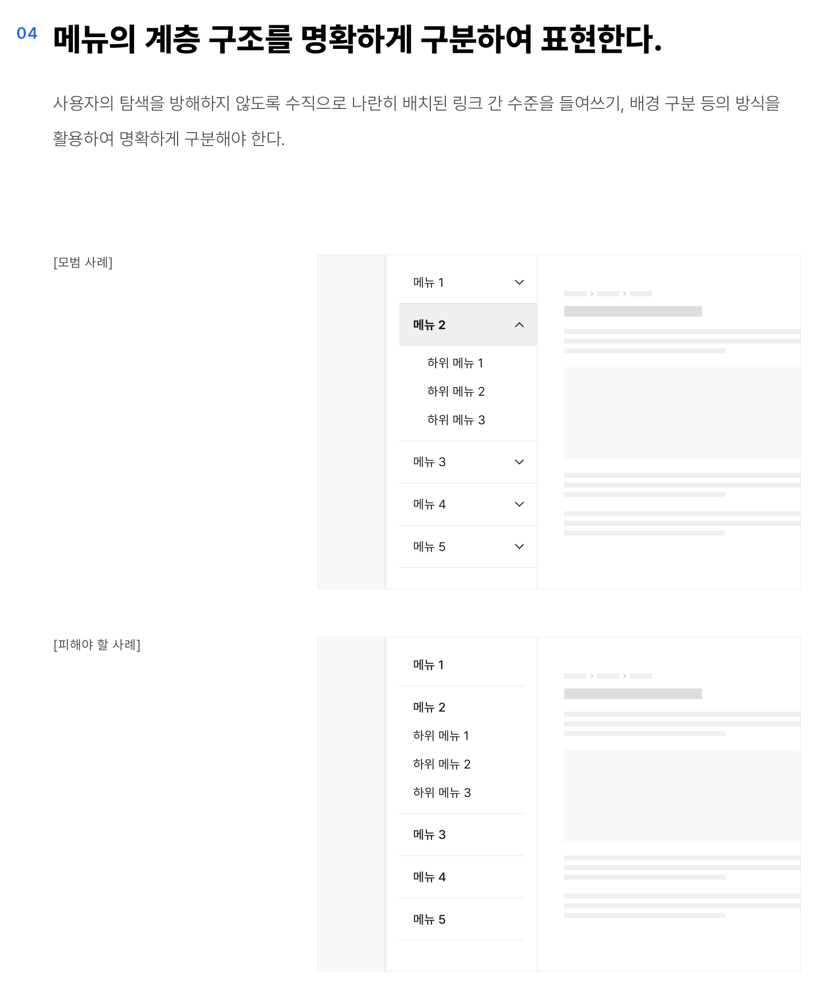

사이드 메뉴는 서브 화면 내에서의 이동을 위해 사용하는 메뉴이다. 일반적으로 본문 영역의 좌측에 사이드바 형태로 제공된다. 메인 메뉴보다 훨씬 좁고 깊은 페이지 구조 탐색에 사용되기 때문에 링크의 개수가 많고 복잡하게 표현되기 쉽다. 사이트 규모가 클수록 사이드 메뉴를 단순하고 직관적으로 설계하여 사용자가 탐색 중에 길을 잃지 않도록 해야 한다.

## 용례

### 사용하기 적합한 경우

- 메인 메뉴에서 선택한 메뉴 하위에 많은 화면이 존재하는 경우

제한된 메인 메뉴 영역에서 가로로 배치된 목록을 탐색하는 것보다 세로로 배치된 사이드 메뉴 링크 목록을 훑어보는 것이 쉽다.

- 사용자가 사이트 정보의 계층 구조에서 특정 수준의 메뉴를 상세하게 탐색할 필요가 있는 경우

메인 메뉴 항목 하위 링크 목록이 유사한 정보 그룹으로 구성되어 있고 사용자가 링크 목록을 비교하여 탐색하는 행동을 빈번하게 수행하는 경우, 본문 옆에 배치된 사이드 메뉴가 탐색 과정을 효율적으로 수행하는 것을 도울 수 있다.
### 사용하기 적합하지 않은 경우

- 사이트 규모가 작은 경우

화면 수가 5개 미만인 소규모 서비스는 메인 메뉴 또는 다른 보조적 탐색 수단을 통해 사이트 정보 구조를 충분히 탐색할 수 있다.

- 콘텐츠 표현과 인지를 위해 넓은 본문 영역이 필요한 경우

넓은 본문 영역이 필요한 경우, 수준이 깊은 메인 메뉴 형식을 사용하여 사용자가 메인 메뉴를 통해 로컬 탐색을 수행하도록 한다. 화면 너비가 충분하다면 화면 전체 너비로 레이아웃을 확장하고 사이드 메뉴와 본문을 함께 표시할 수 있다.

- 탐색 계층 구조가 2수준 이내이고 탐색 항목 수가 적은 경우

2수준까지 탐색 가능한 메인 메뉴를 통해 서비스의 정보 구조를 충분히 탐색할 수 있다.
## 유형

### 단순 목록

사이드 메뉴의 가장 기본적인 형태로 모든 수준의 링크가 표시된다. 사용자는 메인 메뉴와 메인 메뉴의 식별자를 통해 사이드 메뉴 목록의 계층 구조를 파악할 수 있다.



**시각 자료 텍스트 보완**

```text
헤더가 있는 목록
4수준 이상의 계층 구조를 가진 서비스에서 4수준 이상의 메뉴를 점진적으로 공개할 때, 상위 수준 메뉴 텍스트를 보여주는 제목과 이동 버튼으로 구성된 헤더를 포함하여 사용한다.
링크 목록이 메인 메뉴에 표시된 정보 구조의 하위 수준에 속하지 않는 경우, 사용자가 정보 구조를 명확하게 파악하는 것을 돕기 위해 제목을 제공할 수 있다.
```
### 헤더가 있는 목록

4수준 이상의 계층 구조를 가진 서비스에서 4수준 이상의 메뉴를 점진적으로 공개할 때, 상위 수준 메뉴 텍스트를 보여주는 제목과 이동 버튼으로 구성된 헤더를 포함하여 사용한다.

링크 목록이 메인 메뉴에 표시된 정보 구조의 하위 수준에 속하지 않는 경우, 사용자가 정보 구조를 명확하게 파악하는 것을 돕기 위해 제목을 제공할 수 있다.



**시각 자료 텍스트 보완**

```text
원본 PDF의 UI 배치·상태·다이어그램을 보존한 시각 자료입니다.
```
### 드롭다운

4수준 이상의 계층 구조를 가진 서비스에서 햄버거 메뉴로 전환되었을 때 메인 메뉴를 보조하여 탐색할 수 있는 수단으로 사용한다. 본문의 제목이 드롭다운 버튼으로 사용되며, 실행 시 동일한 수준의 메뉴 링크 목록을 표시한다.



**시각 자료 텍스트 보완**

```text
원본 PDF의 UI 배치·상태·다이어그램을 보존한 시각 자료입니다.
```
## 구조

- 1 컨테이너: 사이드 메뉴 링크 목록을 담고 있는 영역으로 배경면 또는 구분선으로 본문 및 인접 영역과 구분함
- 2 구분선: 링크 목록 내의 항목을 구분하기 위한 가로선
- 3 헤더(선택): 메뉴 목록의 제목을 제공하는 영역

- a. 제목: 메뉴 목록 전체의 상위 수준 정보 구조를 알려주는 텍스트
- b. 화살표: 제목으로 제공되는 상위 수준 정보 구조로 이동하는 데 사용되는 버튼

- 4 기본 화면 링크 목록: 기본 탐색 링크 그룹
- 5 하위 수준 화면 링크 목록: 기본 화면 링크 하위 수준에 속하는 링크 목록
- 6 식별자: 선택된 링크를 변별하기 위한 시각적 단서
- 7 꺾쇠 아이콘: 하위 수준 화면 링크 목록의 확장/축소 상태를 나타냄. 사용자는 꺾쇠 아이콘의 유무를 통해 개별 기본 화면 링크 하위에 추가적으로 탐색할 수 있는 링크 목록이 존재하는지를 인지할 수 있음


## 사용성 가이드라인

- 01 현재 탐색 중인 화면에 대한 링크를 강조 표시한다.
- 02 메뉴의 계층 구조는 최대 2개 수준까지 사용한다.
- 03 하위 수준 메뉴 표시에 확장 가능한 영역을 사용하는 방안을 고려한다.
- 04 메뉴의 계층 구조를 명확하게 구분하여 표현한다.
### 01. 현재 탐색 중인 화면에 대한 링크를 강조 표시한다.

사용자가 탐색 계층 구조 내에서 어디에 있는지 알 수 있도록 식별자를 통해 탐색 중인 링크를 강조 표시한다.

### 02. 메뉴의 계층 구조는 최대 2개 수준까지 사용한다.

사이드 메뉴 영역의 너비는 제한되어 있기 때문에 3개 이상의 수준을 한 번에 표시할 경우 인지와 탐색이 어려워질 수 있다. 2개 이상의 수준에 대한 탐색이 필요한 경우 더 깊은 수준의 메뉴를 점진적으로 공개하고 헤더가 있는 목록을 사용하거나, 본문에 보조적인 탐색 수단을 제공하는 것이 적절하다.

[모범 사례]

[피해야 할 사례]

### 03. 하위 수준 메뉴 표시에 확장 가능한 영역을 사용하는 방안을 고려한다.

긴 계층 구조를 한 번에 표시할 경우 정보가 복잡해지며 사용자가 뷰포트 바깥에 제공된 링크를 놓칠 수 있다. 하위 수준 메뉴를 확장 가능한 영역으로 구성하고 화면이 로딩되었을 때 사용자가 탐색 중인 메뉴의 하위 수준 메뉴를 확장된 상태로 제공하면 사용자가 목록을 보다 쉽게 탐색할 수 있다.

만약 모든 수준의 메뉴를 표시하였을 때 목록이 사이드 메뉴 영역을 벗어나지 않으며 간결하다면 기본으로 모든 메뉴가 보이도록 표현할 수 있다.

[모범 사례]

[피해야 할 사례]

### 04. 메뉴의 계층 구조를 명확하게 구분하여 표현한다.

사용자의 탐색을 방해하지 않도록 수직으로 나란히 배치된 링크 간 수준을 들여쓰기, 배경 구분 등의 방식을 활용하여 명확하게 구분해야 한다.

[모범 사례]

[피해야 할 사례]


### 플랫폼에 대한 고려 사항

화면 너비가 충분하지 않은 경우 사이드 메뉴를 표시하지 않는다.

사용자는 햄버거 아이콘으로 축소된 메인 메뉴를 통해 정보 구조를 탐색한다. 4수준 이상의 정보 구조가 필요하다면 본문 제목을 4수준 메뉴에 대한 보조적 탐색 수단으로 사용하여 사용자의 탐색을 도울 수 있다.
## 접근성 가이드라인

### 01. 메뉴의 컨테이너가 내비게이션 섹션임을 스크린 리더에서 인지할 수 있도록 한다.

메뉴의 전체 컨테이너는 &lt;nav&gt;로 감싸거나 WAI-ARIA 영역을 role="navigation"으로 지정하여 스크린 리더에서 내비게이션 요소임을 인지할 수 있도록 제공해야 한다. 내비게이션 섹션에 aria-label="사이드 메뉴"를 제공하면 스크린 리더 사용자는 사이드 메뉴의 역할을 보다 명확하게 인지할 수 있다.

- KWCAG 2.2 제목 제공
- WCAG 2.1 Info and Relationships (A)

### 02. 메뉴 링크의 계층 구조를 표현한다.

스크린 리더 사용자가 사이트의 정보 구조를 파악하는 데 도움을 줄 수 있도록 &lt;h2&gt;~&lt;h6&gt;, &lt;ul&gt;, &lt;li&gt; 태그를 활용하여 계층 구조로 정보를 제공해야 한다.

- KWCAG 2.2 제목 제공
- WCAG 2.1 Info and Relationships (A)

### 03. 활성화된 메뉴 정보가 스크린 리더로 전달될 수 있도록 한다.

인디케이터가 시각적으로만 구분되는 것이 아니라 스크린 리더로도 전달될 수 있도록 WAI-ARIA ariacurrent 속성을 제공한다. 현재 탐색 중인 화면에 대한 링크인 경우 aria-current="page" 속성을 추가한다.

- KWCAG 2.2 적절한 대체 텍스트 제공
- WCAG 2.1 Name, Role, Value (A)
### 04. 메뉴 링크는 키보드로 탐색할 수 있도록 한다.

사이드 메뉴의 링크는 반드시 키보드가 접근할 수 있도록 제공해야 한다. 사용자가 키보드를 이용하여 영역을 확장하거나 축소하고 목록을 탐색할 수 있는지 점검해야 한다.

- KWCAG 2.2 키보드 사용 보장
- WCAG 2.1 Keyboard (A)
- WCAG 2.1 No Keyboard Trap (A)

### 05. 키보드의 초점은 메뉴의 계층 순서대로 이동하도록 한다.

키보드를 이용하여 메뉴를 탐색하는 경우, 키보드의 탐색 위치를 표시하는 초점이 메뉴의 계층 순서에 맞게 이동되도록 제공해야 한다. 문서에 메뉴의 계층 구조를 표현하지 않거나 임의로 키보드 초점의 이동 순서를 조작하면 보조 기술 사용자는 메뉴 탐색에 혼동을 느끼게 된다.

- KWCAG 2.2 초점 이동과 표시
- WCAG 2.1 Focus Order (A)

### 06. 스크린 리더에서 하위 수준 메뉴의 확장/축소 상태를 확인할 수 있도록 한다.

aria-expanded 속성이나 title 속성을 활용하여 하위 메뉴 영역의 활성화 상태 정보가 스크린 리더에 탐지될 수 있도록 해야 한다.

- WCAG 2.1 Name, Role, Value (A)
### 07. 축소된 메뉴 링크에 보조 기술이 접근되지 않도록 제공한다.

시각적으로 확인할 수 없는 메뉴 링크에 보조 기술이 접근하게 되면, 보조 기술 사용자들은 의도와 상관 없이 숨겨진 링크에 모두 접근해야 한다.

- KWCAG 2.2 초점 이동과 표시
- WCAG 2.1 Focus Order (A)


## 상호작용 가이드라인

### 메뉴 링크 탐색

### 메뉴 영역 확장 및 축소

| 구분 | 설명 |
|---|---|
| Enter | 연결된 링크 목적지로 이동한다. |
| Click | 연결된 링크 목적지로 이동한다. |
| Tab, Shift + Tab | 시각적으로 표시된 메뉴 링크에 순차적으로 접근한다. |

| 구분 | 설명 |
|---|---|
| Click | 꺾쇠 아이콘이 있는 메뉴 링크가 초점을 가진 상태에서 마우스 Click 이벤트가 발생하였을 때 하위 수준 메뉴가 펼쳐지거나 접혀야 한다. 하나의 하위 링크 목록의 확장 상태는 다른 하위 링크 목록에 영향을 미치지 않는다. 즉, 어떤 하위 메뉴가 확장되어 있는 상태에서 다른 하위 링크 목록이 확장되더라도 기존에 확장된 링크 목록의 확장 상태가 유지되어야 한다. |
| Enter | 꺾쇠 아이콘이 있는 메뉴 링크가 초점을 가진 상태에서 키보드 Enter 이벤트가 발생하였을 때 하위 수준 메뉴가 펼쳐지거나 접혀야 한다. 하나의 하위 링크 목록의 확장 상태는 다른 하위 링크 목록에 영향을 미치지 않는다. 즉, 어떤 하위 메뉴가 확장되어 있는 상태에서 다른 하위 링크 목록이 확장되더라도 기존에 확장된 링크 목록의 확장 상태가 유지되어야 한다. |
