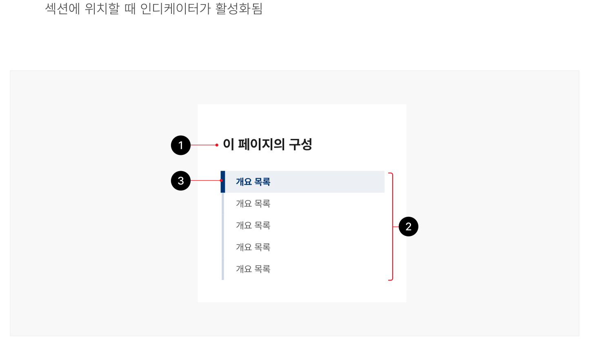

콘텐츠 내 탐색은 사용자가 본문의 구조를 훑어보고 원하는 콘텐츠로 빠르게 이동할 수 있도록 하는 탐색 수단이다. 화면을 스크롤 할 때 특정 위치에 고정되어 콘텐츠의 목차 역할을 하는 동시에 사용자가 콘텐츠 내 탐색에서 특정 항목을 클릭하면 연결된 섹션으로 스크롤 된다.

## 용례

### 사용하기 적합한 경우

- 구조화된 콘텐츠이며 화면이 길 때

콘텐츠 내 탐색은 세 개 이상의 개별 콘텐츠 섹션 또는 세 개 이상의 뷰포트 높이를 초과하는 콘텐츠가 포함된 본문의 탐색에 사용하기 적합하다.
### 사용하기 적합하지 않은 경우

- 화면 길이가 짧을 때

스크롤 동작이 거의 필요하지 않은 화면의 경우 콘텐츠 내 탐색이 제공되지 않아도 된다.

- 콘텐츠가 구조화되지 않았을 때

계층 구조가 없는 본문에는 콘텐츠 내 탐색 요소를 사용할 수 없다.

- 무한 스크롤 기능을 사용할 때

무한 스크롤 기능이 있는 화면의 경우 콘텐츠 내 탐색은 구현할 수 없으며 실용성이 없다.

- 서비스의 정보 구조를 탐색할 때

사이드 메뉴 등의 서브 메뉴를 사용하는 것이 적절하다.

- 필터 목록을 표시할 때

콘텐츠에 대한 필터 목록을 표시하는 데 콘텐츠 내 탐색을 사용하지 않는다.
## 구조

- 1 제목: 콘텐츠 내 탐색 목록의 제목. '이 페이지의 구성', '목차'와 같은 설명적인 제목을 제공하여 콘텐츠 내 탐색의 기능에 대한 사용자의 이해도를 높일 수 있음
- 2 개요 목록: 본문을 구성하는 콘텐츠의 섹션 제목을 보여주는 링크 목록. 클릭하면 해당 콘텐츠 섹션으로 빠르게 이동할 수 있음
- 3 활성화 상태 인디케이터: 탐색 중인 콘텐츠 섹션을 알려주는 시각적 표시기. 사용자가 특정 콘텐츠 섹션에 위치할 때 인디케이터가 활성화됨



**시각 자료 텍스트 보완**

```text
원본 PDF의 UI 배치·상태·다이어그램을 보존한 시각 자료입니다.
```
## 사용성 가이드라인

- 01 적절한 너비로 표현한다.
- 02 콘텐츠 내 탐색은 본문 우측에 표시한다.
- 03 개요 목록 텍스트는 연결된 섹션 제목과 일치하는 내용으로 제공한다.
- 04 목록 수준은 최대 3단계까지 사용한다.
### 01. 적절한 너비로 표현한다.

콘텐츠 내 탐색 구성 요소의 너비는 충분히 넓어야 한다. 텍스트 길이에 따라 줄 바꿈이 발생하지 않는 일관된 너비로 정의하여 버튼이나 다른 컨트롤과 혼동되지 않도록 한다.

### 02. 콘텐츠 내 탐색은 본문 우측에 표시한다.

콘텐츠 내 탐색은 사용자의 자연스러운 읽기 순서를 고려하여 본문 다음에 배치한다. 한글과 같이 왼쪽에서 오른쪽으로 읽는 언어로 구성된 화면에서 콘텐츠 내 탐색은 기본 콘텐츠의 오른쪽에 배치하는 것이 적절하다.

### 03. 개요 목록 텍스트는 연결된 섹션 제목과 일치하는 내용으로 제공한다.

콘텐츠 내 탐색에 표시되는 링크의 텍스트는 해당 콘텐츠 섹션의 제목 텍스트와 일치해야 한다.

### 04. 목록 수준은 최대 3단계까지 사용한다.

탐색의 깊이를 지나치게 세부적으로 구분하게 되면 콘텐츠 내 탐색을 통해 본문의 구조를 빠르게 파악하기 어렵다. 가능한 한 1단계 수준으로 구성하되 수준 표현이 필요한 경우 최대 3단계까지만 사용해야 한다.


### 플랫폼에 대한 고려 사항

### 모바일에서 콘텐츠 내 탐색은 제목과 본문 사이에 배치한다.

화면 너비가 충분하지 않을 때, 콘텐츠 내 탐색은 특정 위치에 고정하지 않고 제목과 본문 사이에 배치한다. 본문의 구조가 복잡하여 콘텐츠 내 탐색 링크 목록의 길이가 길어질 경우, 디스클로저와 같은 확장 가능한 섹션으로 콘텐츠 내 탐색을 제공할 수 있다.
## 접근성 가이드라인

### 01. 키보드로 접근과 조작이 가능하도록 한다.

사용자는 Tab 키를 사용하여 항목 사이를 탐색할 수 있어야 하며, 키보드에서 Enter 키를 누르면 링크의 동작을 실행할 수 있어야 한다. 사용자는 마우스와 키보드 모두로 호버 및 포커스 상태를 활성화할 수 있어야 한다.

- KWCAG 2.2 키보드 사용 보장
- WCAG 2.1 Keyboard (A)

### 02. 콘텐츠 내 탐색은 제목과 본문 사이에 배치한다.

콘텐츠 내 탐색을 통해 본문의 구조를 파악하고 원하는 정보가 있는 섹션에 바로 접근할 수 있도록 본문 전에 콘텐츠 내 탐색이 마크업되어야 한다.

- KWCAG 2.2 콘텐츠의 선형화
- WCAG 2.1 Meaningful Sequence (A)
- WCAG 2.1 Consistent Navigation (AA)

### 03. 키보드로 콘텐츠 내 탐색 링크를 실행하였을 때 화면과 함께 키보드 초점이 해당 섹션으로 이동되도록 한다.

키보드 사용자가 Enter 키를 눌러 링크를 실행하였을 때, 해당 섹션으로 초점이 이동되어야 한다. 마우스 사용자가 콘텐츠 내 탐색 목록 링크를 실행한 경우 초점은 선택한 링크에 유지되어야 한다.

- KWCAG 2.2 초점 이동과 표시
- WCAG 2.1 Focus Order (A)
### 04. 링크 목록에 &lt;h1&gt;을 사용하지 않는다.

각 화면에는 해당 화면에서 전달하고자 하는 핵심 콘텐츠를 대표하는 제목이 &lt;h1&gt;으로 제공된다. 콘텐츠 내 탐색에 &lt;h1&gt; 태그를 사용하는 경우 중복될 수 있다.

- KWCAG 2.2 제목 제공
- WCAG 2.1 Info and Relationships (A)


## 상호작용 가이드라인

### 목록 탐색

### 콘텐츠 섹션 이동

| 구분 | 설명 |
|---|---|
| Tab, Shift + Tab | 콘텐츠 내 탐색 링크를 순차적으로 탐색한다. |

| 구분 | 설명 |
|---|---|
| Click | 링크를 Click 하면 해당 콘텐츠 섹션으로 화면이 스크롤된다. |
| Enter, Space | 목록 링크가 초점을 가진 상태에서 Enter 또는 Space 키를 누르면 해당 콘텐츠 섹션으로 화면이 스크롤되며 콘텐츠 섹션의 제목 또는 콘텐츠 섹션 자체로 초점이 이동한다. |
