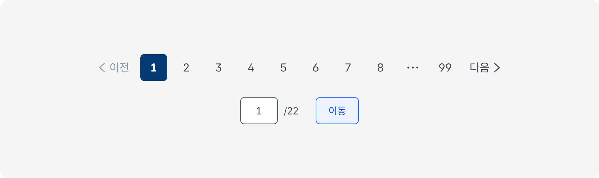
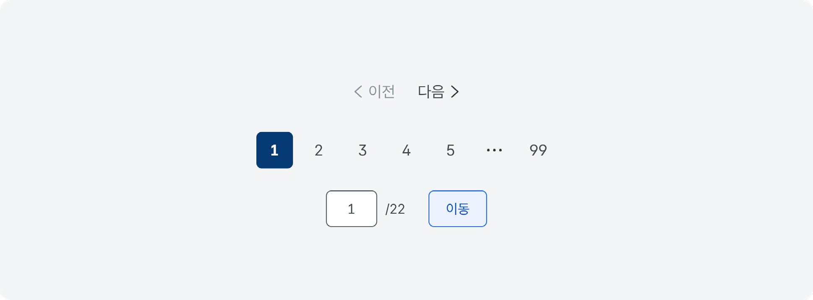
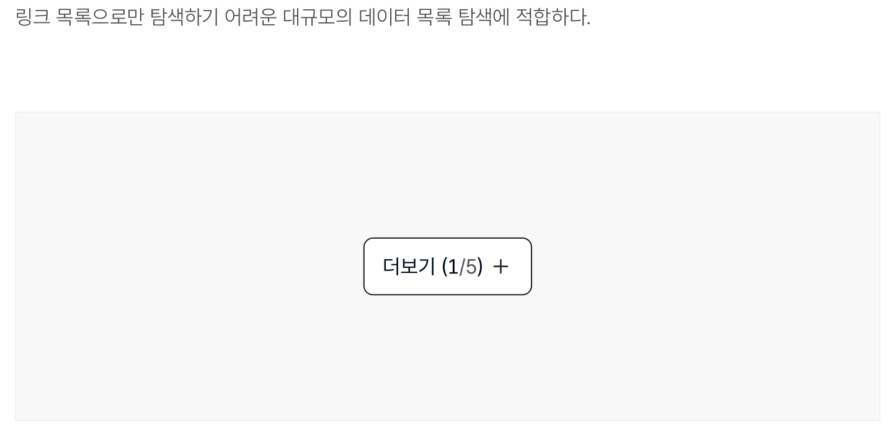
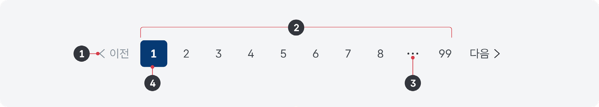
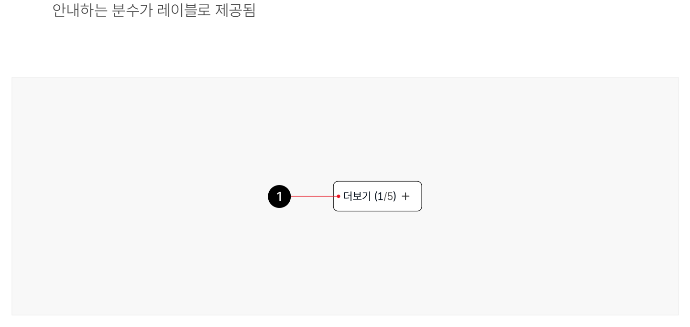
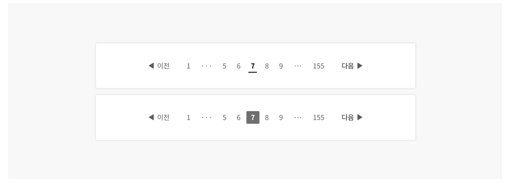
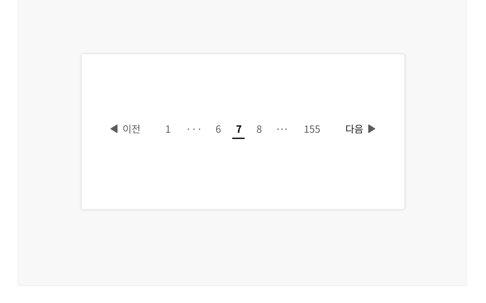
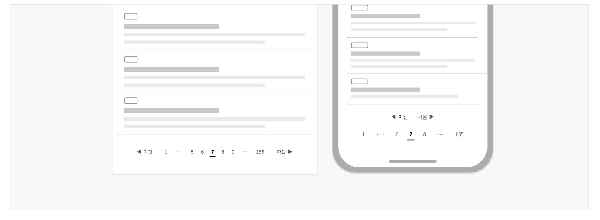
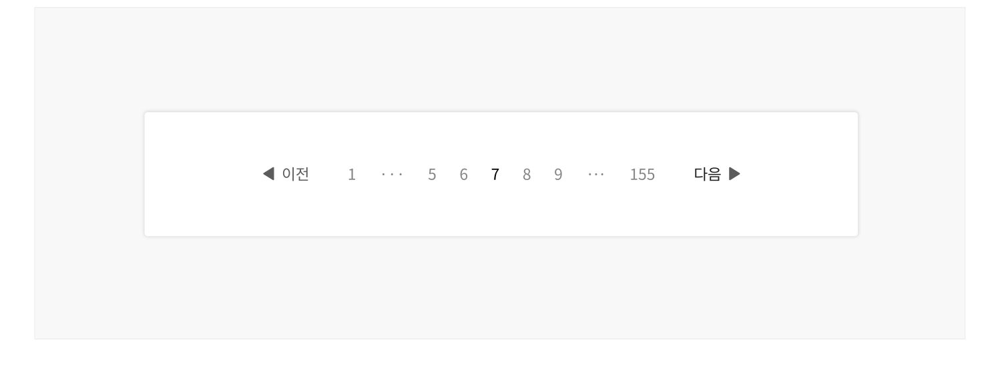

페이지네이션은 많은 양의 콘텐츠를 탐색하기 쉽도록 여러 화면에 나누고, 분할된 화면을 탐색하는 데 사용되는 요소이다.

## 용례

### 사용하기 적합한 경우

- 데이터 집합에서 특정 항목을 찾는 것이 사용자의 목표일 때

데이터 집합에서 세부적인 정보를 확인하는 것이 아니라 특정 항목을 찾는 것이 중요한 경우, 데이터 집합을 여러 화면으로 구분하면 사용자가 데이터를 더 빨리 훑어 보고 탐색할 수 있다.

- 한 화면에 모든 콘텐츠를 표시하면 화면 로딩 시간이 오래 걸릴 때

데이터 집합을 한 화면에 표시하였을 때 목록의 높이가 뷰포트의 2배를 초과하거나, 전체 항목 개수가 20개를 초과하는 경우 페이지네이션의 사용을 검토한다.
### 사용하기 적합하지 않은 경우

- 데이터 집합을 의미적으로 그룹화하고자 할 때

긴 데이터 집합을 특정 주제나 범주로 구분하고자 하는 경우에는 별도 정보 구조로 포함시켜 사이드 메뉴를 통해 탐색하는 것이 적합하다.

- 전체 데이터 수가 적을 때

데이터 집합을 한 화면에 표시하였을 때 목록의 높이가 뷰포트의 2배를 초과하지 않거나 전체 항목 개수가 20개 이내인 경우 한 화면에서 목록을 탐색하도록 하는 방안을 고려한다. 필요한 경우 필터링/ 조회 패턴을 활용하여 한 화면에 표시된 데이터 목록의 탐색을 도울 수 있다.

- 무한 스크롤 기능을 사용할 때

사용자가 화면을 아래로 스크롤할 때 추가적으로 데이터가 로드되는 무한 스크롤 기능을 사용하는 경우, 페이지네이션을 사용하지 않는다.

무한 스크롤은 키보드 사용자에게 문제를 야기할 수 있으므로 사용하지 않는 것이 좋으며, 항목 개수에 대한 추정치가 있고 사용자가 항목 목록의 끝으로 이동할 필요가 없을 때만 사용한다.
## 유형

### 숫자 링크 목록

분할된 화면의 순서를 숫자로 표시한다. 숫자 링크를 눌러 원하는 순서의 화면 목록으로 직접 이동하거나 이전/ 다음 버튼을 눌러 화면을 순차적으로 탐색할 수 있다. 첫 화면과 마지막 화면 숫자 링크가 항상 표시되므로 사용자는 목록의 시작이나 끝으로 빠르게 이동할 수 있다.

PC


Mobile


### 화면 직접 이동

숫자 링크 목록과 함께 사용하며, 사용자가 원하는 화면 숫자를 직접 페이지 입력하여 이동할 수 있다. 숫자 링크 목록으로만 탐색하기 어려운 대규모의 데이터 목록 탐색에 적합하다.

PC



Mobile


### 목록 확장

숫자 링크 목록과 함께 사용하며, 사용자가 원하는 화면 숫자를 직접 페이지 입력하여 이동할 수 있다. 숫자 링크 목록으로만 탐색하기 어려운 대규모의 데이터 목록 탐색에 적합하다.



**시각 자료 텍스트 보완**

```text
원본 PDF의 UI 배치·상태·다이어그램을 보존한 시각 자료입니다.
```
## 구조

### 숫자 링크 목록

- 1 이전/다음 버튼: 화면 목록을 앞/뒤로 탐색하는 데 사용되는 버튼. 아이콘과 텍스트를 조합하여 제공하거나, 아이콘과 텍스트를 단독으로 사용할 수 있음
- 2 숫자 링크 목록: 표시된 숫자의 화면으로 이동할 수 있는 링크. 목록의 첫 번째 요소는 숫자 '1', 마지막 요소는 가장 마지막 화면의 숫자를 표시함
- 3 말줄임표: 번호 링크 사이에 생략된 숫자가 있음을 표시함
- 4 현재 화면 식별자: 사용자가 현재 탐색하고 있는 화면을 나타냄


### 직접 이동

- 1 숫자 입력 필드: 탐색하고자 하는 화면 번호를 입력할 수 있는 입력 필드. 입력 전에는 사용자가 현재 보고 있는 화면 번호를 보여줌
- 2 전체 화면 수 레이블: 화면 숫자 입력 필드 오른쪽에 배치되어 전체 화면 수를 보여줌
- 3 이동 버튼: 실행 시 숫자 입력 필드에 입력된 숫자에 해당하는 화면으로 이동함


### 목록 확장

1 더보기 버튼: 실행 시 항목을 추가적으로 표시함. '더보기'라는 텍스트와 표시된 항목 수, 전체 항목 수를 안내하는 분수가 레이블로 제공됨



**시각 자료 텍스트 보완**

```text
1 더보기 버튼: 실행 시 항목을 추가적으로 표시함. '더보기'라는 텍스트와 표시된 항목 수, 전체 항목 수를 안내하는 분수가 레이블로 제공됨
```
## 사용성 가이드라인

- 01 페이지네이션에는 첫/마지막 화면, 이전/다음 화면으로 이동할 수 있는 수단을 제공한다.
- 02 전체 화면 수를 표시한다.
- 03 번호 링크에 현재 화면 숫자를 강조하여 표현한다.
- 04 페이지네이션은 전체 서비스에서 일관된 영역에 배치한다.
- 05 페이지네이션은 한 화면에 하나만 사용한다.
- 06 숫자 링크 목록에는 말줄임표를 포함하여 10개 이내의 항목을 표시한다.
- 07 화면당 항목 수를 최적화한다.
### 01. 페이지네이션에는 첫/마지막 화면, 이전/다음 화면으로 이동할 수 있는 수단을 제공한다.

목록 확장형 페이지네이션을 제외하고 사용자는 어떤 화면에서든 항상 첫 화면, 마지막 화면, 이전 화면, 다음 화면으로 이동할 수 있어야 한다.

### 02. 전체 화면 수를 표시한다.

사용자가 전체 데이터 목록 수를 알 수 있도록 전체 화면 수를 제공해야 한다.
### 03. 번호 링크에 현재 화면 숫자를 강조하여 표현한다.

사용자가 현재 몇 번째 화면을 탐색하는지 명확하게 변별할 수 있도록 현재 화면 숫자 링크를 적절하게 강조하여 표현한다. 목록 상단에 별도의 텍스트 정보를 제공함으로써 탐색 중인 화면의 인지를 도울 수 있다.

[모범 사례]



**사례 텍스트 보완**

```text
원본 PDF의 UI 배치·상태·다이어그램을 보존한 시각 자료입니다.
```
### 04. 페이지네이션은 전체 서비스에서 일관된 영역에 배치한다.

페이지네이션은 유형에 상관없이 목록 하단에 중앙 정렬하여 사용자가 전체 사이트에 걸쳐 일관된 영역에서 접근할 수 있도록 한다.

### 05. 페이지네이션은 한 화면에 하나만 사용한다.

페이지네이션을 이용하여 구분하고 탐색해야 할 항목이 한 화면에 여러 개 제공되면 복잡성이 증가하고 여러 개의 목록 및 페이지네이션의 용도와 역할 구분이 어려워진다.

### 06. 숫자 링크 목록에는 말줄임표를 포함하여 10개 이내의 항목을 표시한다.

필요 이상으로 많은 숫자 링크 목록을 표시하면 인지적 부담이 증가한다.
### 07. 화면당 항목 수를 최적화한다.

화면당 항목 수가 너무 많으면 사용자를 압도할 수 있고, 지나치게 적을 경우 정보 탐색이 불편할 수 있다. 각 화면에 표시되는 항목 수를 결정할 때는 화면 로딩 시간, 성능, 사용자의 스크롤 기본 설정 등을 고려한다. 사용자가 각 화면에 표시할 항목 수를 제어하는 컴포넌트를 필터링·정렬 옵션으로 추가하여 사용자가 원하는 방식대로 항목을 탐색하도록 할 수 있다.
### 플랫폼에 대한 고려 사항

### 01. 화면 너비가 충분하지 않은 경우 이전/다음 버튼, 숫자 링크 목록을 수직으로 배치한다.

화면 너비가 충분하지 않다면 데이터 목록 하단에 이전/다음 버튼을 배치하고 그 아래에 숫자 링크 목록을 배치한다. 선형적이고 순차적인 방식으로 탐색하는 수단을 더 쉽게 접근할 수 있는 영역에 배치하여, 작은 화면에서 일련의 숫자 링크 목록을 탐색하는 데서 발생하는 피로를 감소시키고 인접 영역을 실수로 터치하지 않도록 한다.

[모범 사례]

[피해야 할 사례]


### 02. 화면 너비가 충분하지 않은 경우 숫자 링크 목록은 말줄임표를 포함하여 최대 7개 링크를 표시한다.

더 많은 항목이 제공될 경우, 각 링크를 터치할 수 있는 충분한 영역을 확보하기 어렵다.

[모범 사례]



**사례 텍스트 보완**

```text
원본 PDF의 UI 배치·상태·다이어그램을 보존한 시각 자료입니다.
```
### 03. 화면 크기에 상관없이 전체 화면 수를 일정하게 유지한다.

어떤 설정과 디바이스 환경에서 서비스를 이용하더라도 동일한 항목은 동일한 위치에서 찾을 수 있도록 전체 화면 수와 각 화면에 표시되는 항목 수를 일정하게 유지해야 한다.
## 접근성 가이드라인

### 01. 페이지네이션의 컨테이너가 내비게이션 섹션임을 스크린 리더에서 인지할 수 있도록 한다.

페이지네이션의 전체 컨테이너는 &lt;nav&gt;로 감싸거나 WAI-ARIA 영역을 role="navigation"으로 지정하여 스크린 리더에서 내비게이션 요소임을 인지할 수 있도록 제공해야 한다. 내비게이션 섹션에 aria-label 속성을 활용하여 어떤 데이터 집합에 대한 페이지네이션인지에 대한 설명을 제공하면 스크린 리더 사용자가 보다 명확하게 페이지네이션의 역할을 인지할 수 있다.

- KWCAG 2.2 제목 제공
- WCAG 2.1 Info and Relationships

### 02. 숫자 링크 목록의 구조를 표현한다.

스크린 리더 사용자가 페이지네이션의 항목 수를 빠르게 파악할 수 있도록 &lt;ul&gt;, &lt;li&gt; 태그를 활용하여 계층 구조로 정보를 제공해야 한다.

- KWCAG 2.2 제목 제공
- WCAG 2.1 Info and Relationships (A)

### 03. 스크린 리더에서 확인할 수 있는 현재 화면 정보를 제공한다.

스크린 리더 사용자가 시각적으로 표시된 현재 화면 정보를 동등하게 전달받을 수 있도록 현재 화면 링크의 href 속성을 삭제하고 aria-current="true"를 부여한다.

- WCAG 2.1 Name, Role, Value (A)
### 04. 현재 화면 숫자 링크를 색상만으로 구분하지 않는다.

현재 화면 숫자 링크는 밑줄, 배경 반전, 텍스트 크기 조정 등의 방식을 활용하여 다른 링크와 명확하게 구분되어야 한다.

- KWCAG 2.2 색에 무관한 콘텐츠 인식
- WCAG 2.1 Use of Color (A)

[모범 사례]



**사례 텍스트 보완**

```text
피해야 할 사례
```
[피해야 할 사례]


**사례 텍스트 보완**

```text
원본 PDF의 UI 배치·상태·다이어그램을 보존한 시각 자료입니다.
```
### 05. 숫자 링크에 적절한 접근 가능한 이름을 제공한다.

스크린 리더 사용자가 숫자 링크의 용도를 보다 명확하게 인지할 수 있도록 aria-label="페이지 1", arialabel="페이지 2" 또는 title="페이지"와 같은 방식으로 접근 가능한 이름이나 보조적 설명을 제공한다. 마지막 화면의 경우, aria-label="마지막 페이지, [숫자]" 또는 title="마지막 페이지"로 설명을 제공한다.

- KWCAG 2.2 적절한 링크 텍스트
- WCAG 2.1 Headings and Labels (AA)

### 06. 이전/다음 화면 이동 버튼을 아이콘으로만 제공하는 경우 이름을 제공해야 한다.

aria-label="이전 페이지", aria-label="다음 페이지"와 같은 방식으로 버튼에 접근 가능한 이름을 제공해야 한다.

- KWCAG 2.2 적절한 링크 텍스트
- WCAG 2.1 Link Purpose (In Context) (A)

### 07. 페이지네이션의 구성 요소를 적절한 크기로 표현하고 영역 간 구분을 제공한다.

마우스 커서나 손가락으로 선택할 수 있도록 충분히 큰 버튼을 제공하고 실수를 방지하기 위해 버튼 간 충분한 간격을 확보한다. 요소의 적절한 크기는 버튼, 링크 컴포넌트 가이드라인을 참조한다.

- KWCAG 2.2 콘텐츠 간의 구분
- KWCAG 2.2 조작 가능
- WCAG 2.1 Target Size (AAA)

접근성 가이드라인

### 08. 페이지네이션의 구성 요소를 일관된 순서로 제공한다.

화면 너비와 시각적 배치에 상관없이 이전 버튼, 숫자 링크 목록, 다음 버튼, 화면 숫자 입력 필드, 전체 화면 수 레이블, 이동 버튼 순서로 제공한다.

- KWCAG 2.2 콘텐츠의 선형화
- WCAG 2.1 Meaningful Sequence (A)

### 09. 목록 확장 페이지네이션을 사용할 때, 초점 이동 순서에 유의한다.

더보기 버튼을 눌러 새로운 항목이 생성되었을 때, 새로 생성된 항목 중 가장 첫 번째 항목으로 Focus 이벤트가 발생해야 한다.

- KWCAG 2.2 초점 이동과 표시
- WCAG 2.1 Focus Order (A)
## 상호작용 가이드라인

### 숫자 링크 목록

### 화면 직접 이동

| 구분 | 설명 |
|---|---|
| Click | 기본 상태의 이전/다음 버튼, 숫자 링크를 Click 하면 해당 화면으로 이동한다. |
| Enter | 기본 상태의 이전/다음 버튼, 숫자 링크가 초점을 가진 상태에서 Enter 키를 누르면 해당 화면으로 이동한다. |

| 구분 | 설명 |
|---|---|
| Click | 숫자 입력 필드에 숫자를 입력한 후 이동 버튼을 Click 하면 해당 화면으로 이동한다. |
| Space | 숫자 입력 필드에 숫자를 입력한 후 이동 버튼이 초점을 가진 상태에서 Space 키를 누르면 해당 화면으로 이동한다. |
### 목록 확장

| 구분 | 설명 |
|---|---|
| Click | 더보기 버튼을 Click 하면 목록과 더보기 버튼 사이에 새로운 항목이 생성된다. 화면은 새로 생성된 항목 중 첫 번째 항목으로 스크롤 되며, 해당 요소에 Focus 이벤트가 발생한다. 표시된 항목 수 정보가 실제 내용에 맞추어 갱신된다. |
| Space | 더보기 버튼이 초점을 가진 상태에서 Space 키를 누르면 목록과 더보기 버튼 사이에 새로운 항목이 생성된다. 화면은 새로 생성된 항목 중 첫 번째 항목으로 스크롤 되며, 해당 요소에 Focus 이벤트가 발생한다. 표시된 항목 수 정보가 실제 내용에 맞추어 갱신된다. |
