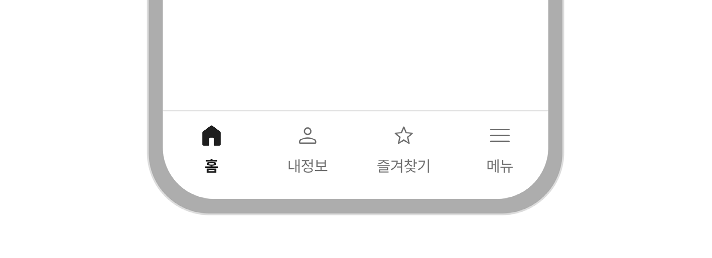
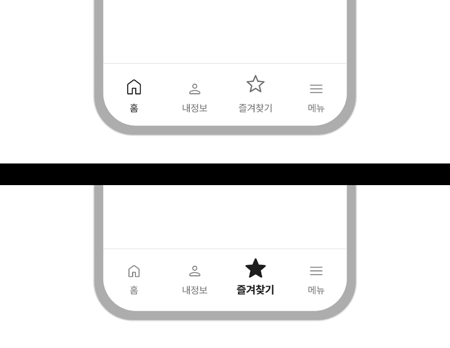
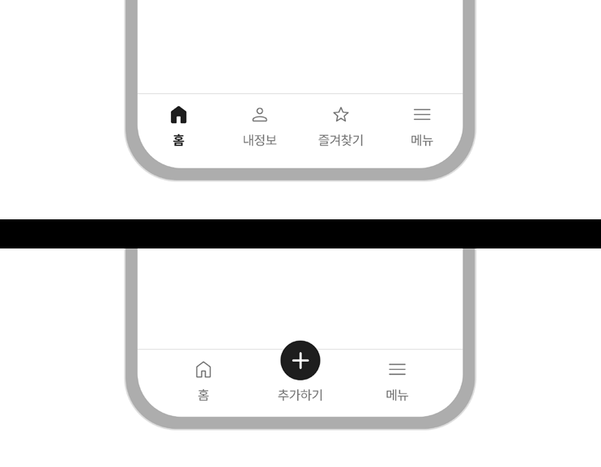
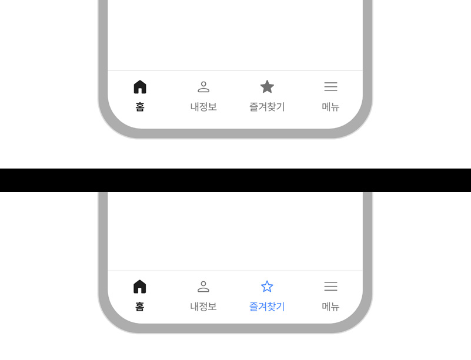
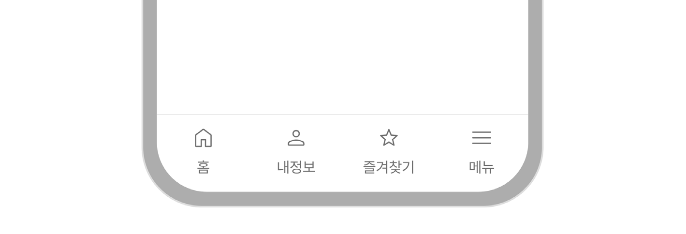
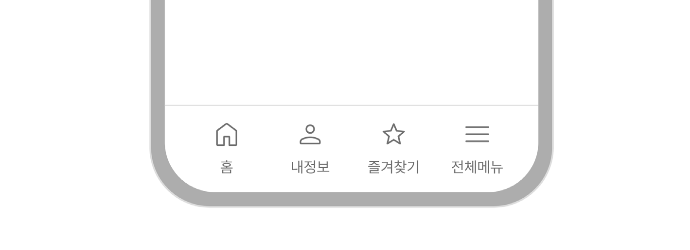
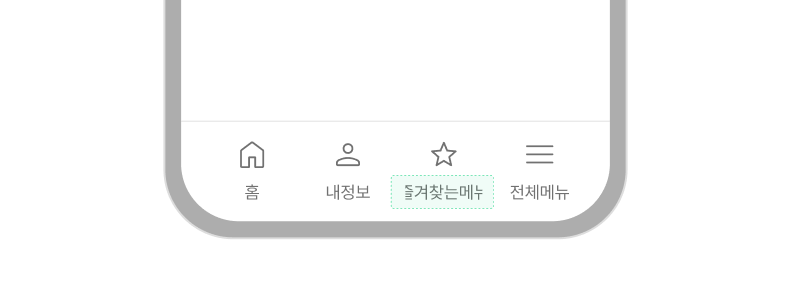
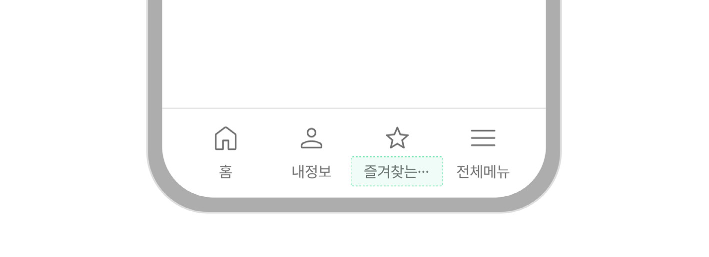
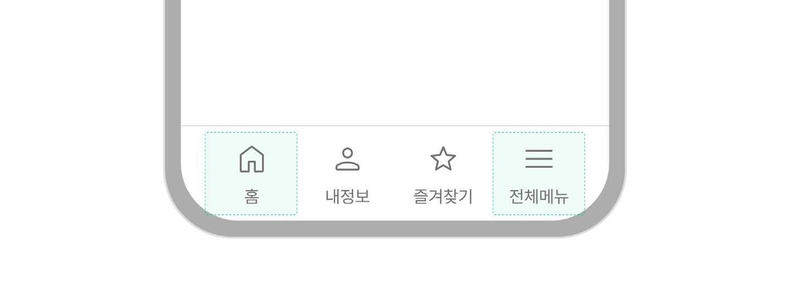
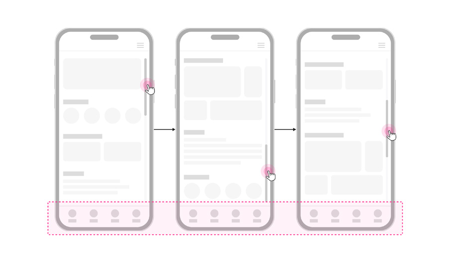

탭바는 화면 하단에 고정하여 제공하는 탐색 수단으로 작은 디바이스나 좁은 화면에서 서비스의 핵심 화면으로 빠르게 접근할 수 있도록 도와준다.

## 용례

### 사용하기 적합한 경우

- 화면 너비가 좁은 경우

모바일, 태블릿과 같이 콘텐츠를 표시할 영역이 좁은 경우 탭바를 사용하여 주요 화면과 연결되는 직관적인 내비게이션을 제공할 수 있다.

- 적은 수의 상위 수준 화면에 빠르게 접근할 필요가 있는 경우

모바일 디바이스는 한 손에 디바이스를 쥐었을 때 엄지 손가락이 도달할 수 있는 범위가 한정되어 있으므로 하단에 고정된 탭바를 사용하면 보다 효율적으로 서비스의 정보 구조를 탐색할 수 있다.
### 사용하기 적합하지 않은 경우

- 화면 너비가 충분한 경우

메인 메뉴를 사용한다.
## 사용성 가이드라인

- 01 탭 메뉴의 크기를 동일하게 유지한다.
- 02 선택된 메뉴 상태를 명확하게 표현한다.
- 03 모든 탭 버튼을 일관성있게 표현한다.
- 04 탭 메뉴의 개수를 5개 이내로 제한한다.
- 05 아이콘과 레이블을 함께 사용한다.
- 06 레이블 텍스트를 간결하게 작성하여 잘리지 않도록 한다.
- 07 탭바에 홈 버튼, 전체 버튼이 사용되는 경우 각각 가장 왼쪽, 가장 오른쪽 항목으로 배치한다.
- 08 탭바는 화면 하단에 위치를 고정하여 제공하며, 스크롤 동작 시 숨겨지지 않도록 한다.
### 01. 탭 메뉴의 크기를 동일하게 유지한다.

탭 바 내의 모든 메뉴는 동일한 너비와 높이를 가져야 한다. 이를 통해 사용자가 메뉴 간의 차이를 혼란 없이 인식하여 빠르고 쉽게 탭 메뉴를 선택할 수 있으며, 시각적으로 일관된 탐색 경험을 통해 사용자 경험이 향상된다.

[모범 사례]

[피해야 할 사례]

### 02. 선택된 메뉴 상태를 명확하게 표현한다.

아이콘의 형태나 별도 인디케이터를 사용하여 선택된 메뉴의 상태를 명확하게 구분해야 한다. 선택되지 않은 탭 메뉴의 아이콘은 라인 형식으로 표시하고, 선택된 탭 메뉴는 글리프 형식의 채워진 상태로 표현하여 시각적인 차이를 제공한다. 선택된 메뉴에 인디케이터를 제공하는 표현 방식도 활용할 수 있으며, 두 가지 방법을 사용하면 사용자에게 보다 명확하게 상태 정보를 전달할 수 있다.

[모범 사례]

[피해야 할 사례]

### 03. 모든 탭 버튼을 일관성있게 표현한다.

특정 버튼이 선택되지 않은 상태임에도 불구하고 아이콘이나 레이블 색상을 다른 버튼과는 다른 색으로 표현하게 되면 사용자에게 혼동을 줄 수 있다. 서비스 특성상 특정 버튼을 강조해야 할 필요가 있다면 해당 버튼의 아이콘 크기와 표현 방식을 다른 버튼과 명확하게 구분해야 한다. 그러나 강조된 버튼은 사용자의 주의를 끌어 다른 메뉴를 탐색하거나 조작하는 데 방해가 될 수 있으므로 사용을 지양하며, 불가피하게 사용하는 경우에도 일시적으로만 사용하는 것이 바람직하다.

[모범 사례]

[피해야 할 사례]

### 04. 탭 메뉴의 개수를 5개 이내로 제한한다.

탭 메뉴는 5개 이내로 제한하여 탐색의 효율성을 높인다. 5개 이상의 메뉴가 있으면 화면이 복잡해지며, 각 탭의 선택 영역이 줄어들어 사용자가 터치하기 어려워질 수 있다. 만약 더 많은 항목이 필요한 경우, 전체 메뉴나 더 보기 메뉴와 같은 부가적인 탐색 수단을 제공하고 탭바는 직관적이고 간결한 탐색이 가능하도록 구성해야 한다.

[모범 사례]

[피해야 할 사례]

### 05. 아이콘과 레이블을 함께 사용한다.

각 탭에는 아이콘과 레이블을 함께 제공하여 의미를 명확하게 전달해야 한다. 아이콘만 사용할 경우 의미가 모호할 수 있고, 레이블만 사용할 경우 시각적 주목도가 떨어질 수 있다. 따라서 두 정보 표현 방식의 문제점을 상호 보완하고 사용자에게 정확한 정보를 제공하기 위해, 레이블을 제공하고 레이블의 의미를 이해하는 데 도움을 줄 수 있는 간결한 아이콘을 제공한다.

[모범 사례]

[피해야 할 사례]

### 06. 레이블 텍스트를 간결하게 작성하여 잘리지 않도록 한다.

레이블 텍스트는 짧고 간결하게 작성해야 하며, 화면에서 잘리거나 말줄임표가 표시되지 않도록 한다. 각 레이블은 1~2 단어로 작성하되, 메뉴의 기능을 명확히 설명할 수 있어야 한다. 다양한 화면 크기와 해상도에서도 테스트를 거쳐 문제없이 표시되도록 하고, 다국어 지원 시 번역된 레이블도 잘리거나 축약되지 않도록 한다.

- [피해야 할 사례 1]

- [피해야 할 사례 2]

### 07. 탭바에 홈 버튼, 전체 버튼이 사용되는 경우 각각 가장 왼쪽, 가장 오른쪽 항목으로 배치한다.

모든 디지털 정부서비스에서의 일관성 있는 탐색 제공을 위해 주요 탭 버튼은 항상 일관된 순서로 제공한다. 탭바 버튼 목록에 홈 버튼이 있다면 가장 왼쪽에 첫 번째 버튼으로 배치한다. 전체 메뉴를 포함하여 탭바에 표시되지 않은 더 많은 메뉴를 확인하는 데 사용되는 버튼은 가장 오른쪽에 마지막 버튼으로 배치한다.

[모범 사례]

[피해야 할 사례]

### 08. 탭바는 화면 하단에 위치를 고정하여 제공하며, 스크롤 동작 시 숨겨지지 않도록 한다.

탭바의 이용 목적과 탭바에 익숙하지 않은 사용자를 고려하여 탭바의 배치를 변경하거나 사용자의 행동에 반응하여 숨겨졌다 표시되지 않도록 한다. 정보 구조상 하위 수준에 속하는 뷰에 진입하였을 때 탭바가 제공되지 않는 것은 적절하며 이 항목을 준수하지 않는 것이 아니다.

[모범 사례]

## 접근성 가이드라인

### 탭바의 역할을 스크린 리더에서 인지할 수 있도록 한다.

웹에서는 탭바 컨테이너를 &lt;nav&gt;로 감싸거나 WAI-ARIA 영역을 role="navigation"으로 지정하여 스크린 리더에서 내비게이션 요소임을 인지할 수 있도록 제공해야 한다.

네이티브 애플리케이션은 각 운영체제에서 지원하는 내장 요소(예: iOS - Tab bars, Android - Navigation bar)를 사용하여 다른 요소와 역할이 구분되도록 한다.

- KWCAG 2.2 제목 제공
- WCAG 2.1 Info and Relationships

### 활성화된 메뉴 정보가 스크린 리더로 전달될 수 있도록 한다.

웹에서는 활성화된 메뉴 버튼에 aria-current=”page” 속성을 추가하여, 스크린 리더로 활성화된 메뉴 정보를 전달한다.

네이티브 애플리케이션의 경우, 각 운영체제에서 지원하는 내장 요소(예: iOS - Tab bars, Android Navigation bar)를 사용하면 별도의 설정 없이도 선택된 메뉴 정보가 스크린 리더로 전달된다.

- WCAG 2.1 Name, Role, Value (A)
- 01 구조화 목록
- 02 긴급 공지
- 03 달력
- 04 디스클로저
- 05 모달
- 06 배지
- 07 아코디언
- 08 이미지
- 09 캐러셀
- 10 탭
- 11 표
- 12 스플래시 스크린
- 13 텍스트 목록
