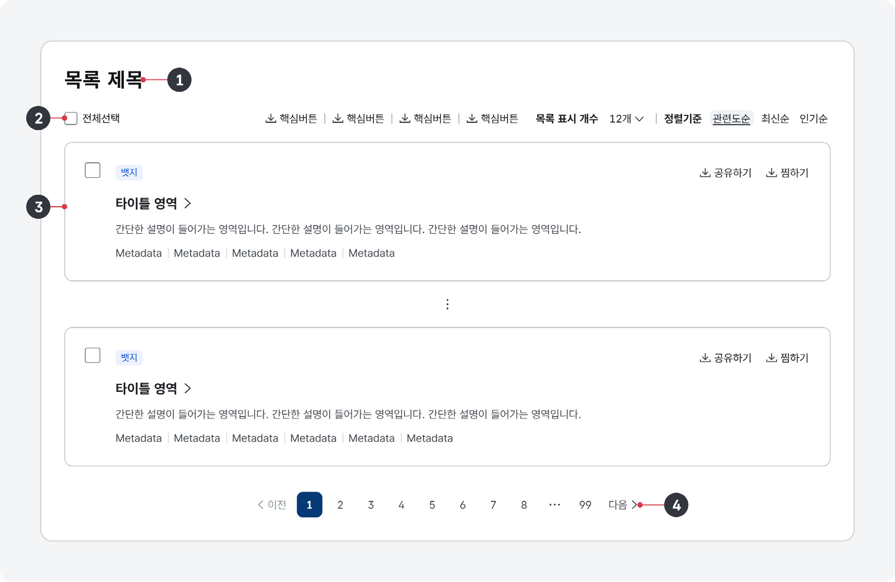

구조화 목록은 유사하거나 관련된 콘텐츠 집합을 표현하기 위한 형식으로 목록에 제공된 데이터에 대한 상세 정보 탐색 수단 또는 관련 기능 실행 수단으로 활용된다. 사용자가 콘텐츠를 효율적으로 탐색하고 다음 행동을 빠르게 결정할 수 있도록 목록 내 정보는 상세 페이지에서 제공되는 복잡한 콘텐츠 중 핵심적이거나 흥미를 끌 수 있는 정보를 논리적 흐름에 따라 조직화하여 명확한 위계 구조를 반영해 제공해야 한다.

## 구조

- 1 제목(선택): 구조화 목록에서 제공하는 정보의 카테고리로, 필요한 경우 부가적인 설명을 제공할 수 있음
- 2 도구 막대(선택): 목록 내 일부 또는 전체 항목에 대해 실행할 여러 가지 기능을 제공하는 영역으로 대개 구조화 목록의 상단에 배치함

- 검색
- 필터
- 정렬
- 더보기 링크
- 액션 버튼

- 3 항목: 정보를 식별하기 위한 콘텐츠 집합으로 개별 항목에 대해 실행할 기능 관련 버튼, 상세 정보를 확인할 수 있는 탐색 링크가 포함될 수 있음

- 항목 선택 체크박스
- 미리보기 이미지
- 콘텐츠
- CTA
- 액션 버튼
- 항목 구분자
- 4 페이지네이션(선택): 구조화 목록을 탐색하기 위한 기능 버튼 및 관련 정보를 제공하는 영역으로 대개 구조화 목록 하단에 배치함

- 인디케이터
- 페이징
- 이동 버튼

## 사용성 가이드라인

- 01 도구 막대를 구성하는 사용자 인터페이스는 모든 화면에서 일관된 위치에 동일한 순서로 배치한다.
- 02 콜투액션(CalltoAction)은 항목과 관련된 가장 중요한 행동을 유도하기 위해 사용한다.
- 03 사용자가 필요로 하는 기능과 행동 버튼을 제공한다.
- 04 항목의 콘텐츠에는 모든 정보를 일관된 분류 체계와 순서로 제공한다.
### 01. 도구 막대를 구성하는 사용자 인터페이스는 모든 화면에서 일관된 위치에 동일한 순서로 배치한다.

구조화 목록의 유형이나 콘텐츠 특성에 따라 툴바에서 제공되는 상세 사용자 인터페이스의 구성은 달라질 수 있다. 그러나 이 경우에도 유사한 기능을 가진 요소를 일관된 위치에 배치하여 사용자가 별도의 학습 없이 기능을 사용할 수 있도록 해야 한다.

### 02. 콜투액션(Call to Action)은 항목과 관련된 가장 중요한 행동을 유도하기 위해 사용한다.

구조화 목록에서 전달하고자 하는 정보의 특성 및 사용자의 방문 목적을 고려하여 가장 중요한 행동을 콜투액션 버튼(최상위 수준의 강조 버튼)으로 표현해야 한다.
### 03. 사용자가 필요로 하는 기능과 행동 버튼을 제공한다.

구조화 목록에는 사용자가 필요로 하거나 가장 빈번하게 사용하는 기능과 관련된 다양한 행동 버튼을 제공함으로써 상세 화면으로 이동하거나 상세 정보 영역을 확장하지 않더라도 빠르게 목적을 달성할 수 있도록 도와준다.

### 04. 항목의 콘텐츠에는 모든 정보를 일관된 분류 체계와 순서로 제공한다.

항목을 구성하는 모든 정보를 일관된 분류 체계와 순서로 제공해야 한다. 만약 구조화 목록을 구성하는 항목별로 원자료의 정보 수준이 달라 정보가 비어있거나 생략되면 사용자는 혼동을 느낄 수 있으므로 해당 카테고리 정보가 제공되어야 하는 위치에 대시(-)를 플레이스홀더로 제공한다.

## 접근성 가이드라인

### 01. 구조화 목록에서 제공되는 모든 기능을 키보드로 실행할 수 있도록 한다.

구조화 목록에서 제공되는 모든 기능은 마우스뿐만 아니라 키보드, 터치 인터페이스로 실행할 수 있어야 한다.

- KWCAG 2.2 키보드 사용 보장
- WCAG 2.1 Keyboard (A)

### 02. 구조화 목록에서 제공되는 모든 기능에 키보드 초점이 명확하게 표시되도록 한다.

구조화 목록에서 제공되는 모든 사용자 인터페이스(버튼, 링크)는 초점을 받은 상태가 시각적으로 명확하게 구분되어야 한다.

- KWCAG 2.2 초점 이동과 표시
- WCAG 2.1 Focus Visible (AA)

### 03. 구조화 목록에서 제공되는 모든 기능은 사용자가 예측 가능한 방식으로 작동해야 한다.

만약 새로운 브라우저 창을 실행하는 링크나 외부 애플리케이션을 실행하는 버튼이 있다면 부가적인 설명을 제공하여 스크린 리더 사용자가 기능의 실행 결과를 예측할 수 있어야 한다. 구조화 목록을 정렬하거나 조회하는 기능이 있다면 해당 기능 실행 후, 키보드 초점은 정렬/조회 UI에 유지되어야 한다.

- KWCAG 2.2 사용자 요구에 따른 실행

## 상호작용 가이드라인

### 탐색

### 기능 실행 또는 이동

| 구분 | 설명 |
|---|---|
| Tab, Shift + Tab | 구조화 목록 내 다음 인터페이스 요소를 순차적으로 탐색한다. |

| 구분 | 설명 |
|---|---|
| Click | 구조화 목록 내 액션 버튼의 기능이 실행되거나 링크 목적지로 이동한다. |
| Enter | 구조화 목록 내 액션 버튼의 기능이 실행되거나 링크 목적지로 이동한다. |
