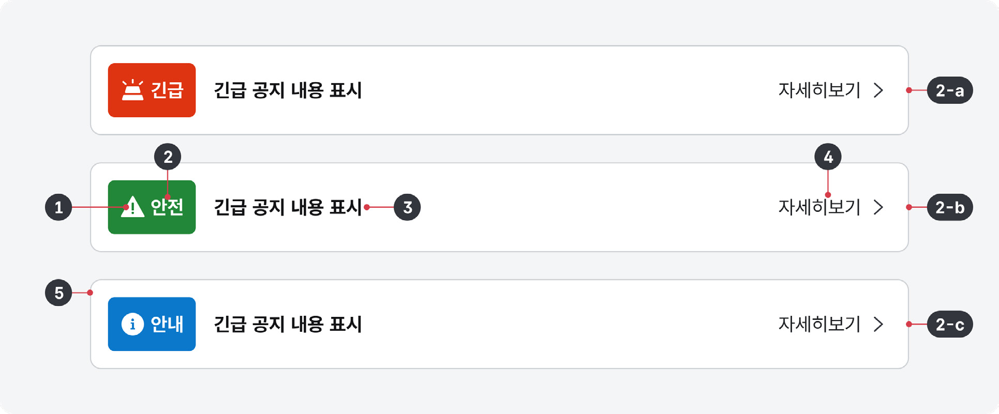

긴급 공지는 본문 상단에 강조되어 표시되는 배너로 사용자에게 긴급하거나 중요한 정보를 전달하는 데 사용된다. 모든 공공 디지털 서비스에서 동일한 긴급 공지 컴포넌트를 사용함으로써 사용자는 긴급한 정보를 일관되고 예측 가능한 방식으로 찾고 이해할 수 있다.

## 용례

### 사용하기 적합한 경우

- 중요하고 시의성 있는 정보를 전달해야 할 경우

구조의 레이블 유형을 참고하여 사용자에 중요하게 전달해야 할 필요가 있는 정보 전달에 긴급 공지를 사용해야 한다.

### 사용하기 적합하지 않은 경우

- 홍보 목적의 콘텐츠를 전달하고자 하는 경우
- 일반적인 공지 콘텐츠를 전달하거나 강조하는 경우

본문에 구조화 목록 컴포넌트를 사용하거나 히어로 영역을 적절하게 활용하는 것이 적합하다.

- 피드백 메시지를 제공하는 경우

입력폼에 대한 유효성 검사 결과, 완료 상태 등 사용자에게 피드백을 제공하기 위한 용도로 사용해서는 안 된다.
## 구조

- 1 아이콘: 공지 유형을 구분하며 긴급한 정도에 대한 맥락을 파악하는 데 도움 되는 아이콘
- 2 레이블: 공지 유형을 구분하는 텍스트로 긴급한 정도는 다음 세 가지 상태를 가짐

- a. 긴급도 상 국가적으로 재난 재해에 대응하거나 복구가 필요한 상황, 예고되지 않은 급작스러운 서비스 장애/ 이용 중단 상황에 대해 알림 예) 태풍, 홍수, 감염병, 전산사고, 사이버테러 등
- b. 긴급도 중 온/오프라인 서비스 이용 중단에 대한 사전 예고를 알림
- c. 긴급도 하 서비스 이용에 중대한 영향을 미치지는 않으나 대부분의 사용자가 인지해야 하는 상황을 알림

- 3 텍스트: 공지 내용을 전달하기 위한 간략한 문구
- 4 링크(선택): 긴급 공지와 관련된 상세 정보를 확인할 수 있는 서비스/화면 링크
- 5 컨테이너: 긴급 공지 배너가 제공되는 영역

## 사용성 가이드라인

- 01 시급하고 사용자에게 중요한 정보를 전달하는 데 긴급 공지를 사용한다.
- 02 일시적으로 게시하고 정보가 필요한 기간 동안만 유지한다.
- 03 눈에 잘 띄게 표현하고 배치한다.
- 04 긴급 공지 배너 숨기기 버튼을 제공하지 않는다.
- 05 공지 내용은 이해하기 쉽고 간결하게 작성한다.
- 06 여러 개의 긴급 공지를 사용하지 않는다.
- 07 관련 화면으로 이동하기 위한 링크를 여러 개 사용하지 않는다.
### 01. 시급하고 사용자에게 중요한 정보를 전달하는 데 긴급 공지를 사용한다.

긴급 공지는 메인 메뉴와 히어로 영역 사이에 배치되어 사용자의 주의를 끌도록 표현하기 때문에 사용자가 서비스의 핵심 과업을 수행하거나 중요 정보에 접근하는 과정을 방해한다. 따라서 필요한 경우에만 사용해야 하며 공지 유형에 따른 적절한 강조 수준으로 표현해야 한다.

### 02. 일시적으로 게시하고 정보가 필요한 기간 동안만 유지한다.

긴급 공지는 공지 내용과 관련된 기간 동안만 일시적으로 사용해야 한다. 긴급 공지 배너가 항상 표시되어 있고 최신화되지 않은 콘텐츠가 제공되면 실제로 긴급한 상황이 발생했을 때 사용자가 긴급 공지에 주의를 기울이지 않을 수 있다.

### 03. 눈에 잘 띄게 표현하고 배치한다.

서비스에 접속하자마자 사용자가 가장 먼저 볼 수 있도록 본문 콘텐츠의 가장 첫 요소로 배치하며 컨테이너가 화면의 전체 너비를 차지하도록 표현한다.
### 04. 긴급 공지 배너 숨기기 버튼을 제공하지 않는다.

한 번 배너를 숨기고 나면 화면을 새로 고침하거나 방문 기록을 초기화하기 전까지 사용자는 긴급 공지 내용을 확인할 수 없다. 긴급 공지는 사용자가 반드시 알아야 하는 정보를 강조하기 위해 사용하는 컴포넌트이므로 배너를 숨기거나 일시적으로 접어두는 기능을 제공해서는 안 된다.

### 05. 공지 내용은 이해하기 쉽고 간결하게 작성한다.

공지 내용은 이해하기 쉬운 언어를 사용하고 명확하게 이해할 수 있도록 작성한다. 문장은 1줄 이내로 작성하여 사용자의 인지적 부하를 최소화해야 한다. 만약 화면 너비가 충분하지 않다면 2줄까지 사용할 수 있다. 필요한 경우 관련 서비스/화면 링크를 사용하여 사용자가 상세 화면에서 정보를 확인할 수 있도록 구성한다.

### 06. 여러 개의 긴급 공지를 사용하지 않는다.

여러 개의 긴급 공지가 제공되면 상대적으로 더 중요한 정보에 집중하기 어려워진다. 또한 사용자에게 부담을 가중시켜 긴급 공지를 무시하게 될 수도 있다.
### 07. 관련 화면으로 이동하기 위한 링크를 여러 개 사용하지 않는다.

공지와 관련된 상세 화면으로 이동하기 위한 링크는 공지 내용과 직접적으로 관련된 화면으로 이동하는 1개의 링크만 사용해야 한다. 여러 개의 링크가 제공되면 긴급 공지 요소의 복잡도가 증가하여 내용에 집중하기 어려워진다.

### 플랫폼에 대한 고려 사항

화면 너비가 충분하지 않은 경우 텍스트는 2줄까지 표현할 수 있다.

긴급 공지는 화면 상단에 표시되므로 작은 모바일 화면에서 다른 콘텐츠의 가시성에 큰 영향을 미칠 수 있다. 화면 너비가 충분하지 않다면 텍스트가 최대 2줄까지 표시되도록 하고, 필요한 경우 관련 서비스/화면 링크를 사용하여 사용자가 상세 화면에서 정보를 확인할 수 있도록 구성한다.

## 접근성 가이드라인

### 01. 긴급 공지 섹션에 배너 역할을 제공한다.

긴급 공지 섹션에 role="banner"를 사용하여 배너 역할을 부여함으로써 스크린 리더 사용자가 섹션의 용도를 직관적이고 빠르게 탐색할 수 있도록 해야 한다.

- WCAG 2.1 Info and Relationships (A)

### 02. 아이콘에 대체 텍스트를 제공하지 않는다.

긴급 공지에는 아이콘 외에 레이블이 항상 표시되므로 스크린 리더 사용자에게 중복된 정보가 전달되지 않도록 아이콘 이미지에 대체 텍스트를 제공해서는 안 된다.

- KWCAG 2.2 적절한 대체 텍스트 제공
- WCAG 2.1 Non-text Content (A)

### 03. 목적지를 예측할 수 있는 링크 이름 또는 부가 설명을 제공한다.

'자세히 보기'라는 링크 레이블만으로는 링크에 연결된 목적지 정보를 예측하기 어려우므로 목적지의 웹 문서 제목(&lt;title&gt;)을 부가적인 설명으로 제공하는 것이 좋다.

- KWCAG 2.2 제목 제공
- WCAG 2.1 Link Purpose (In Context) (A)
