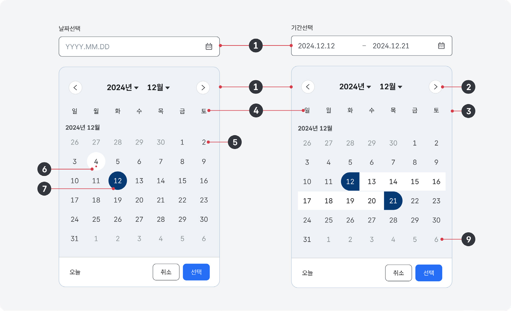
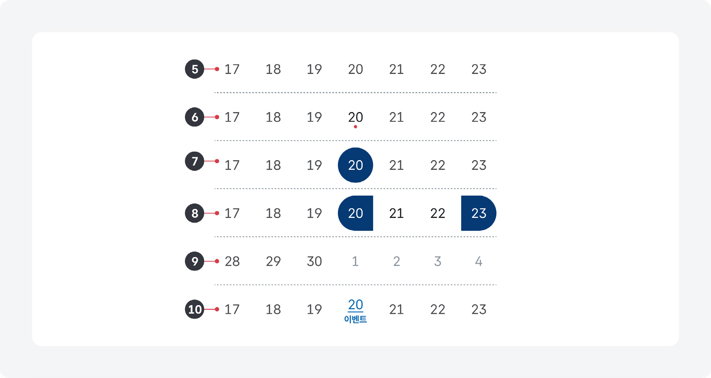
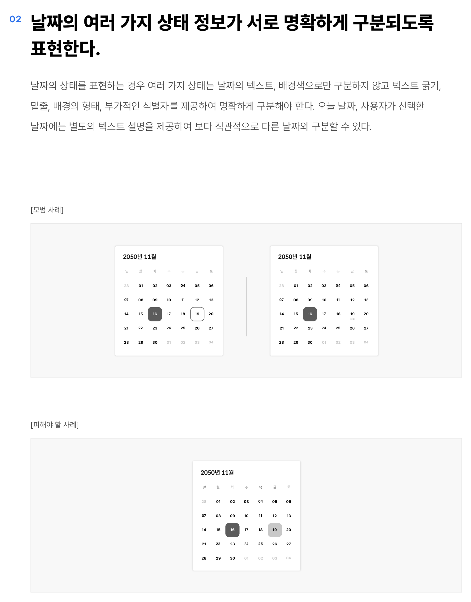
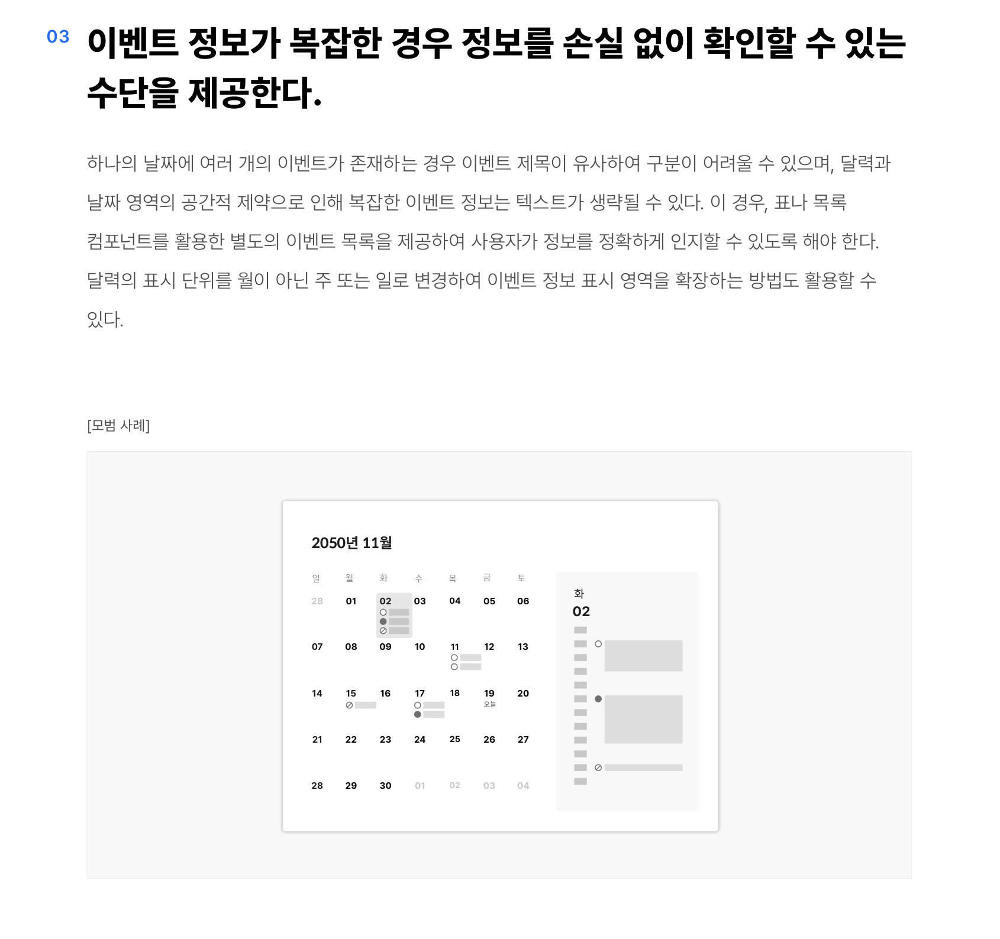

달력은 날짜와 관련된 정보와 기능을 제공하는 데 사용한다.

## 용례

### 사용하기 적합한 경우

- 날짜별로 신청 가능한 서비스가 정기적으로 제공되는 경우
- 사용자가 날짜를 입력하는 과정에서 여러 가지 날짜 정보를 비교하여 선택해야 하는 경우
- 사용자가 현재와 가까운 날짜 관련 정보를 확인하거나 선택해야 하는 경우

사용하기 적합하지 않은 경우

- 정기적으로 업데이트되는 정보가 아니거나 한 달에 2개 이하의 이벤트만 있는 경우
## 구조

- 1 연/월: 달력의 연도, 월 정보 달력 유형에 따라 연도나 월을 선택하기 위한 컨트롤이 제공될 수 있음
- 2 연/월 탐색 버튼: 이전 또는 다음 연도, 월을 탐색하기 위한 버튼
- 3 달력 그리드: 요일과 여러 상태의 날짜 정보를 표시하는 시각적인 그리드
- 4 요일: 한 주의 요일 정보로 시작 요일은 주사용자의 지역/언어에 따라 달라질 수 있음
- 5 날짜: 가장 기본적인 상태의 날짜 정보로 버튼으로 사용될 수 있음
- 6 오늘 날짜: 현재 날짜로 다른 상태의 날짜와 구분하기 위한 별도의 식별자와 함께 사용됨
- 7 선택된 날짜(선택): 사용자가 선택한 날짜로 다른 상태의 날짜와 구분하기 위한 별도의 식별자와 함께 사용됨
- 8 선택할 수 없는 날짜(선택): 사용자가 선택할 수 없는 날짜
- 9 활성화되지 않은 날짜(선택): 이전 달 또는 다음 달에 속한 날짜로 사용자가 선택할 수 있음
- 10 이벤트(선택): 날짜와 관련하여 사용자에게 안내하고자 하는 데이터로 텍스트, 식별자, 텍스트와 식별자가 조합된 형태로 사용할 수 있음

## 사용성 가이드라인

- 01 날짜의 여러 가지 상태, 정보의 범례는 일관성 있게 표현한다.
- 02 날짜의 여러 가지 상태 정보가 서로 명확하게 구분되도록 표현한다.
- 03 이벤트 정보가 복잡한 경우 정보를 손실 없이 확인할 수 있는 수단을 제공한다.
- 04 달력 그리드에 헤딩(요일) 정보를 반드시 제공한다.

### 날짜의 여러 가지 상태, 정보의 범례는 일관성 있게 표현한다.

달력이 여러 개의 섹션이나 화면에 반복적으로 사용될 경우 날짜의 여러 가지 상태 정보(오늘 날짜, 선택된 날짜, 활성화되지 않은 날짜, 선택할 수 없는 날짜), 날짜에 표현된 정보의 범례(예 - 휴관일, 공휴일 등)를 시각적, 구조적으로 일관성 있게 표현하여 사용자가 학습 없이 효율적으로 콘텐츠를 확인할 수 있도록 해야 한다.

### 날짜의 여러 가지 상태 정보가 서로 명확하게 구분되도록 표현한다.

날짜의 상태를 표현하는 경우 여러 가지 상태는 날짜의 텍스트, 배경색으로만 구분하지 않고 텍스트 굵기, 밑줄, 배경의 형태, 부가적인 식별자를 제공하여 명확하게 구분해야 한다. 오늘 날짜, 사용자가 선택한 날짜에는 별도의 텍스트 설명을 제공하여 보다 직관적으로 다른 날짜와 구분할 수 있다.

[모범 사례]

도식 라벨: 2050년 11월 2050년 11월

[피해야 할 사례]

도식 라벨: 2050년 11월

### 이벤트 정보가 복잡한 경우 정보를 손실 없이 확인할 수 있는 수단을 제공한다.

하나의 날짜에 여러 개의 이벤트가 존재하는 경우 이벤트 제목이 유사하여 구분이 어려울 수 있으며, 달력과 날짜 영역의 공간적 제약으로 인해 복잡한 이벤트 정보는 텍스트가 생략될 수 있다. 이 경우, 표나 목록 컴포넌트를 활용한 별도의 이벤트 목록을 제공하여 사용자가 정보를 정확하게 인지할 수 있도록 해야 한다. 달력의 표시 단위를 월이 아닌 주 또는 일로 변경하여 이벤트 정보 표시 영역을 확장하는 방법도 활용할 수 있다.

[모범 사례]

도식 라벨: 2050년 11월

### 달력 그리드에 헤딩(요일) 정보를 반드시 제공한다.

달력에 헤딩 없이 날짜 정보만 제공하게 되면 콘텐츠가 날짜임을 직관적으로 이해하기 어려우며, 한 주의 시작 요일을 명확하게 인지하기 어렵다.
## 접근성 가이드라인

### 01. 날짜 및 관련 정보의 의미를 색상으로만 구분하지 않는다.

여러 가지 날짜 및 관련 정보에 대한 의미를 색상 이외의 수단으로 구분할 수 있는 시각적 단서를 제공해야 한다. 밑줄 제공, 1px 이상의 테두리 차이, 식별자 제공 등의 방법으로 크기나 형태 차원에서 정보를 구분하는 방법을 사용할 수 있다.

- KWCAG 2.2 색에 무관한 콘텐츠 인식
- WCAG 2.1 Use of Color (A)

### 02. 날짜 및 관련 정보의 의미를 스크린 리더에서 확인할 수 있도록 한다.

시각적으로 표현된 날짜 관련 여러 가지 상태 정보(오늘 날짜, 선택된 날짜, 활성화되지 않은 날짜, 선택할 수 없는 날짜), 날짜에 표현된 정보의 범례(예 - 일정 있음, 휴관일, 공휴일 등)에 대한 대체 텍스트를 제공해야 한다.

- KWCAG 2.2 적절한 대체 텍스트 제공
- WCAG 2.1 Non-text Content (A)

### 03. 달력에서 제공되는 모든 기능을 키보드로 실행할 수 있도록 한다.

달력에서 제공되는 모든 기능은 마우스뿐만 아니라 키보드, 터치 인터페이스로 실행할 수 있어야 한다.

- KWCAG 2.2 키보드 사용 보장
- WCAG 2.1 Keyboard (A)
### 04. 달력에서 제공되는 모든 기능에 키보드 초점이 명확하게 표시되도록 한다.

달력에서 제공되는 모든 사용자 인터페이스(버튼, 링크)는 초점을 받은 상태가 시각적으로 명확하게 구분되어야 한다.

- KWCAG 2.2 초점 이동과 표시
- WCAG 2.1 Focus Visible (AA)

## 상호작용 가이드라인

### 날짜 링크 탐색

### 기능 실행 또는 이동

| 구분 | 설명 |
|---|---|
| Tab, Shift + Tab | 달력 내 인터페이스 요소를 순차적으로 탐색한다. |

| 구분 | 설명 |
|---|---|
| Click | 달력 내 액션 버튼의 기능이 실행되거나 링크 목적지로 이동한다. |
| Enter | 달력 내 액션 버튼의 기능이 실행되거나 링크 목적지로 이동한다. |
