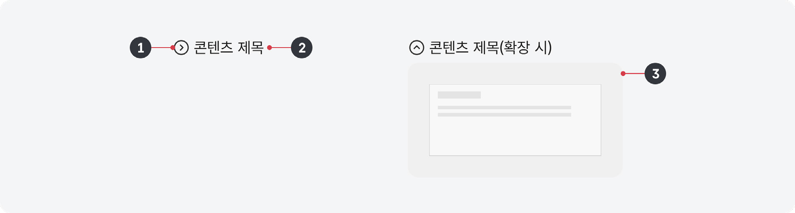
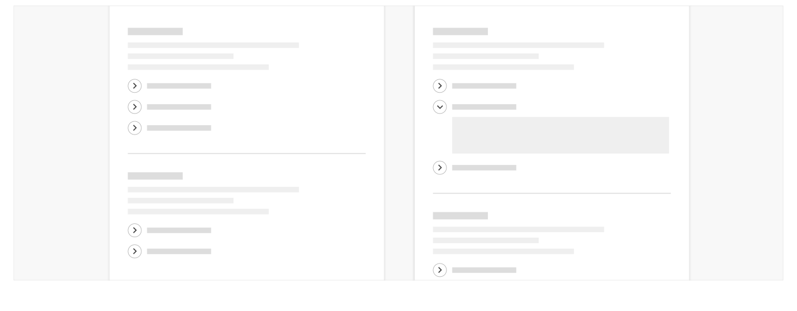

디스클로저는 특정한 정보/컨트롤/섹션에 관련된 부가적인 정보를 표시하거나 숨기는 데 사용되는 요소이다. 디스클로저 하위 콘텐츠 섹션은 기본으로 축소된 상태로 제공되며 사용자가 요청하는 경우에 확장되어 자세한 정보가 표시된다. 이는 사용자의 인지적 부담을 감소시키고 정보를 빠르게 훑어보는 데 도움이 된다.

## 용례

### 사용하기 적합한 경우

- 화면이 여러 개의 콘텐츠 섹션으로 구성된 경우

화면이 단일 섹션으로 구성된 경우 사용자가 여러 섹션을 비교·탐색하는 인지적 부담이 적으므로 부가적인 상호작용을 통해 콘텐츠를 표시하는 것보다 기본으로 보여주는 것이 적절하다.

- 부가적인 정보를 제공하고자 하는 경우

디스클로저는 탭이나 아코디언보다 시각적으로 눈에 덜 띄며 콘텐츠를 표시하기 위한 상호작용이 필요하므로 부가적인 정보를 제공하는 데 사용하는 것이 적합하다.

예) 부가적인 안내 콘텐츠, 시각적으로 표시되는 이미지 대체 텍스트
### 사용하기 적합하지 않은 경우

- 화면이 단일 콘텐츠 섹션으로 구성된 경우

화면이 단일 섹션으로 구성된 경우 부가적인 상호작용을 통해 콘텐츠를 표시하는 것보다 기본으로 정보를 보여주는 것이 적절하다.

- 오류 메시지나 중요한 정보를 전달해야 하는 경우

디스클로저 내부에 정보가 제공되고 있음을 발견하지 못할 수 있으므로 사용자가 명확하게 인지할 수 있는 레이아웃을 사용해야 한다.

- 표의 셀 내부

표의 셀 내부는 콘텐츠를 표시할 수 있는 공간이 충분하지 않으며, 디스클로저로 인해 행의 높이가 유동적으로 변경되었을 경우 정보를 인지하기 어렵다.
## 구조

1 꺾쇠 아이콘: 콘텐츠 섹션의 확장/축소 상태를 나타냄 2 텍스트: 확장할 콘텐츠 섹션의 내용을 유추할 수 있는 제목 텍스트 3 컨테이너: 정보가 제공되는 콘텐츠 섹션으로 꺾쇠 아이콘이나 텍스트를 눌러 표시하거나 숨길 수 있음


## 사용성 가이드라인

- 01 기본적으로 축소된 상태로 제공한다.
- 02 디스클로저를 통해 제공하고자 하는 부가 정보와 관련된 정보/컨트롤/섹션 아래에 배치한다.
- 03 가능한 한 하나의 섹션에 하나의 디스클로저만 사용한다.
### 01. 기본적으로 축소된 상태로 제공한다.

디스클로저는 화면 내 정보를 훑어보는 과정에서 사용자의 인지적 부담을 덜어주기 위한 용도로 사용되므로 화면이 로딩되었을 때 펼쳐진 상태로 제공하는 것은 적절하지 않다.

### 02. 디스클로저를 통해 제공하고자 하는 부가 정보와 관련된 정보/컨트롤/섹션 아래에 배치한다.

사용자가 관련 정보와 디스클로저 컨트롤 및 섹션 간 관계를 인지할 수 있도록 부가적인 정보를 제공하고자 하는 요소 아래에 배치한다.
### 03. 가능한 한 하나의 섹션에 하나의 디스클로저만 사용한다.

여러 개의 디스클로저를 연속적으로 배치하게 되면 복잡성이 증가되어 오히려 사용자에게 혼동을 줄 수 있다.

[모범 사례]



**사례 텍스트 보완**

```text
피해야 할 사례
```
[피해야 할 사례]


**사례 텍스트 보완**

```text
원본 PDF의 UI 배치·상태·다이어그램을 보존한 시각 자료입니다.
```


## 접근성 가이드라인

### 01. 디스클로저를 버튼 역할로 제공한다.

디스클로저를 실행하였을 때 특정 섹션이나 화면으로 이동하는 것이 아니므로 &lt;button&gt;을 사용하거나 role="button"을 사용하여 스크린 리더에서 버튼 역할임을 인지할 수 있도록 한다.

- WCAG 2.1 Name, Role, Value (A)

### 02. 스크린 리더에서 확장/축소 상태 정보를 확인할 수 있도록 한다.

aria-expanded 속성이나 title 속성을 활용하여 디스클로저 섹션의 활성화 상태 정보가 스크린 리더에 탐지될 수 있도록 해야 한다.

- WCAG 2.1 Name, Role, Value (A)


## 상호작용 가이드라인

### 디스클로저 탐색

### 디스클로저 확장 및 축소

| 구분 | 설명 |
|---|---|
| Tab, Shift + Tab | 디스클로저 컨트롤에 초점이 진입하고 포커스링이 표시된다. |

| 구분 | 설명 |
|---|---|
| Click | 디스클로저를 Click 하여 펼치거나 접는다. |
| Enter, Space | 디스클로저 컨트롤이 초점을 가진 상태에서 Enter 또는 Space 키를 눌러 디스클로저를 펼치거나 접을 수 있다. |
