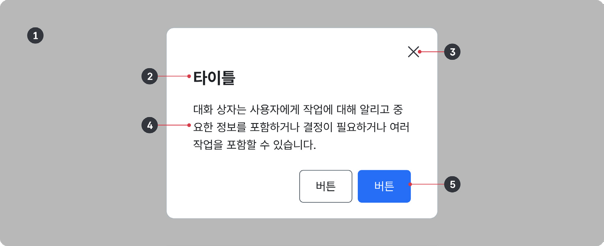
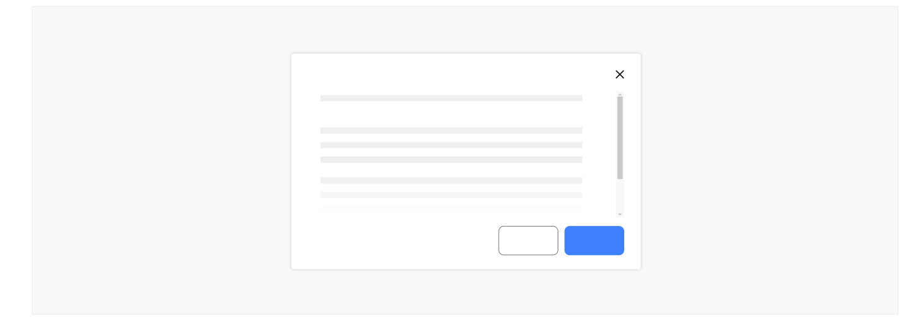
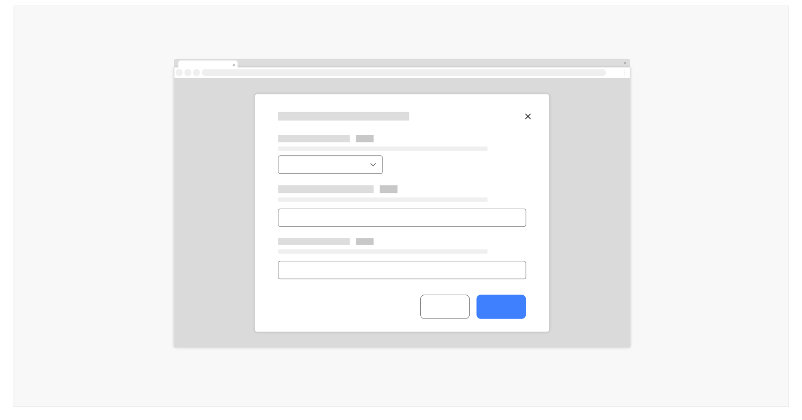

모달은 대화창의 한 종류로 기본 창에 종속된 요소이다. 기본 창과 겹쳐져 가장 상단에 표시되며, 이때 기본 창은 비활성 상태로 전환되어 상호작용이 불가능하므로 사용자는 모달에서의 단일한 과업 또는 메시지에 집중할 수 있다.

## 용례

### 사용하기 적합하지 않은 경우

모달을 사용하기 전에 사용자의 플로(Flow)에 최대한 방해가 되지 않는 다른 컴포넌트가 존재하지 않는지 다시 한 번 생각해야 한다. 모달은 최후의 수단이다.

- 다단계 프로세스와 같이 사용자의 플로(Flow)가 복잡한 경우

사용자가 기본 화면의 콘텐츠에서 벗어난 상태인 모달에서 다단계 프로세스, 복잡한 사용자 플로(Flow)가 진행되는 것을 피해야 한다. 이 경우에는 모달이 아닌 개별 화면에서 프로세스를 진행하는 것이 적합하다. 개별 화면에서는 사용자에게 안내를 제공하기 쉽고 플로(Flow)의 복잡성을 해소하기 위한 여러 가지 장치를 사용할 수 있다.

- 개별 입력 양식에 대한 오류, 성공, 경고 메시지를 제공할 때

개별 입력 양식에 대한 메시지(예 - 필수 입력 항목의 입력 누락, 비밀번호 입력 양식 오류 등)는 모달이 아니라 입력폼이 제공되는 화면의 각 요소에 인라인 텍스트 방식으로 제공되었을 때 인지하기 쉽다.
## 유형

### 프로세스를 중단하지 않고 사용자에게 설명, 정보를 제공할 때

프로세스나 과업에서 벗어나지 않고 사용자가 현재 진행 중인 과업에서 알아야 하는 정보를 전달한다. 모달에는 사용자가 선택하거나 입력해야 하는 항목에 대한 상세 정의, 설명 등 과업에 대해 더 잘 이해하거나 수행하는 데 도움이 되는 선택적인 정보가 제공된다. 일반적으로 이 유형의 모달에서는 모달을 닫는 것 외에 다른 행동을 사용자에게 요구하지 않는다.

### 사용자에게 긴급하거나 중요한 정보를 알릴 때

사용자에게 현재 진행 중인 과업과 관련하여 반드시 확인해야 할 중요한 정보를 전달한다. 시스템 오류나 사용자 행동의 결과를 알리기 위한 목적으로 자주 사용되며 별도의 컨트롤 요소를 통해 사용자가 모달을 실행하는 것이 아니라 화면이 로딩될 때, 다음 프로세스가 진행될 때 제공되는 경우가 많다. 닫기 버튼 및 닫기 버튼과 동일한 동작을 실행시키는 확인 버튼이 제공된다. 모달의 반복적인 출현으로 인한 사용자 플로(Flow)의 방해를 방지하기 위해 더 이상의 출현을 막는 옵션 버튼이 제공될 수 있다.

예) "접수가 완료되었습니다.", "시스템 작업으로 [서비스명] 서비스 제공이 중단됩니다."

### 사용자의 행동을 확인 또는 확정하고자 할 때

사용자가 기본 창에서의 주요 플로(Flow)에서 벗어나 완전히 주의를 기울인 상태에서 의사결정을 내려야 하는 작업에 사용되는 모달이다. 대개 사용자의 행동을 확인하거나 취소할 수 없는 행동, 기능의 실행 여부를 확인하고자 할 때 사용되므로 실행되는 기능, 결과, 위험성에 대한 설명이 반드시 포함되어야 한다. 기본 화면에서의 사용자 행동에 의해 모달이 실행되며 행동을 확정하기 위한 버튼, 취소하기 위한 버튼이 제공된다.

예) "작업이 저장되지 않았습니다. 계속 진행하시겠습니까?"
### 프로세스 진행 전에 사용자의 승인이 필요할 때

사용자가 모달에서 제공되는 정보를 확인하거나 응답하지 않고 다음 프로세스를 계속 진행하는 것을 방지하기 위한 수단으로 사용한다. 이 유형의 모달이 다른 유형의 모달과 구분되는 특징은 사용자가 모달의 액션 중 하나를 선택하지 않고는 모달을 닫거나 중단할 수 없다는 것이다. 따라서 모달에는 'X' 아이콘으로 표현되는 닫기 버튼은 제공되지 않으며, 모달에서 제시하는 정보를 수용하거나 거절하여 이전 상태 또는 다른 프로세스로 이동할 수 있는 액션 버튼이 제공된다.

예) "이 웹사이트를 사용함으로써 당신은 우리의 개인 정보 보호 정책에 동의하는 것입니다.", "세션 만료 시간이 다 되었습니다. 시간이 더 필요하신가요?", "65세 이상이신가요?"
## 구조

- 1 오버레이(Overlay): 모달과 하단의 기본 창을 시각적으로 구분하기 위한 그림자 또는 가림막
- 2 헤더: 모달의 상단 영역으로 모달에서 제공하는 콘텐츠나 요청하는 행동에 대한 간단한 요약 정보를 담은 제목, 설명을 제공함
- 3 닫기 버튼(선택): 사용자가 모달을 닫을 수 있게 하는 버튼 요소로 대개 'X' 아이콘으로 표현됨. 모달에서 데이터를 입력하여 제출하거나 행동을 확정해야 하는 경우, 닫기 버튼은 모달을 닫는 동시에 취소와 동일한 기능을 제공함
- 4 본문(선택): 정보와 다른 컴포넌트 요소가 제공되는 영역
- 5 푸터(선택): 모달의 하단 영역으로 취소, 확인, 삭제, 저장 등 과업을 완료하거나 중단하기 위한 주요 액션 버튼을 제공함. 본문에 입력폼을 제공하는 경우, 입력폼과 관련된 컨트롤은 본문 영역에 배치할 수 있으나 행동을 확정하거나 취소하는 액션은 항상 푸터에 제공해야 함


## 사용성 가이드라인

- 01 모달은 콘텐츠의 양을 고려하여 적절한 크기로 제공한다.
- 02 콘텐츠 영역에 스크롤이 필요한 경우 사용자가 스크롤 영역을 인지할 수 있도록 표현하고 푸터가 항상 표시되도록 한다.
- 03 헤더, 콘텐츠, 버튼 레이블은 명확한 내용으로 제공한다.
- 04 모달 내 상호작용을 최소화한다.
- 05 모달은 사용자의 행동을 통해 실행한다.
### 01. 모달은 콘텐츠의 양을 고려하여 적절한 크기로 제공한다.

모달의 콘텐츠가 짧은 메시지인 경우에는 모달의 너비를 최소화하여 문장 길이(Linelength)가 길어지는 것을 피해야 하고 콘텐츠가 상대적으로 복잡한 경우에는 전체 화면 너비를 차지하는 모달의 사용을 고려해야 한다.
### 02. 콘텐츠 영역에 스크롤이 필요한 경우 사용자가 스크롤 영역을 인지할 수 있도록 표현하고 푸터가 항상 표시되도록 한다.

모달 콘텐츠는 간결하고 모달에서의 상호작용은 최소로 제공해야 한다. 그러나 사용자별 디바이스 화면 크기 차이, 모달 유형 등에 따라 불가피하게 콘텐츠 영역에 세로 스크롤이 생성되는 경우 스크롤바를 제공하고 콘텐츠 영역 하단부에 흐림 효과를 적용하여 사용자가 스크롤 해야 함을 인지할 수 있는 단서를 제공해야 한다. 또한 액션 버튼이 스크롤 한 영역의 가장 아래에 배치될 경우 사용자에게 혼동을 줄 수 있으므로 액션 버튼이 제공되는 푸터는 모달 영역의 하단부에 항상 표시될 수 있도록 구현해야 한다.

[모범 사례]



**사례 텍스트 보완**

```text
원본 PDF의 UI 배치·상태·다이어그램을 보존한 시각 자료입니다.
```
### 03. 헤더, 콘텐츠, 버튼 레이블은 명확한 내용으로 제공한다.

헤더에서 제공되는 제목 및 설명은 모달의 제공 목적(실행되는 기능, 확인하고자 하는 정보 등)이 명확하게 드러나야 한다. 본문에는 현재 플로(Flow)나 과업과 상관없는 내용을 포함하지 않아야 한다. 버튼 레이블은 버튼을 통해 실행하고자 하는 기능, 확정하고자 하는 행동을 반영해야 한다.
### 04. 모달 내 상호작용을 최소화한다.

모달 내부에 액션 버튼 외에 상호작용이 필요한 다른 컴포넌트를 사용하는 것을 피해야 한다. 탭, 아코디언, 입력폼 같은 컴포넌트가 모달 내부에 제공될 경우 사용자는 모달과 상호작용 중인 맥락을 잊어버리기 쉽고, 사용자의 이용 환경에 따라 화면 크기가 줄어드는 경우 상호작용이 어렵다.

[피해야 할 사례]



**사례 텍스트 보완**

```text
원본 PDF의 UI 배치·상태·다이어그램을 보존한 시각 자료입니다.
```
### 05. 모달은 사용자의 행동을 통해 실행한다.

일부 예외를 제외하고 사용자가 의도하지 않은 모달을 자동으로 실행해서는 안 된다. 팝업의 갑작스러운 출현은 사용자를 당황하게 하며, 특히 스크린 리더 사용자가 화면 탐색 맥락을 잃어버리는 원인이 되므로 사용자 행동의 결과로 모달 팝업이 실행되어야 한다. 다만, 사용자에게 인증 세션 만료를 안내하거나 서비스의 메인 화면에서 사용자에게 긴급한 정보를 안내해야 하는 경우에는 자동으로 실행되는 모달을 사용할 수 있다.


## 접근성 가이드라인

### 01. 모달과 내부 요소의 초점 이동 순서를 논리적으로 제공한다.

모달 열기 버튼을 실행하여 창이 활성화되었을 때, 키보드 초점은 모달 자체 또는 모달 내에서 상호작용이 가능한 첫 번째 요소로 이동해야 하며, 모달을 닫거나 취소했을 때 초점은 모달 열기 버튼으로 이동해야 한다. 모달이 활성화된 상태에서 키보드 초점 및 스크린 리더의 가상 초점은 모달 내부에서만 이동해야 한다. 이러한 키보드 상호작용 구현을 통해 키보드 사용자 및 스크린 리더 사용자는 별도의 탐색 과정 없이 변화된 맥락에서 콘텐츠를 계속적으로 이용할 수 있다.

- KWCAG 2.2 초점 이동과 표시
- WCAG 2.1 Focus Order (A)
- WCAG 2.1 No Keyboard Trap (A)

### 02. 모달의 닫기 버튼은 모달의 가장 마지막 요소로 마크업한다.

'X' 아이콘으로 제공되는 모달의 닫기 버튼은 모달의 가장 마지막 요소로 마크업한다. 닫기 버튼이 모달의 헤더 바로 다음 또는 가장 첫 번째 요소로 제공될 경우 키보드 사용자는 본문의 콘텐츠 탐색 후 모달을 닫기 위해 콘텐츠를 역방향으로 탐색해야 하며 스크린 리더 사용자는 모달에 본문 콘텐츠가 있음을 인지하지 못할 수 있다.

- KWCAG 2.2 콘텐츠의 선형화
- WCAG 2.1 Meaningful Sequence (A)


## 상호작용 가이드라인

### 모달 열기/닫기

### 내부 콘텐츠 탐색

| 구분 | 설명 |
|---|---|
| Click | 모달 열기/닫기 동작, 액션 버튼의 기능을 실행한다. |
| Enter, Space | 모달 열기/닫기 동작, 액션 버튼의 기능을 실행한다. |
| Esc | 모달에 닫기 버튼이 제공되는 경우 닫기 동작을 실행한다. |

| 구분 | 설명 |
|---|---|
| Tab | 모달 내부의 다음 상호작용 요소로 초점이 이동한다. 모달의 가장 마지막 상호작용 가능 요소가 초점을 받은 상태라면 Tab 키를 눌렀을 때 모달의 가장 첫 번째 상호작용 가능 요소로 초점이 이동한다. |
| Shift + Tab | 모달 내부의 이전 상호작용 요소로 초점이 이동한다. 모달의 가장 첫 번째 상호작용 가능 요소가 초점을 받은 상태라면 Shift + Tab 키를 눌렀을 때 모달의 가장 마지막 상호작용 가능 요소로 초점이 이동한다. |
| 방향키 ↑, ↓ | 본문에 생성된 스크롤을 상/하로 이동할 수 있게 해준다. |
| Scroll | 본문에 생성된 스크롤을 상/하로 이동할 수 있게 해준다. |
| Esc | 모달에 닫기 버튼이 제공되는 경우 닫기 동작을 실행한다. |
