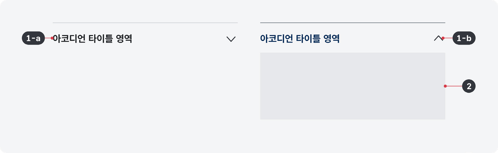
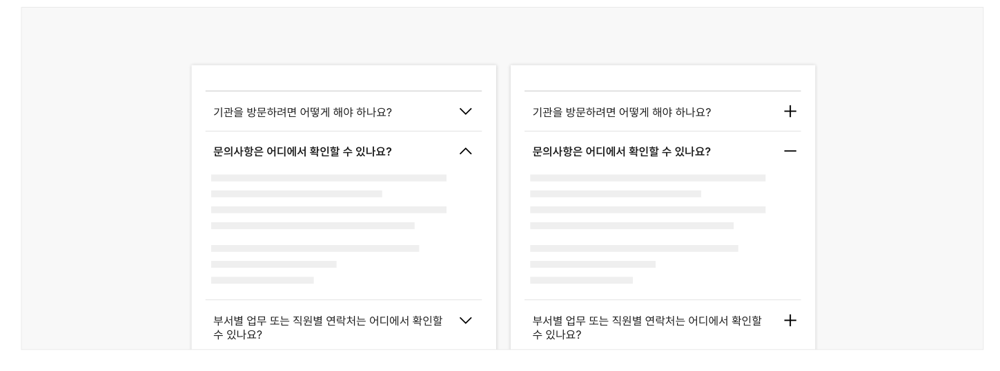
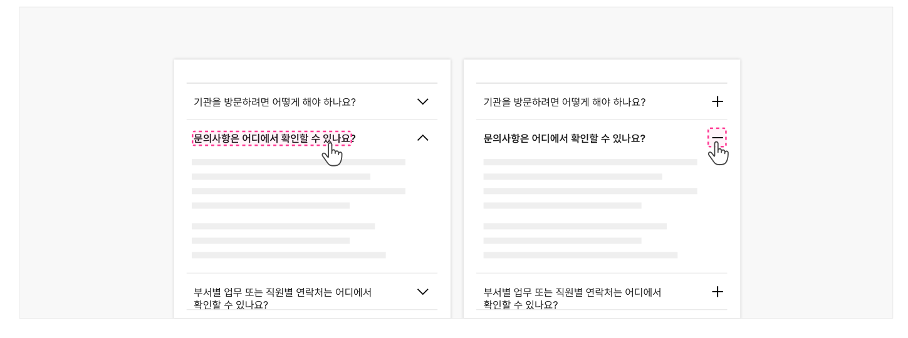
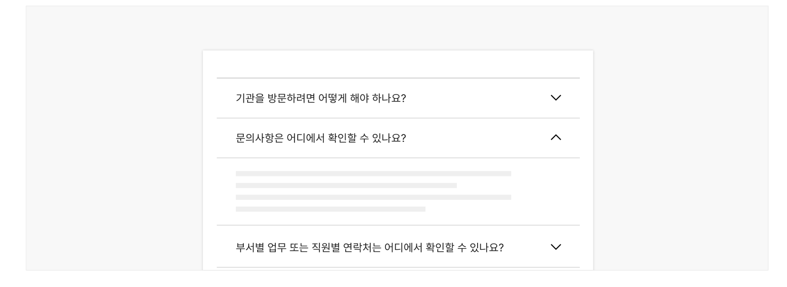
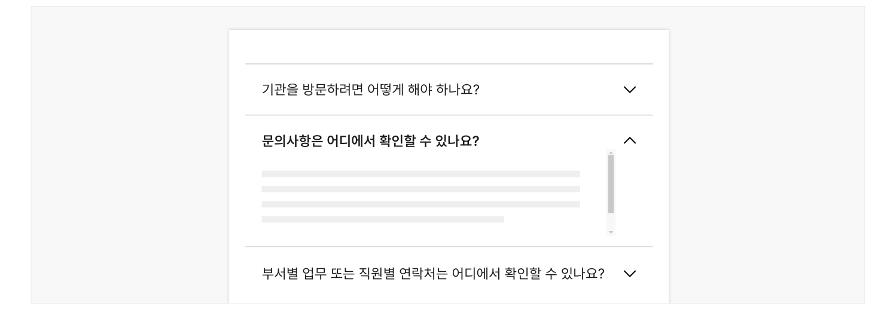

아코디언은 한 페이지에서 관련 있는 여러 콘텐츠 섹션을 확인할 수 있도록 하는 컴포넌트로 콘텐츠 섹션의 헤더 목록이 수직으로 쌓여 있는 형태로 표현된다. 일반적으로 헤더 목록은 컨트롤 요소로 활용되며 사용자는 필요에 따라 헤더를 선택하여 하위 콘텐츠 섹션을 표시하거나 숨길 수 있다.

## 용례

- 사용하기 적합한 경우
- 아코디언 컴포넌트는 콘텐츠가 숨겨진 형태이므로 사용자가 콘텐츠가 있음을 인지하지 못할 가능성이 있으며, 콘텐츠를 표시하기 위해 헤더를 클릭할 것인지에 대한 의사결정 과정이 필요하기 때문에 사용자의 인지적 부담을 증가시킨다. 그러므로 다음 중 하나에 해당하고 아코디언을 사용함으로써 사용자에게 도움이 된다는 뚜렷한 증거가 없는 경우에는 가급적 아코디언 컴포넌트를 사용하지 않아야 한다.

- 모바일 스크린, 사이드 패널과 같이 공간이 부족하여 긴 콘텐츠를 한 번에 보여주기 어려운 경우
- 사용자가 여러 콘텐츠 섹션 중 일부의 정보만 필요로 하는 경우
- 사용자가 여러 콘텐츠 섹션 전체를 다 읽어야 할 만큼 중요한 정보가 아니어서 화면의 스크롤을 줄이고자 하는 경우
- 사용자가 서로 관련된 여러 콘텐츠 섹션의 개요를 빠르게 파악하고 비교해야 하는 경우
- 사용하기 적합하지 않은 경우
- 아코디언을 사용하기에 앞서 다른 컴포넌트나 패턴을 사용하여 콘텐츠를 제공하는 방안을 최우선으로 고려해야 한다. 콘텐츠를 적절히 구조화하여 표현하면 아코디언을 사용하지 않고도 효과적으로 정보를 전달할 수 있다.

- 사용자가 콘텐츠의 전체 또는 대부분을 반드시 확인해야 하거나 중요도가 높은 정보인 경우

아코디언의 상호작용 방식에 익숙하지 않은 사용자도 있으며 중요한 정보를 놓칠 가능성이 높아진다.

- 하위 또는 상위 요소로 이미 아코디언 컴포넌트가 사용되었거나 탭 패턴이 사용된 경우

아코디언과 탭은 콘텐츠를 숨겨둔 상태에서 사용자가 콘텐츠의 표시 여부를 선택해야 하기 때문에 사용자의 인지적 부담을 더욱 증가시킬 수 있다.

- 패널 내부 콘텐츠의 양이 많거나 복잡하여 표시되는 데 많은 시간이 걸리는 경우

이 경우 콘텐츠를 여러 화면에 분할하여 제공하는 것이 적합하다.

- 콘텐츠가 매우 단순한 경우

콘텐츠를 하나의 화면에 제공하고 섹션의 헤딩을 명확하게 구분하는 것만으로 콘텐츠를 쉽게 인지할 수 있다. 필요한 경우 콘텐츠 상단부에 사용자가 화면의 특정 섹션으로 이동할 수 있는 링크 목록을 제공할 수 있다.
## 구조

- 1 헤더 a. 제목: 패널 섹션의 콘텐츠 제목 b. 아이콘: 패널의 펼침/접힘 상태를 나타냄
- 2 패널: 헤더 하위에 속하는 콘텐츠 섹션


## 사용성 가이드라인

- 01 아코디언의 확장 상태를 나타내는 아이콘은 항상 일관된 위치에 제공한다.
- 02 아코디언의 확장 상태를 나타내는 아이콘은 패널이 펼쳐지거나 접히는 방향을 정확하게 반영하도록 제공한다.
- 03 헤더 전체를 클릭 가능하도록 만든다.
- 04 헤더와 패널은 서로 관련 있는 것으로 인지될 수 있게 표현한다.
- 05 패널 영역에 스크롤이 발생하지 않도록 한다.
### 01. 아코디언의 확장 상태를 나타내는 아이콘은 항상 일관된 위치에 제공한다.

아코디언을 서로 관련 있는 콘텐츠 섹션의 정보를 전달하기 위한 목적으로 사용하는 경우에는 아이콘을 헤더의 끝에 배치하는 것이 바람직하다. 헤더 목록에서 텍스트가 같은 위치에서 시작될 수 있어 사용자의 안구 운동 피로도를 줄일 수 있다. 만약 콘텐츠 섹션 목록이 트리 구조로 구성되어 있다면 이러한 정보를 전달하기 위해서 아이콘을 헤더의 시작 부분에 배치할 수 있다.
### 02. 아코디언의 확장 상태를 나타내는 아이콘은 패널이 펼쳐지거나 접히는 방향을 정확하게 반영하도록 제공한다.

아코디언이 접혀 있는 경우 사용자가 확장 가능한 영역이 있음을 알 수 있도록 'v' 또는 '+' 아이콘이, 펼쳐진 경우에는 '

', '-' 아이콘이 제공되어야 한다.

v

[모범 사례]



**사례 텍스트 보완**

```text
기관을 방문하려면 어떻게 해야 하나요?
문의사항은 어디에서 확인할 수 있나요?
부서별 업무 또는 직원별 연락처는 어디에서 확인할
수 있나요?
```
### 03. 헤더 전체를 클릭 가능하도록 만든다.

상호작용이 가능한 타깃 영역이 클수록 사용자가 더 쉽게 조작할 수 있다. 사용자가 패널을 펼치거나 접기 위해 헤더 전체를 클릭할 수 있도록 구현해야 한다. 만약, 패널 내부 콘텐츠에 링크, 버튼과 같은 인터페이스가 포함되어 있다면 헤더와 패널 사이에 충분한 공간을 확보하여 사용자가 실수로 헤더를 클릭하지 않도록 해야 한다.

[모범 사례]



**사례 텍스트 보완**

```text
기관을 방문하려면 어떻게 해야 하나요?
문의사항은 어디에서 확인할 수 있나요?
부서별 업무 또는 직원별 연락처는 어디에서 확인할 수 있나요?
누리집을 브라우저에 즐겨찾기로 등록하려면 어떻게 하나요?
```
[피해야 할 사례]


**사례 텍스트 보완**

```text
기관을 방문하려면 어떻게 해야 하나요?
문의사항은 어디에서 확인할 수 있나요?
부서별 업무 또는 직원별 연락처는 어디에서
확인할 수 있나요?
```
### 04. 헤더와 패널은 서로 관련 있는 것으로 인지될 수 있게 표현한다.

헤더와 패널이 하나의 콘텐츠 섹션으로 인지될 수 있게 표현되어야 하며, 필요한 경우 여백, 색상, 그림자, 선을 사용할 수 있다.

[모범 사례]



**사례 텍스트 보완**

```text
기관을 방문하려면 어떻게 해야 하나요?
문의사항은 어디에서 확인할 수 있나요?
부서별 업무 또는 직원별 연락처는 어디에서
확인할 수 있나요?
```
[피해야 할 사례]


**사례 텍스트 보완**

```text
기관을 방문하려면 어떻게 해야 하나요?
문의사항은 어디에서 확인할 수 있나요?
부서별 업무 또는 직원별 연락처는 어디에서 확인할 수 있나요?
```
### 05. 패널 영역에 스크롤이 발생하지 않도록 한다.

패널 내부 콘텐츠가 길어져 화면의 뷰포트를 넘어가는 경우, 화면 스크롤을 통해 콘텐츠를 탐색할 수 있어야 한다. 패널 영역에 별도의 세로, 가로 스크롤이 생성되어서는 안 된다.

[피해야 할 사례]



**사례 텍스트 보완**

```text
기관을 방문하려면 어떻게 해야 하나요?
문의사항은 어디에서 확인할 수 있나요?
부서별 업무 또는 직원별 연락처는 어디에서 확인할 수 있나요?
```


## 접근성 가이드라인

### 01. 아코디언에 접근 가능한 제목을 제공한다.

아코디언 헤더 내부의 제목은 화면의 다른 콘텐츠의 구조에 맞추어 &lt;h1&gt;~&lt;h6&gt; 태그로 마크업한다. 스크린 리더 사용자가 아코디언 목록에서 어떤 정보를 확인할 수 있는지 개요를 파악하고 필요한 정보를 빠르게 탐색하는 데 도움이 된다.

- KWCAG 2.2 제목 제공
- WCAG 2.1 Info and Relationships (A)

### 02. 아코디언의 활성화 상태 정보를 스크린 리더에서 확인할 수 있도록 한다.

아코디언의 확장 상태에 대한 정보를 텍스트 정보로 제공(펼치기/접기, 축소됨/확장됨)하여 스크린 리더 사용자가 컨트롤의 상태를 인지할 수 있도록 해야 한다.

- WCAG 2.1 Name, Role, Value (A)

### 03. 헤더를 버튼 역할로 제공한다.

헤더를 실행하였을 때 특정 섹션이나 화면으로 이동하는 것이 아니므로 &lt;button&gt;을 사용하거나 role="button"을 사용하여 스크린 리더에서 버튼 역할임을 인지할 수 있도록 한다.

- WCAG 2.1 Name, Role, Value (A)


## 상호작용 가이드라인

### 헤더 목록 탐색

### 패널 확장 또는 축소

| 구분 | 설명 |
|---|---|
| Tab, Shift + Tab | 아코디언 목록의 헤더 버튼에 순차적으로 접근한다. |

| 구분 | 설명 |
|---|---|
| Click | 사용자가 헤더 영역 전체 또는 아이콘을 Click 하면 아코디언의 확장 상태가 변경된다. |
| Enter, Space | 헤더에 초점이 있는 상태에서 Enter 또는 Space 키를 누르면 아코디언의 확장 상태가 변경된다. 이때, 초점은 헤더에 유지되어야 한다. |
