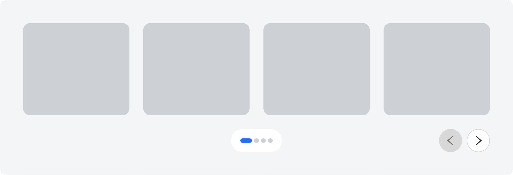
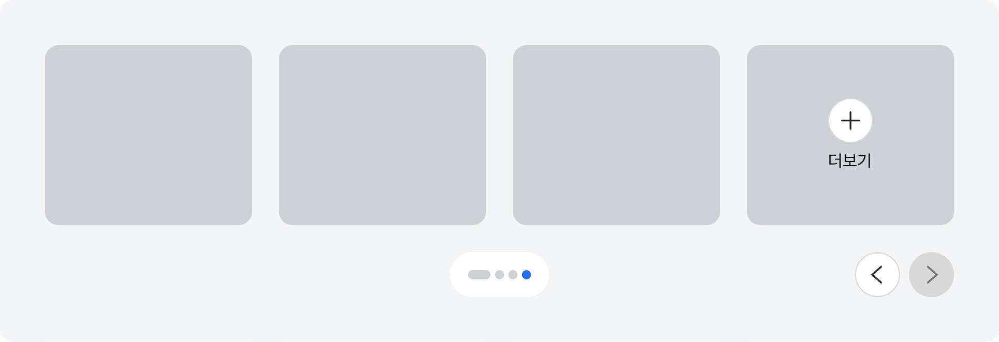
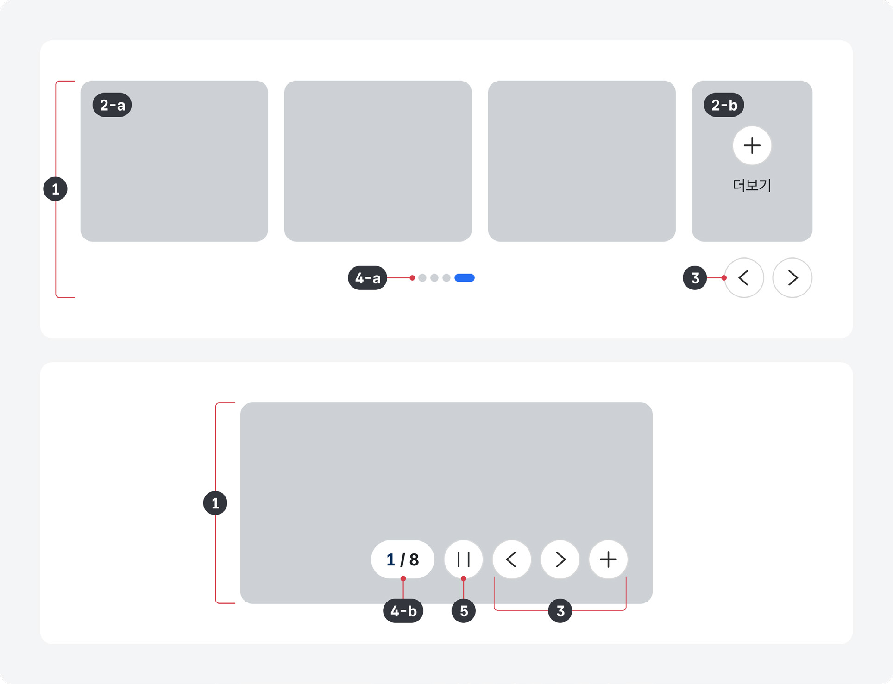
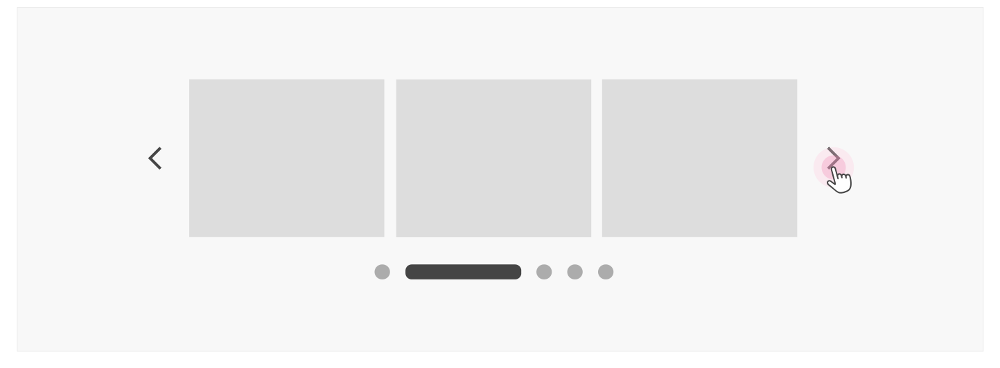
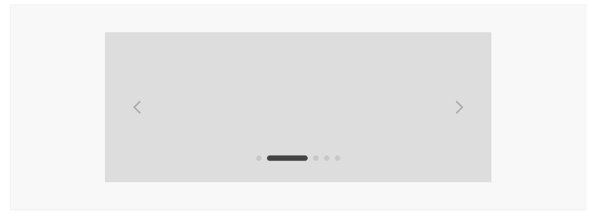
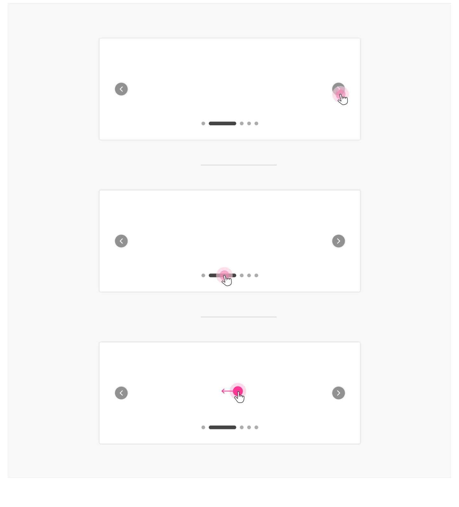
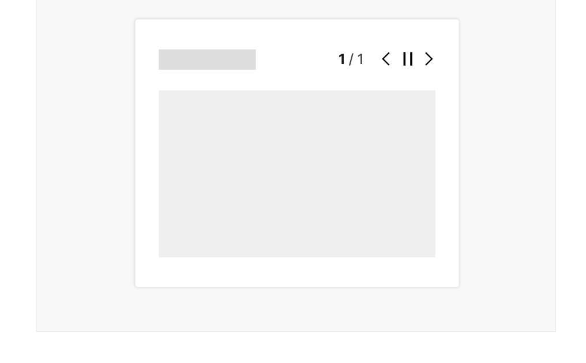
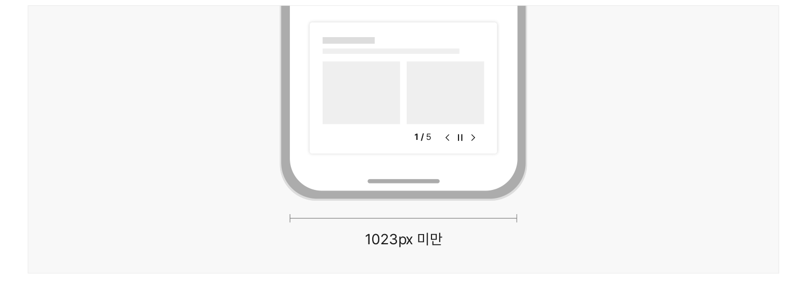

캐러셀은 하나의 콘텐츠 영역 내에 여러 개의 서로 다른 콘텐츠를 표시할 수 있는 컴포넌트이다. 캐러셀에 포함된 콘텐츠는 가로로 배치되어 있으며, 사용자가 좌/우로 콘텐츠를 회전시켜 콘텐츠를 탐색하도록 하거나 자동으로 회전하도록 설정할 수 있다.

## 용례

### 사용하기 적합하지 않은 경우

- 중요한 정보를 전달할 때

캐러셀은 컨테이너 영역 바깥에 콘텐츠를 숨겨둔 상태로 숨어 있는 콘텐츠를 확인하기 위해서는 선형적으로 콘텐츠를 탐색해야 한다. 사용자가 캐러셀임을 인지하지 못하거나 캐러셀의 모든 콘텐츠를 탐색하지 않는 상황이 발생할 수 있으므로 중요한 콘텐츠를 표시하는 데 캐러셀을 사용하는 것은 적절하지 않다.
## 유형

### 레이아웃

### 단일 항목

- 캐러셀 컨테이너에 기본 항목이 1개만 표시되어 사용자는 한 번의 탐색에서 하나의 정보에 집중할 수 있다. 단일 항목 중에서도 항목이 전체 화면 크기로 제공되거나 본문 높이의 절반 이상을 차지하는 전체 화면 유형은 메인 화면 히어로 영역이나 사용자가 주목해야 하는 콘텐츠를 전달하는 데 사용하기 적합하다.


### 다중 항목

- 캐러셀 컨테이너에 기본 항목이 2개 이상 표시된다. 미디어 콘텐츠, 정책, 법령과 같은 여러 항목의 정보를 탐색하는 데 적합하다. 화면 너비에 따라 항목의 크기가 줄어들 경우 정보를 표시하는 데 제약이 있을 수 있으므로 항목 내부에 복잡한 이미지나 텍스트가 제공되어야 한다면 정보를 적절히 인지할 수 있는 항목 수를 선택하거나 단일 항목 레이아웃을 사용해야 한다.




### 애니메이션

- 자동 회전

일정 시간 이후에 다음 슬라이드 항목으로 전환된다. 자동 회전을 사용하는 경우, 항목에 포함된 콘텐츠의 복잡성을 고려하여 적절한 시간 간격으로 콘텐츠가 전환될 수 있도록 해야 한다. 또한 콘텐츠를 이해하는 데

- 더 많은 시간이 필요한 사용자, 애니메이션에 민감한 사용자를 위해 자동 회전을 정지할 수 있는 컨트롤을 제공해야 한다.

고정

사용자가 이전/다음 항목 탐색을 시도하는 경우에 회전 동작이 발생한다. 캐러셀이 고정되어 있으면 사용자가 캐러셀 요소임을 인지하지 못할 수 있기 때문에 가려진 항목을 사용하거나 탐색 버튼이 시각적으로 보다 명확하게 드러나야 한다.
## 구조

- 1 컨테이너: 캐러셀 항목과 관련 컨트롤이 시각적으로 표시되는 영역
- 2 캐러셀 항목: 캐러셀을 구성하고 있는 개별 콘텐츠

a. 기본 항목: 컨테이너 내에서 시각적으로 완전하게 표시되는 항목 b. 작은/가려진 항목: 항목 목록의 가장 첫 번째, 가장 마지막 항목을 작게 표현하거나 컨테이너 영역에 가려지도록 표현한 것. 숨겨진 콘텐츠가 있음을 암시하여 콘텐츠 탐색을 유도함

- 3 탐색 버튼: 항목 목록의 이전/다음 요소를 탐색하는 데 사용되는 버튼
- 4 항목 탐색 식별자: 캐러셀의 전체 항목 수와 활성화된 항목의 순서 정보를 표시함

- a. 도형: 식별자를 시각적으로 강조하여 표현한 유형으로 일반적으로 원 아이콘이 사용됨. 화면 너비가 충분하거나 전체 슬라이드 수가 5개 이내인 경우에 사용하기 적합하며, 각 슬라이드로 이동할 수 있는 수단으로 활용됨
- b. 분수: 전체 항목 수와 탐색 중인 항목 순서를 숫자로 표시함 예) 3/5

- 5 정지/재생 버튼: 자동 회전 캐러셀에서 움직임을 정지하거나 재생하는 데 사용하는 버튼

## 사용성 가이드라인

- 01 슬라이드 수를 5개 이내로 사용한다.
- 02 캐러셀 항목의 텍스트 콘텐츠는 1~2줄로 작성한다.
- 03 캐러셀 항목의 콘텐츠의 윤곽이 명확하게 드러나도록 표현한다.
- 04 캐러셀 관련 컨트롤, 항목 탐색 식별자가 캐러셀 항목과 중첩되지 않도록 한다.
- 05 캐러셀 관련 컨트롤과 항목 탐색 식별자가 명확하게 인지될 수 있도록 표현한다.
- 06 캐러셀 관련 컨트롤과 항목 탐색 식별자를 일관된 위치에 표시한다.
- 07 전체 슬라이드 수와 사용자의 탐색 위치를 표시한다.
- 08 캐러셀 관련 컨트롤 요소를 쉽게 조작할 수 있도록 충분히 크게 표현한다.
- 09 중요한 항목을 우선적으로 배치한다.
- 10 드래그 앤 드롭/스와이프로 슬라이드를 전환할 수 있도록 한다.
- 11 표시할 캐러셀 항목 수가 1개인 경우 캐러셀과 관련된 단서를 숨긴다.
### 01. 슬라이드 수를 5개 이내로 사용한다.

슬라이드 수가 많으면 사용자의 인지 부하가 증가하고 이후에 캐러셀에서 필요한 정보를 다시 탐색하는 데 어려움을 겪게 된다. 대부분의 사용자는 캐러셀에서 3~4개의 슬라이드를 확인한 후 탐색을 중단한다. 항목 수가 많은 경우에는 캐러셀 대신 목록을 사용해야 한다.

[모범 사례]



**사례 텍스트 보완**

```text
원본 PDF의 UI 배치·상태·다이어그램을 보존한 시각 자료입니다.
```
### 02. 캐러셀 항목의 텍스트 콘텐츠는 1~2줄로 작성한다.

각 캐러셀 항목에 지나치게 많은 정보가 제공되면 사용자의 인지적 부담이 증가한다. 캐러셀 항목에 포함된 텍스트는 가독성 있는 간단한 문구로 1~2줄 이하로 작성한다.

### 03. 캐러셀 항목의 콘텐츠의 윤곽이 명확하게 드러나도록 표현한다.

배경색, 윤곽선, 그림자 등을 활용하여 캐러셀 각 항목이 변별되도록 표현해야 한다. 항목의 경계가 명확하게 변별되지 않으면 링크나 버튼으로 작동하는 캐러셀 항목은 상호작용 가능한 영역을 인지하기 어려우며, 다중 항목의 캐러셀에서 항목 간 구분이 어려워진다.
### 04. 캐러셀 관련 컨트롤, 항목 탐색 식별자가 캐러셀 항목과 중첩되지 않도록 한다.

탐색 버튼, 항목 탐색 식별자를 캐러셀 항목 위에 제공하게 되면 각 항목에서 전달하고자 하는 정보가 가려질 가능성이 높다. 단, 전체 화면 유형의 단일 항목 캐러셀은 사용자가 캐러셀임을 인지할 수 있는 단서로서 해당 요소를 항목 하단의 일관된 영역에 배치할 수 있다.

[모범 사례]


**사례 텍스트 보완**

```text
3 / 5
```
[피해야 할 사례]


**사례 텍스트 보완**

```text
3 / 5
```
### 05. 캐러셀 관련 컨트롤과 항목 탐색 식별자가 명확하게 인지될 수 있도록 표현한다.

캐러셀 관련 컨트롤과 항목 탐색 식별자는 항목과 명확하게 구분되어야 한다. 만약 단일 항목, 전체 화면 레이아웃을 사용하여 항목과 요소들이 중첩되어야 하는 경우, 버튼 요소/영역과 항목 간 명도 대비를 분명하게 하거나 버튼 색상과 대비되는 그림자 또는 글로우 등을 활용하여 두 정보가 변별되도록 할 수 있다.

[모범 사례]



**사례 텍스트 보완**

```text
피해야 할 사례
```
[피해야 할 사례]


**사례 텍스트 보완**

```text
원본 PDF의 UI 배치·상태·다이어그램을 보존한 시각 자료입니다.
```
### 06. 캐러셀 관련 컨트롤과 항목 탐색 식별자를 일관된 위치에 표시한다.

도형형 항목 탐색 식별자는 컨테이너 중앙, 분수형 항목 탐색 식별자는 컨테이터 우측 하단에 배치한다. 탐색 버튼은 레이아웃 유형에 따라 컨테이너 중앙의 좌/우 또는 우측 하단에 배치한다.

### 07. 전체 슬라이드 수와 사용자의 탐색 위치를 표시한다.

사용자가 탐색 가능한 정보의 양을 가늠하고 탐색 중인 슬라이드 위치를 확인하여 필요에 따라 다시 정보를 탐색할 수 있도록 정보를 제공해야 한다.

### 08. 캐러셀 관련 컨트롤 요소를 쉽게 조작할 수 있도록 충분히 크게 표현한다.

클릭, 터치 영역을 정교하게 조작하기 어려운 사용자를 고려하여, 마우스 상호작용에 대해서는 17px × 17px, 터치 상호작용에 대해서는 44px x 44px 이상의 영역에서 반응할 수 있는 컨트롤 크기를 사용할 것을 권장한다. 이때, 단위는 CSS 픽셀을 기준으로 한다.
### 09. 중요한 항목을 우선적으로 배치한다.

사용자가 항상 캐러셀 내부의 모든 항목을 탐색하지는 않으므로 항목의 우선순위를 구분하여 시의성 있거나 사용자가 관심 있어 할 만한 정보를 우선적으로 배치한다. 우선순위의 지정을 통해 사용자가 캐러셀 항목을 탐색하는 과정에서의 지루함을 덜 수 있고, 사용자의 흥미를 끌어 더 많은 항목을 탐색하도록 유도할 수 있다.
### 10. 드래그 앤 드롭/스와이프로 슬라이드를 전환할 수 있도록 한다.

별도의 탐색 버튼이 존재하는 상황에서도 사용자가 원하는 방식으로 캐러셀을 탐색할 수 있도록 드래그 앤 드롭 또는 스와이프 동작을 통해 슬라이딩 애니메이션이 작동할 수 있도록 한다.

[모범 사례]



**사례 텍스트 보완**

```text
원본 PDF의 UI 배치·상태·다이어그램을 보존한 시각 자료입니다.
```
### 11. 표시할 캐러셀 항목 수가 1개인 경우 캐러셀과 관련된 단서를 숨긴다.

콘텐츠의 변경으로 캐러셀 항목 수가 1개가 되는 상황을 고려하여, 해당 상황이 발생하였을 때 탐색 버튼, 항목 탐색 식별자, 정지/재생 버튼을 숨겨 사용자가 불필요한 정보 탐색 행동을 수행하지 않도록 한다.

[모범 사례]

[피해야 할 사례]



**사례 텍스트 보완**

```text
1 / 1
```


**사례 텍스트 보완**

```text
원본 PDF의 UI 배치·상태·다이어그램을 보존한 시각 자료입니다.
```
### 플랫폼에 대한 고려 사항

화면 크기가 충분한 경우 도형형 항목 탐색 식별자를 버튼으로 제공한다.

식별자를 클릭하였을 때 해당 식별자에 상응하는 슬라이드로 전환하도록 한다. 이를 통해 사용자는 항목을 순차적으로 탐색하지 않고 원하는 순서의 슬라이드에 바로 접근할 수 있다.

### 화면 크기가 충분하지 않은 경우 도형형 항목 탐색 식별자는 분수형으로 전환한다.

화면 너비가 1023px 미만이 되면 도형을 통한 슬라이드 수와 탐색 위치 파악, 버튼 기능의 이용이 어려워지므로 분수형 식별자로 전환해야 한다.

[모범 사례]



**사례 텍스트 보완**

```text
1 / 5
1023px 미만
```


## 접근성 가이드라인

### 01. 자동 재생 캐러셀에서 정지 버튼이 상호작용 가능한 첫 요소로 제공되어야 한다.

캐러셀 항목과 다른 컨트롤 요소보다 우선적으로 접근 가능하도록 하여 항목을 원활하게 탐색할 수 있도록 해야 한다.

- KWCAG 2.2 정지 기능 제공
- WCAG 2.1 Pause, Stop, Hide (A)

### 02. 단일 지점과의 상호작용을 통해 슬라이드를 탐색할 수 있는 수단을 제공한다.

경로 기반의 상호작용, 다중 지점 상호작용이 아닌 단순 클릭/터치로 탐색할 수 있도록 한다.

- KWCAG 2.2 누르기 동작 지원
- WCAG 2.1 Pointer Gestures (A)

### 03. 캐러셀에서 제공되는 모든 기능을 키보드로 실행할 수 있도록 한다.

캐러셀에서 제공되는 모든 기능은 마우스뿐만 아니라 키보드, 터치 인터페이스로 실행할 수 있어야 한다.

- KWCAG 2.2 키보드 사용 보장
- WCAG 2.1 Keyboard (A)
접근성 가이드라인


### 04. 키보드와 스크린 리더는 기본 항목에만 접근하도록 한다.

작은/가려진 항목에 키보드와 스크린 리더 초점이 접근하게 되면 관련 인터페이스 및 보조 기술 사용자는 수많은 캐러셀 항목을 모두 탐색하기 전까지 다음 콘텐츠 섹션을 탐색할 수 없다. 작은/가려진 항목에는 tabindex="-1", aria-hidden="true" 속성이나 display:none 스타일을 적용하여 사용자가 의도적으로 항목 탐색을 시도하기 전까지 작은/가려진 항목에 초점이 진입하지 않도록 해야 한다.

- KWCAG 2.2 초점 이동과 표시
- WCAG 2.1 Focus Order (A)

### 05. 텍스트가 포함된 이미지를 사용하지 않는다.

슬라이드에 이미지를 추가하는 경우 로고의 일부가 아닌 한 텍스트(텍스트가 이미지의 일부인 경우)가 포함된 슬라이드는 피한다. 대신 해당 텍스트를 제목이나 본문 콘텐츠 내에 배치한다.

- WCAG 2.1 Images of Text (AA)
## 상호작용 가이드라인

### 슬라이드 탐색

| 구분 | 설명 |
|---|---|
| Click | 화살표 아이콘을 Click 하면 이전 또는 다음 슬라이드로 넘어간다. 페이지네이션 인디케이터의 경우 특정 인디케이터를 선택하면 해당하는 슬라이드로 넘어간다. |
| Drag & Drop | 가로 스크롤 인디케이터의 경우 스크롤바를 드래그하여 슬라이드를 넘길 수 있다. |
| 방향키 ←, → | 페이지네이션 인디케이터의 경우 인디케이터 그룹에 초점이 있을 때 키보드 방향키 ←, →를 눌러 다음 또는 이전 콘텐츠로 선택을 전환한다. |
| Tab | Tab 키를 눌러 캐러셀의 대화형 요소에 초점을 이동한다. 캐러셀의 마지막 콘텐츠에 초점이 있을 때 Tab 키를 누르면 화면의 캐러셀 다음 항목으로 초점이 빠져나간다. |
| Shift + Tab | 콘텐츠의 첫 번째 요소에 초점이 있는 경우 Shift + Tab 키를 누르면 화면의 캐러셀 이전 항목으로 초점이 빠져나간다. |
| Enter | 탐색 버튼에 초점이 있을 때 Enter 키를 눌러 기능을 활성화 한다. |
| Swipe | 왼쪽이나 오른쪽으로 스와이프 하면 캐러셀이 좌우로 이동한다. |
| Tap | 탐색 버튼을 Tap 하면 이전 또는 다음 슬라이드로 넘어간다. |
### 자동 재생 중지 및 재생

| 구분 | 설명 |
|---|---|
| Tab | 자동 재생 캐러셀의 경우 Tab 키를 눌러 캐러셀의 요소에 키보드 초점이 들어가면 자동 재생이 중지된다. 사용자가 재생 컨트롤을 활성화하지 않으면 다시 시작하지 않는다. |
| Enter | 자동 재생 캐러셀의 재생 컨트롤에 초점이 있을 때 Enter 키를 눌러 기능을 활성화 한다. |
| Click | 자동 재생 캐러셀의 경우 정지 버튼을 Click 하면 슬라이드가 정지되고, 재생 버튼을 Click 하면 다시 재생된다. |
| Hover | 자동 재생 캐러셀의 경우 마우스를 캐러셀 위로 올렸을 때마다 재생을 중지한다. |
