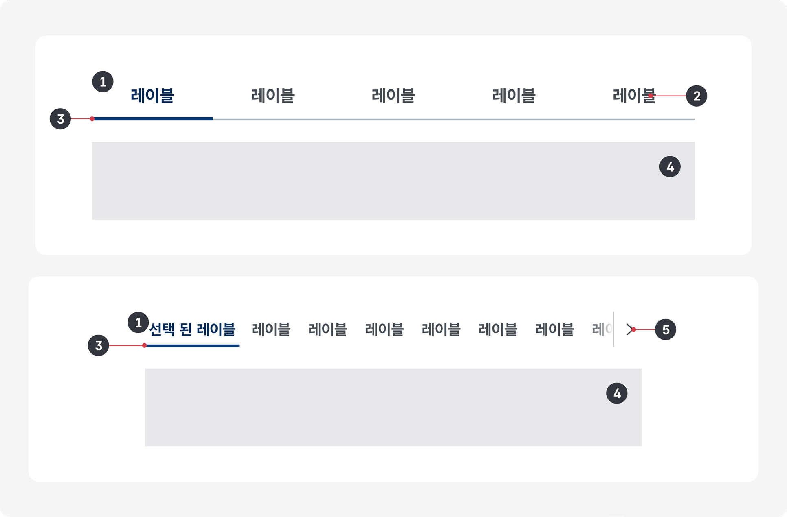
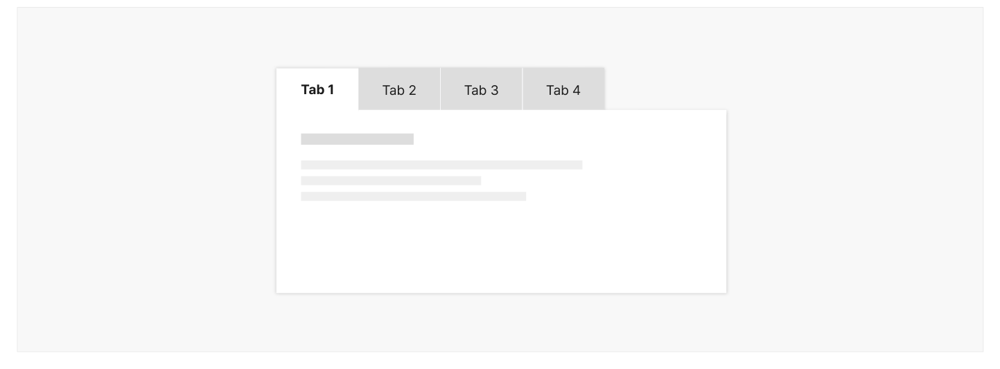
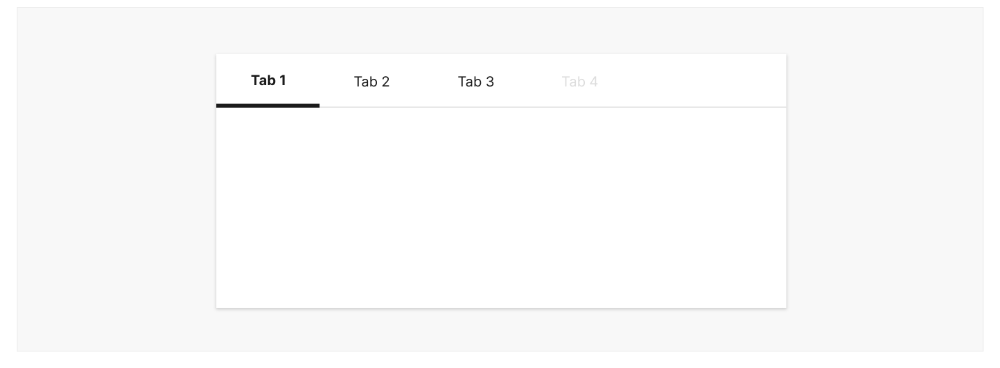
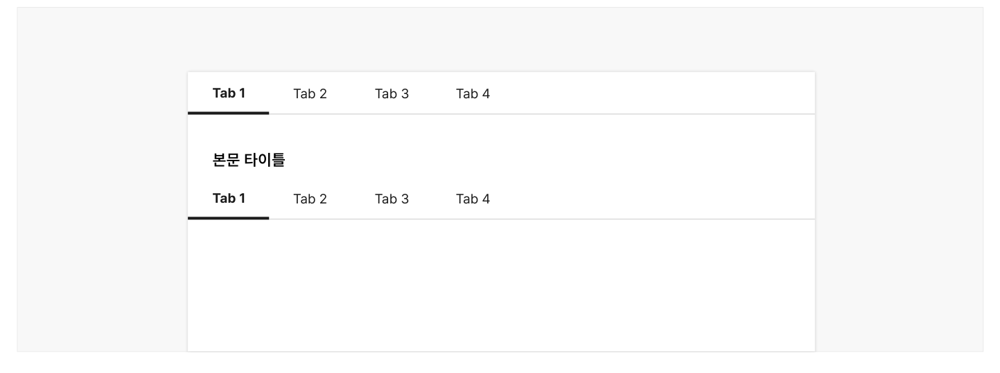
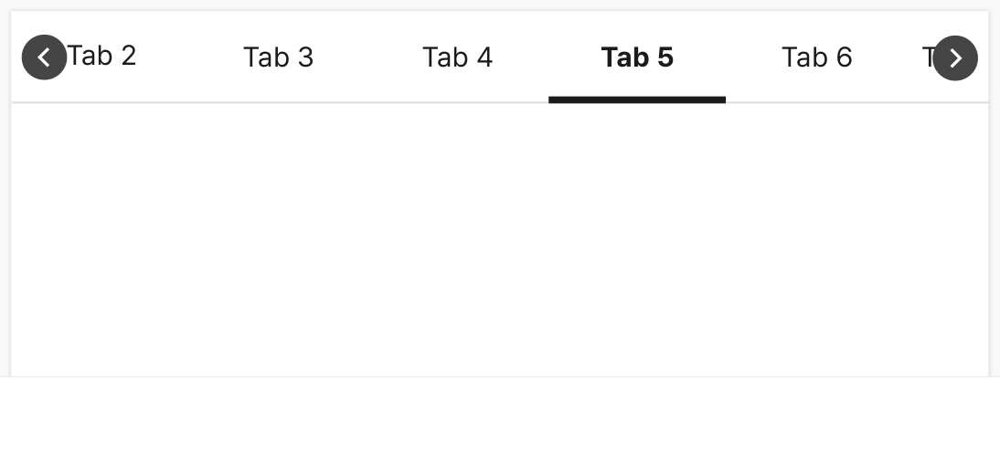
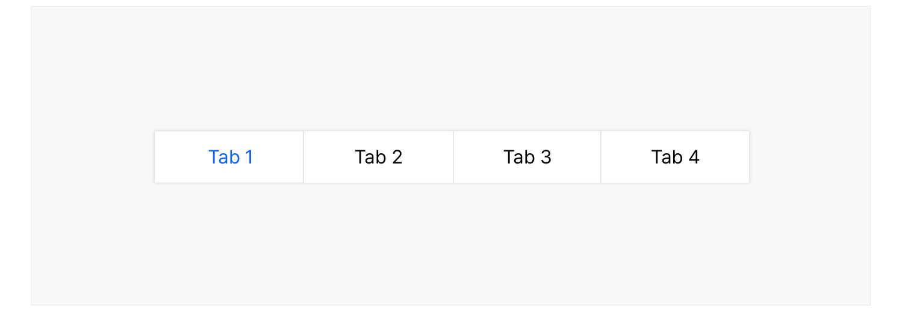

탭은 버튼을 눌러 상호배타적인 여러 개의 콘텐츠 섹션을 전환할 수 있는 컴포넌트이다. 콘텐츠 섹션은 동일한 영역 내에서 전환되기 때문에 정보를 탐색하는 맥락을 유지할 수 있고 작은 공간에 많은 양의 콘텐츠를 효과적으로 표현할 수 있다.

## 용례

### 사용하기 적합한 경우

- 대부분의 사용자에게 첫 번째 콘텐츠 섹션이 가장 중요하거나 유용한 정보를 전달하는 경우
- 사용자가 한 번에 두 개 이상의 콘텐츠 섹션을 확인할 필요가 없는 경우
- 사용자가 콘텐츠 섹션을 빠르게 전환해야 하는 경우

사용하기 적합하지 않은 경우

- 서로 다른 탭에 속한 콘텐츠 섹션의 정보를 비교해야 하는 경우

사용자는 한 탭 패널의 정보를 암기한 상태에서 다른 패널로 전환한 후, 기억에 의존하여 정보를 비교해야 하기 때문에 적합하지 않다.

- 콘텐츠 섹션을 이해하는 데 순서가 중요한 경우

각각의 콘텐츠 섹션을 이해하기 위해 모든 내용을 순서대로 읽어야 하는 경우에는 단계 마법사와 같은 패턴이 적합하다. 단계 마법사는 첫 번째 콘텐츠 섹션에서부터 순차적으로 작업을 완료해야 다음 단계의 콘텐츠 섹션을 확인할 수 있는 반면, 탭은 사용자가 임의로 콘텐츠 탐색 순서를 결정할 수 있다.
## 유형

### 수평 탭

탭이 좌에서 우의 순서로 제공되며 탭과 탭 패널이 상/하로 배치된다.

### 수직 탭

탭이 상에서 하의 순서로 제공되며 탭과 탭 패널이 좌/우로 배치된다.
## 구조

- 1 탭: 사용자와의 상호작용에 반응하는 박스 영역으로 실행 시 각 탭에 상응하는 콘텐츠가 탭 패널에 표시됨
- 2 탭 레이블: 표시할 탭 패널의 제목
- 3 인디케이터: 탭이 선택된 상태임을 알려주는 시각적인 식별자
- 4 탭 패널: 콘텐츠가 표시되는 영역
- 5 탭 탐색 버튼(선택): 시각적으로 표시되지 않는 나머지 탭을 탐색하기 위한 버튼


## 사용성 가이드라인

- 01 사용자가 탭과 탭 패널 간 관계를 명확하게 인지할 수 있도록 표현한다.
- 02 탭 레이블은 표시할 콘텐츠 섹션의 정보를 예측할 수 있는 명확한 내용으로 제공한다.
- 03 탭에 사용 불가 상태를 사용하지 않는다.
- 04 여러 개의 탭을 중첩하는 경우, 서로 다른 수준의 탭이 명확하게 구분되도록 표현한다.
- 05 수직 탭은 탭을 수평으로 배치하기 어려운 경우에 사용한다.
- 06 탭의 항목 수가 많아 일렬로 배치하기 어려운 경우 별도의 탐색 컨트롤을 제공한다.
### 01. 사용자가 탭과 탭 패널 간 관계를 명확하게 인지할 수 있도록 표현한다.

탭과 탭 패널을 인접한 영역에 배치하여 탭 패널이 선택된 탭에 관련된 콘텐츠임을 인지할 수 있도록 해야 한다. 탭과 탭 패널의 배경색을 동일하게 지정하면 두 요소 간 관련성을 시각적으로 보다 강조할 수 있다.

- [모범 사례 1]



**사례 텍스트 보완**

```text
Tab 1
Tab 2
Tab 3
Tab 4
```
- [모범 사례 2]


**사례 텍스트 보완**

```text
Tab 1
Tab 2
Tab 3
Tab 4
```
### 02. 탭 레이블은 표시할 콘텐츠 섹션의 정보를 예측할 수 있는 명확한 내용으로 제공한다.

탭은 선택된 탭을 제외한 나머지 탭의 콘텐츠를 숨기기 때문에 레이블이 명확하지 않으면 사용자 탭을 클릭해야 하는지 알 수 없어 필요한 정보가 포함된 탭을 놓칠 수 있다.
### 03. 탭에 사용 불가 상태를 사용하지 않는다.

탭에 표시될 콘텐츠가 없는 경우, 해당 탭을 삭제하거나 탭을 선택했을 때 패널에 콘텐츠가 없는 이유에 대한 설명을 제공하여 사용자가 혼동을 느끼지 않도록 해야 한다.

[피해야 할 사례]



**사례 텍스트 보완**

```text
Tab 1
Tab 2
Tab 3
Tab 4
```
### 04. 여러 개의 탭을 중첩하는 경우, 서로 다른 수준의 탭이 명확하게 구분되도록 표현한다.

탭은 콘텐츠를 숨겨둔 상태에서 사용자가 콘텐츠의 표시 여부를 선택해야 하기 때문에 사용자의 인지적 부담을 더욱 증가시킬 수 있어 여러 개의 탭을 중첩하는 것은 바람직하지 않다. 그러나 불가피하게 탭을 중첩해야 하는 경우 중첩된 탭의 스타일이 시각적으로 분명하게 구분되어야 한다.

[모범 사례]



**사례 텍스트 보완**

```text
Tab 1
Tab 2
Tab 3
Tab 4
```
[피해야 할 사례]


**사례 텍스트 보완**

```text
Tab 1
Tab 3
Tab 4
Tab 2
본문 타이틀
```
### 05. 수직 탭은 탭을 수평으로 배치하기 어려운 경우에 사용한다.

많은 수의 탭을 별도의 탐색 컨트롤을 사용하지 않고 한 번에 확인하는 것이 중요한 경우 수직 탭을 사용할 수 있다. 또한 수직 탭은 수평 탭의 높이만큼 공간을 절약할 수 있으므로, 콘텐츠 섹션의 높이가 고정적이고 탭 영역의 높이에 제한이 있는 경우에 사용하기 적합하다. 그러나 탭이 탭 패널의 상단에 배치되어 있는 것이 사용자에게 더 익숙하므로 수직 탭을 사용할 때에는 탭과 탭 패널 간 관계를 표현하는 데 더 주의를 기울여야 한다.
### 06. 탭의 항목 수가 많아 일렬로 배치하기 어려운 경우 별도의 탐색 컨트롤을 제공한다.

탭이 6개를 초과하면 사용자의 인지적인 부담을 증가시키고 레이아웃에 문제가 발생할 수 있다. 모든 탭이 영역의 너비에서 넘치지 않고 표시될 수 없는 경우, 숨겨진 탭을 탐색할 수 있는 팝업 버튼을 제공하거나 탭을 좌/우로 이동할 수 있는 컨트롤 요소를 제공해야 한다.

[모범 사례]



**사례 텍스트 보완**

```text
Tab 2
Tab 3
Tab 4
Tab 5
Tab 6
Ta
```
[피해야 할 사례]


**사례 텍스트 보완**

```text
원본 PDF의 UI 배치·상태·다이어그램을 보존한 시각 자료입니다.
```
## 접근성 가이드라인
### 01. 탭의 선택 상태를 색상으로만 구분하지 않는다.

탭의 선택 상태를 색상 이외의 수단으로 구분할 수 있는 시각적 단서를 제공해야 한다. 밑줄 제공, 1px 이상의 테두리 차이, 식별자 제공 등의 방법으로 크기나 형태 차원에서 정보를 구분하는 방법을 사용할 수 있다.

- KWCAG 2.2 색에 무관한 콘텐츠 인식
- WCAG 2.1 Use of Color (A)

[모범 사례]



**사례 텍스트 보완**

```text
Tab 1
Tab 2
Tab 3
Tab 4
```
[피해야 할 사례]


**사례 텍스트 보완**

```text
Tab 1
Tab 2
Tab 3
Tab 4
```
### 02. 탭을 키보드로 탐색하고 실행할 수 있도록 한다.

탭은 키보드로 접근하여 조작할 수 있어야 한다.

- KWCAG 2.2 키보드 사용 보장
- WCAG 2.1 Keyboard (A)
- WCAG 2.1 No Keyboard Trap (A)

### 03. 탭의 키보드 초점이 명확하게 표시되도록 한다.

모든 탭은 초점을 받은 상태가 시각적으로 명확하게 구분되어야 한다.

- KWCAG 2.2 초점 이동과 표시
- WCAG 2.1 Focus Visible (AA)
- WCAG 2.1 Non-text Contrast (AA)

### 04. 탭의 선택 상태를 스크린 리더로 확인할 수 있도록 한다.

탭 레이블과 탭의 선택 상태를 텍스트로 제공하여 스크린 리더에서 정보를 인지할 수 있도록 해야 한다. 탭 버튼에 role="tab"로 역할을 부여하고 선택된 탭에 aria-selected="true"로 상태 정보를 전달하거나 title="현재 탭", title="선택됨"으로 선택 상태에 대한 정보를 제공할 수 있다.

- KWCAG 2.2 적절한 대체 텍스트 제공
- WCAG 2.1 Name, Role, Value (A)
### 05. 탭과 패널의 역할 및 관계를 스크린 리더로 확인할 수 있도록 한다.

탭 버튼 목록 영역은 role="tablist", 탭 버튼은 role="tab", 탭 패널은 role="tabpanel"로 역할을 부여한다. 그런 다음 탭 버튼과 탭 패널에 각각 id 속성과 속성값을 부여한 다음, 탭 버튼에는 aria-controls="[상응하는 탭 패널 id 속성값]", aria-labelledby="[상응하는 탭 버튼 id 속성값]"을 설정하여 탭과 패널 간 연결 관계를 프로그램적으로 전달할 수 있다.

- KWCAG 2.2 콘텐츠의 선형화
- WCAG 2.1 Info and Relationships (A)
- WCAG 2.1 Name, Role, Value (A)


## 상호작용 가이드라인

### 탭 탐색

### 탭 패널 전환

| 구분 | 설명 |
|---|---|
| Tab, Shift + Tab | 모든 탭은 Tab, Shift + Tab 키를 눌렀을 때 접근할 수 있어야 한다. |

| 구분 | 설명 |
|---|---|
| Click | 탭을 Click 하면 탭이 선택되면서 관련 콘텐츠로 탭 패널의 정보가 전환된다. |
| Enter | 탭에 초점이 있는 상태에서 Enter 키를 누르면 탭이 선택되면서 관련 콘텐츠로 탭 패널의 정보가 전환된다. |
