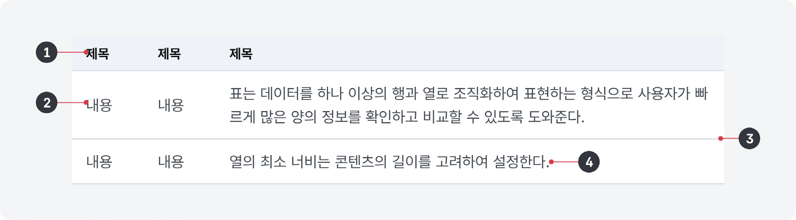
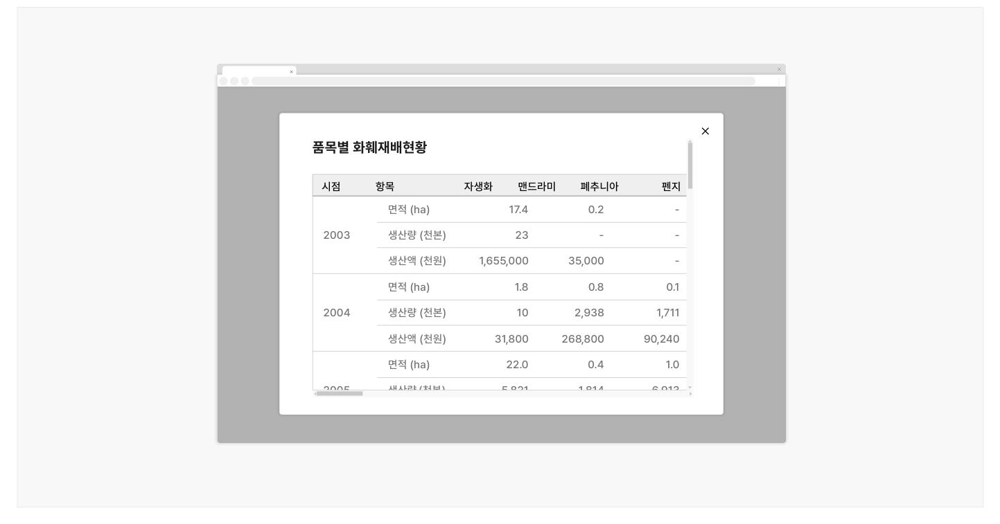
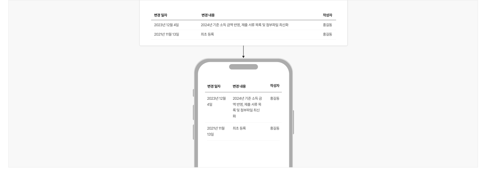
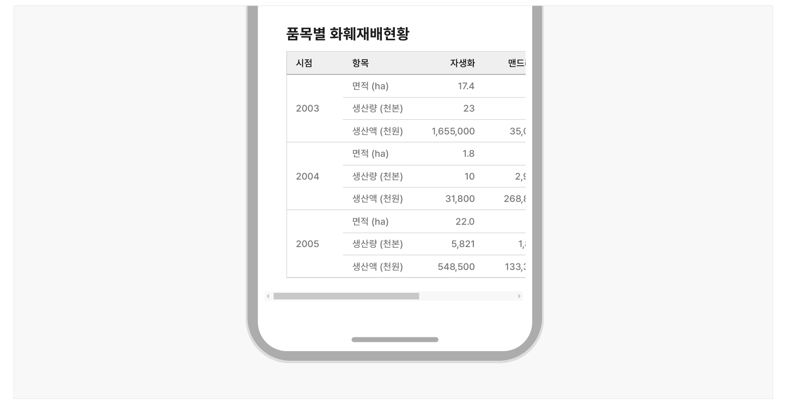

표는 데이터를 하나 이상의 행과 열로 조직화하여 표현하는 형식으로 사용자가 빠르게 많은 양의 정보를 확인하고 비교할 수 있도록 도와준다. 기본적으로 대화형 요소가 아니기 때문에 열 제목에 데이터를 정렬하기 위한 컨트롤 요소가 포함된 상황 외에 행 전체나 데이터 셀이 대화형으로 작동하지 않는다.

## 용례

### 사용하기 적합한 경우

- 표 형식의 데이터를 제공하는 경우

예) 통계 데이터

- 다수의 항목에 대해서 유사한 방식으로 구조화된 정보를 표현하는 경우

에) 리소스 목록, 게시물 목록
### 사용하기 적합하지 않은 경우

- 다른 콘텐츠 형식이 더 적합한 경우

콘텐츠의 의미와 맥락을 고려하였을 때 정의 목록, 순서 있는 목록, 순서 없는 목록, 제목과 문단의 조합으로 표현하는 것이 적합한 경우에는 표를 사용하지 않을 것을 권장한다. 데이터 셀 내의 정보가 복잡하거나 계층적인 구조를 가진 경우에도 마찬가지이다.

- 데이터 간 복잡한 관계를 표현해야 하는 경우

막대그래프와 같은 차트나 인포그래픽으로 정보를 제공하는 것이 보다 직관적일 수 있다.

- 그리드를 표현하고자 하는 경우

요소를 사각형으로 배치하기 위한 목적으로 표를 사용해서는 안 된다. 그리드, 플렉스박스 등 적절한 스타일 속성을 활용해야 한다.

- 데이터 구조에 일관성이 없는 경우

카드와 같은 유연한 레이아웃을 사용하는 것이 적합하다.

- 데이터와 관련하여 복잡한 상호작용이 필요한 경우

표 컴포넌트 대신 구조화 목록 컴포넌트를 사용해야 한다.
## 구조

1 헤더: 각 데이터 셀의 제목 2 행: 서로 다른 유형의 데이터를 보여줌 3 디바이더: 행과 행 사이를 시각적으로 구분하는 수단 4 데이터 셀: 행을 구성하는 데이터 요소


## 사용성 가이드라인

- 01 표는 데이터 잘림 없이 표시될 수 있는 영역에 사용한다.
- 02 열의 최소 너비는 콘텐츠의 길이를 고려하여 설정한다.
- 03 열 구분선의 사용을 지양한다.
- 04 양적 데이터를 전달하기 위한 숫자는 오른쪽으로 정렬한다.
- 05 텍스트 데이터, 명목 데이터는 왼쪽으로 정렬한다.
- 06 열의 개수를 최소화한다.
- 07 사용자가 원하는 대로 데이터를 정렬할 수 있는 기능을 제공한다.
- 08 데이터값이 존재하지 않는 경우 셀을 비워두지 않고 대시(-)를 제공한다.
### 01. 표는 데이터 잘림 없이 표시될 수 있는 영역에 사용한다.

아코디언, 모달과 같이 공간의 제한으로 인해 데이터가 잘리거나 데이터 확인을 위해 가로 스크롤을 사용해야 하는 영역에는 표를 사용하지 않아야 한다. 필요한 경우, 각각의 열이 아래로 떨어지도록 배치한다.

[피해야 할 사례]



**사례 텍스트 보완**

```text
품목별 화훼재배현황
시점
항목
자생화
맨드라미
폐추니아
펜지
면적 (ha)
17.4
0.2
2003
생량 (천본)
생액 (천원)
1,655,000
35,000
1.8
0.8
…
```
### 02. 열의 최소 너비는 콘텐츠의 길이를 고려하여 설정한다.

데이터 셀을 구성하는 텍스트는 가능한 3줄을 넘어가지 않도록 하고 행과 행 사이의 간격을 적절하게 제공하여 사용자가 한 번에 많은 데이터를 비교할 수 있도록 해야 한다.

### 03. 열 구분선의 사용을 지양한다.

열 구분선은 표 콘텐츠를 구조화하거나 구분하는 데 도움이 될 수 있으나 시각적인 복잡성을 높이므로 반드시 필요한 경우를 제외하고 사용하지 않는 것이 바람직하다.

### 04. 양적 데이터를 전달하기 위한 숫자는 오른쪽으로 정렬한다.

개수, 퍼센트, 용량 등의 양적 데이터는 셀에서 오른쪽으로 정렬하여 사용자가 숫자를 더 잘 비교할 수 있도록 해야 한다. 숫자를 오른쪽으로 정렬하면 단위 구분 기호(, %, KB 등)가 일관된 위치에 배치되므로 가독성을 높인다.
### 05. 텍스트 데이터, 명목 데이터는 왼쪽으로 정렬한다.

일반적인 텍스트 데이터와 범주를 구분하기 위한 목적으로 사용되는 명목 데이터(예 - 날짜, 우편번호, 핸드폰 번호, IP주소 등)는 왼쪽으로 정렬하여 사용자가 데이터를 탐색하기 위해 일관된 위치에서 안구 운동을 시작할 수 있도록 해야 한다.

### 06. 열의 개수를 최소화한다.

수평으로 길게 배치된 정보를 읽는 것보다 수직으로 배치된 정보를 읽는 것이 더 쉬우므로 표를 구성하는 열의 개수를 최소화하는 것이 좋다. 가능하다면 불필요하거나 상대적으로 덜 중요한 열을 제거하고, 행과 열을 전환하는 방법을 활용할 수 있다.

### 07. 사용자가 원하는 대로 데이터를 정렬할 수 있는 기능을 제공한다.

데이터의 수가 많은 경우 데이터를 논리적인 순서에 따라 정렬하거나 검색, 필터링, 탐색하는 기능을 제공하면 사용자가 효율적으로 원하는 데이터를 발견할 수 있다. 열 헤더에 정렬 버튼이 제공되는 경우, 기본 상태는 가장 첫 번째 열을 기준으로 데이터가 정렬된 상태이다.
### 08. 데이터값이 존재하지 않는 경우 셀을 비워두지 않고 대시(-)를 제공한다.

데이터 셀에 아무런 텍스트가 표시되지 않으면 사용자에게 혼동을 줄 수 있으므로 빈 셀에는 대시 기호를 표시하여 이용할 수 있는 정보가 존재하지 않음을 안내해야 한다.
### 플랫폼에 대한 고려 사항

화면 너비가 충분하지 않은 경우 데이터의 배열 방식의 변경을 고려한다.

### 한 줄의 행 헤더 또는 열 헤더로 구성된 단일 차원의 단순한 표의 경우, 헤더 텍스트와 데이터 텍스트를 수직으로 배치를 변경할 수 있다.

[모범 사례]



**사례 텍스트 보완**

```text
변경 일자
변경 내용
작성자
2023년 12월 4일
2024년 기준 소득 금액 반영, 제출 서류 목록 및 첨부파일 최신화
홍길동
2021년 11월 13일
최초 등록
2024년 기준 소득 금액 반영, 제출 서류
목록 및 첨부파일 최신화
2024년 기준 소득 금액 반영, 제출 서류 목록 및 첨부
파일 최신화
2023년 11월 13일
```
[피해야 할 사례]


**사례 텍스트 보완**

```text
변경 일자
변경 내용
작성자
2023년 12월 4일
2024년 기준 소득 금액 반영, 제출 서류 목록 및 첨부파일 최신화
홍길동
2021년 11월 13일
최초 등록
2023년 12월
2024년 기준 소득 금
4일
액 반영, 제출 서류 목
록 및 첨부파일 최신
화
2021년 11월
13일
```

### 화면 너비가 충분하지 않은 경우 표 영역에 가로 스크롤을 사용하는 방안을 고려한다.

행과 열 간의 관계 표현이 유지되어야 하거나 구성이 복잡하다면 셀의 배치를 변경하지 않고 표 섹션에 가로 스크롤을 생성할 수 있다. 만약 표에 행 헤더가 존재한다면 가로 스크롤의 위치가 변경되더라도 열 헤더를 화면의 왼쪽에 고정함으로써 데이터를 탐색하는 과정의 편의성을 높일 수 있다.

[모범 사례]



**사례 텍스트 보완**

```text
품목별 화훼재배현황
시점
항목
자생화
맨드라
면적 (ha)
17.4
2003
생량 (천본)
35,0
생액 (천원)
1,655,000
1.8
2,9
2004
31,800
…
```


## 접근성 가이드라인

### 데이터의 구조를 적절하게 반영하여 마크업한다.

표는 &lt;table&gt;로 마크업하고 &lt;caption&gt;, &lt;thead&gt;, &lt;th&gt;, &lt;tfoot&gt; 태그를 적절히 사용하여 시각적으로 표현된 정보의 구조가 스크린 리더를 통해서도 동등하게 전달될 수 있도록 해야 한다.

- KWCAG 2.2 표의 구성
- WCAG 2.1 Info and Relationships (A)

### 가로 스크롤이 필요한 경우 단순한 동작으로 스크롤 위치를 조정할 수 있도록 한다.

표 섹션이 스크롤되는 영역임을 인지할 수 있도록 가로 스크롤을 표시하고 버튼을 클릭하거나 탭하는 단순한 동작만으로도 스크롤 위치를 조정할 수 있도록 한다.

- KWCAG 2.2 누르기 동작 지원
- WCAG 2.1 Pointer Gestures (A)

접근성 가이드라인

### 데이터의 구조를 적절하게 반영하여 마크업한다.

표는 &lt;table&gt;로 마크업하고 &lt;caption&gt;, &lt;thead&gt;, &lt;th&gt;, &lt;tfoot&gt; 태그를 적절히 사용하여 시각적으로 표현된 정보의 구조가 스크린 리더를 통해서도 동등하게 전달될 수 있도록 해야 한다.

- ▪ KWCAG 2.2 표의 구성
- ▪ WCAG 2.1 Info and Relationships (A)

가로 스크롤이 필요한 경우 단순한 동작으로 스크롤 위치를 조정할 수 있도록 한다.

표 섹션이 스크롤되는 영역임을 인지할 수 있도록 가로 스크롤을 표시하고 버튼을 클릭하거나 탭하는 단순한 동작만으로도 스크롤 위치를 조정할 수 있도록 한다.

- ▪ KWCAG 2.2 누르기 동작 지원
- ▪ WCAG 2.1 Pointer Gestures (A)
