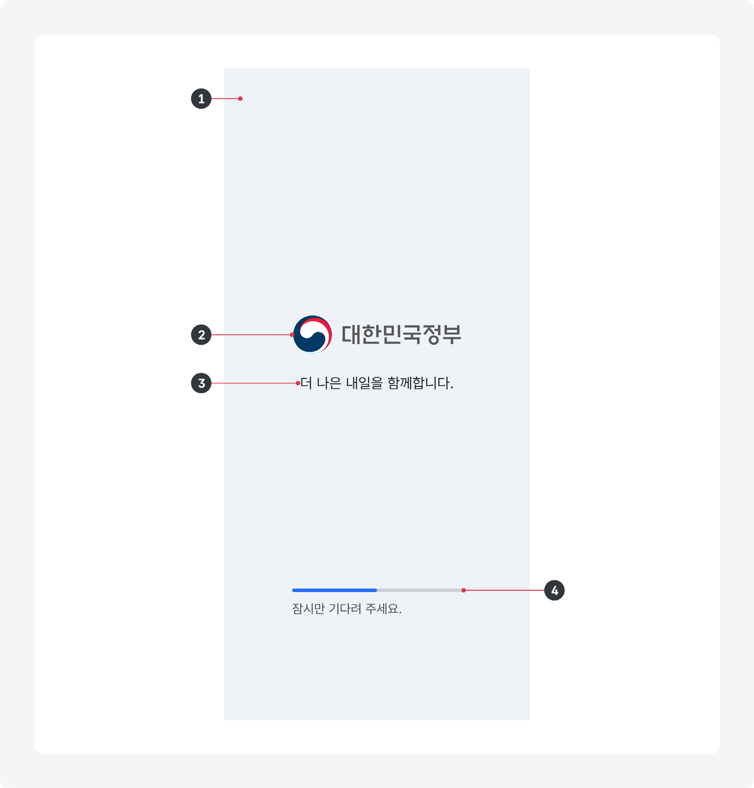
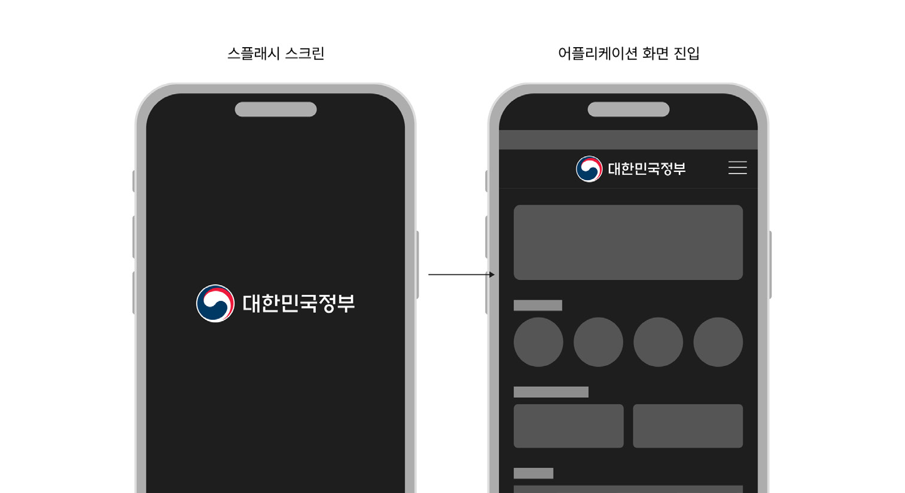
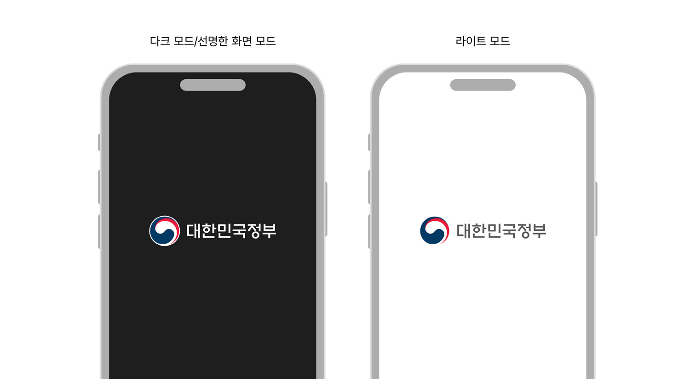
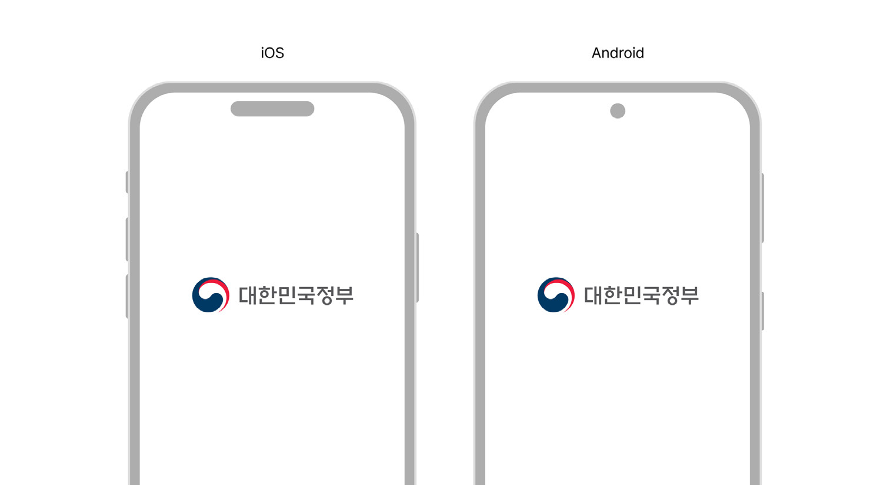
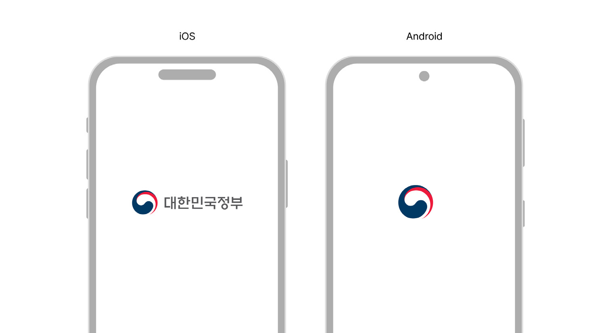
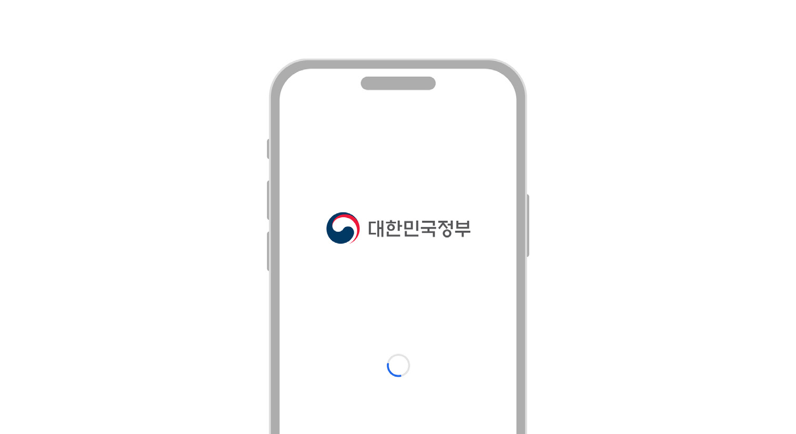
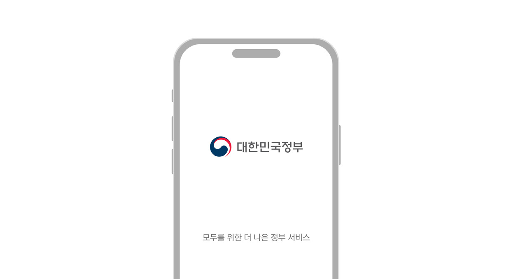
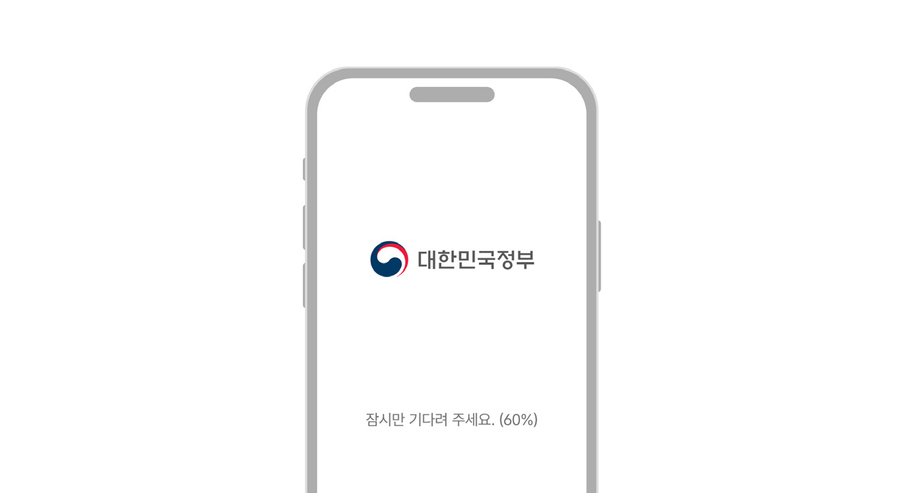

스플래시 스크린은 응용 프로그램이 실행되기 전에 사용자에게 짧은 시간 동안 제공되는 화면으로 모바일 애플리케이션 전용 컴포넌트이다.

## 용례

### 사용하기 적합한 경우

- 응용 프로그램을 실행하는 데 많은 리소스가 필요하여 로딩에 시간이 오래 걸리는 경우
- 브랜드 경험이 중요한 경우
## 유형

### 헤더

각 운영체제에서 기본으로 제공하거나 필수로 지정하도록 요구하고 있는 가장 기초적인 스타일의 스플래시 스크린으로 단일 면의 배경색, 브랜드 아이덴티티, 브랜드 명칭 텍스트로 구성된다.

### 브랜드

브랜드 이미지를 소구하기 위해 별도의 스타일을 적용한 형태의 스플래시 스크린이다.
## 구조

- 1 배경: 스플래시 스크린의 시스템 뷰. 브랜드/서비스 아이덴티티, 스타일 테마에 따라 색상이나 배경 이미지가 변경된다.
- 2 브랜드 아이덴티티: 서비스 로고 이미지
- 3 텍스트: 브랜드의 특성을 전달하는 메시지
- 4 스피너: 화면이나 요소의 다양한 처리 상태를 시각적으로 알려주는 컴포넌트

## 사용성 가이드라인

- 01 운영체제의 기본 스플래시 스크린을 활용한다.
- 02 디자인 테마별로 최적화된 스플래시 스크린 제공을 고려한다.
- 03 운영체제와 운영체제의 버전에 상관없이 일관성 있는 시작 경험을 제공한다.
- 04 앱 실행이 길어질 경우 상태를 보여줄 수 있는 피드백을 제공한다.
- 05 스플래시 스크린에 텍스트 사용을 최소화한다.
- 06 스플래시 스크린의 노출 시간을 임의로 조정하지 않는다.

### 운영체제의 기본 스플래시 스크린을 활용한다.

디지털 정부서비스는 개별 서비스의 브랜드 경험보다 하나의 정부서비스로서의 정체성을 강조해야 한다. 따라서 운영체제의 기본 스플래시 스크린을 활용하여 사용자에게 일관된 경험을 제공하는 것이 중요하다.

### 디자인 테마별로 최적화된 스플래시 스크린 제공을 고려한다.

다양한 디자인 테마에 맞게 스플래시 스크린을 최적화하여 사용자에게 서비스의 정체성을 더욱 명확하게 전달한다. 서비스의 디자인 테마가 다크 모드로 설정되어 있을 때, 스플래시 스크린도 다크 모드 테마의 스타일에 맞춘 디자인으로 제공해야 스플래시 화면에서의 인상과 첫 화면에서의 인상이 일관성 있게 유지될 수 있다.
### [모범 사례 1]

### [모범 사례 2]

### 운영체제와 운영체제의 버전에 상관없이 일관성 있는 시작 경험을 제공한다.

다양한 운영체제와 그 버전 간에도 스플래시 스크린의 디자인과 기능이 일관되도록 하여 사용자가 서비스에 대한 예측 가능성을 유지할 수 있도록 한다. 이를 위해 각 운영체제의 가이드라인을 준수하되, 정부서비스의 정체성 요소가 일관되게 반영되도록 디자인한다. 다양한 화면 크기나 해상도에서 스플래시 스크린이 왜곡 없이 적절하게 표시되는지 테스트해야 한다.
[모범 사례]

[피해야 할 사례]

### 앱 실행이 길어질 경우 상태를 보여줄 수 있는 피드백을 제공한다.

응용 프로그램의 실행에 시간이 오래 걸릴 경우, 사용자에게 현재 진행 상황을 시각적으로 알려줄 수 있는 단서(스피너, 텍스트, 로딩 애니메이션 등)를 제공한다. 스피너가 아닌 별도의 애니메이션을 표시하는 경우, 가급적 1,000ms 이내로 제작하여 사용자의 피로감을 최소화한다.

[모범 사례]

### 스플래시 스크린에 텍스트 사용을 최소화한다.

스플래시 스크린에 노출되는 텍스트는 읽기 어렵고 피로감을 유발할 수 있다. 따라서 브랜드 로고나 간단한 아이콘과 같은 시각적 요소를 중심으로 직관적인 디자인을 구성하고, 필수적인 정보만을 간결하게 제공하는 것이 바람직하다.

- [모범 사례 1]

- [모범 사례 2]

### 스플래시 스크린의 노출 시간을 임의로 조정하지 않는다.

가능한 스플래시 스크린의 노출 시간은 운영체제의 기본 설정에 따라 서비스가 실제로 로딩되는 시간을 초과하지 않도록 한다. 사용자가 스플래시 스크린에서 불필요하게 대기하는 시간을 줄이고 빠르게 목표 작업을 수행할 수 있도록 한다.
접근성 가이드라인

### 스플래시 스크린에 중요한 정보를 포함하지 않는다.

문자를 읽는 데 더 많은 시간이 필요한 사용자, 스크린 리더 사용자는 스플래시 스크린에 잠깐 동안 표시되었다 사라지는 텍스트를 잘 읽을 수 없다. 사용자가 반드시 확인해야 하는 중요한 정보라면 로딩이 완료된 이후, 첫 화면에서 사용자가 빠르게 인지할 수 있는 레이아웃과 컴포넌트를 사용하여 정보를 제공해야 한다.

- ▪ WCAG 2.1 Pause, Stop, Hide (AA)

애니메이션 사용에 유의한다.

애니메이션을 가진 요소가 화면에서 차지하는 면적의 비율, 지속 시간 등의 특성에 따라 기준 이상의 번쩍임, 깜빡임이 발생하여 사용자가 어지럽게 느끼거나 광과민성 발작이 유발될 수 있다

- ▪ WCAG 2.1 Three Flashes or Below Threshold (A)
