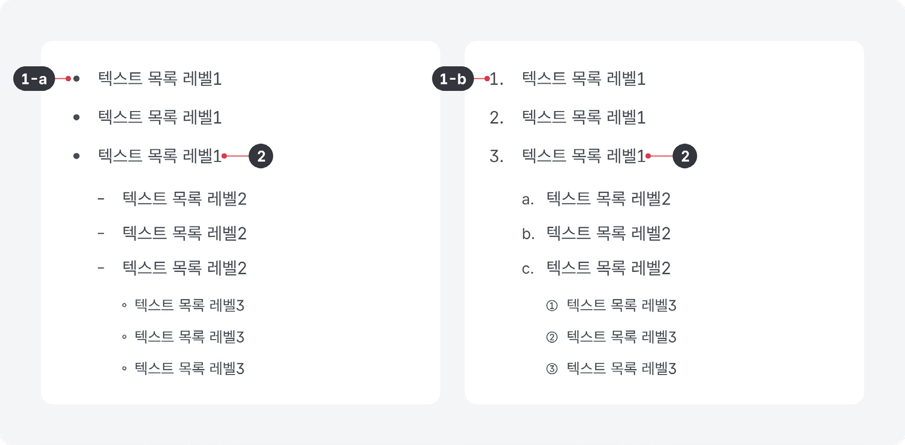
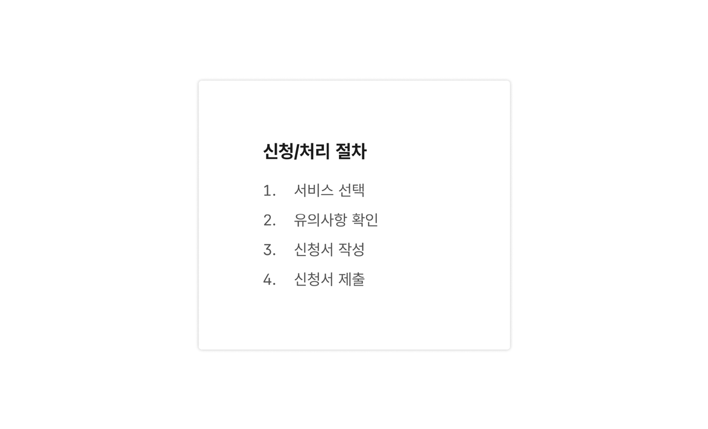
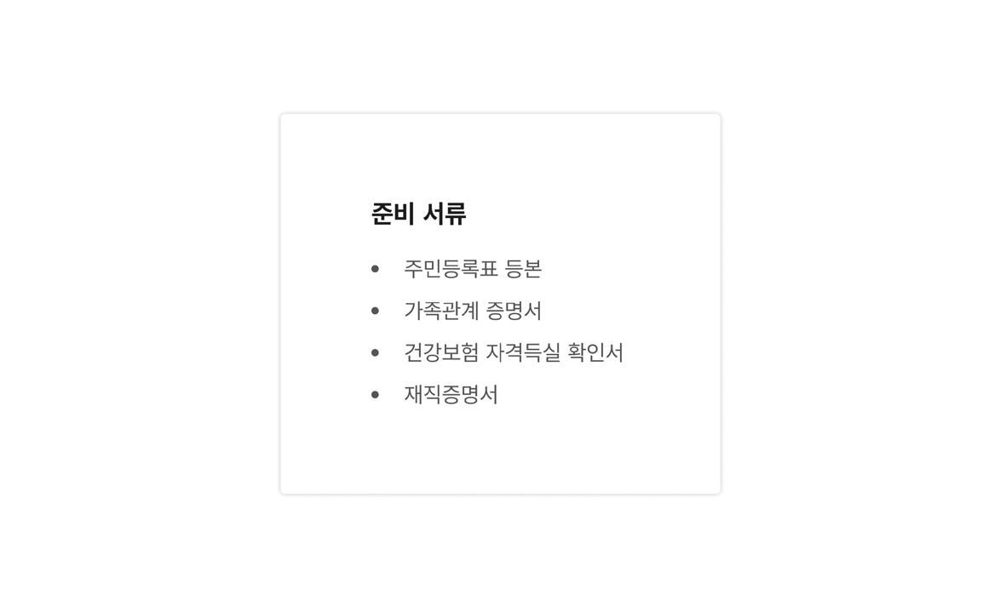
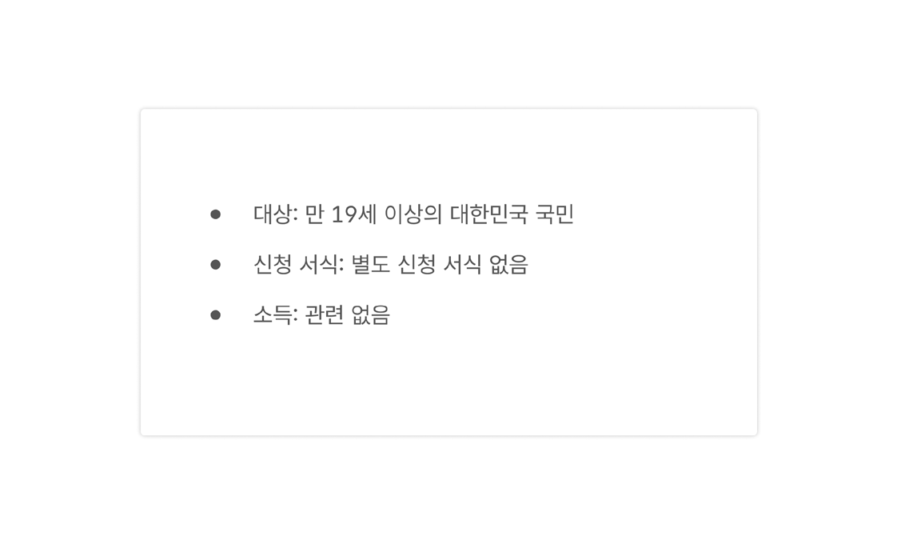
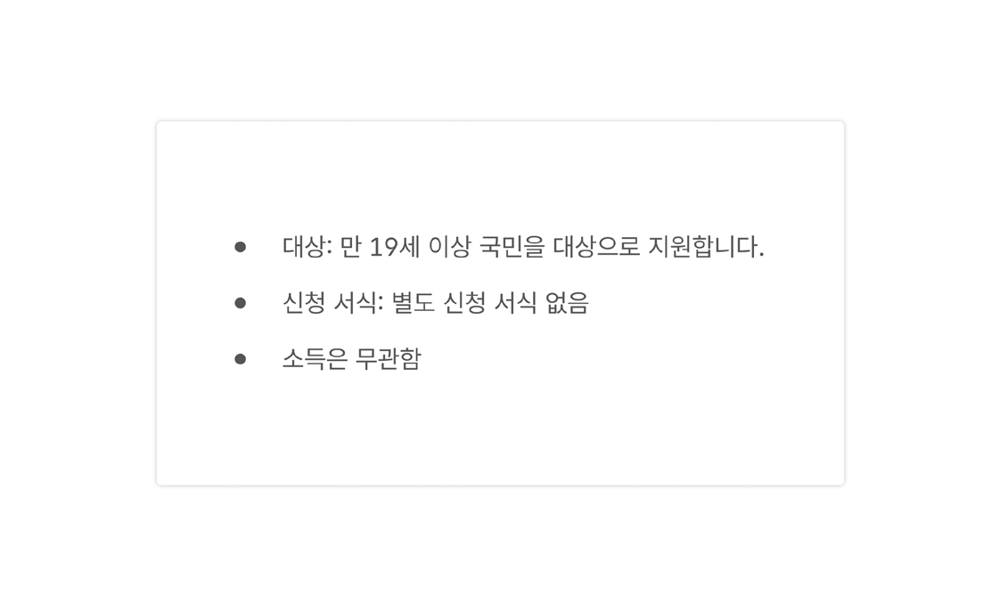
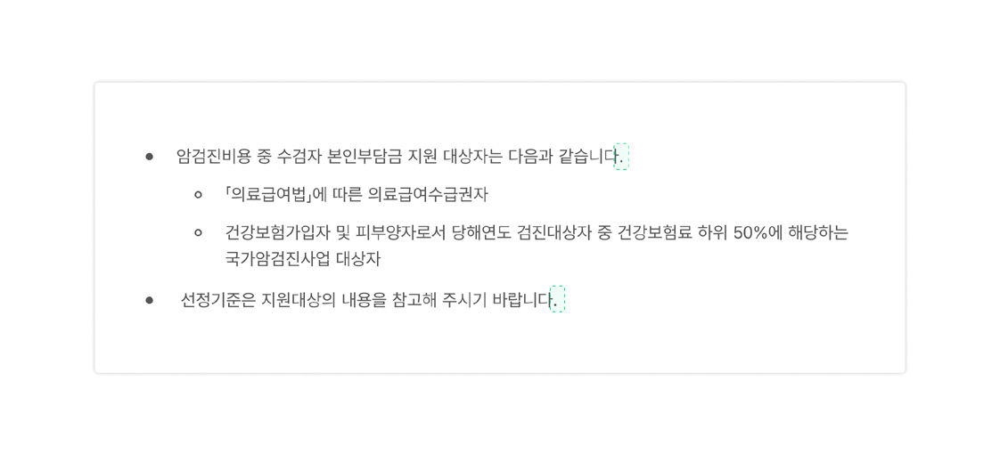
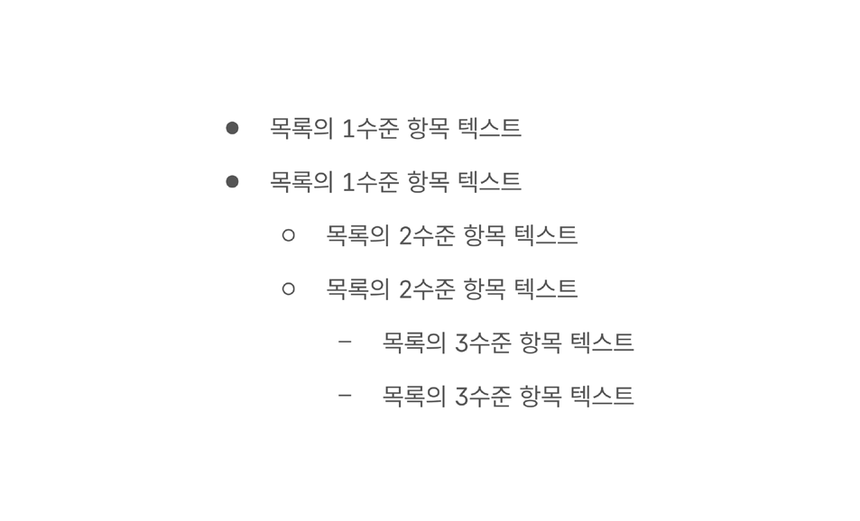
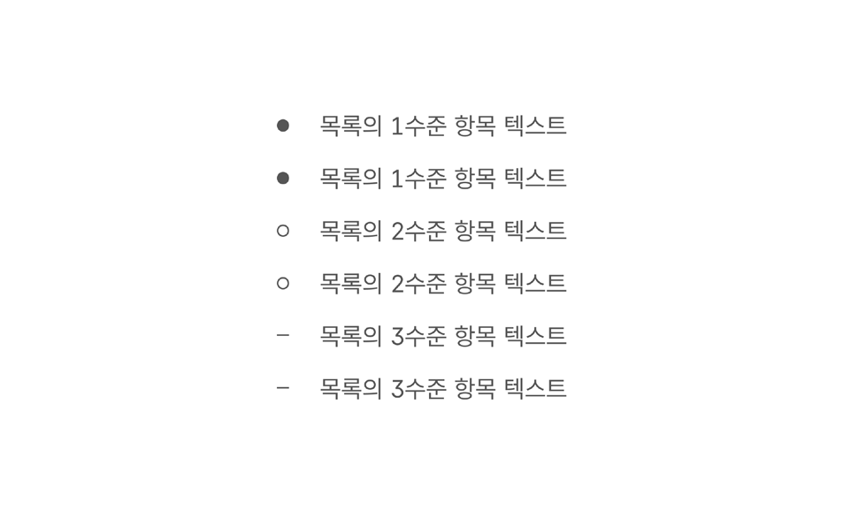
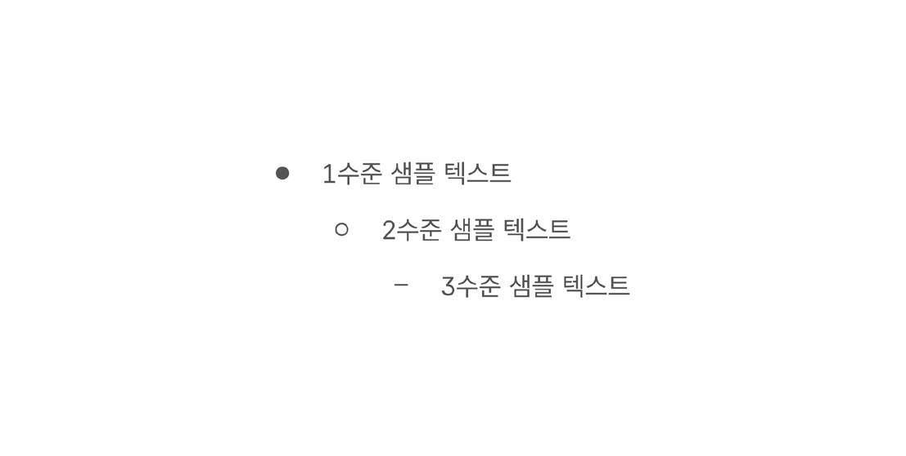
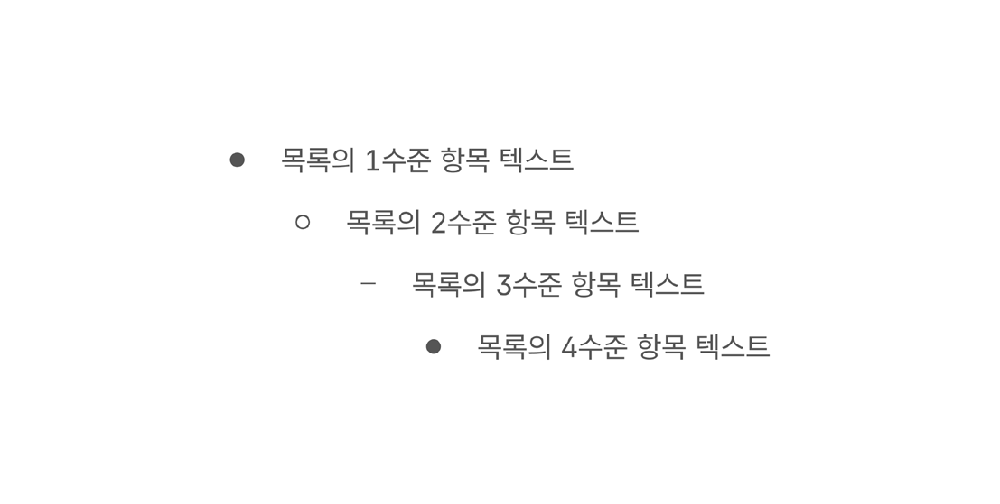

텍스트 목록은 계층 구조가 있는 텍스트 블록을 읽기 쉽게 구성한 것이다.

## 용례

### 사용하기 적합한 경우

- 여러 차원으로 구성된 텍스트 정보인 경우

표를 사용하는 것이 적절하다.

- 긴 문장의 서술형 텍스트인 경우

문단 형식으로 표현한다.
## 유형

### 순서 없는 목록

특정 순서나 순서를 따를 필요가 없는 관련 텍스트를 표현할 때 사용한다.

### 순서 있는 목록

특정 순서로 항목을 표시하거나 계층 구조를 표시해야 하는 경우에 사용한다.
## 구조

1 목록 구분자: 순차적으로 배열된 목록의 각 항목의 시작을 정의하는 문자 또는 이미지

a. 글머리 기호: 순서 없는 목록에 사용됨. 원, 네모, 줄표가 흔하게 사용되며 이 외에도 다양한 도형과 이미지를 사용할 수 있음 b. 번호: 순서 있는 목록에 사용됨. 숫자, 한글 자음, 영문 알파벳과 같이 순서의 진행을 보여줄 수 있는 글자가 사용됨 2 텍스트: 항목별 본문 내용

## 사용성 가이드라인

- 01 콘텐츠에 적합한 유형의 목록을 사용한다.
- 02 동일한 수준의 항목은 일관된 어투로 작성한다.
- 03 문장 형식에 적합한 종결 부호를 사용한다.
- 04 들여쓰기를 활용하여 계층 구조를 명확하게 구분한다.
- 05 목록은 3수준 이내로 구성한다.

### 콘텐츠에 적합한 유형의 목록을 사용한다.

모든 항목이 동등한 수준의 중요도를 갖는 경우에는 순서 없는 목록을 사용한다. 항목에 순서를 지정할 수 있거나 순위를 매기는 것이 가능하다면 순서 있는 목록을 사용한다. 모든 항목의 중요도가 동등함에도 순서 있는 목록을 사용하게 되면 사용자가 콘텐츠의 내용을 잘못 이해하거나, 특정 번호의 콘텐츠만 확인하거나, 순서를 건너뛰어 읽게 될 수 있다.

- [모범 사례 1]

- [모범 사례 2]

### 동일한 수준의 항목은 일관된 어투로 작성한다.

만약 첫 번째 항목이 서술식으로 작성되었다면 목록에서 동일한 수준의 항목은 일관되게 서술식으로 작성한다.

[모범 사례]

[피해야 할 사례]

### 문장 형식에 적합한 종결 부호를 사용한다.

서술식 목록의 가장 마지막 문장에는 반드시 종결 부호를 사용한다. 개조식 목록의 가장 마지막 문장에는 종결 부호를 생략할 수 있다.

[모범 사례]

[피해야 할 사례]

### 들여쓰기를 활용하여 계층 구조를 명확하게 구분한다.

글자 크기를 조정하는 것만으로는 서로 다른 수준의 항목을 구분하는 것이 어려울 수 있다. 글자 크기, 계층 구조의 수준을 고려하여 각 수준별로 적절한 들여쓰기 여백을 설정하여 계층 구조가 명확하게 구분될 수 있도록 한다.

[모범 사례]

[피해야 할 사례]

### 목록은 3수준 이내로 구성한다.

목록의 수준이 지나치게 깊어지면 항목 간 상하 관계를 이해하기 어려워진다.

[모범 사례]

[피해야 할 사례]

접근성 가이드라인

### 목록 유형에 적합한 태그를 사용한다.

시각적으로 목록의 항목이 글머리 기호로 구분되어 있다면 &lt;ul&gt;, &lt;li&gt; 태그로 목록을 마크업한다. 시각적으로 목록의 항목이 번호로 구분되어 있다면 &lt;ol&gt;, &lt;li&gt; 태그로 목록을 마크업한다.

- ▪ WCAG 2.1 Info and Relationships (A)

list-style-type: none 스타일 지정으로 인한 접근성 문제에 유의한다.

목록 요소(&lt;ul&gt;, &lt;ol&gt;)에 list-style-type: none 스타일이 지정되었을 때, 일부 모바일 디바이스 스크린 리더에서 요소의 역할을 탐지하지 못하는 문제가 발생할 수 있다. 따라서 목록에 list-style-type: none 스타일을 사용한다면 목록에는 role=”list”, 항목에는 role=”listitem”을 사용하여 목록의 역할을 명시해야 한다.

- ▪ WCAG 2.1 Info and Relationships (A)
- ▪ WCAG 2.1 Name, Role, Value (A)
