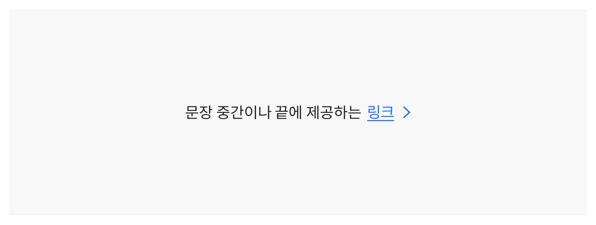
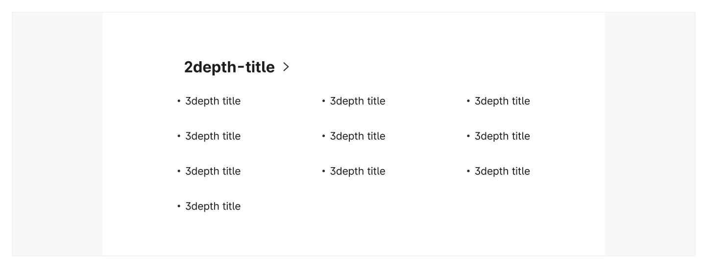
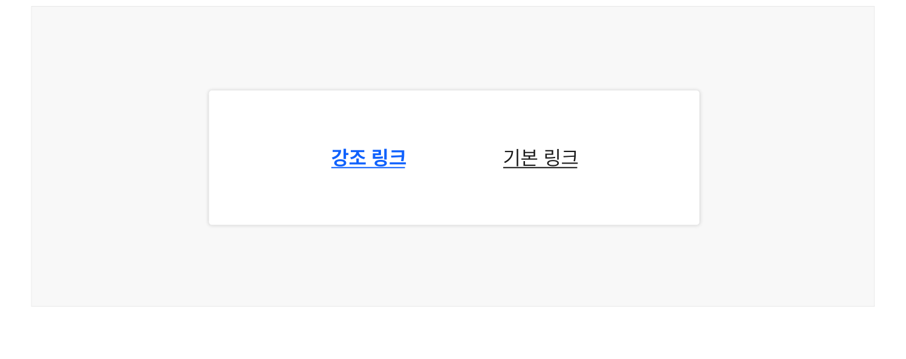
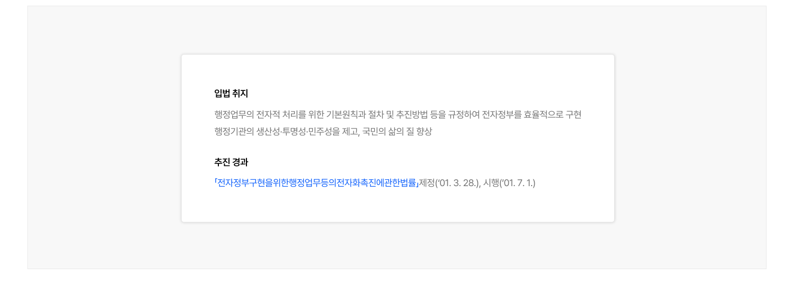
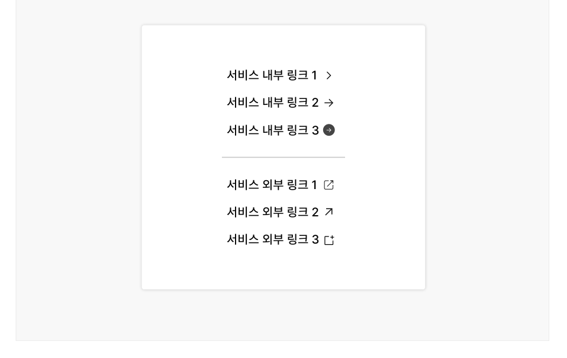

링크는 다른 서비스/애플리케이션, 한 서비스 내의 다른 화면, 한 화면 내의 다른 섹션 등으로 이동하는 데 사용되는 탐색 요소이다.

## 용례

### 사용하기 적합한 경우

- 다른 서비스/애플리케이션, 한 서비스 내의 다른 화면, 한 화면 내의 다른 섹션 등으로 이동이 필 요한 경우

링크 역할의 컴포넌트를 지원하는 경우 링크를 사용한다.

### 사용하기 적합하지 않은 경우

- 입력폼 제출, 대화창 실행, 기능 취소 등 중요한 상호작용이 필요한 경우

버튼 컴포넌트를 사용하는 것이 적절하다.
## 유형

단독


### 그룹



**시각 자료 텍스트 보완**

```text
원본 PDF의 UI 배치·상태·다이어그램을 보존한 시각 자료입니다.
```
## 구조

- 1 레이블: 링크와 연결된 대상을 안내하는 텍스트
- 2 인디케이터(선택): 일반 텍스트와 링크 텍스트를 명확하게 구분하기 위한 시각적인 식별자로 실선/파선, 밑줄로 표현됨. 링크가 메뉴, 푸터, 사이트맵과 같이 용도가 명확한 요소 내에서 사용되는 경우에는 인디케이터를 생략할 수 있음
- 3 아이콘(선택): 현재 서비스의 맥락을 벗어나 다른 웹사이트로 이동하거나 부가적인 도움말 제공 화면으로 이동하는 경우에 사용됨


## 사용성 가이드라인

- 01 링크가 인라인으로 사용될 때 링크 텍스트를 주변 텍스트와 동일한 크기로 제공한다.
- 02 링크와 관련된 사용자 과업, 플로(Flow)의 중요도에 따라 위계를 명확하게 구분한다.
- 03 링크를 색상만으로 구분하지 않는다.
- 04 링크 레이블은 연결된 목적지 정보를 예측할 수 있는 내용으로 제공한다.
- 05 이메일 주소, 전화번호 정보를 링크로 제공한다.
- 06 외부 서비스로 이동하는 링크를 분명하게 구분하고 일관된 방식으로 표현한다.
- 07 링크는 레이블의 설명과 가장 관련성이 높은 목적지로 바로 이동할 수 있도록 구성한다.
### 01. 링크가 인라인으로 사용될 때 링크 텍스트를 주변 텍스트와 동일한 크기로 제공한다.

문장 중 일부 단어의 크기만 조정되면 문단의 가독성에 중요한 텍스트의 스타일 속성(행간 등)에 일관성이 저하되어 정보 인지를 어렵게 만들고 사용자에게 혼동을 줄 수 있다.
### 02. 링크와 관련된 사용자 과업, 플로(Flow)의 중요도에 따라 위계를 명확하게 구분한다.

일반적으로 파란색이나 주조색(Maincolor)으로 표현되는 강조 링크를 가장 중요한 정보에 사용한다.

기본 링크는 중간 수준의 강조가 필요한 경우에 사용한다. 링크와 관련된 행동의 중요도가 낮거나 한 화면 또는 한 개의 뷰에서 중요도가 동일한 여러 개의 링크가 제공되어야 하는 경우에 적합하다.

[모범 사례]



**사례 텍스트 보완**

```text
강조 링크
기본 링크
```
### 03. 링크를 색상만으로 구분하지 않는다.

링크에 인디케이터를 제공하면 요소를 직관적으로 인지할 수 있으며, 색상 지각에 어려움이 있는 사용자도 링크를 명확하게 변별할 수 있다.

[모범 사례]



**사례 텍스트 보완**

```text
입법 취지
행정업무의 전자적 처리를 위한 기본원칙과 절차 및 추진방법 등을 규정하여 전자정부를 효율적으로 구현 행정기관의 생산성·투명성·민주성을 제고, 국민의 삶의 질 향상
추진 경과
「전자정부구현을위한행정업무등의전자화촉진에관한법률」제정('01. 3. 28.), 시행('01. 7. 1.)
```
[피해야 할 사례]


**사례 텍스트 보완**

```text
입법 취지
행정업무의 전자적 처리를 위한 기본원칙과 절차 및 추진방법 등을 규정하여 전자정부를 효율적으로 구현 행정기관의 생산성·투명성·민주성을 제고, 국민의 삶의 질 향상
추진 경과
「전자정부구현을위한행정업무등의전자화촉진에관한법률」제정('01. 3. 28.), 시행('01. 7. 1.)
```
### 04. 링크 레이블은 연결된 목적지 정보를 예측할 수 있는 내용으로 제공한다.

링크는 사용자를 현재의 맥락에서 데리고 나와 새로운 위치로 이동시킨다. 그러므로 링크 레이블은 목적지에서 발견할 수 있는 콘텐츠 내용을 정확하게 반영해야 한다. 따라서 주변 맥락을 활용하여 링크 목적지 정보를 명확하게 파악할 수 있는 경우를 제외하고 '이곳을 클릭하세요', '더 읽기'와 같은 일반적인 텍스트를 레이블로 사용해서는 안 된다.

레이블은 사용자가 이해할 수 있을 만큼 구체적이고 설명적이어야 하지만 텍스트가 여러 줄로 줄 바꿈될 정도로 길어지는 것은 피해야 한다.
### 05. 이메일 주소, 전화번호 정보를 링크로 제공한다.

이메일 주소, 전화번호를 링크로 마크업하고 각각에 'mailto:', 'tel:' 속성을 적용하면 텍스트를 복사하지 않고 링크를 실행하는 것만으로 적절한 플랫폼으로 연결될 수 있다.
### 06. 외부 서비스로 이동하는 링크를 분명하게 구분하고 일관된 방식으로 표현한다.

외부 서비스로 이동하는 링크에는 별도의 아이콘이나 텍스트(예 - '외부')를 제공하여 링크를 실행함으로써 현재 이용 중인 서비스를 벗어나게 될 것임을 사용자가 예측할 수 있도록 해야 한다.

[모범 사례]

[피해야 할 사례]



**사례 텍스트 보완**

```text
서비스 내부 링크 1
서비스 내부 링크 2
서비스 내부 링크 3
서비스 외부 링크 1
서비스 외부 링크 2
서비스 외부 링크 3
```


**사례 텍스트 보완**

```text
서비스 내부 링크 1
서비스 내부 링크 2
서비스 내부 링크 3
서비스 외부 링크 1
서비스 외부 링크 2
서비스 외부 링크 3
```
### 07. 링크는 레이블의 설명과 가장 관련성이 높은 목적지로 바로 이동할 수 있도록 구성한다.

사용자가 링크를 실행하여 이동한 후, 원하는 정보를 찾기 위해 부가적인 탐색을 시도하지 않도록 적절한 목적지로 연결해야 한다. 적절한 경우 연결된 서비스의 특정 섹션이 목적지로 사용될 수 있다.
## 접근성 가이드라인

### 01. 비활성화, 사용불가 상태인 경우를 제외하고 모든 링크는 키보드로 접근하고 조작할 수 있도록 한다.

&lt;a&gt;가 스크린 리더에서 컨트롤 요소로 인식되고 키보드로 접근할 수 있도록 href 속성을 선언해야 한다. 단, 링크가 사용불가 상태이거나 일시적으로 기능이 동작하지 않도록 하는 경우, href 속성을 생략하여 키보드가 접근하지 않도록 하는 것이 적절하다.

- KWCAG 2.2 키보드 사용 보장
- WCAG 2.1 Keyboard (A)

### 02. 링크 텍스트는 링크 목적지 정보를 적절하게 설명할 수 있는 내용으로 제공한다.

링크 요소의 레이블을 텍스트 형식으로 제공하여 스크린 리더 사용자가 링크 목적지 정보를 전달받을 수 있도록 해야 한다. 만약 눈에 보이는 텍스트만으로 목적지에 대한 정보를 충분히 전달하기 어렵다면 툴팁 속성(title)을 보조적인 수단으로 활용할 수 있다.

- KWCAG 2.2 적절한 링크 텍스트
- WCAG 2.1 Link Purpose (In Context) (A)

### 03. 링크 레이블은 고유한 내용으로 제공한다.

같은 목적지로 이동하는 링크 레이블은 동일하게, 서로 다른 목적지로 이동하는 링크 레이블은 다르게 제공하여 사용자가 목적지를 혼동하지 않도록 해야 한다.

- KWCAG 2.2 적절한 링크 텍스트
- WCAG 2.1 Link Purpose (In Context) (A)
- WCAG 2.1 Consistent Identification (AA)
상호작용 가이드라인


### 04. 링크를 적절한 크기로 제공한다.

클릭, 터치 영역을 정교하게 조작하기 어려운 사용자를 고려하여, 마우스 상호작용에 대해서는 17px × 17px, 터치 상호작용에 대해서는 44px x 44px 이상의 영역에서 반응할 수 있는 컨트롤 크기를 사용할 것을 권장한다.

- WCAG 2.1 Target Size (AAA)

### 05. 링크로 작동하는 모든 요소는 스크린 리더에서 링크로 인지될 수 있도록 한다.

&lt;a&gt; 대신 불가피하게 다른 태그를 사용해야 하는 경우 role="link"를 사용하여 스크린 리더에서 요소의 역할이 링크로 인식될 수 있도록 해야 한다.

- WCAG 2.1 Name, Role, Value (A)

## 상호작용 가이드라인

### 탐색

### 링크 실행

| 구분 | 설명 |
|---|---|
| Tab, Shift + Tab | 모든 링크는 Tab, Shift + Tab 키를 눌렀을 때 접근할 수 있어야 한다. |

| 구분 | 설명 |
|---|---|
| Click | 링크 영역을 Click 하면 링크가 실행된다. |
| Enter | 링크가 초점을 가진 상태에서 Enter 키를 누르면 링크가 실행된다. |
