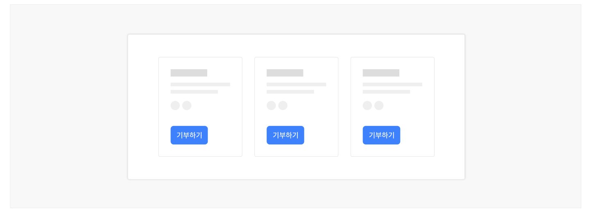

버튼은 어떤 기능이나 동작을 실행하거나 기능을 사용하기 위한 상태로 변경하는 요소이다. 사용자가 서비스를 이용하는 과정에서 어떤 행동이 중요한지에 따라 관련된 버튼이 다양한 스타일로 표현된다.

## 용례

### 사용하기 적합한 경우

- 입력폼 제출, 대화창 실행, 기능 취소 등 중요한 상호작용이 필요한 경우

- 일반적인 기능을 실행할 때
- 상태를 전환할 때
- 도움말을 제공할 때
- 진행 중인 프로세스를 중단하거나 취소할 때
- 중요한 데이터를 완전히 삭제할 때

사용하기 적합하지 않은 경우

- 현재 화면에서 완전히 다른 화면이나 서비스로 이동하는 경우

- 한 서비스 내에서 완전히 다른 화면으로 전환되거나 새 창이 별도의 탭이나 창으로 실행되는 경우에는 링크 컴포넌트를 사용해야 한다.
## 구조

- 1 텍스트 레이블: 버튼을 눌렀을 때 실행되는 기능에 대한 설명. 기본적으로 모든 버튼은 텍스트 레이블을 제공해야 하지만 아이콘만으로 표현되는 버튼인 경우에는 텍스트 레이블을 시각적으로 숨긴 상태로 사용할 수 있음
- 2 컨테이너(선택): 버튼을 배경과 구분하는 시각적인 수단으로 면 또는 선으로 표현됨
- 3 아이콘(선택): 버튼을 눌렀을 때 실행되는 기능을 텍스트 대신 시각적인 상징으로 표현한 것

## 사용성 가이드라인

- 01 버튼이 그룹으로 제공될 때 모든 버튼의 크기를 동일하게 제공한다.
- 02 버튼과 관련된 사용자 과업, 플로(Flow)의 중요도에 따라 버튼 간 위계를 명확하게 구분한다.
- 03 한 화면에 최상위 수준의 강조 버튼은 한 번만 사용한다.
- 04 버튼 그룹을 수직으로 배열할 때 최상위 수준의 강조 버튼을 첫 번째로 배치한다.
- 05 버튼의 텍스트 레이블은 버튼을 통해 실행되는 기능을 예측할 수 있는 명확한 내용을 동사형으로 제공한다.
- 06 아이콘은 중요한 작업에 그리고 반드시 필요한 경우에 사용한다.
- 07 사용자가 실수로 버튼을 두 번 이상 누르는 상황을 고려한다.
### 01. 버튼이 그룹으로 제공될 때 모든 버튼의 크기를 동일하게 제공한다.

버튼의 크기가 동일하다는 것은 그룹 내 선택지가 동질적임을 암시한다. 특정 버튼을 강조해야 할 필요가 있다면 크기가 아닌 다른 스타일을 통해 정보의 위계를 구분해야 한다.
### 02. 버튼과 관련된 사용자 과업, 플로(Flow)의 중요도에 따라 버튼 간 위계를 명확하게 구분한다.

일반적으로 주조색(Maincolor)을 배경색으로 채운 버튼은 강조 버튼으로 사용자로부터 중요한 행동을 유도하고자 할 때 사용한다.

윤곽선 버튼은 기본 버튼으로 중간 수준의 강조가 필요한 경우에 사용한다. 버튼과 관련된 행동의 중요도가 낮거나 한 화면 또는 한 개의 뷰에서 중요도가 동일한 여러 개의 기능이 제공되어야 하는 경우에 적합하다.

텍스트 버튼이 가장 낮은 수준의 강조를 가지며 다양한 기능이 제공되어야 할 때 사용하기 적합하다.

[모범 사례]

[피해야 할 사례]
### 03. 한 화면에 최상위 수준의 강조 버튼은 한 번만 사용한다.

채운 스타일의 버튼은 시각적으로 매우 현저하기 때문에 사용자가 빠르게 인지할 수 있도록 도와준다. 하지만 한 화면에 채운 버튼을 여러 개 사용할 경우 사용자는 인지적 부담이 증가해 가장 중요한 행동 관련 버튼을 발견하는 데 많은 시간이 걸릴 수 있다.

[모범 사례]



**사례 텍스트 보완**

```text
기부하기
```
[피해야 할 사례]


**사례 텍스트 보완**

```text
기부하기
```
### 04. 버튼 그룹을 수직으로 배열할 때 최상위 수준의 강조 버튼을 첫 번째로 배치한다.

일반적으로 버튼 그룹은 수평 방향으로 나란히 배치된다. 그러나 버튼이 패널, 모바일 디바이스처럼 좁은 영역에 제공되어야 하는 경우 공간의 제약으로 인해 버튼을 수직으로 배치할 수 있다. 이 경우 버튼의 중요도 순으로 위쪽에 배치하여 사용자의 시선이 중요도가 높은 버튼에 먼저 도달할 수 있도록 구현해야 한다.

### 05. 버튼의 텍스트 레이블은 버튼을 통해 실행되는 기능을 예측할 수 있는 명확한 내용을 동사형으로 제공한다.

버튼은 어떤 기능이나 동작을 실행시키는 요소이므로 사용자가 수행하는 작업을 동사로 표현하는 것이 적절하다. 명사나 형용사 레이블은 버튼의 용도나 목적을 명확하게 전달하지 못할 수 있으므로 '완료', '닫기', '취소', '추가', '삭제'와 같은 일반적인 작업인 경우와 동사를 사용했을 때 버튼 길이에 문제가 발생하거나 해석이 모호해지는 경우를 제외하고 항상 동사형 레이블을 제공해야 한다.
### 06. 아이콘은 중요한 작업에 그리고 반드시 필요한 경우에 사용한다.

아이콘은 가장 핵심적인 동작을 수행하는 버튼에 사용해야 하며, 아이콘은 버튼의 텍스트 레이블과 의미적으로 높은 관련성이 있어야 한다. 텍스트 레이블이 없는 아이콘 버튼은 대부분의 사용자가 다른 서비스/ 시스템에서의 학습을 통해 의미를 명확하게 이해하고 있는 경우(예 - 설정, 닫기, 공감 등)가 아니라면 사용하지 않는 것이 바람직하다. 아이콘이 있는 버튼은 아이콘이 없는 버튼보다 강조 수준이 높아야 한다. 버튼 그룹에서 가장 중요한 작업에 아이콘이 없으면 나머지 하위 수준 작업에서 아이콘을 사용해서는 안 된다.

### 07. 사용자가 실수로 버튼을 두 번 이상 누르는 상황을 고려한다.

인터넷 환경이 느리거나, 시스템의 반응이 즉각적이지 않거나, 사용자가 손떨림이 있는 경우 실수로 버튼을 두 번 이상 누를 수 있다. 그러므로 버튼이 데이터를 전송하는 용도로 사용되는 경우에는 사용자의 두 번째 인터랙션이 무시되도록 구현해야 한다.
## 접근성 가이드라인

### 01. 모든 버튼에는 접근 가능한 이름을 제공한다.

모든 버튼에는 기능, 목적을 이해할 수 있는 설명을 텍스트로 제공해야 한다.

- KWCAG 2.2 적절한 링크 텍스트
- WCAG 2.1 Name, Role, Value (A)

### 02. 버튼의 기능을 설명할 수 있는 텍스트 레이블이 있는 아이콘 버튼에 대체 텍스트를 제공하지 않는다.

이 경우 버튼의 아이콘은 강조와 버튼 용도의 빠른 인지를 위해 사용되는 것이므로 아이콘에 대체 텍스트를 제공하지 않아야 한다.

- KWCAG 2.2 적절한 대체 텍스트 제공
- WCAG 2.1 Non-text Content (A)

### 03. 버튼의 접근 가능한 이름은 버튼을 통해 실행되는 기능을 적절하게 설명할 수 있는 내용으로 제공한다.

버튼이 아이콘 이미지만으로 제공되는 경우, 버튼의 텍스트 이름이 이미지에 대한 설명이 아니라 버튼의 기능에 대한 정확한 설명을 제공할 수 있는지에 유의하여 제공해야 한다.

- KWCAG 2.2 적절한 링크 텍스트
- WCAG 2.1 Headings and Labels (AA)
### 04. 모든 버튼은 키보드로 접근하고 조작할 수 있도록 한다.

비활성화, 사용불가 상태인 경우를 제외하고 모든 버튼은 키보드로 접근하고 조작할 수 있도록 해야 한다.

- KWCAG 2.2 키보드 사용 보장
- WCAG 2.1 Keyboard (A)

### 05. 버튼의 키보드 초점이 명확하게 표시되도록 한다.

모든 버튼은 초점을 받은 상태가 시각적으로 명확하게 구분되어야 한다. 가능한 한 포커스링의 스타일은 사용자 에이전트에서 제공하는 기본 스타일을 유지한다. 만약 포커스링 스타일에 변경이 필요하다면 모든 유형의 버튼에서 포커스링이 가려지지 않고 명확하게 표시되며 인접 배경과 3:1 이상의 명도 대비를 갖는지 확인해야 한다.

- KWCAG 2.2 초점 이동과 표시
- WCAG 2.1 Focus Visible (AA)
- WCAG 2.1 Non-text Contrast (AA)

### 06. 버튼으로 작동하는 모든 요소는 스크린 리더에서 버튼으로 인지될 수 있도록 한다.

&lt;button&gt; 대신 불가피하게 다른 태그를 사용해야 하는 경우 role="button"을 사용하여 스크린 리더에서 요소의 역할이 버튼으로 인식될 수 있도록 해야 한다.

- WCAG 2.1 Name, Role, Value (A)
### 07. 버튼을 적절한 크기로 제공한다.

클릭, 터치 영역을 정교하게 조작하기 어려운 사용자를 고려하여, 마우스 상호작용에 대해서는 17px × 17px, 터치 상호작용에 대해서는 44px x 44px 이상의 영역에서 반응할 수 있는 컨트롤 크기를 사용할 것을 권장한다.

- KWCAG 2.2 조작 가능
- WCAG 2.1 Target Size (AAA)

## 상호작용 가이드라인

### 탐색

### 실행

| 구분 | 설명 |
|---|---|
| Tab, Shift + Tab | 모든 버튼은 Tab, Shift + Tab 키를 눌렀을 때 접근할 수 있어야 한다. |

| 구분 | 설명 |
|---|---|
| Click | 버튼의 동작을 실행시킨다. |
| Enter, Space | 버튼이 초점을 가진 상태에서 버튼의 동작을 실행시킨다. |
