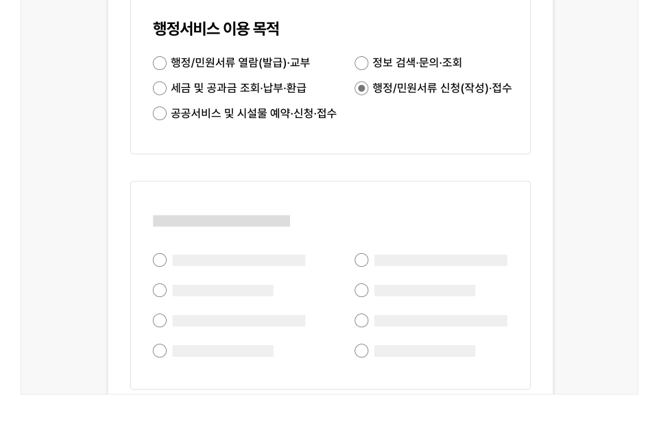
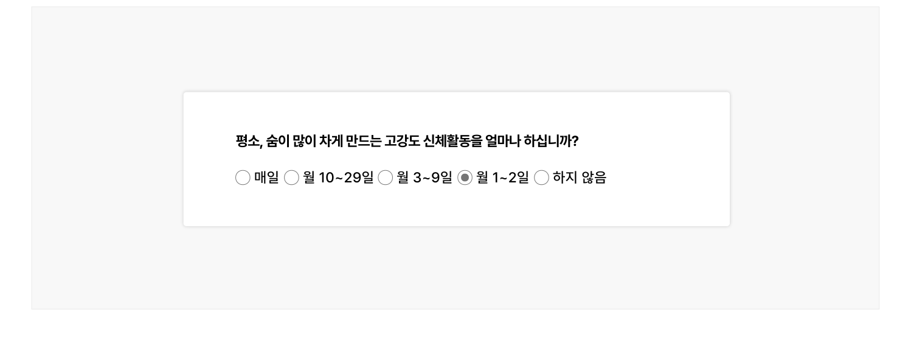
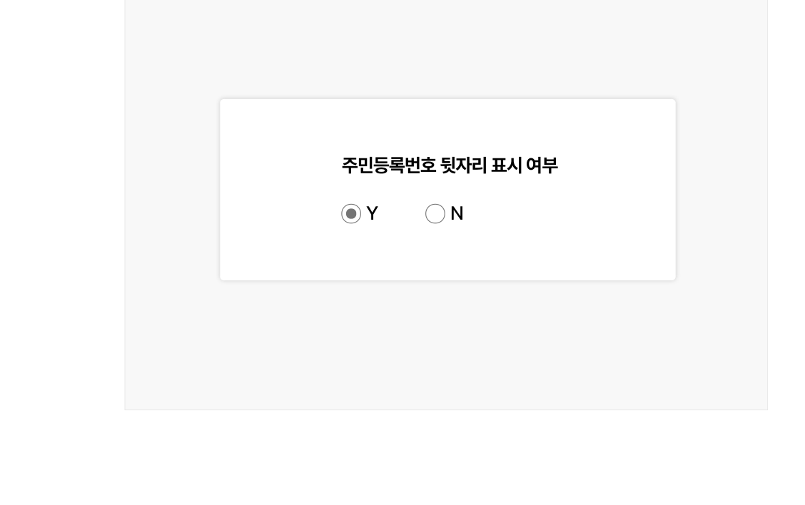
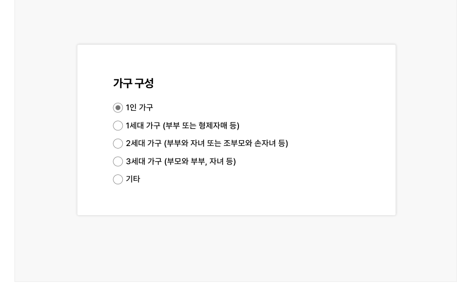
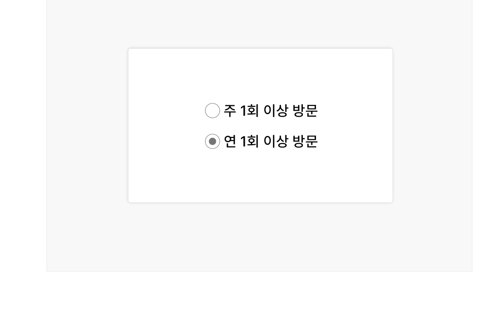
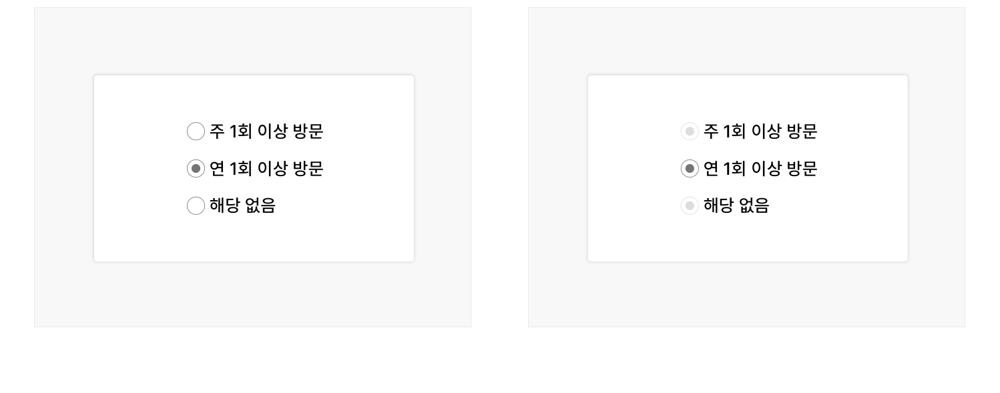

라디오 버튼은 사용자가 여러 개의 옵션 중 한 개의 값을 선택할 수 있도록 하는 경우에 사용한다. 사용자가 옵션 목록에서 새로운 옵션을 선택했을 때, 기존에 선택되었던 옵션은 자동으로 선택이 해제되어야 한다.

## 용례

### 사용하기 적합한 경우

- 사용자가 옵션 목록에서 한 개의 값만 선택할 수 있는 경우

사용자가 여러 개의 옵션을 선택할 수 있도록 하는 경우에는 체크박스를 사용해야 한다.

- 사용자가 옵션을 선택하기 위해 여러 옵션을 비교해야 하거나 선택 과정의 효율성이 중요한 경우

셀렉트나 콤보박스보다 라디오 버튼이 적합하다.

예) 설문조사 응답 문항
### 사용하기 적합하지 않은 경우

- 사용자가 여러 개의 옵션을 선택할 수 있도록 하는 경우

체크박스를 사용해야 한다.

- 옵션의 개수가 많은 경우

옵션의 개수가 7개를 초과하며 사용자가 옵션 목록에 친숙한 경우에 라디오 버튼이 아니라 셀렉트나 콤보박스를 사용하면 사용자의 인지적 부담을 줄이고 활용할 수 있는 공간을 확보하는 데 도움이 된다.

- 모바일 플랫폼

옵션을 확인하기 위해 전체 화면을 스크롤 하는 것보다 별도의 옵션 목록을 탐색하는 것이 더 효율적이므로 셀렉트나 콤보박스의 사용을 우선적으로 고려해야 한다.
## 구조

1 그룹 레이블(선택): 옵션 목록의 카테고리에 대한 설명 또는 옵션 선택에 대한 도움말을 제공함 2 버튼 양식: 버튼의 현재 선택 상태를 보여줌 3 버튼 레이블: 선택하거나 선택 해제할 정보를 나타냄


## 사용성 가이드라인

- 01 기본적으로 라디오 버튼의 옵션은 가나다순으로 정렬한다.
- 02 라디오 버튼은 수직으로, 라디오 버튼의 레이블은 양식의 오른쪽에 배치한다.
- 03 라디오 버튼을 수평으로 배치하는 경우 버튼 간 간격을 충분히 제공한다.
- 04 라디오 버튼의 레이블은 분명하고 정확하게 제공한다.
- 05 사용자가 정확한 값을 입력하는 것이 중요한 경우 라디오 버튼의 특정 옵션을 기본 선택값으로 제공하지 않아야 한다.
- 06 '해당 없음', '잘 모름' 옵션 제공을 고려한다.

### 기본적으로 라디오 버튼의 옵션은 가나다순으로 정렬한다.

사용자가 가장 많이 선택하는 옵션을 먼저 배치할 경우 옵션을 빠르게 선택하는 데 도움이 될 수 있다. 그러나 특정한 기준에 따른 옵션 정렬이 편견이나 차별을 강화할 수 있으므로 유의해서 사용해야 한다. 정렬 기준에 대한 명확한 근거나 이유가 없는 경우에는 가나다순으로 정렬하는 것이 가장 안전하다.

### 라디오 버튼은 수직으로, 라디오 버튼의 레이블은 양식의 오른쪽에 배치한다.

가독성과 옵션 간 명확한 구분을 위하여 라디오 버튼은 수직으로 배치하는 것이 좋다. 이때, 레이블은 양식의 오른쪽에 배치해 일관된 위치에서 텍스트를 읽을 수 있도록 해야 한다. 만약 라디오 버튼을 수평으로 배치해야 한다면 레이블의 텍스트 길이가 지나치게 길지 않아야 한다.

[모범 사례]

[피해야 할 사례]



**사례 텍스트 보완**

```text
행정서비스 이용 목적
행정/민원서류 열람(발급)·교부
정보 검색·문의·조회
세금 및 공금 조회·납부·환급
행정/민원서류 신청(작성)·접수
공공서비스 및 시설물 예약·신청·접수
```


**사례 텍스트 보완**

```text
행정서비스 이용 목적
행정/민원서류 열람(발급)·교부
정보 검색·문의·조회
세금 및 공금 조회·납부·환급
행정/민원서류 신청(작성)·접수
공공서비스 및 시설물 예약·신청·접수
```

### 라디오 버튼을 수평으로 배치하는 경우 버튼 간 간격을 충분히 제공한다.

각 라디오 버튼의 간격을 양식과 레이블 간 간격과 동일하게 제공하는 경우 사용자에게 혼동을 줄 수 있으므로 유의해야 한다.

[모범 사례]



**사례 텍스트 보완**

```text
원본 PDF의 UI 배치·상태·다이어그램을 보존한 시각 자료입니다.
```
[피해야 할 사례]


**사례 텍스트 보완**

```text
원본 PDF의 UI 배치·상태·다이어그램을 보존한 시각 자료입니다.
```

### 라디오 버튼의 레이블은 분명하고 정확하게 제공한다.

사용자가 어떤 옵션을 선택하는 것인지 이해할 수 있도록 라디오 버튼의 레이블은 분명하고 정확하게 제공해야 한다.

[모범 사례]

[피해야 할 사례]



**사례 텍스트 보완**

```text
주민등록번호 뒷자리 표시 여부
표시함
표시하지 않음
Y
N
```


**사례 텍스트 보완**

```text
원본 PDF의 UI 배치·상태·다이어그램을 보존한 시각 자료입니다.
```

### 사용자가 정확한 값을 입력하는 것이 중요한 경우 라디오 버튼의 특정 옵션을 기본 선택값으로 제공하지 않아야 한다.

사용자가 어떤 질문이나 선택을 해야 하는지를 놓치거나 잘못된 옵션값을 제출하는 실수를 할 수 있으므로 유의해야 한다.

[모범 사례]

[피해야 할 사례]



**사례 텍스트 보완**

```text
가구 구성
1인 가구
1세대 가구 (부부 또는 형제자매 등)
2세대 가구 (부부와 자녀 또는 조부모와 손자녀 등)
3세대 가구 (부모와 부부, 자녀 등)
기타
```


**사례 텍스트 보완**

```text
가구 구성
1인 가구
1세대 가구 (부부 또는 형제자매 등)
2세대 가구 (부부와 자녀 또는 조부모와 손자녀 등)
3세대 가구 (부모와 부부, 자녀 등)
기타
```

### '해당 없음', '잘 모름' 옵션 제공을 고려한다.

일단 라디오 버튼 옵션 목록에서 하나의 옵션을 선택하고 나면 화면을 새로고침하기 전까지 선택을 되돌릴 수 없다. 필수 입력 항목이 아닌 경우와 같이 아무 값도 선택하지 않아도 되는 상황을 고려하여 '해당 없음', '잘 모름', '선택 안 함'과 같은 옵션을 제공하는 것이 좋다.

[모범 사례]

[피해야 할 사례]



**사례 텍스트 보완**

```text
주 1회 이상 방문
연 1회 이상 방문
해당 없음
```


**사례 텍스트 보완**

```text
주 1회 이상 방문
연 1회 이상 방문
```
## 접근성 가이드라인

### 01. 버튼 양식과 인접 배경 간 명도 대비를 3:1 이상으로 표현한다.

원형의 라디오 버튼 양식은 라디오 버튼의 선택 상태와 해당 요소가 라디오 버튼 컴포넌트임을 인지할 수 있게 도와주는 중요한 시각적 정보이므로 인접 배경과의 명도 대비를 최소 3:1 이상으로 제공해야 한다.

- KWCAG 2.2 텍스트 콘텐츠의 명도 대비
- WCAG 2.1 Non-text Contrast (AA)
### 02. 버튼 양식의 선택 상태를 색상으로만 구분하지 않는다.

버튼 양식의 선택 상태를 색상 이외의 수단으로 구분할 수 있는 시각적 단서를 제공해야 한다.

- KWCAG 2.2 색에 무관한 콘텐츠 인식
- WCAG 2.1 Use of Color (A)

[모범 사례]



**사례 텍스트 보완**

```text
주 1회 이상 방문
연 1회 이상 방문
해당 없음
```
[피해야 할 사례]


**사례 텍스트 보완**

```text
주 1회 이상 방문
연 1회 이상 방문
해당 없음
```
### 03. 라디오 버튼을 키보드로 탐색하고 실행할 수 있도록 한다.

사용자 에이전트에서 제공되는 기본 버튼 양식이 아니라 커스텀 양식 디자인을 사용하는 경우에 기본 버튼 양식에 display:none, visibility:hidden, opacity:0과 같은 스타일을 하면 스크린 리더에서 라디오 버튼의 역할을 인지할 수 없으며 키보드로 옵션을 선택할 수 없게 된다.

- KWCAG 2.2 키보드 사용 보장
- WCAG 2.1 Keyboard (A)
- WCAG 2.1 No Keyboard Trap (A)

### 04. 라디오 버튼에 키보드 초점이 명확하게 표시되도록 한다.

사용자 에이전트에서 제공되는 기본 버튼 양식이 아니라 커스텀 양식 디자인을 사용하는 경우 키보드 초점이 시각적으로 표시되도록 스타일을 제공해야 한다. 라디오 버튼 요소를 시각적으로 숨기는 경우, 시각적으로 표시되고 있는 버튼 양식과 숨겨진 요소의 크기와 위치를 일치시켜 포커스링이 적절하게 표시되도록 구현해야 한다.

- KWCAG 2.2 초점 이동과 표시
- WCAG 2.1 Focus Visible (AA)
- WCAG 2.1 Non-text Contrast (AA)
### 05. 라디오 버튼에 접근 가능한 이름을 제공한다.

스크린 리더 사용자가 라디오 버튼의 용도를 확인할 수 있도록 &lt;label&gt;, title, aria-label, aria-labelledby 중 1가지 방식을 이용하여 레이블을 제공해야 한다. 이때, 가능하면 &lt;label&gt;을 이용하여 사용자가 레이블을 클릭하였을 때에도 값을 선택할 수 있도록 구현하는 것이 좋다.

- KWCAG 2.2 레이블 제공
- WCAG 2.1 Info and Relationships (A)
- WCAG 2.1 Name, Role, Value (A)

### 06. 스크린 리더에서 그룹 레이블과 라디오 버튼 그룹의 관계를 확인할 수 있도록 한다.

&lt;fieldset&gt;, &lt;legend&gt;를 사용하여 스크린 리더 사용자에게 라디오 버튼 그룹에서 값을 선택하는 목적을 보다 명확하게 전달할 수 있다.

- WCAG 2.1 Info and Relationships (A)
- WCAG 2.1 Labels or Instructions (A)


## 상호작용 가이드라인

### 탐색

### 실행

| 구분 | 설명 |
|---|---|
| Tab, Shift + Tab | 모든 라디오 버튼은 Tab, Shift + Tab 키를 눌렀을 때 접근할 수 있어야 한다. |
| 방향키 ↑, ↓ | 방향키 ↑, ↓를 눌렀을 때 다음/이전 라디오 버튼 양식으로 초점이 이동하고 값이 선택되어야 한다. |

| 구분 | 설명 |
|---|---|
| Click | 버튼 양식 또는 버튼 레이블을 Click 하였을 때 값이 선택되어야 한다. |
| Space | 라디오 버튼 양식에 초점이 있는 상태에서 Space 키를 누르면 값이 선택되어야 한다. |
| 방향키 ↑, ↓ | 방향키 ↑, ↓를 눌렀을 때 다음/이전 라디오 버튼 양식으로 초점이 이동하고 값이 선택되어야 한다. |
