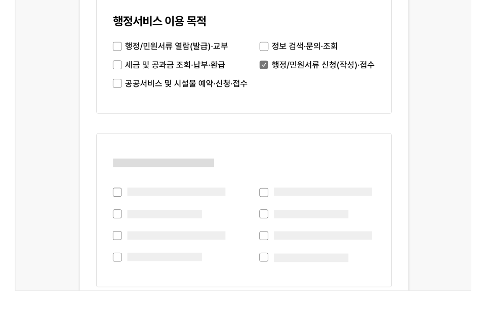
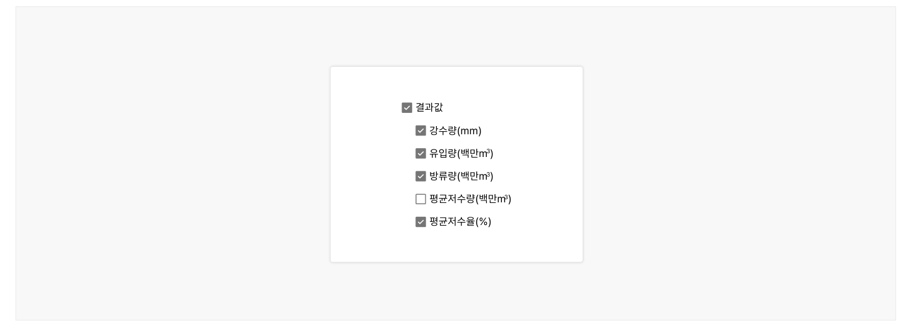
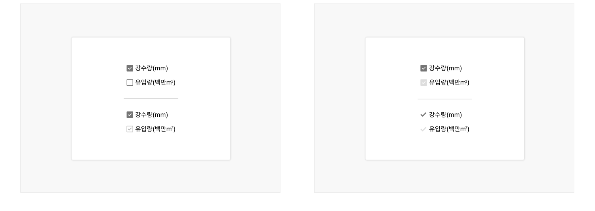

체크박스는 사용자가 여러 개의 옵션 중 한 개 이상의 값을 선택할 수 있도록 하는 경우에 사용한다. 즉, 체크박스 옵션의 선택은 상호배타적이므로 한 개의 옵션을 선택하는 것은 다른 옵션의 선택에 영향을 미치지 않는다.

## 용례

### 사용하기 적합한 경우

- 사용자가 옵션 목록에서 여러 개의 값을 선택할 수 있는 경우

- 필터링
- 약관, 조건 선택 등

사용하기 적합하지 않은 경우

- 사용자가 한 개의 옵션을 선택할 수 있도록 하는 경우

- 라디오 버튼을 사용해야 한다.

- 옵션을 선택하자마자 적용되는 경우

- 토글 스위치를 사용을 고려한다. 체크박스는 적용, 제출과 같은 별도의 확정 행위가 필요한 하나의 큰 과업 플로(Flow) 내에서 부분적으로 옵션을 선택하는 경우에 사용하기 적합하다.
## 유형

### 한 그룹 내 모든 옵션을 독립적으로 선택할 수 있도록 할 때

가장 기본적인 체크박스 유형으로 체크박스 양식은 선택됨, 선택 안 됨 두 가지 상태로 표현된다.

### 전체 옵션을 선택할 수 있을 때

체크박스의 양식은 선택됨, 선택 안 됨, 중간의 세 가지 상태로 표현된다. 옵션이 의미적으로 상하 관계로 구성되어 있어 상위 옵션의 선택, 선택 해제를 통해 모든 하위 옵션을 선택, 선택 해제할 수 있다. 이때 하위 옵션의 일부만을 선택할 수 있으므로 이 경우에는 상위 옵션이 중간 상태로 설정된다. 사용자가 한 그룹 내의 모든 옵션을 개별적으로 선택하도록 할 수 있으나, 전체 선택 옵션을 제공할 경우 사용자는 모든 옵션을 선택할 수 있음을 분명하게 인지할 수 있고 효율적으로 값을 선택할 수 있다.
## 구조

1 그룹 레이블(선택): 옵션 목록의 카테고리에 대한 설명 또는 옵션 선택에 대한 도움말을 제공함 2 체크박스 양식: 체크박스의 현재 선택 상태를 보여줌 3 체크박스 레이블: 선택하거나 선택 해제할 정보를 나타냄


## 사용성 가이드라인

- 01 기본적으로 체크박스의 옵션은 가나다순으로 정렬한다.
- 02 체크박스는 수직으로, 체크박스 레이블은 양식의 오른쪽에 배치한다.
- 03 체크박스의 레이블은 분명하고 정확하게 제공한다.
- 04 전체 선택 옵션이 제공되는 경우 중간 상태를 명확하게 표현한다.
### 01. 기본적으로 체크박스의 옵션은 가나다순으로 정렬한다.

사용자가 가장 많이 선택하는 옵션을 먼저 배치할 경우 옵션을 빠르게 선택하는 데 도움이 될 수 있다. 그러나 특정한 기준에 따른 옵션 정렬이 편견이나 차별을 강화할 수 있으므로 유의해서 사용해야 한다. 정렬 기준에 대한 명확한 근거나 이유가 없는 경우에는 가나다순으로 정렬하는 것이 가장 안전하다.
접근성 가이드라인


### 02. 체크박스는 수직으로, 체크박스 레이블은 양식의 오른쪽에 배치한다.

가독성과 옵션 간 명확한 구분을 위하여 체크박스는 수직으로 배치하는 것이 좋다. 이때, 레이블은 양식의 오른쪽에 배치해 일관된 위치에서 텍스트를 읽을 수 있도록 해야 한다. 만약 체크박스를 수평으로 배치해야 한다면 레이블의 텍스트 길이가 지나치게 길지 않아야 한다.

[모범 사례]

[피해야 할 사례]



**사례 텍스트 보완**

```text
행정서비스 이용 목적
행정/민원서류 열람(발급)·교부
정보 검색·문의·조회
세금 및 공금 조회·납부·환급
행정/민원서류 신청(작성)·접수
공공서비스 및 시설물 예약·신청·접수
```


**사례 텍스트 보완**

```text
행정서비스 이용 목적
행정/민원서류 열람(발급)·교부
정보 검색·문의·조회
행정/민원서류 신청(작성)·접수
세금 및 공금 조회·납부·환급
공공서비스 및 시설물 예약·신청·접수
```
### 03. 체크박스의 레이블은 분명하고 정확하게 제공한다.

사용자가 어떤 옵션을 선택하는 것인지 이해할 수 있도록 체크박스의 레이블은 분명하고 정확하게 제공해야 한다.
### 04. 전체 선택 옵션이 제공되는 경우 중간 상태를 명확하게 표현한다.

하위 옵션의 일부만 선택되었음에도 불구하고 상위 옵션이 선택 상태로 유지되면 사용자에게 혼동을 줄 수 있다.

[모범 사례]



**사례 텍스트 보완**

```text
결과값
강수량(mm)
유입량(백만m 3 )
방류량(백만m 3 )
평균저수량(백만m 3 )
평균저수율(%)
```
[피해야 할 사례]


**사례 텍스트 보완**

```text
결과값
강수량(mm)
유입량(백만m 3 )
방류량(백만m 3 )
평균저수량(백만m 3 )
평균저수율(%)
```
## 접근성 가이드라인

### 체크박스, 아이콘과 인접 배경 간 명도 대비를 3:1 이상으로 표현한다.

체크박스의 배경과 체크 아이콘은 체크박스의 선택 상태와 해당 요소가 체크박스 컴포넌트임을 인지할 수 있게 도와주는 중요한 시각적 정보이므로 인접 배경과의 명도 대비를 최소 3:1 이상으로 제공해야 한다.

- KWCAG 2.2 텍스트 콘텐츠의 명도 대비
- WCAG 2.1 Non-text Contrast (AA)

### 체크박스의 선택 상태를 색상으로만 구분하지 않는다.

체크박스의 선택 상태를 색상 이외의 수단으로 구분할 수 있는 시각적 단서를 제공해야 한다.

- KWCAG 2.2 색에 무관한 콘텐츠 인식
- WCAG 2.1 Use of Color (A)

[모범 사례]



**사례 텍스트 보완**

```text
강수량(mm)
유입량(백만m 3 )
```
[피해야 할 사례]


**사례 텍스트 보완**

```text
강수량(mm)
유입량(백만m 3 )
```

### 체크박스를 키보드로 탐색하고 실행할 수 있도록 한다.

사용자 에이전트에서 제공되는 기본 체크박스가 아니라 커스텀 디자인을 사용하는 경우에 기본 체크박스에 display:none, visibility:hidden, opacity:0과 같은 스타일을 하면 스크린 리더에서 체크박스의 역할을 인지할 수 없으며 키보드로 옵션을 선택할 수 없게 된다.

- KWCAG 2.2 키보드 사용 보장
- WCAG 2.1 Keyboard (A)
- WCAG 2.1 No Keyboard Trap (A)

### 체크박스에 키보드 초점이 명확하게 표시되도록 한다.

사용자 에이전트에서 제공되는 기본 체크박스가 아니라 커스텀 디자인을 사용하는 경우 키보드 초점이 시각적으로 표시되도록 스타일을 제공해야 한다. 체크박스 요소를 시각적으로 숨기는 경우, 시각적으로 표시되고 있는 체크박스 양식과 숨겨진 요소의 크기와 위치를 일치시켜 포커스링이 적절하게 표시되도록 구현해야 한다.

- KWCAG 2.2 초점 이동과 표시
- WCAG 2.1 Focus Visible (AA)
- WCAG 2.1 Non-text Contrast (AA)
사용성 가이드라인

### 체크박스에 접근 가능한 이름을 제공한다.

스크린 리더 사용자가 체크박스의 용도를 확인할 수 있도록 &lt;label&gt;, title, aria-label, aria-labelledby 중 1가지 방식을 이용하여 레이블을 제공해야 한다. 이때, 가능하면 &lt;label&gt;을 이용하여 사용자가 레이블을 클릭하였을 때에도 값을 선택할 수 있도록 구현하는 것이 좋다.

- KWCAG 2.2 레이블 제공
- WCAG 2.1 Info and Relationships (A)
- WCAG 2.1 Name, Role, Value (A)

### 스크린 리더에서 그룹 레이블과 체크박스 그룹의 관계를 확인할 수 있도록 한다.

&lt;fieldset&gt;, &lt;legend&gt;를 사용하여 스크린 리더 사용자에게 체크박스 그룹에서 값을 선택하는 목적을 보다 명확하게 전달할 수 있다.

- WCAG 2.1 Info and Relationships (A)
- WCAG 2.1 Labels or Instructions (A)

## 상호작용 가이드라인

### 옵션 탐색

### 옵션 선택 및 선택 해제

| 구분 | 설명 |
|---|---|
| Tab, Shift + Tab | 모든 체크박스는 Tab, Shift + Tab 키를 눌렀을 때 접근할 수 있어야 한다. |

| 구분 | 설명 |
|---|---|
| Click | 사용자는 체크박스 양식 또는 체크박스 레이블을 눌러 옵션을 선택하거나 선택 해제할 수 있다. 일반적으로 체크박스 양식은 조작하기에 크기가 충분하지 않으므로 레이블로 상호작용이 확장될 수 있도록 구현해야 한다. |
| Space | 체크박스 양식에 초점이 있는 상태에서 Space 키를 누르면 값이 선택된다. |
