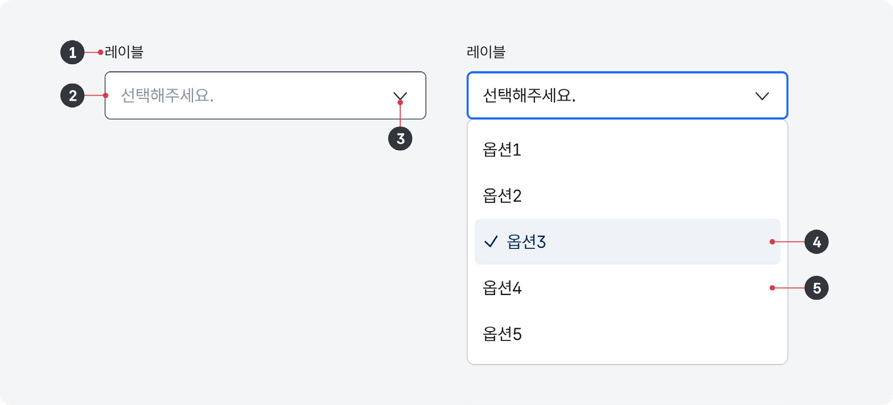

셀렉트는 사용자에게 여러 개의 옵션 목록을 팝업으로 제공하여 그 중 한 개의 값을 선택할 수 있도록 하는 경우에 사용한다.

## 용례

### 사용하기 적합한 경우

- 사용자에게 제공할 옵션 목록이 7개 이상, 20개 이하인 경우
- 입력폼에서 값을 선택해야 하는 경우
- 옵션 목록을 표시할 영역이 충분하지 않거나 모바일 웹이 더 중요한 경우

사용자의 웹 브라우저와 화면 크기에 맞추어 별도의 스타일 적용이 필요한 드롭다운이나 콤보박스와 달리 셀렉트는 기본 컨트롤 요소를 사용하므로 더 쉽게 조작할 수 있다.
### 사용하기 적합하지 않은 경우

- 사용자가 목록에서 옵션을 비교하는 것이 중요한 경우

사용자가 옵션을 선택하기 위해 여러 옵션을 비교해야 하거나 선택 과정의 효율성이 중요한 경우에는 셀렉트보다 라디오 버튼이 적합하다.

- 한 번에 여러 개의 값을 선택해야 하는 경우

체크박스 또는 다중 선택이 가능한 드롭다운 컴포넌트를 사용한다.

- 옵션의 개수가 20개를 초과하는 경우

사용자가 좁은 목록 영역에서 옵션을 탐색하는 것이 어려울 수 있다. 셀렉트 대신 사용자가 직접 값을 입력하여 옵션 목록에서 일치하는 옵션을 제안받을 수 있는 콤보박스를 사용하거나, 여러 개의 셀렉트 요소로 분할하는 방법을 고려해야 한다.
## 구조

- 1 레이블: 옵션 목록의 카테고리에 대한 설명 또는 옵션 선택에 대한 도움말을 제공함
- 2 컨테이너: 셀렉트와 배경을 구분하는 시각적인 수단으로 면 또는 선으로 표현됨
- 3 아이콘: 옵션 목록의 확장/축소 상태를 나타냄
- 4 선택값: 사용자가 옵션 목록에서 선택한 값을 보여줌
- 5 옵션: 사용자가 선택할 수 있는 값 또는 사용자에게 제안된 값의 목록

## 사용성 가이드라인

- 01 옵션 텍스트를 간결하게 제공한다.
- 02 모든 셀렉트에는 레이블을 제공한다.
- 03 셀렉트의 값을 변경하였을 때 폼이 제출되어서는 안 된다.
### 01. 옵션 텍스트를 간결하게 제공한다.

옵션 텍스트는 컨테이너와 옵션 목록 영역에 표현될 수 있는 적절한 길이로 제공해야 한다. 옵션 텍스트의 길이가 셀렉트의 너비를 벗어나게 되면 사용자는 선택하고자 하는 옵션의 정확한 내용을 파악할 수 없다. 불가피한 경우 해당 옵션에 툴팁을 제공하여 옵션에 마우스 또는 키보드가 접근했을 때 전체 내용이 표시되도록 해야 한다.

### 02. 모든 셀렉트에는 레이블을 제공한다.

셀렉트에 레이블이 제공되지 않으면 어떤 값을 선택해야 하는 것인지 알 수 없다. 레이블을 생략하고자 하는 경우에는 레이블 없이도 사용자가 값을 선택하는 데 문제가 없다는 근거가 명확해야 한다.

### 03. 셀렉트의 값을 변경하였을 때 폼이 제출되어서는 안 된다.

입력폼에 별도의 제출 버튼을 제공하여 사용자가 입력폼의 제출을 확정하는 경우에만 데이터가 전송되어야 한다. 사용자는 입력폼에서 입력한 데이터를 수정하거나 다음 항목의 데이터를 입력하게 되는데, 이때 셀렉트의 옵션 변경만으로도 폼이 제출되어 버리면 기존에 입력한 정보가 삭제되거나 의도하지 않게 제출되어 당황하게 된다. 특히 키보드, 스크린 리더 사용자는 데이터를 다시 입력하는 과정에서 이 같은 변화의 맥락을 인지하는 데 어려움이 따르므로 유의해야 한다.
## 접근성 가이드라인

### 01. 셀렉트에 접근 가능한 이름을 제공한다.

스크린 리더 사용자가 셀렉트의 용도를 확인할 수 있도록 &lt;label&gt;, title, aria-label, aria-labelledby 중 1가지 방식을 이용하여 레이블을 제공해야 한다.

- KWCAG 2.2 레이블 제공
- WCAG 2.1 Info and Relationships (A)
- WCAG 2.1 Name, Role, Value (A)

### 02. 셀렉트 아이콘과 인접 배경 간 명도 대비를 3:1 이상으로 표현한다.

셀렉트의 꺾쇠 아이콘은 옵션 목록의 확장/축소 상태를 나타내며 요소가 셀렉트 컴포넌트임을 인지할 수 있게 도와주는 중요한 시각적 정보이므로 인접 배경과의 명도 대비를 최소 3:1 이상으로 제공해야 한다.

- KWCAG 2.2 텍스트 콘텐츠의 명도 대비
- WCAG 2.1 Non-text Contrast (AA)
## 상호작용 가이드라인

### 목록 확장 및 축소

### 탐색

| 구분 | 설명 |
|---|---|
| Click | 컨테이너를 Click 했을 때, 옵션 목록이 확장되거나 축소된다. 옵션 목록이 확장된 상태에서 셀렉트의 레이블, 컨테이너, 옵션 목록이 아닌 영역을 Click 하면 옵션 목록은 축소되어야 한다. |
| Enter, Space | 컨테이너에 초점이 있는 경우, 옵션 목록이 확장되거나 축소된다. |
| Esc | 옵션 목록을 축소하고 컨테이너로 초점이 이동해야 한다. |

| 구분 | 설명 |
|---|---|
| Tab, Shift + Tab | 모든 셀렉트는 Tab, Shift + Tab 키를 눌렀을 때 접근할 수 있어야 한다. |
| Scroll | 옵션 목록에 스크롤이 생성된 경우 목록이 상/하로 이동한다. |
상호작용 가이드라인

### 옵션 선택

| 구분 | 설명 |
|---|---|
| Click | 옵션 목록에서 특정 옵션을 Click 하면 해당 옵션으로 선택값이 변경된다. |
| Enter | 옵션에 초점이 있는 경우, 해당 옵션값이 선택된 후 목록이 축소된다. |
| 방향키 ↑, ↓ | 컨테이너에 초점이 있고 옵션 목록이 축소된 경우, 이전/다음 옵션으로 선택값이 변경된다. |
