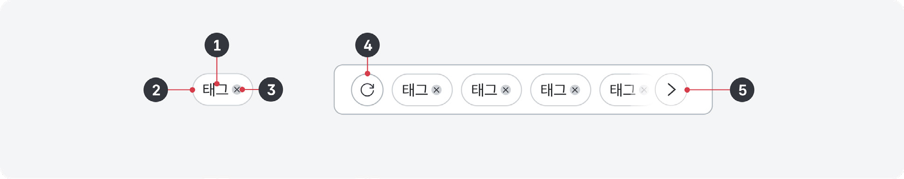
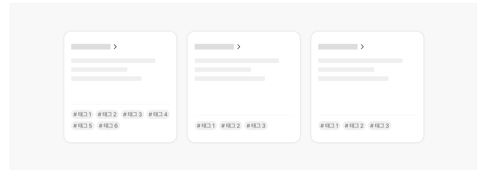
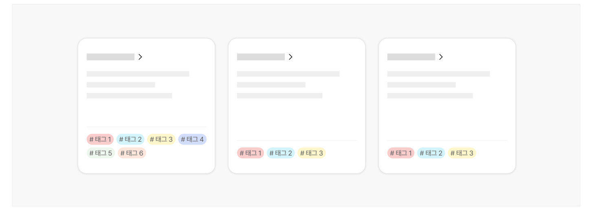

태그는 키워드 또는 레이블을 사용하여 콘텐츠를 분류하는 수단이다. 콘텐츠 항목에 직접 관련 분류 체계, 데이터 속성을 표시하거나, 목록에서 특정 분류 체계, 데이터 속성을 가진 항목이 선택되었음을 보여주기 위한 태그 그룹으로 사용된다.

## 용례

### 사용하기 적합한 경우

- 필터링·정렬 패턴에서 설정된 옵션을 표시할 때

사용자가 선택한 필터링·정렬 옵션 목록을 표시하고 선택된 조건을 삭제하는 데 태그를 이용할 수 있다.

### 사용하기 적합하지 않은 경우

- 상호작용 없이 데이터의 특성 분류, 속성을 강조하여 표현하고자 할 때

배지를 사용한다.
## 유형

### 단순 레이블

텍스트 레이블로만 구성된 태그 형식이다. 대개 데이터 집합의 개별 항목에 배치되어 항목의 분류 체계, 데이터 속성을 보여준다.

### 선행 아이콘과 레이블

체크 아이콘과 레이블로 구성된 태그 형식이다. 필터링·정렬 옵션의 하나로 선행 아이콘이 있는 태그 목록을 배치하여, 목록에 표시되고 있는 데이터 분류 또는 속성을 보여줄 수 있다. 이때, 태그 목록은 대화형 요소로 사용되며 사용자가 선택을 해제하면 단순 레이블 형태로 변경된다.

### 레이블과 삭제 아이콘

레이블과 삭제 아이콘으로 구성되어, 실행 시 설정된 필터링·정렬 옵션에서 해당 레이블 관련 옵션 설정이 해제됨을 안내한다.
## 구조

- 1 레이블: 태그를 통해 전달하고자 하는 메타 데이터
- 2 컨테이너: 배지를 배경과 구분하는 윤곽선 또는 배경색
- 3 삭제 아이콘: 레이블과 관련된 데이터의 필터링을 해제할 수 있음을 안내함
- 4 일괄 액션 버튼: 태그 그룹 주변에 배치되어 전체 그룹에 대해 한 번에 동일한 동작을 수행하는 데 사용되는 버튼
- 5 더 보기 버튼: 표와 같이 공간이 제한되어 있는 경우 그룹 내 일부 토큰을 숨길 수 있음


## 사용성 가이드라인

- 01 레이블은 정확한 내용으로 간결하게 제공한다.
- 02 태그는 관련 요소 주변에 배치한다.
- 03 대화형 태그와 비대화형 태그를 같은 그룹에 포함하지 않는다.
- 04 지나치게 많은 태그를 사용하지 않는다.
- 05 태그의 표현에 지나치게 많은 색상을 사용하지 않는다.
### 01. 텍스트 레이블을 제공한다.

접근성과 명확한 이해를 위해 태그에 항상 텍스트 레이블을 제공해야 한다.

### 02. 레이블은 정확한 내용으로 간결하게 제공한다.

태그 레이블은 태그의 주제를 간결하고 명확하게 전달해야 한다. 레이블은 2단어 이내로 구성하고 텍스트 줄 바꿈이 발생하지 않도록 해야 한다.

### 03. 태그는 관련 요소 주변에 배치한다.

한 화면에서 여러 항목에 걸쳐 동일한 형태와 내용의 태그 반복적으로 사용되므로 사용자가 어떤 항목에 대한 태그인지를 명확하게 변별할 수 있도록 관련 요소 주변에 배치하고 항목이 서로 구분될 수 있도록 표현해야 한다.

### 04. 대화형 태그와 비대화형 태그를 같은 그룹에 포함하지 않는다.

대화형 태그와 비대화형 태그가 같은 그룹에 혼합되어 있으면 사용자는 어떤 태그가 대화형으로 사용되는지 혼동을 느낄 수 있다.
### 05. 지나치게 많은 태그를 사용하지 않는다.

태그를 많이 사용할수록 인지 부담이 증가되므로 최소의 태그를 사용한다. 이후, 사용자 의견 수렴 과정을 통해 추가가 필요한 태그를 확인하여 표시 개수를 늘릴 수 있다.

[피해야 할 사례]



**사례 텍스트 보완**

```text
태그 1
태그 2
태그 3
태그 4
태그 5
태그 6
```
### 06. 태그의 표현에 지나치게 많은 색상을 사용하지 않는다.

여러 색상은 사용자의 주의를 분산시키고 혼동을 줄 수 있으므로 가능한 한 태그에는 하나의 색상만 사용하는 것이 적합하다. 색상을 추가하고자 하는 경우, 색상을 활용한 태그 구분이 사용자에게 의미가 있는지를 가장 먼저 고려해야 한다. 그 다음 동시에 표시되는 태그 수를 고려하여, 모든 태그가 동등한 수준으로 강조될 수 있는 색상을 사용해야 한다.

[피해야 할 사례]



**사례 텍스트 보완**

```text
태그 1
태그 2
태그 3
태그 4
태그 5
태그 6
```


## 접근성 가이드라인

### 01. 대화형 태그의 초점을 명확하게 표시한다.

대화형 태그가 초점을 가진 상태일 때, 태그에 인접 배경과 3:1 이상의 명도 대비를 갖는 윤곽선이 명확하게 표시되어야 한다.

- KWCAG 2.2 초점 이동과 표시
- WCAG 2.1 Focus Visible (AA)
- WCAG 2.1 Non-text Contrast (AA)

### 02. 대화형 태그에 기능 또는 상태 정보를 명확하게 제공한다.

사용자가 태그를 실행하였을 때 어떤 동작이 발생하는지 예측할 수 있도록 용도에 적합한 접근 가능한 이름이나 상태 정보를 제공해야 한다.

- 필터링·조회 패턴의 일부로서 실행 시 해당 태그를 가진 요소에 대한 필터링 동작이 발생하는 경우:

aria-pressed="true", aria-pressed="false" 속성을 활용하여 선택 상태에 대한 정보를 제공
- 필터링·조회 패턴의 일부로서 실행 시 해당 태그에 대한 필터링 옵션이 해제되는 경우:

aria-label="[태그 레이블] 옵션 삭제"
- 관련된 항목 주변에 배치되어 실행 시 해당 태그에 대한 필터링 옵션이 설정되는 경우: aria-label="[태그 레이블] 필터 옵션 추가"

- WCAG 2.1 Name, Role, Value (A)

접근성 가이드라인

### 03. 태그의 색상으로 의미를 전달하지 않아야 한다.

색상을 사용하여 태그를 구분할 수 있지만, 색상을 사용하여 의미를 전달해서는 안 된다.

- KWCAG 2.2 색에 무관한 콘텐츠 인식
- WCAG 2.1 Use of Color (A)

### 04. 태그 레이블, 아이콘이 인접 배경과 3:1 이상의 명도 대비를 갖도록 표현한다.

태그 레이블뿐만 아니라 태그 내부 아이콘이 인접 배경과 3:1 이상의 명도 대비를 갖도록 표현해야 한다. 아이콘은 태그를 통해 어떤 동작이 수행될 것인지를 예측하는 데 참고할 수 있는 중요한 정보이다.

- KWCAG 2.2 색에 무관한 콘텐츠 인식
- WCAG 2.1 Contrast (Minimum) (AA)
- WCAG 2.1 Non-text Contrast (AA)
## 상호작용 가이드라인

### 태그 탐색과 실행

### 태그 선택

| 구분 | 설명 |
|---|---|
| Click | 대화형 태그인 경우, Click 시 해당 태그 조건이 필터링 옵션으로 추가된다. 초점은 적용된 필터링 옵션을 표시하는 막대로 이동한다. |
| Tab | 대화형 태그인 경우, 태그 그룹으로 Tab 하면 첫 번째 태그에 초점이 위치한다. 한 번에 하나의 태그만 키보드 초점을 가진다. |
| Space, Enter | 대화형 태그인 경우, 태그가 초점을 가진 상태에서 Space 또는 Enter 키에서 Keyup 이벤트가 발생하면 해당 태그 조건이 필터링 옵션으로 추가된다. 초점은 적용된 필터링 옵션을 표시하는 막대로 이동한다. |

| 구분 | 설명 |
|---|---|
| Click | Click 시 해당 태그 조건의 선택 상태가 토글된다. 초점은 Click 한 요소에 유지된다. |
| Space | 태그가 초점을 가진 상태에서 Space 또는 Enter 키에서 Keyup 이벤트가 발생하면 해당 태그 조건의 선택 상태가 토글된다. 초점은 Keyup 이벤트가 발생한 태그에 유지된다. |
### 태그 삭제

| 구분 | 설명 |
|---|---|
| Click | Click 시 해당 태그 조건이 목록에서 제거된다. 초점은 삭제된 태그의 이전 태그로 이동한다. 만약 초점을 이동할 태그가 목록에 남아 있지 않다면 태그 목록을 표시하는 컨테이너 자체로 초점이 이동한다. |
| Space | 태그가 초점을 가진 상태에서 Space 또는 Enter 키에서 Keyup 이벤트가 발생하면 해당 태그 조건이 목록에서 제거된다. 초점은 삭제된 태그의 이전 태그로 이동한다. 만약 초점을 이동할 태그가 목록에 남아 있지 않다면 태그 목록을 표시하는 컨테이너 자체로 초점이 이동한다. |
