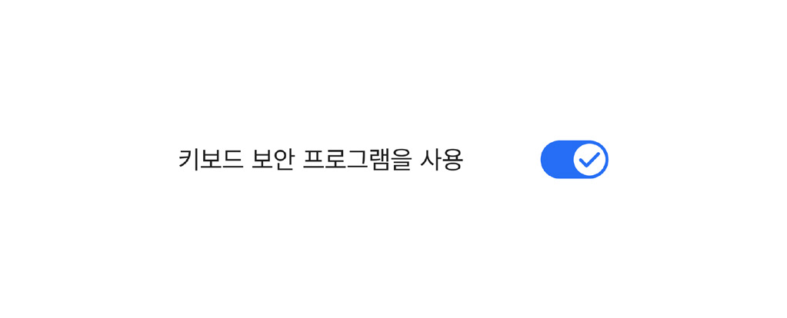
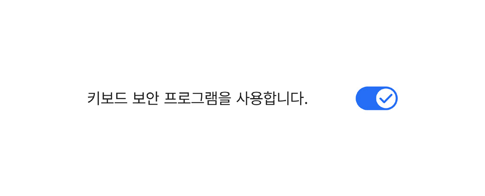
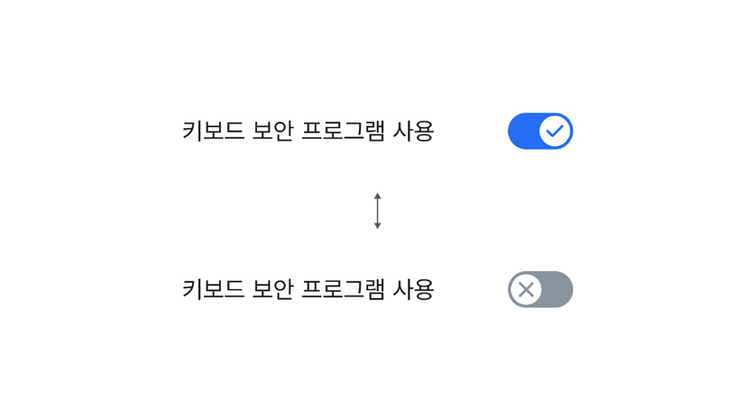
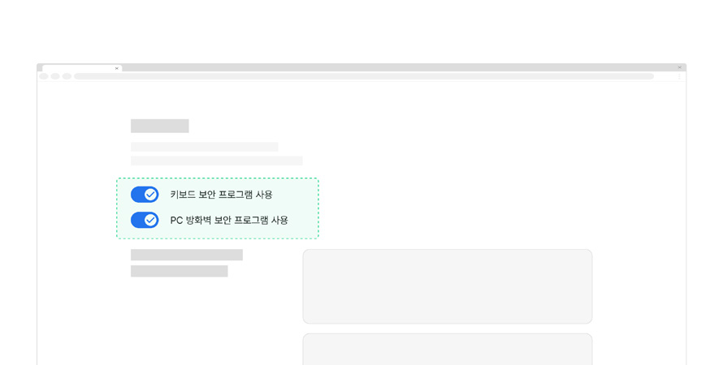
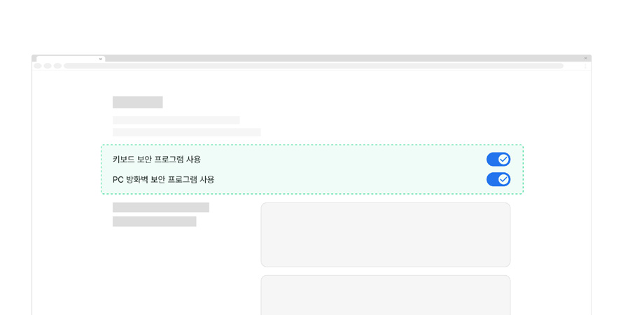

토글은 상호 배타적인 두 가지 상태를 전환하는 데 사용되는 요소이다.

## 용례

### 사용하기 적합한 경우

- 서로 반대인 두 가지 상태 값을 선택하는 경우

두 가지 상태가 부울 유형(Boolean)이어서 상호 배타적인 경우, 토글 스위치를 사용할 수 있다.

- 기능의 사용을 설정하거나 해제하고자 하는 경우

알림의 표시 여부 등 기능의 사용을 설정하거나 해제할 때, 토글 스위치를 사용하여 값을 선택하도록 하는 것이 적절하다.

- 상태 전환의 결과가 즉각적으로 반영되는 경우

선택한 상태가 화면/서비스 전체에 즉각적으로 반영되는 경우, 토글 스위치를 사용하여 값을 선택하도록 하는 것이 적절하다.
### 사용하기 적합하지 않은 경우

- 선택 옵션이 계층 구조를 가지는 경우

중간 상태를 가지는 체크박스 목록을 사용한다.

- 레이블이 직관적이지 않은 경우

서로 반대되는 상태를 선택하는 경우라도 단일 레이블로 적절하게 설명하기 어렵다면, 라디오 버튼을 사용하여 선택 컨트롤을 2개로 나누고 각각의 라디오 버튼에 정확하게 레이블을 제공하는 것이 좋다.

- 기본 상태가 존재하지 않는 경우

토글 형태의 요소는 항상 기본 상태를 갖는다. 기본 상태가 존재하지 않는(켜짐 또는 꺼짐이 모두 아님) 상황에서는 토글을 사용하지 않아야 한다.

- 두 상태가 서로 반대되는 상태가 아닌 경우

부울 유형(Boolean)의 상태를 전환하는 것이 아니라면 라디오 버튼을 사용한다.

- 여러 개의 상호 배타적인 선택 옵션이 존재하는 경우

라디오 버튼을 사용한다.

- 선택한 옵션 값의 적용에 별도 제출/적용 과정이 필요한 경우

선택 정보 및 옵션의 특성에 따라 체크박스나 라디오 버튼을 사용한다.
## 구조

- 1 스위치: a. 경로(Track) 핸들의 이동 경로를 보여주는 내부 영역 또는 테두리 b. 핸들(Handle) 두 상태의 전환 상태를 표시하는 인디케이터로 경로를 따라 좌/우로 이동함
- 2 레이블: 상태를 적용할 대상 정보를 나타내는 텍스트
- 3 상태 아이콘: 선택/선택 해제 상태를 보여주는 아이콘
- 4 도움말 (선택): 대상 정보, 선택 결과 등에 대한 사용자의 이해를 돕기 위해 부가적인 설명을 제공할 때 사용하는 텍스트

## 사용성 가이드라인

- 01 레이블은 가능한 명사형으로 작성한다.
- 02 스위치 상태에 상관없이 레이블을 일관되게 유지한다.
- 03 레이블과 스위치 사이의 거리에 유의한다.
- 04 한 화면 내에서의 토글 스위치 표현에 동일한 레이아웃을 사용한다.

### 레이블은 가능한 명사형으로 작성한다.

명사형으로 작성하였을 때 의미가 명확하지 않다면 동사형으로 변경하거나, 부가적인 도움말을 제공하여 토글 스위치를 켜고 끄는 동작을 통해 무엇이 변경되는지를 사용자가 직관적으로 이해할 수 있어야 한다.

[모범 사례]

[피해야 할 사례]

### 스위치 상태에 상관없이 레이블을 일관되게 유지한다.

스위치 상태가 변경될 때마다 레이블의 내용이 변경되어서는 안 된다. 스위치 상태 정보는 핸들의 위치, 상태 아이콘을 통해 전달할 수 있으므로 레이블의 내용은 스위치의 목적을 정확하게 보여줄 수 있는 내용으로 작성한다. 상태 정보를 텍스트로 제공하고자 하는 경우, 스위치의 인접 영역에 별도 텍스트로 제공해야 한다.

[모범 사례]

[피해야 할 사례]

### 레이블과 스위치 사이의 거리에 유의한다.

레이블과 스위치가 지나치게 멀리 배치되어 있으면 사용자에 따라 두 요소 간 관계를 파악하기 어려울 수 있다. 넓은 컨테이너 내부에 스위치를 사용해야 하는 경우, 레이블을 스위치 오른쪽과 같이 보다 인접한 영역에 배치하는 것이 바람직하다.

[모범 사례]

[피해야 할 사례]

### 한 화면 내에서의 토글 스위치 표현에 동일한 레이아웃을 사용한다.

만약 목록의 왼쪽 열에 레이블이 배치되고 오른쪽 열에 스위치가 배치된다면 목록에서의 모든 스위치는 동일한 배열을 가져야 한다. 또한 상태 레이블이나 상태 아이콘을 사용한 스위치가 하나라도 존재한다면, 이 역시 모든 스위치 항목에 제공되어야 한다.

이를 통해, 사용자의 시선이 일관된 흐름으로 이동하도록 도와 탐색 피로도를 최소화할 수 있다.

[모범 사례]

[피해야 할 사례]

## 접근성 가이드라인

### 01. 경로, 핸들, 상태 아이콘과 인접 배경 간 명도 대비를 3:1 이상으로 표현한다.

경로와 핸들은 요소가 토글 스위치임을 알려주는 시각적 단서이며, 상태 아이콘은 스위치의 활성화 상태 정보를 전달하는 중요 정보이므로 인접한 영역과 3:1 이상의 명도 대비를 준수해야 한다.

- KWCAG 2.2 텍스트 콘텐츠의 명도 대비
- WCAG 2.1 Non-text Contrast (AA)

### 02. 토글 스위치를 키보드로 탐색하고 실행할 수 있도록 한다.

토글 스위치로 작동하는 요소에 display:none, visibility:hidden, opacity:0과 같은 스타일을 적용하면 스크린 리더에서 요소의 역할을 인지할 수 없으며 키보드로 옵션을 선택할 수 없게 된다.

- KWCAG 2.2 키보드 사용 보장
- WCAG 2.1 Keyboard (A)
- WCAG 2.1 No Keyboard Trap (A)

### 03. 토글 스위치에 키보드 초점이 명확하게 표시되도록 한다.

시각적으로 표시되고 있는 토글 스위치와 숨겨진 요소의 크기 및 위치를 일치시켜 포커스링이 적절하게 표시되도록 구현해야 한다.

- KWCAG 2.2 초점 이동과 표시
- WCAG 2.1 Focus Visible (AA)
- WCAG 2.1 Non-text Contrast (AA)
### 04. 토글 스위치에 접근 가능한 이름을 제공한다.

스크린 리더 사용자가 스위치의 용도를 확인할 수 있도록 &lt;label&gt;, aria-label, aria-labelledby 중 1가지 방식을 이용하여 레이블을 제공해야 한다. 이때, 가능하면 &lt;label&gt;을 이용하여 사용자가 레이블을 클릭하였을 때도 값을 선택할 수 있도록 구현하는 것이 좋다.

- KWCAG 2.2 레이블 제공
- WCAG 2.1 Info and Relationships (A)
- WCAG 2.1 Name, Role, Value (A)

### 05. 스크린 리더에서 도움말을 인지할 수 있도록 한다.

스위치가 도움말을 aria-describedby로 연결하여 스크린 리더가 스위치에 접근하였을 때, 도움말 정보를 즉각적으로 전달받을 수 있도록 한다.

- WCAG 2.1 Info and Relationships (A)
## 상호작용 가이드라인

### 옵션 탐색

### 옵션 선택 및 선택 해제

| 구분 | 내용 |
|---|---|
| Tab, Shift + Tab | 모든 토글 스위치는 Tab, Shift + Tab 키를 눌렀을 때 접근할 수 있어야 한다. |

| 구분 | 내용 |
|---|---|
| Click | 사용자는 스위치 또는 레이블을 눌러 선택하거나 선택 해제할 수 있다. 일반적으로 스위치는 조작하기에 크기가 충분하지 않으므로 레이블로 상호작용이 확장될 수 있도록 구현해야 한다. |
| Space | 스위치에 초점이 있는 상태에서 Space 키를 누르면 값이 선택된다. |
