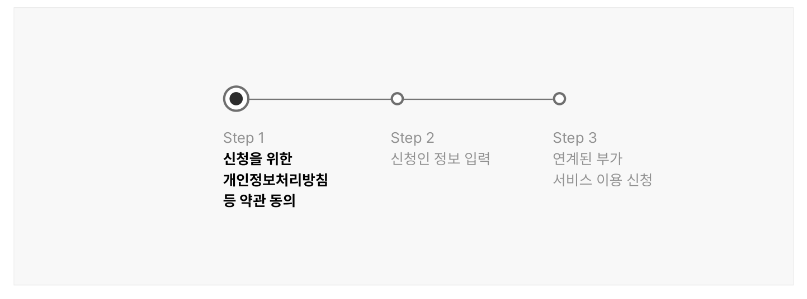
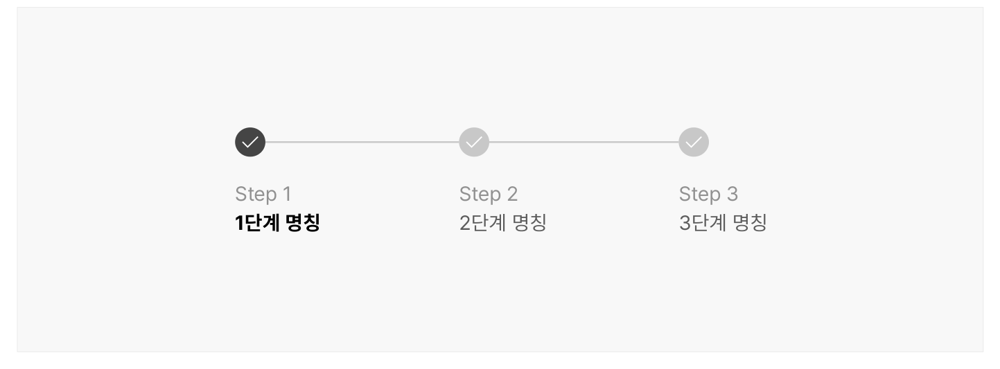

### 단계 표시기


단계 표시기는 서비스 이용을 위해 사용자가 거쳐야 하는 일련의 단계를 시각화하여 표현한 것으로 진행 상태에 대한 피드백을 사용자에게 전달한다.

## 구조

- 1 단계 숫자: 단계 레이블 옆에 표시되는 작은 텍스트로 각 단계의 번호를 나타냄. 작은 디스플레이에서는 현재 단계, 전체 단계 수를 제외한 정보는 생략할 수 있음(예 - 4단계 중 1단계)
- 2 단계 레이블: 각 단계에서 사용자가 수행해야 할 작업을 요약한 텍스트
- 3 현재 단계 식별자: 진행 중인 단계를 다른 단계와 구분하는 식별자
- 4 완료된 단계 식별자: 완료된 단계를 다른 단계와 구분하는 식별자
- 5 연결선: 단계와 단계 사이를 연결하는 선으로 프로세스의 선형성을 보여줌

## 사용성 가이드라인

- 01 단계 레이블은 해당 프로세스에 대한 간결하고 명확한 내용으로 제공한다.
- 02 단계는 좌에서 우 또는 상에서 하의 순서로 논리적으로 전개될 수 있도록 구성한다.
- 03 단계의 수는 최소 3개에서 최대 7개로 제공한다.
- 04 현재 단계를 명확하게 인지할 수 있도록 표현한다.
- 05 과업의 성격에 적합한 탐색 모델을 제공한다.
- 06 선택적인 단계를 건너뛸 수 있는 수단을 제공한다.
### 01. 단계 레이블은 해당 프로세스에 대한 간결하고 명확한 내용으로 제공한다.

레이블은 해당 단계/프로세스에서 사용자가 수행해야 하는 작업의 특성을 명확하게 보여줄 수 있는 내용으로 제공해야 한다. 레이블로만 설명을 제공하기 어려운 경우, 보조 텍스트를 인접 영역에 제공할 수 있으나, 레이블 자체는 텍스트가 잘리거나 줄 바꿈이 발생하지 않도록 짧은 단어, 문구로 구성해야 한다.

[모범 사례]



**사례 텍스트 보완**

```text
Step 1
Step 2
Step 3
부가 서비스 신청
약관 동의
신청인 정보 입력
```
[피해야 할 사례]


**사례 텍스트 보완**

```text
Step 1
Step 2
Step 3
신청인 정보 입력
연계된 부가
신청을 위한
서비스 이용 신청
개인정보처리방침
등 약관 동의
```
### 02. 단계는 좌에서 우 또는 상에서 하의 순서로 논리적으로 전개될 수 있도록 구성한다.

사용자가 여러 단계로 구성된 프로세스에 관여 중임을 분명하게 인지하고 프로세스의 진행 방향을 확인할 수 있도록 각 단계는 선형적으로 표현한다. 단계의 흐름은 연결선, 화살표, 꺾쇠 기호 등을 활용하여 표현할 수 있다. 이 중 화살표, 꺾쇠 기호는 각 단계를 선형적으로 탐색하는 경우에 적합한 표현 방식이다. 어떤 표현 방식을 사용하든 한 사이트 내에서 단계는 일관성 있게 표현되어야 한다.

### 03. 단계의 수는 최소 3개에서 최대 7개로 제공한다.

사용자의 인지적 부담을 줄이기 위해 단계의 수는 최대 7개로 제한할 것을 권장한다. 프로세스를 단계로 구분할 때 불필요한 단계나 사용자의 행동이 포함되지 않았는지 반복적으로 점검하고 논리적, 효율성 측면에서 문제가 없는 과업은 가능한 한 하나의 단계에서 처리될 수 있도록 해야 한다.
### 04. 현재 단계를 명확하게 인지할 수 있도록 표현한다.

사용자가 자신이 거쳐온 단계, 앞으로 거쳐야 할 단계를 확인하고 진행 중인 단계의 과업을 명확하게 인지할 수 있도록 현재 단계를 다른 단계와 구분하여 표현해야 한다.

[모범 사례]



**사례 텍스트 보완**

```text
Step 1
Step 2
Step 3
3단계 명칭
1단계 명칭
2단계 명칭
```
[피해야 할 사례]


**사례 텍스트 보완**

```text
Step 1
Step 2
Step 3
3단계 명칭
1단계 명칭
2단계 명칭
```
### 05. 과업의 성격에 적합한 탐색 모델을 제공한다.

단계 표시기는 프로세스 및 단계의 논리적인 구성에 따라 순차적 탐색, 적응형 탐색 방식을 지원한다. 순차적 탐색 방식에서 사용자는 일단 정해진 순서에 따라 단계를 진행해야 한다. 한 단계에서 필요한 행동이 완료되지 않으면 다음 단계로 이동하는 데 사용되는 UI는 비활성화 상태로 제공된다. 반면 적응형 탐색 방식에서 사용자는 특정 단계를 건너뛰고 다른 단계를 먼저 탐색할 수 있고 건너뛴 단계에 자유로운 순서로 접근할 수 있다.

### 06. 선택적인 단계를 건너뛸 수 있는 수단을 제공한다.

선택적인 단계는 가능한 한 모든 필수 단계를 거친 후 가장 마지막에 제공하는 것이 바람직하다. 프로세스에 선택적인 단계가 포함된 경우, 사용자가 선택적인 단계를 건너뛰어 다음 필수 단계로 이동할 수 있는 수단을 제공해야 한다. 남은 필수 단계가 존재하지 않는다면 최종 단계(최종 검토/제출)로 건너뛴다. 건너뛰기 UI에는 사용자가 쉽게 식별하고 이해할 수 있도록 '건너뛰기', '다음에 입력하기' 등 명확한 텍스트 레이블을 제공해야 한다.


## 접근성 가이드라인

### 순서 있는 목록을 사용한다.

단계 목록과 항목을 &lt;ol&gt;, &lt;li&gt;로 마크업하여 스크린 리더에서 전체 단계 수와 구성을 빠르게 파악할 수 있도록 한다.

- KWCAG 2.2 제목 제공
- WCAG 2.1 Info and Relationships (A)

### 단계 식별자를 색상으로만 구분하여 표현하지 않는다.

현재 단계, 완료된 단계를 색상 이외의 수단으로 구분할 수 있는 시각적 단서를 제공해야 한다. 밑줄 제공, 1px 이상의 테두리 차이, 식별자 제공 등의 방법으로 크기나 형태 차원에서 정보를 구분하는 방법을 사용할 수 있다.

- KWCAG 2.2 색에 무관한 콘텐츠 인식
- WCAG 2.1 Use of Color (A)

### 현재 단계를 스크린 리더로 확인할 수 있도록 한다.

단계 인디케이터가 시각적으로만 구분되는 것이 아니라 스크린 리더로도 전달될 수 있도록 해야 한다. 만약 단계 레이블에 '현재', '현재 단계'라는 텍스트가 제공되지 않고 있다면 현재 탐색 중인 단계에 ariacurrent="true" 속성을 추가한다. aria-current 속성을 사용할 수 없는 경우, 현재 단계 레이블에 '현재 단계'라는 텍스트를 추가하여 시각적으로 표시되도록 하거나 프로그램적으로만 전달되도록 한다.

- KWCAG 2.2 적절한 대체 텍스트 제공
- WCAG 2.1 Name, Role, Value (A)
