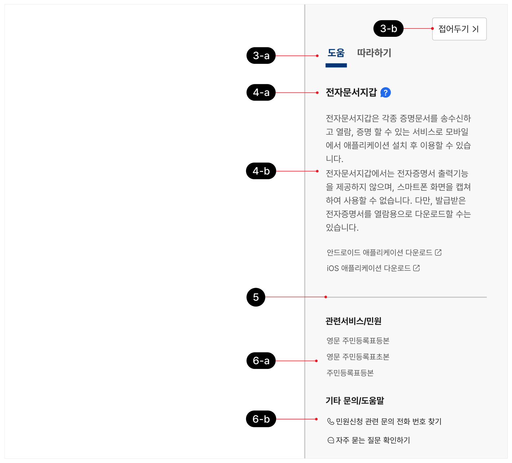
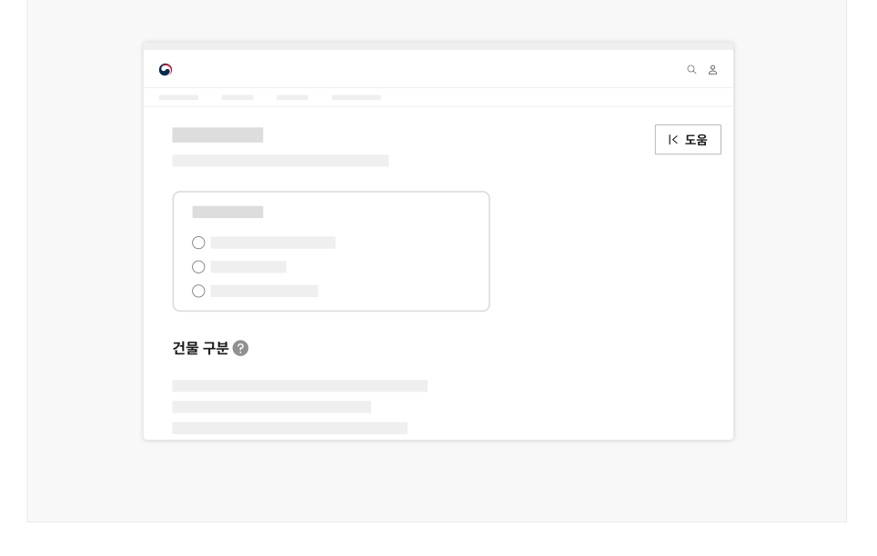
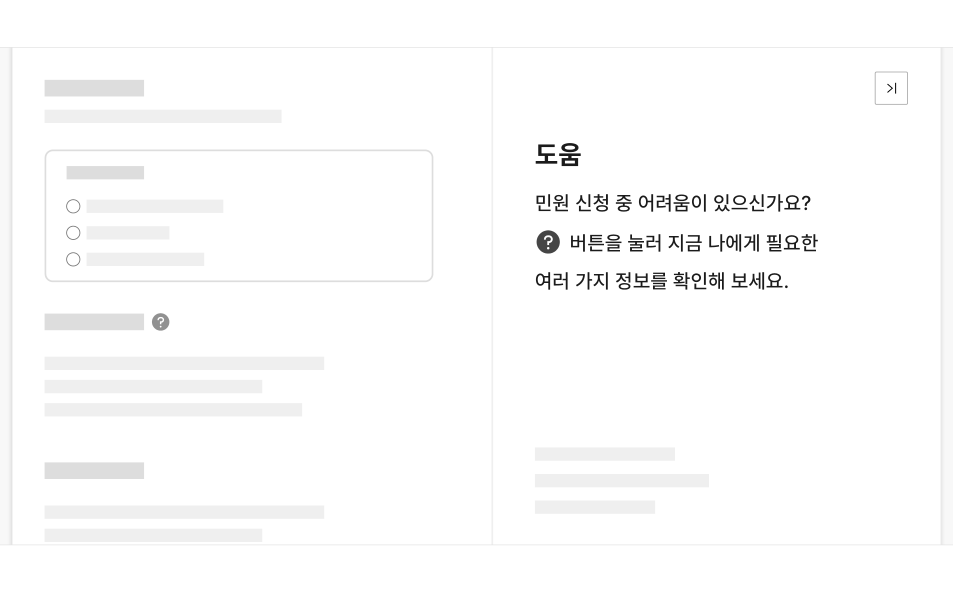

### 도움 패널


도움 패널은 본문 콘텐츠의 섹션이나 일부 요소에 대한 개념/용어 설명, 옵션의 구성, 이용 방법 등과 관련된 정보나 도움말 콘텐츠를 제공하는 사이드 패널이다.

## 용례

### 사용하기 적합하지 않은 경우

- 안내/도움 정보가 간단한 경우

맥락적 도움말 컴포넌트를 사용하는 것이 적합하다.

- 작업을 완료하는 방법에 대한 단계별 안내를 제공하고자 하는 경우

도움 패널 대신 따라하기 패널과 코치마크 컴포넌트를 사용한다.
## 구조

- 1 패널 열기 버튼: 패널을 표시하는 데 사용되는 버튼. 본문 우측에 배치되며, 스크롤 동작 시 화면의 일관된 위치에 고정하여 배치됨
- 2 아이콘 버튼: 도움 패널과 상세 도움 콘텐츠의 표시를 토글하는 물음표(?) 아이콘 버튼
- 3 헤더

a. 패널 선택 탭: 도움 패널과 따라하기 패널을 전환하는 데 사용됨 b. 패널 닫기 버튼: 패널을 닫고 패널 열기 버튼을 표시하는 데 사용됨

- 4 본문 도움 패널의 용도를 안내하고, 사용을 유도하기 위한 초기 상태와 대상에 관련된 상세 정보를 제공하는 두 가지 상태로 구성됨

a. 섹션 제목: 도움말을 제공할 대상에 대한 요약 텍스트 b. 내용: 도움말 콘텐츠. 필요한 경우 관련 화면 링크나 파일 다운로드 링크가 포함될 수 있음

- 5 구분선: 본문과 푸터를 구분하기 위한 선
- 6 푸터

- a. 관련 화면 링크: 원하는 화면으로 이동하지 못한 사용자를 고려하여, 탐색 중인 화면과 관련되어 있거나 유사한 내용의 화면 링크를 대안으로 제공함
- b. 기타 문의/도움말 채널: 관련 질의응답을 확인할 수 있거나 추가적으로 질문할 수 있는 채널(자주 묻는 질문 목록, 챗봇, 상담 번호 등) 정보를 제공함


## 사용성 가이드라인

- 01 화면이 로딩되었을 때 도움 패널은 열린 상태로 제공한다.
- 02 도움 패널의 첫 화면은 기본 상태로 제공한다.
- 03 아이콘 버튼은 도움 정보를 제공하고자 하는 요소 주변에 배치한다.
- 04 도움 패널의 섹션 제목은 아이콘 버튼과 관련된 본문 섹션 제목/레이블 텍스트와 일치해야 한다.
- 05 콘텐츠를 간결하게 유지한다.
- 06 사용자가 작업을 수행하기 위해 반드시 알아야 하는 필수 정보가 패널에서만 제공되지 않도록 한다.
- 07 패널에서 제공하는 웹 페이지 링크는 새 창으로 실행한다.
- 08 본문은 사용자가 특정 아이콘 버튼을 실행하는 경우에만 변경되도록 한다.
### 01. 화면이 로딩되었을 때 도움 패널은 열린 상태로 제공한다.

도움말이 필요한 사용자가 패널의 존재 유무를 직관적으로 인지할 수 있도록 화면이 로딩되었을 때 도움 패널을 펼친 상태로 제공한다.

[모범 사례]

[피해야 할 사례]



**사례 텍스트 보완**

```text
도움
민원 신청 중 어려움이 있으신가요?
버튼을 눌러 지금 나에게 필요한
여러 가지 정보를 확인해 보세요.
```


**사례 텍스트 보완**

```text
도움
건물 구분
```
### 02. 도움 패널의 첫 화면은 기본 상태로 제공한다.

도움 패널과 따라하기 패널이 함께 제공되어야 하는 경우, 도움 패널이 선택되어 있어야 한다. 콘텐츠는 도움 패널의 용도와 활용 방법을 간략하게 안내하여, 사용자의 이용을 유도하고 사용자가 의도하지 않은 상황에서 상세 도움 정보가 제공되지 않도록 해야 한다.

[모범 사례]



**사례 텍스트 보완**

```text
도움
민원 신청 중 어려움이 있으신가요?
버튼을 눌러 지금 나에게 필요한
여러 가지 정보를 확인해 보세요.
```
### 03. 아이콘 버튼은 도움 정보를 제공하고자 하는 요소 주변에 배치한다.

정보를 제공하고자 하는 컴포넌트나 레이블 옆에 배치하여 관련 요소와의 연관성이 명확하게 인지될 수 있도록 한다.

### 04. 도움 패널의 섹션 제목은 아이콘 버튼과 관련된 본문 섹션 제목/레이블 텍스트와 일치해야 한다.

섹션 제목을 아이콘 버튼 옆의 본문 섹션 제목/레이블 텍스트와 일치시켜 사용자가 어떤 요소나 섹션에 관련된 도움말을 보는 중인지 명확하게 인지할 수 있도록 해야 한다. 만약 섹션 제목으로 사용할 수 있는 텍스트가 존재하지 않는다면, 안내/도움 정보를 제공하고자 하는 정보 그룹을 설명할 수 있는 내용을 섹션 제목으로 제공한다.

### 05. 콘텐츠를 간결하게 유지한다.

가능한 한 사용자가 패널 영역을 스크롤 하지 않고 정보를 훑어볼 수 있도록 필요한 내용을 간결한 문장으로 작성한다.
### 06. 사용자가 작업을 수행하기 위해 반드시 알아야 하는 필수 정보가 패널에서만 제공되지 않도록 한다.

도움 패널을 발견하지 못할 수 있으므로 사용자가 반드시 확인해야 하는 중요한 정보를 도움 패널에만 제공해서는 안 된다. 도움 패널은 필수 정보가 아니라 제공되었을 때 사용자가 더 쉽게 이용하는 데 도움 되는 정보를 제공해야 한다. 필수 정보를 잘 요약하여 본문에 표현하고 관련된 유용한 정보를 도움 패널에 제공한다.

### 07. 패널에서 제공하는 웹 페이지 링크는 새 창으로 실행한다.

패널에 웹 페이지 링크가 포함되어 있는 경우에는 항상 새 창으로 링크를 실행시켜 사용자의 현재 과업 맥락이 중단되지 않도록 한다.

### 08. 본문은 사용자가 특정 아이콘 버튼을 실행하는 경우에만 변경되도록 한다.

사용자가 패널을 닫았다가 다시 실행한 경우, 본문은 사용자가 가장 마지막에 확인한 도움 콘텐츠를 표시해야 한다.


### 플랫폼에 대한 고려 사항

화면 너비가 충분하지 않을 때 도움 패널은 패널 열기 버튼으로 축약하여 제공한다.

### 화면 너비가 충분하지 않을 경우, 사용자가 본문 콘텐츠에 우선적으로 접근하고 본문의 과업에 집중할 수 있도록 패널 열기 버튼을 제공한다. 패널 열기 버튼이나 아이콘 버튼을 눌렀을 때 패널은 모달 형식으로 제공하면 된다.

[모범 사례]
## 접근성 가이드라인

### 01. 아이콘과 인접 배경 간 명도 대비를 3:1 이상으로 제공한다.

사용자가 아이콘이 컨트롤로 사용되고 있으며 유형에 따라 다른 정보를 제공함을 인지할 수 있도록 아이콘과 인접 배경의 명도 대비를 3:1 이상으로 제공해야 한다.

- KWCAG 2.2 텍스트 콘텐츠의 명도 대비
- WCAG 2.1 Non-text Contrast (AA)

### 02. 아이콘 버튼에 이름을 제공한다.

스크린 리더 사용자가 활성화 버튼의 용도를 이해할 수 있도록 각각의 아이콘 버튼에 이름을 제공해야 한다.

- KWCAG 2.2 적절한 링크 텍스트
- WCAG 2.1 Non-text Content (A)
- WCAG 2.1 Name, Role, Value (A)

### 03. 아이콘 버튼에 고유하고 적절한 이름을 제공한다.

아이콘 버튼이 맥락적으로 도움을 제공하고자 하는 본문 콘텐츠의 내용을 포함하고 있지 않다면 해당 정보를 아이콘 버튼의 이름으로 포함하여 스크린 리더 사용자가 정확한 용도를 이해할 수 있도록 제공한다. 화면에 존재하는 다른 아이콘 버튼과 혼동되지 않도록 모든 아이콘 버튼의 이름은 고유해야 한다.

예) 건축물 대장 유형 안내

- KWCAG 2.2 적절한 링크 텍스트
- WCAG 2.1 Headings and Labels (AA)
### 04. 키보드 초점은 논리적인 순서로 이동해야 한다.

패널이 실행되면 키보드 초점은 패널 영역 자체로 이동해야 한다. 패널 내부에서 키보드 함정이 발생하지 않아야 한다.

- KWCAG 2.2 초점 이동과 표시
- WCAG 2.1 Focus Order (A)
- WCAG 2.1 No Keyboard Trap (A)

### 05. 아이콘 버튼의 크기를 44px × 44px 이상으로 제공하는 방안을 고려한다.

클릭이나 터치 영역을 정교하게 조작하기 어려운 사용자를 고려하여 아이콘 버튼의 크기를 44px x 44px 이상으로 제공하는 방안을 고려한다. 이때, 단위는 CSS 픽셀을 기준으로 한다.

만약 아이콘 버튼이 문장의 끝에 제공되고 있다면 문장의 일부 요소로 간주되기 때문에 크기에 대한 요구사항을 충족하지 않아도 된다.

- KWCAG 2.2 조작 가능
- WCAG 2.1 Target Size (AAA)

### 06. 패널 열기 버튼과 패널은 본문 바로 다음 요소로 제공한다.

키보드, 스크린 리더 사용자가 우선 본문의 다양한 정보와 컨트롤 요소에 대한 개요를 파악한 후 도움 패널의 사용 여부를 결정할 수 있도록 본문 다음 요소로 제공한다.

- KWCAG 2.2 콘텐츠의 선형화
- WCAG 2.1 Meaningful Sequence (A)
- WCAG 2.1 Consistent Navigation (AA)
## 상호작용 가이드라인

### 도움 패널 실행

### 도움 패널 내부 콘텐츠 탐색

Tab 패널이 활성화된 상태에서 내부 링크 요소를 순차적으로 탐색한다.

| 구분 | 설명 |
|---|---|
| Click | 패널 열기 버튼 또는 아이콘 버튼을 Click 하면 도움 패널이 표시된다. 패널 표시 후, 키보드 초점은 도움 패널 자체로 이동한다. |
| Enter, Space | 패널 열기 버튼 또는 아이콘 버튼이 초점을 가진 상태에서 Enter 또는 Space 키를 누르면 도움 패널이 표시된다. 패널 표시 후, 키보드 초점은 도움 패널 자체로 이동한다. |

| 구분 | 설명 |
|---|---|
| Tab | 패널이 활성화된 상태에서 내부 링크 요소를 순차적으로 탐색한다. |
### 도움 패널 비활성화

| 구분 | 설명 |
|---|---|
| Click | 패널 닫기 버튼을 Click 하면 도움 패널이 닫히고 패널 열기 버튼이 표시된다. 키보드 초점은 패널 열기 버튼으로 이동한다. |
| Enter, Space | 패널 닫기 버튼이 초점을 가진 상태에서 Enter 또는 Space 키를 누르면 도움 패널이 닫히고 패널 열기 버튼이 표시된다. 키보드 초점은 관련된 패널 열기 버튼으로 이동한다. |
