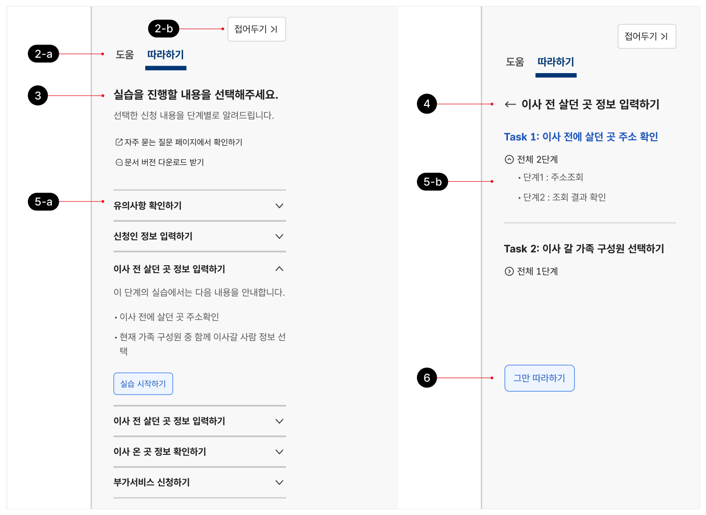

### 따라하기 패널


따라하기 패널은 본문 콘텐츠와 관련된 이용 방법을 실제 이용 절차에 따라 단계적으로 수행할 수 있도록 도와주며 코치마크를 실행하는 데 사용되는 사이드 패널이다.

## 용례

### 사용하기 적합한 경우

- 여러 세부 단계를 거쳐야 하거나 복잡한 입력이 필요한 경우

### 사용하기 적합하지 않은 경우

- 안내/도움 정보가 간단한 경우

맥락적 도움말 컴포넌트를 사용하는 것이 적합하다.
## 구조

- 1 패널 열기 버튼: 패널을 표시하는 데 사용되는 버튼. 본문 우측에 배치되며, 스크롤 동작 시 화면의 일관된 위치에 고정하여 배치됨
- 2 헤더

a. 패널 선택 탭: 도움 패널과 따라하기 패널을 전환하는 데 사용됨 b. 패널 닫기 버튼: 패널을 닫고 패널 활성화 버튼을 표시하는 데 사용됨

- 3 섹션 제목: 따라하기 패널 자체의 제목 또는 현재 진행 중인 과업 단계의 텍스트가 제공됨
- 4 뒤로 가기 버튼: 기본 내용 화면으로 전환하기 위한 버튼
- 5 본문 따라하기 패널의 용도를 안내하고 사용을 유도하기 위한 초기 상태와 단계별 상세 안내 정보를 제공하는 두 가지 상태로 구성됨

- a. 기본: 따라하기 패널을 실행하였을 때 최초에 제공되는 기본 콘텐츠로 실습에 포함된 과업 목록과 세부 과업을 확인할 수 있음
- b. 실습 단계: 기본 콘텐츠에 명시된 과업 목록 하위의 세부 과업 목록. 각 세부 과업의 제목은 코치마크의 제목과 동일함

- 6 중단 버튼: 진행 중인 따라하기 과정을 중단하는 데 사용되는 버튼


**시각 자료 텍스트 보완**

```text
2-b
2-a
5-b
5-a
```
## 사용성 가이드라인

- 01 사용자가 중단하기 버튼을 누르기 전까지 콘텐츠가 변경되지 않아야 한다.
- 02 사용자가 중단하기 버튼을 누르기 전까지 따라하기 프로세스가 중단되지 않아야 한다.
- 03 콘텐츠를 간결하게 유지한다.
- 04 패널에서 제공하는 웹 페이지 링크는 새 창으로 실행한다.
### 01. 사용자가 중단하기 버튼을 누르기 전까지 콘텐츠가 변경되지 않아야 한다.

사용자가 패널을 닫거나 도움 패널로 전환하였다 따라하기 패널을 다시 실행하더라도 본문은 사용자가 가장 마지막에 확인한 따라하기 콘텐츠를 표시해야 한다.

### 02. 사용자가 중단하기 버튼을 누르기 전까지 따라하기 프로세스가 중단되지 않아야 한다.

사용자는 본문과 코치마크에 집중하기 위해 패널을 일시적으로 접은 상태에서 서비스를 이용할 수 있다. 패널 닫기 동작을 수행하였다고 하여 사용자의 의도와 상관없이 따라하기 절차가 중단되면 사용자는 이용 맥락을 잃어버리게 된다.

### 03. 콘텐츠를 간결하게 유지한다.

가능한 한 사용자가 패널 영역을 스크롤 하지 않고 정보를 훑어볼 수 있도록 필요한 내용을 간결한 문장으로 작성한다.

### 04. 패널에서 제공하는 웹 페이지 링크는 새 창으로 실행한다.

패널에 웹 페이지 링크가 포함되어 있는 경우에는 항상 새 창으로 링크를 실행시켜 사용자의 현재 과업 맥락이 중단되지 않도록 한다.


### 플랫폼에 대한 고려 사항

화면 너비가 충분하지 않을 때 따라하기 패널은 패널 열기 버튼으로 축약하여 제공한다.

화면 너비가 충분하지 않을 경우, 사용자가 본문 콘텐츠에 우선적으로 접근하고 본문의 과업에 집중할 수 있도록 패널 열기 버튼을 제공한다. 패널 열기 버튼을 눌렀을 때 패널은 모달 형식으로 제공하면 된다.


## 접근성 가이드라인

### 01. 키보드 초점은 논리적인 순서로 이동해야 한다.

패널이 실행되면 키보드 초점은 패널 영역 자체로 이동해야 한다. 패널 내부에서 키보드 함정이 발생하지 않아야 한다.

- KWCAG 2.2 초점 이동과 표시
- WCAG 2.1 Focus Order (A)
- WCAG 2.1 No Keyboard Trap (A)

### 02. 패널 열기 버튼과 패널은 본문 바로 다음 요소로 제공한다.

키보드, 스크린 리더 사용자가 우선 본문의 다양한 정보와 컨트롤 요소에 대한 개요를 파악한 후 도움 패널의 사용 여부를 결정할 수 있도록 본문 다음 요소로 제공한다.

- KWCAG 2.2 콘텐츠의 선형화
- WCAG 2.1 Meaningful Sequence (A)
- WCAG 2.1 Consistent Navigation (AA)
## 상호작용 가이드라인

### 패널 실행

### 패널 내부 콘텐츠 탐색

| 구분 | 설명 |
|---|---|
| Click | 패널 열기 버튼 또는 아이콘 버튼을 Click 하면 도움/따라하기 패널이 표시된다. 패널 표시 후, 키보드 초점은 도움/따라하기 패널 자체로 이동한다. |
| Enter, Space | 패널 열기 버튼 또는 아이콘 버튼이 초점을 가진 상태에서 Enter 또는 Space 키를 누르면 도움/따라하기 패널이 표시된다. 패널 표시 후, 키보드 초점은 도움/따라하기 패널 자체로 이동한다. |

| 구분 | 설명 |
|---|---|
| Tab | 패널이 활성화된 상태에서 내부 링크 요소를 순차적으로 탐색한다. |
| Click | 패널 내부의 확장 가능한 영역을 펼치거나 접는다. |
| Enter, Space | 패널 내부의 확장 가능한 영역을 펼치거나 접는다. 초점은 확장 가능한 영역을 활성화하는 데 사용되는 버튼에 유지된다. |
### 패널 비활성화

| 구분 | 설명 |
|---|---|
| Click | 패널 닫기 버튼을 Click 하면 도움/따라하기 패널이 닫히고 패널 열기 버튼이 표시된다. 키보드 초점은 패널 열기 버튼으로 이동한다. |
| Enter, Space | 패널 닫기 버튼이 초점을 가진 상태에서 Enter 또는 Space 키를 누르면 도움/ 따라하기 패널이 닫히고 패널 열기 버튼이 표시된다. 키보드 초점은 관련된 패널 열기 버튼으로 이동한다. |
