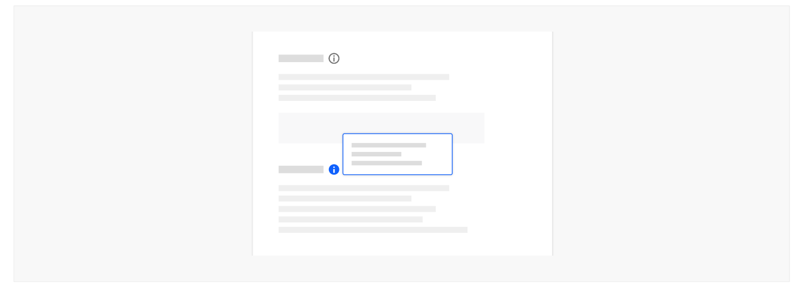
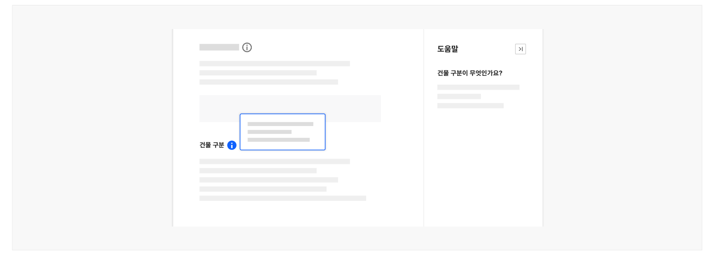

컴포넌트 주변에 배치되어 해당 컴포넌트의 상태나 관련된 상세 정보를 제공하는 컴포넌트이다. 맥락적 도움말은 정보 아이콘이나 도움 아이콘 버튼을 통해 사용자가 요청하는 경우에만 화면에 표시된다.

## 용례

### 사용하기 적합하지 않은 경우

- 컨트롤 요소에 대한 레이블을 제공할 때

텍스트 레이블 없는 아이콘 단독 컨트롤 요소에 레이블을 표시하고자 하는 경우에는 툴팁을 사용하는 것이 적절하다.

- 사용자가 작업을 완료하는 데 필요한 중요한 정보를 전달할 때

사용자가 맥락적 도움말을 발견하지 못할 수 있으므로 사용자가 반드시 확인해야 하는 중요한 정보를 도움말 팝오버에 숨겨서는 안 된다. 중요한 정보를 전달하는 데는 인라인 도움말이나 도움 패널이 적합하다.

- 간단한 추가 정보를 제공할 때

툴팁이나 인라인 도움말을 사용하는 것이 적절하다.
## 유형

### 정보 제공

버튼이 정보(i) 아이콘으로 표현된다. 컴포넌트나 레이블 옆에 배치되어 해당 요소에 관한 부가적인 정보나 사용자가 알았을 때 도움이 되는 정보를 전달하기 위해 사용된다. 본문은 간략하지만 요소에 대한 구체적인 안내를 포함하고 있어야 한다.

예) 비활성화 상태인 컨트롤 요소에 대해 현시점에서 사용할 수 없는 이유에 대한 설명 등

### 도움 제공

버튼이 물음표(?) 아이콘으로 표현된다. 사용자의 과업을 적극적으로 돕기 위한 정보를 전달하기 위해 사용한다. 컴포넌트 자체 또는 컴포넌트 이용에 관한 보다 상세하고 심층적인 정보를 제공하며 이미지, 동영상, 링크를 포함할 수 있다.

예) 입력 방법에 대한 설명, 전문 용어에 대한 해설 등
## 구조

1 아이콘 버튼: 도움말 콘텐츠의 표시를 토글하는 버튼. 정보의 유형에 따라 정보(i) 아이콘, 물음표(?)

아이콘으로 구분됨 2 컨테이너: 도움말 영역과 배경을 구분하는 요소 3 제목: 도움말의 제목 4 본문: 구체적인 설명 텍스트. 일반적으로 짧은 단락으로 구성되며, 링크를 포함할 수 있음 5 닫기 버튼: 컨테이너에 포함된 x 아이콘 버튼

## 사용성 가이드라인

- 01 아이콘 버튼은 도움 정보를 제공하고자 하는 요소 주변에 배치한다.
- 02 팝오버 영역이 화면을 벗어나지 않도록 표현한다.
- 03 팝오버 영역이 본문의 중요 콘텐츠를 가리지 않도록 표현한다.
- 04 사용자가 작업을 수행하기 위해 반드시 알아야 하는 필수 정보가 맥락적 도움말 콘텐츠에서만 제공되지 않도록 한다.
- 05 맥락적 도움말에서 또 다른 맥락적 도움말을 실행하거나 모달을 실행하지 않도록 한다.
- 06 도움말 내부 링크는 새 창으로 실행한다.
- 07 맥락적 도움말과 도움 패널을 함께 사용하지 않는다.
### 01. 아이콘 버튼은 도움 정보를 제공하고자 하는 요소 주변에 배치한다.

정보를 제공하고자 하는 컴포넌트나 레이블 옆에 배치하여 관련 요소와의 연관성이 명확하게 인지될 수 있도록 한다.
### 02. 팝오버 영역이 화면을 벗어나지 않도록 표현한다.

도움말 팝오버 영역이 시각적으로 확인할 수 없는 화면 밖의 영역에 배치되어 내부 콘텐츠가 가려지지 않도록 해야 한다.
### 03. 팝오버 영역이 본문의 중요 콘텐츠를 가리지 않도록 표현한다.

팝오버 영역이 활성화 버튼과 맥락적으로 도움을 제공하고자 하는 본문 콘텐츠 요소를 가리지 않도록 적절한 표시 방향을 설정한다.
### 04. 사용자가 작업을 수행하기 위해 반드시 알아야 하는 필수 정보가 맥락적 도움말 콘텐츠에서만 제공되지 않도록 한다.

맥락적 도움말을 발견하지 못할 수 있으므로 사용자가 반드시 확인해야 하는 중요한 정보를 도움말 팝오버에만 제공해서는 안 된다. 맥락적 도움말은 필수 정보가 아니라 제공되었을 때 사용자가 더 쉽게 이용하는 데 도움되는 정보를 제공해야 한다. 필수 정보를 잘 요약하여 본문에 표현하고 관련된 유용한 정보를 맥락적 도움말로 제공한다.

[모범 사례]



**사례 텍스트 보완**

```text
원본 PDF의 UI 배치·상태·다이어그램을 보존한 시각 자료입니다.
```
### 05. 맥락적 도움말에서 또 다른 맥락적 도움말을 실행하거나 모달을 실행하지 않도록 한다.

여러 개의 도움말 팝업을 동시에 활성화 하거나 하나의 팝오버를 다른 팝오버 내부에 중첩시켜서는 안 된다. 또한 맥락적 도움말에서 모달이 생성되지 않도록 하여 복잡성을 피해야 한다.

### 06. 도움말 내부 링크는 새 창으로 실행한다.

본문에 링크가 포함되어 있는 경우에는 항상 새 창으로 링크를 실행시켜 사용자의 현재 과업 맥락이 중단되지 않도록 한다.
### 07. 맥락적 도움말과 도움 패널을 함께 사용하지 않는다.

사용자가 인터페이스의 작동 방식을 혼동하지 않도록 하나의 과업 흐름에서 맥락적 도움말과 도움 패널을 동시에 사용하지 않아야 한다.

[피해야 할 사례]



**사례 텍스트 보완**

```text
도움말
건물 구분이 무엇인가요?
건물 구분
```
### 플랫폼에 대한 고려 사항

### 모든 화면 크기에서 팝오버 영역이 완전히 표시되는지 확인한다.

특정 너비에서 도움말 팝오버 영역이 시각적으로 확인할 수 없는 화면 밖의 영역에 배치되지 않는지 확인하여 문제가 발견된 경우 적절한 영역으로 배치를 변경해야 한다.
플랫폼에 대한 고려 사항


## 접근성 가이드라인

### 01. 아이콘과 인접 배경 간 명도 대비를 3:1 이상으로 제공한다.

사용자가 아이콘이 컨트롤로 사용되고 있으며 유형에 따라 다른 정보를 제공함을 인지할 수 있도록 아이콘과 인접 배경의 명도 대비를 3:1 이상으로 제공해야 한다.

- KWCAG 2.2 텍스트 콘텐츠의 명도 대비
- WCAG 2.1 Non-text Contrast (AA)

### 02. 아이콘 버튼에 이름을 제공한다.

스크린 리더 사용자가 활성화 버튼의 용도를 이해할 수 있도록 각각의 아이콘 버튼에 이름을 제공해야 한다.

- KWCAG 2.2 적절한 링크 텍스트
- WCAG 2.1 Non-text Content (A)
- WCAG 2.1 Name, Role, Value (A)

### 03. 아이콘 버튼에 고유하고 적절한 이름을 제공한다.

아이콘 버튼이 맥락적으로 도움을 제공하고자 하는 본문 콘텐츠의 내용을 포함하고 있지 않다면 해당 정보를 아이콘 버튼의 이름으로 포함하여 스크린 리더 사용자가 정확한 용도를 이해할 수 있도록 제공한다. 화면에 존재하는 다른 아이콘 버튼과 혼동되지 않도록 모든 아이콘 버튼의 이름은 고유해야 한다.

- KWCAG 2.2 적절한 링크 텍스트
- WCAG 2.1 Headings and Labels (AA)
### 04. 맥락적 도움말은 사용자가 요청한 경우에만 실행되어야 한다.

화면이 로딩되자마자 특정 맥락적 도움말이 활성화되는 등 사용자가 의도하지 않는 상황에서 자동으로 실행되어서는 안 된다.

- KWCAG 2.2 사용자 요구에 따른 실행
- WCAG 2.1 On Focus (A)
- WCAG 2.1 On Input (A)

### 05. 아이콘 버튼과 도움말 팝오버 콘텐츠를 적절한 순서로 제공한다.

스크린 리더 사용자가 도움말 팝오버 콘텐츠에 논리적인 순서로 접근할 수 있도록 관련 있는 아이콘 버튼 다음 요소로 제공해야 한다.

- KWCAG 2.2 콘텐츠의 선형화
- WCAG 2.1 Meaningful Sequence (A)
### 06. 키보드 초점은 논리적인 순서로 이동해야 한다.

맥락적 도움말 팝오버 내부에 링크가 포함된 경우, 맥락적 도움말을 활성화했을 때 키보드 초점은 팝오버 내부의 대화형 요소로 이동해야 한다. 이때, 팝오버 내부에서 키보드 함정이 발생하지 않도록 유의해야 한다.

- KWCAG 2.2 초점 이동과 표시
- WCAG 2.1 Focus Order (A)
- WCAG 2.1 No Keyboard Trap (A)

### 07. 아이콘 버튼의 크기를 44px × 44px 이상으로 제공하는 방안을 고려한다.

클릭이나 터치 영역을 정교하게 조작하기 어려운 사용자를 고려하여 아이콘 버튼의 크기를 44px x 44px 이상으로 제공하는 방안을 고려한다. 이때, 단위는 CSS 픽셀을 기준으로 한다.

만약 아이콘 버튼이 문장의 끝에 제공되고 있다면 문장의 일부 요소로 간주되기 때문에 크기에 대한 요구사항을 충족하지 않아도 된다.

- KWCAG 2.2 조작 가능
- WCAG 2.1 Target Size (AAA)
## 상호작용 가이드라인

### 맥락적 도움말 실행

### 도움말 내부 콘텐츠 탐색

Tab 도움말 팝오버가 활성화된 상태에서 내부 링크 요소를 순차적으로 탐색한다.

| 구분 | 설명 |
|---|---|
| Click | 아이콘 버튼을 Click 하면 도움말 콘텐츠가 표시된다. |
| Enter, Space | 아이콘 버튼이 초점을 가진 상태에서 Enter 또는 Space 키를 누르면 도움말 콘텐츠가 표시된다. |

| 구분 | 설명 |
|---|---|
| Tab | 도움말 팝오버가 활성화된 상태에서 내부 링크 요소를 순차적으로 탐색한다. |
상호작용 가이드라인


### 맥락적 도움말 비활성화

| 구분 | 설명 |
|---|---|
| Click | 아이콘 버튼 또는 도움말 팝오버 바깥쪽 본문 영역을 Click 하면 도움말 콘텐츠가 숨겨진다. 키보드 초점은 관련된 아이콘 버튼으로 돌아간다. |
| Esc | 초점의 위치와 상관 없이 Esc 키를 누르면 도움말 콘텐츠가 숨겨진다. 키보드 초점은 관련된 아이콘 버튼으로 돌아간다. |
| Enter, Space | 아이콘 버튼이 초점을 가진 상태에서 Enter 또는 Space 키를 누르면 도움말 콘텐츠가 숨겨진다. 키보드 초점은 관련된 아이콘 버튼으로 돌아간다. |
