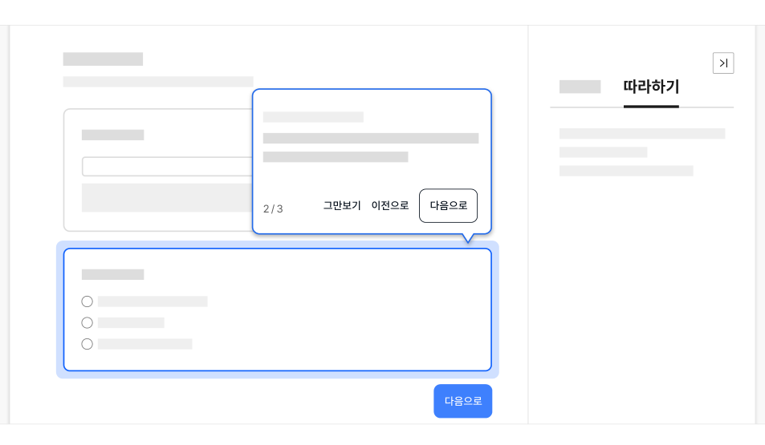
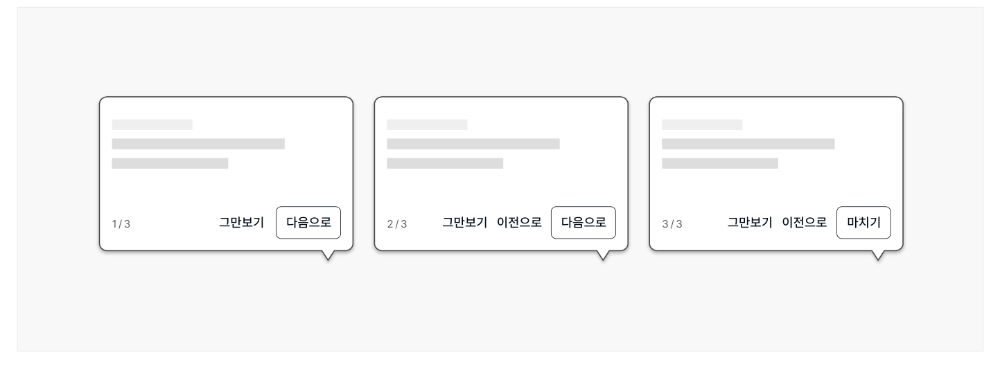
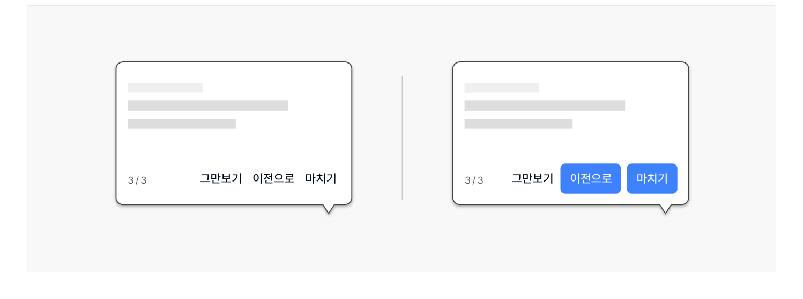

코치마크는 사용자에게 새로 도입된 기능을 안내하거나, 여러 단계를 거쳐 수행해야 하는 복잡한 과업을 사용자가 보다 쉽게 완료할 수 있도록 세부 수행 단계별로 고맥락적 도움말을 제공하는 컴포넌트이다.

## 용례

### 사용하기 적합한 경우

- 사용자를 안내하고 플로(Flow) 단계의 전체적인 순서를 학습시키기 위해 사용하는 경우
- 사용자가 사용 가능한 기능에 대한 개요를 파악할 수 있도록 하기 위해 사용하는 경우
## 구조

1 스포트라이트: 지시 사항 제공을 위해 주의를 집중시키고자 하는 사용자 인터페이스 또는 콘텐츠 섹션.

사용자 인터페이스 또는 콘텐츠 섹션 주변을 둘러싼 외곽선과 애니메이션을 통해 주목도를 높임 2 코치마크 팝오버

- a. 제목: 과업 수행 단계 번호와 과업 명칭 텍스트를 제공함
- b. 지시사항: 과업 수행을 위해 사용자가 확인하거나 따라야 할 사항을 안내하는 텍스트
- c. 단계 식별자: 전체 단계와 현재 수행 중인 단계 번호를 분수 형식으로 표시함
- d. 액션 버튼: 건너뛰기, 이전, 다음 버튼이 제공됨

도식 라벨: 1 2-a 2-b 2-c 2-d
## 사용성 가이드라인

- 01 코치마크는 정보를 제공하고자 하는 요소 주변에 배치한다.
- 02 팝오버 영역이 본문의 중요 콘텐츠를 가리지 않도록 표현한다.
- 03 팝오버 영역의 너비를 일관되게 유지한다.
- 04 코치마크의 제목과 지시 사항은 간결하고 명확하게 작성한다.
- 05 지나치게 많은 코치마크를 사용하지 않는다.
- 06 코치마크는 전체 과업 플로(Flow)를 고려하여 논리적인 순서로 제공한다.
- 07 한 화면에 여러 개의 코치마크가 표시되지 않도록 한다.
- 08 코치마크가 표시된 상태에서 다른 메시지가 표시되지 않도록 한다.
- 09 지시 사항 내부 링크는 새 창으로 실행한다.
- 10 모든 단계에서 액션 버튼을 일관성 있는 순서로 배치하고 동일한 레이블을 사용한다.
- 11 액션 버튼을 적절한 강조 수준으로 표현한다.
- 12 사용자의 특정 행동 이후 다음 단계의 코치마크에 접근 가능한 경우, 사용자의 행동 완수 여부를 시스템이 확인하도록 한다.
### 01. 코치마크는 정보를 제공하고자 하는 요소 주변에 배치한다.

정보를 제공하고자 하는 사용자 인터페이스 또는 콘텐츠 섹션 옆에 배치하여 관련 요소와의 연관성이 명확하게 인지될 수 있도록 한다.
### 02. 팝오버 영역이 본문의 중요 콘텐츠를 가리지 않도록 표현한다.

팝오버 영역이 안내를 제공하고자 하는 본문 콘텐츠 요소를 가리지 않도록 적절한 표시 방향을 설정한다.

[모범 사례]



**사례 텍스트 보완**

```text
따라하기
그만보기
이전으로
다음으로
2 / 3
```
### 03. 팝오버 영역의 너비를 일관되게 유지한다.

코치마크 팝오버 영역의 너비는 최대 지시 사항 텍스트 길이를 고려하여 결정한다. 하나의 과업에 대해 제공되는 모든 코치마크 팝오버는 동일한 너비를 갖도록 표현해야 한다.

### 04. 코치마크의 제목과 지시 사항은 간결하고 명확하게 작성한다.

코치마크는 관련 요소에 대한 간결한 설명을 제공하여 사용자의 부담을 줄이고 과업의 완수를 격려해야 한다. 가능한 한 제목은 1줄을 유지하고 지시 사항은 3줄 이내로 작성한다.

### 05. 지나치게 많은 코치마크를 사용하지 않는다.

한 화면에 4개 이하의 코치마크를 사용하는 것이 가장 이상적이며, 최대 15단계를 넘지 않도록 한다. 최적의 코치마크 수를 유지하기 위해 각 코치마크가 사용자에게 도움 되는 정보를 포함하고 있는지 점검해야 한다. 불필요한 코치마크는 삭제하고 가능한 경우 메시지를 합치되, 사용자가 거쳐야 하는 핵심적인 과업 단계가 누락되지 않도록 유의한다.
### 06. 코치마크는 전체 과업 플로(Flow)를 고려하여 논리적인 순서로 제공한다.

사용자의 실제 이용 플로(Flow)를 반영하여 논리적인 순서에 따라 단계가 진행될 수 있도록 구성해야 한다.

### 07. 한 화면에 여러 개의 코치마크가 표시되지 않도록 한다.

여러 개의 코치마크가 동시에 표시되는 것은 코치마크의 제공 목적과 이용 흐름에 적합하지 않다.

### 08. 코치마크가 표시된 상태에서 다른 메시지가 표시되지 않도록 한다.

코치마크가 제공될 때 화면에 다른 알림이나 배너 등의 레이어가 실행되지 않도록 구성하여 사용자가 코치마크에서 안내하고 있는 과업에 집중할 수 있도록 한다.

### 09. 지시 사항 내부 링크는 새 창으로 실행한다.

지시 사항에 참고 링크가 포함되어 있는 경우에는 항상 새 창으로 링크를 실행시켜 사용자의 현재 과업 맥락이 중단되지 않도록 한다.
### 10. 모든 단계에서 액션 버튼을 일관성 있는 순서로 배치하고 동일한 레이블을 사용한다.

모든 단계에서 액션 버튼은 왼쪽부터 '그만보기', '이전', '다음' 순서로 제공한다.

단일 단계의 코치마크에서 '다음' 버튼의 레이블은 '확인'으로 사용한다. 여러 단계의 코치마크에서 첫 번째 단계는 '이전' 버튼을 사용하지 않으며, 마지막 단계에서 '다음' 버튼의 레이블은 '마치기'로 제공한다.

[모범 사례]



**사례 텍스트 보완**

```text
그만보기
다음으로
이전으로
마치기
1 / 3
2 / 3
3 / 3
```
### 11. 액션 버튼을 적절한 강조 수준으로 표현한다.

'그만보기', '이전' 버튼은 텍스트 버튼 스타일을, '다음', '마치기' 버튼은 고스트 버튼 스타일을 사용한다. '다음', '마치기' 버튼은 본문 액션 버튼의 강조 수준보다 낮아야 한다.

[피해야 될 사례]



**시각 자료 텍스트 보완**

```text
그만보기
이전으로
마치기
3 / 3
```
### 12. 사용자의 특정 행동 이후 다음 단계의 코치마크에 접근 가능한 경우, 사용자의 행동 완수 여부를 시스템이 확인하도록 한다.

코치마크에서 사용자가 지시 사항에 따라 특정 행동을 하도록 요구하는 경우, 사용자가 해당 행동을 완수했을 때 자동으로 다음 단계의 코치마크로 넘어가도록 한다. 사용자 스스로가 해당 행동을 수행하였음을 확인하는 것이 아니라 시스템에서 사용자가 정확한 행동을 수행하였는지 확인함으로써 사용자가 부적절하게 다음 단계에 접근하는 오류를 방지해야 한다. 이 경우 '그만보기' 버튼을 제공하는 한, '다음' 버튼을 제공하지 않아도 된다.


### 플랫폼에 대한 고려 사항

### 모든 화면 크기에서 팝오버 영역이 완전히 표시되는지 확인한다.

특정 너비에서 코치마크 팝오버 영역이 시각적으로 확인할 수 없는 화면 밖의 영역에 배치되지 않는지 확인하여 문제가 발견된 경우 적절한 영역으로 배치를 변경해야 한다.


## 접근성 가이드라인

### 01. 스포트라이트와 인접 배경 간 명도 대비를 3:1 이상으로 제공한다.

사용자가 집중해야 할 요소를 명확하게 인지할 수 있도록 스포트라이트와 인접 배경의 명도 대비를 3:1 이상으로 제공해야 한다.

- KWCAG 2.2 텍스트 콘텐츠의 명도 대비
- WCAG 2.1 Non-text Contrast (AA)

### 02. 코치마크는 사용자가 요청한 경우에만 실행되어야 한다.

화면이 로딩되자마자 특정 코치마크가 활성화되는 등 사용자가 의도하지 않는 상황에서 자동으로 실행되어서는 안된다.

- KWCAG 2.2 사용자 요구에 따른 실행
- WCAG 2.1 On Focus (A)
- WCAG 2.1 On Input (A)

### 03. 관련 요소와 코치마크 팝오버 콘텐츠를 적절한 순서로 제공한다.

스크린 리더 사용자가 코치마크 팝오버 콘텐츠에 논리적인 순서로 접근할 수 있도록 관련 있는 요소의 바로 다음 요소로 제공해야 한다.

- KWCAG 2.2 콘텐츠의 선형화
- WCAG 2.1 Meaningful Sequence (A)


## 상호작용 가이드라인

### 팝오버 내부 콘텐츠 탐색

### 코치마크 비활성화

| 구분 | 설명 |
|---|---|
| Tab | 코치마크 팝오버가 활성화된 상태에서 내부 컨트롤 요소를 순차적으로 탐색한다. |

| 구분 | 설명 |
|---|---|
| Click | 그만보기 버튼을 Click 하면 코치마크 팝오버가 숨겨진다. 키보드 초점은 따라하기 패널에서 따라하기를 실행하는 버튼으로 이동한다. |
| Enter, Space | 그만보기 버튼이 초점을 가진 상태에서 Enter 또는 Space 키를 누르면 코치마크 팝오버가 숨겨진다. 키보드 초점은 따라하기 패널에서 따라하기를 실행하는 버튼으로 이동한다. |
