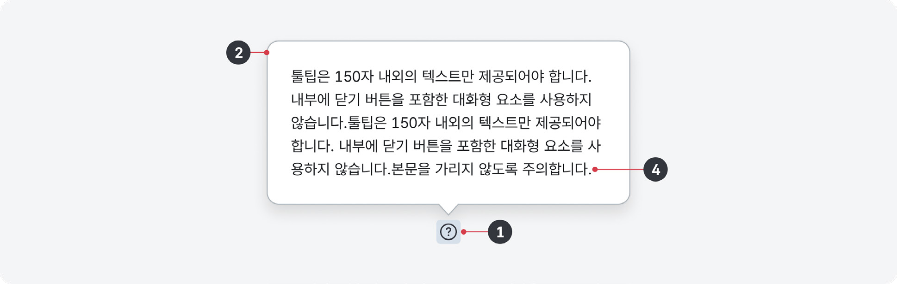
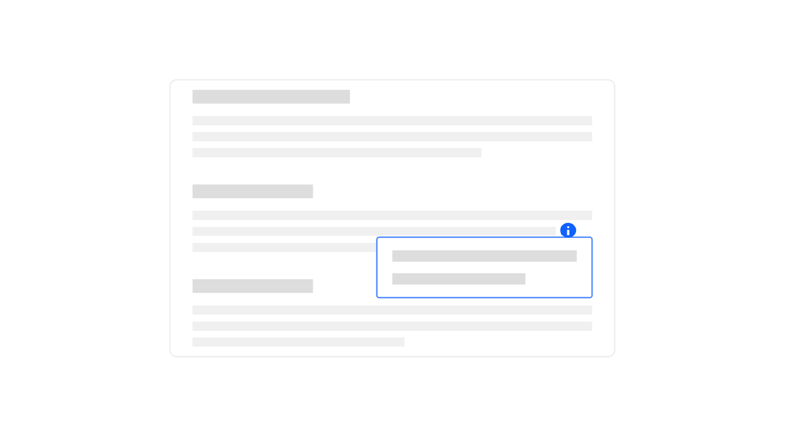
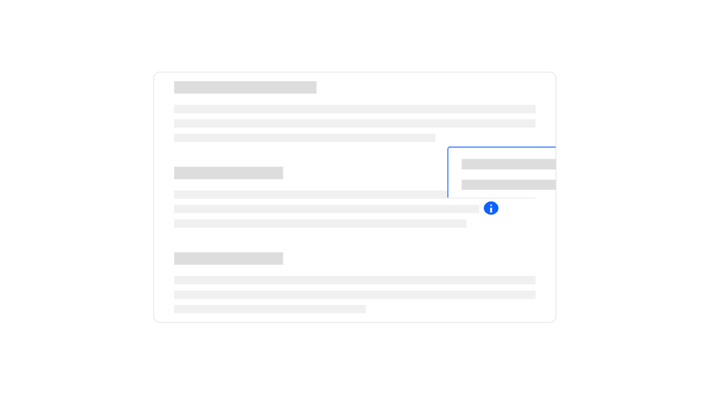
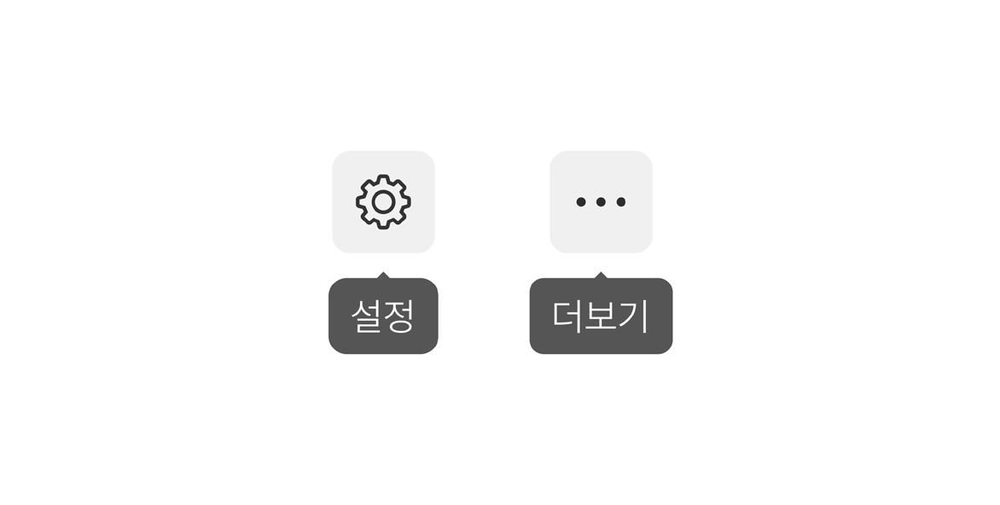
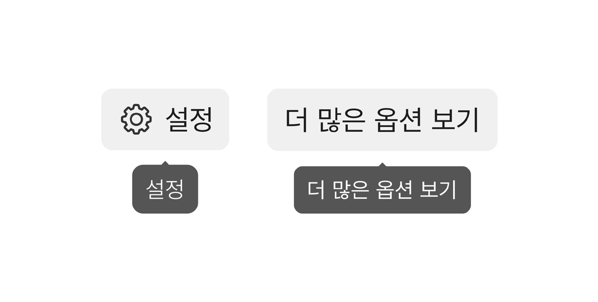
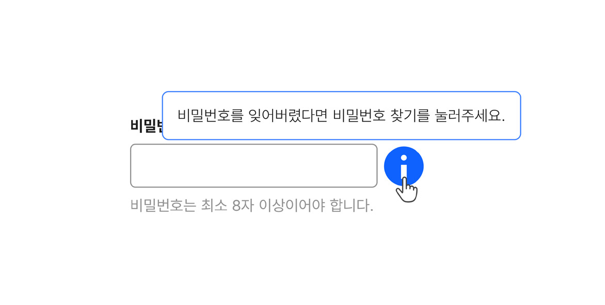
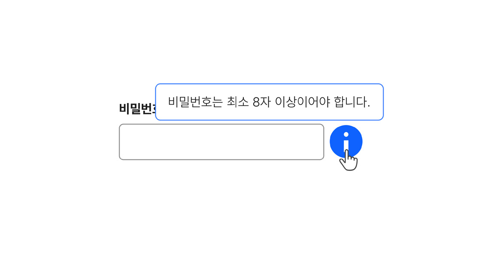
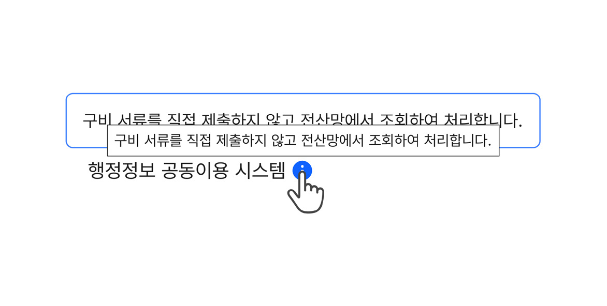

툴팁은 요소나 본문 텍스트에 제공되는 짧은 부가 설명이다. 설명이 필요한 대상 또는 별도의 활성화 버튼에 마우스를 올리거나 초점을 이동했을 때 설명 텍스트가 표시된다.

## 용례

### 사용하기 적합한 경우

- 컨트롤 요소에 대한 레이블을 제공할 때

텍스트 레이블 없는 아이콘 단독 컨트롤 요소에 레이블을 표시하고자 하는 경우에 툴팁을 사용한다.

- 서비스 이용/콘텐츠 이해에 필수적이지는 않으나 간단한 추가 정보를 제공할 때

단어 의미에 대한 설명과 같이 간단한 추가 정보를 제공할 때 툴팁을 사용한다.

### 사용하기 적합하지 않은 경우

- 팝오버에 대화형 요소가 포함되어야 하는 경우

맥락적 도움말을 사용한다.

- 긴 설명을 제공해야 하는 경우

툴팁은 150자 내외의 짧은 설명을 제공할 때 사용하기 적합하다. 더 긴 설명이 필요하다면 콘텐츠의 특성과 이용 맥락에 따라 맥락적 도움말, 도움 패널, 별도 도움말 페이지를 활용한다.
## 구조

1 활성화 버튼: 툴팁 콘텐츠의 표시를 토글하는 버튼 2 컨테이너: 팝오버 영역과 배경을 구분하는 요소 3 아이콘(선택): 강조가 필요한 경우, 본문의 내용에 따라 시스템 상태 아이콘을 사용할 수 있음 4 본문: 구체적인 설명 텍스트

## 유형

### 정보/물음표 아이콘 툴팁

컴포넌트나 레이블 옆에 배치되어 해당 요소에 관한 부가적인 정보를 제공하는 툴팁이다. 아이콘의 선택 방법에 대해서는 맥락적 도움말 컴포넌트의 유형을 참고하면 된다.

### 아이콘 버튼 툴팁

텍스트 레이블이 없거나 공간 제약으로 인해 레이블이 축약된 아이콘 버튼에 제공되는 툴팁이다.
## 사용성 가이드라인

- 01 툴팁 컴포넌트 사용을 우선적으로 고려한다.
- 02 팝오버 영역이 화면을 벗어나지 않도록 표현한다.
- 03 팝오버 영역이 본문의 중요 콘텐츠를 가리지 않도록 표현한다.
- 04 아이콘 버튼에 툴팁을 제공한다.
- 05 툴팁은 부가적인 정보를 전달하는 데 사용한다.
- 06 툴팁 컴포넌트와 title 속성을 중첩하여 사용하지 않는다.
- 09 맥락적 도움말과 도움 패널을 함께 사용하지 않는다.

### 툴팁 컴포넌트 사용을 우선적으로 고려한다.

HTML title 속성으로 제공되는 힌트 텍스트는 글자 크기, 표시 위치와 같은 스타일을 수정할 수 없어 툴팁을 필요로하는 사용자가 정보를 확인하기 어려울 수 있다. 또한 스크린 리더 환경설정에 따라 title 속성으로 제공된 힌트 텍스트가 음성으로 출력되지 않을 수 있으므로 가능한 툴팁 컴포넌트를 사용하는 것이 좋다.

### 팝오버 영역이 화면을 벗어나지 않도록 표현한다.

툴팁의 팝오버 영역이 시각적으로 확인할 수 없는 화면 밖의 영역에 배치되어 내부 콘텐츠가 가려지지 않도록 해야 한다.

[모범 사례]

[피해야 할 사례]

### 팝오버 영역이 본문의 중요 콘텐츠를 가리지 않도록 표현한다.

툴팁의 팝오버 영역이 활성화 버튼과 부가 정보를 제공하고자 하는 본문 콘텐츠 요소를 가리지 않도록 적절한 표시 방향을 설정한다.

[모범 사례]

[피해야 할 사례]

### 아이콘 버튼에 툴팁을 제공한다.

아이콘만으로 구성된 컨트롤 요소는 사용자에게 의미/용도를 정확하게 전달하기 어렵다. 그러므로 아이콘만으로 구성된 메뉴/기능 버튼에는 툴팁을 반드시 제공해야 한다.

[모범 사례]

[피해야 할 사례]

### 툴팁은 부가적인 정보를 전달하는 데 사용한다.

사용자가 반드시 확인해야 하는 중요한 정보를 툴팁 팝오버에만 제공해서는 안 된다. 필수 정보는 사용자가 잘 발견할 수 있도록 별도의 상호작용 없이 본문에 표시하는 것이 적절하다.

[피해야 할 사례]

### 툴팁 컴포넌트와 title 속성을 중첩하여 사용하지 않는다.

툴팁 컴포넌트와 title 속성이 동시에 사용되면 두 요소의 위치가 중첩되면서 설명이 정확하게 전달되기 어렵다. 스크린 리더 사용자에게도 동일한 설명이 여러 번 제공되므로 피로를 유발할 수 있다.
### 플랫폼에 대한 고려 사항

### 터치 인터페이스에서의 사용성을 고려한다.

툴팁은 마우스, 키보드, 펜 인터페이스로만 실행할 수 있기 때문에 터치가 1차적인 입력 방식인 경우에는 사용자에게 부가적인 정보를 제공하기 어렵다. 이러한 상황을 고려하여 아이콘 버튼을 표현할 때는 메뉴/ 기능의 의미를 명확하게 보여줄 수 있는 아이콘을 선택해야 한다. 별도의 활성화 버튼이 존재한다면 터치 인터페이스가 탐지되었을 때, 활성화 버튼의 Click 이벤트에 팝오버의 출현이 토글 될 수 있도록 한다.
## 접근성 가이드라인

### 01. 활성화 버튼에 이름을 제공한다.

스크린 리더 사용자가 활성화 버튼의 용도를 이해할 수 있도록 각각의 버튼에 이름을 제공해야 한다.

- KWCAG 2.2 적절한 링크 텍스트
- WCAG 2.1 Non-text Content (A)
- WCAG 2.1 Name, Role, Value (A)

### 02. 활성화 버튼에 고유하고 적절한 이름을 제공한다.

활성화 버튼이 맥락적으로 도움을 제공하고자 하는 본문 콘텐츠의 내용을 포함하고 있지 않다면 해당 정보를 활성화 버튼의 이름으로 포함하여 스크린 리더 사용자가 정확한 용도를 이해할 수 있도록 제공한다. 화면에 존재하는 다른 활성화 버튼과 혼동되지 않도록 모든 활성화 버튼의 이름은 고유해야 한다.

- KWCAG 2.2 적절한 링크 텍스트
- WCAG 2.1 Headings and Labels (AA)
### 03. 활성화 버튼과 컨테이너 영역을 aria-labelledby 속성으로 연결한다.

이를 통해 시각을 활용하여 정보를 탐색하는 사용자가 활성화 버튼에 접근했을 때 툴팁 콘텐츠를 바로 확인할 수 있는 것처럼 스크린 리더 사용자도 동일한 방식으로 정보를 전달받을 수 있다.

- WCAG 2.1 Info and Relationships (A)

### 04. 활성화 버튼과 팝오버 콘텐츠를 적절한 순서로 제공한다.

스크린 리더 사용자가 도움말 팝오버 콘텐츠에 논리적인 순서로 접근할 수 있도록 관련 있는 활성화 버튼 다음 요소로 제공해야 한다.

- KWCAG 2.2 콘텐츠의 선형화
- WCAG 2.1 Meaningful Sequence (A)
## 상호작용 가이드라인

### 팝오버 내부 콘텐츠 탐색

### 코치마크 비활성화

| 구분 | 설명 |
|---|---|
| Click | 터치 인터페이스에서 활성화 버튼을 누르면 툴팁 팝오버가 표시된다. |
| Mouseover | 활성화 버튼에 Mouseover 이벤트가 발생하면 툴팁 팝오버가 표시된다. |
| Focus | 활성화 버튼이 초점을 가지면 툴팁 팝오버가 표시된다. |

| 구분 | 설명 |
|---|---|
| Click | 터치 인터페이스에서 활성화 버튼 또는 팝오버 영역 외의 화면을 누르면 팝오버가 사라진다. |
| Mouseleave | 활성화 버튼 또는 팝오버 영역 밖으로 마우스가 이동하면 팝오버가 사라진다. |
| Blur | 활성화 버튼에서 Tab, Shift + Tab을 눌러 초점이 버튼 외부로 빠져나가면 팝오버가 사라진다. |
| Esc | 툴팁 팝오버가 표시된 상태에서 Esc 키를 누르면 팝오버가 닫히면서 키보드 초점이 활성화 버튼으로 이동한다. Tab, Shift + Tab을 눌러 다른 요소를 탐색한 후 활성화 버튼에 다시 초점이 다시 진입하기 전까지 팝오버는 사라진 상태로 유지된다. |
