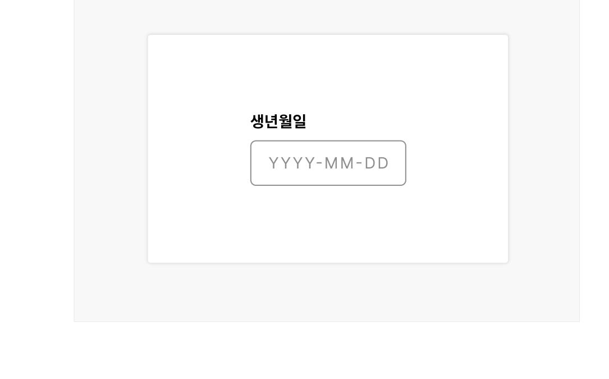
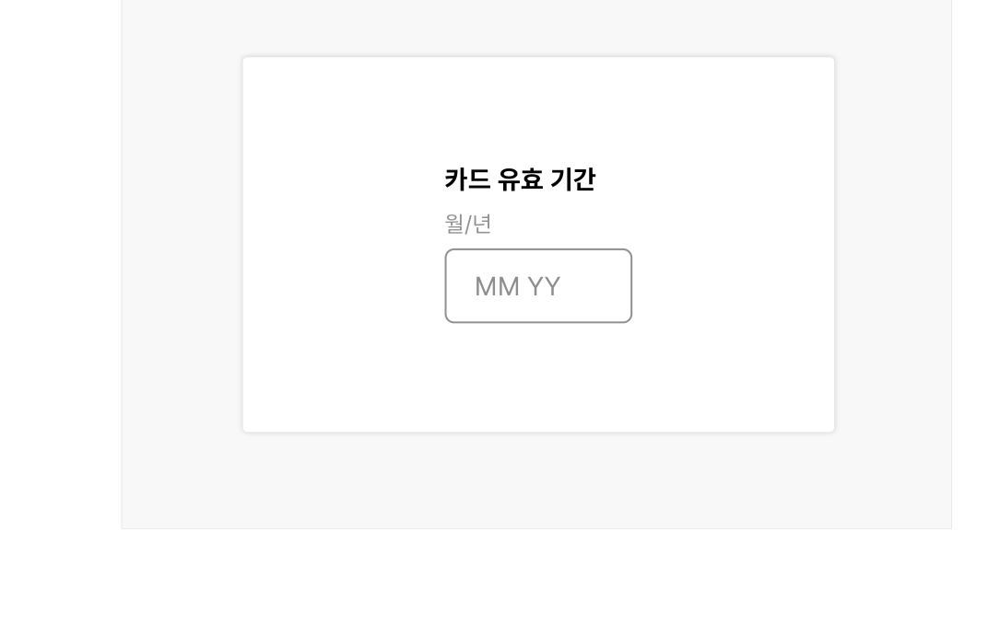
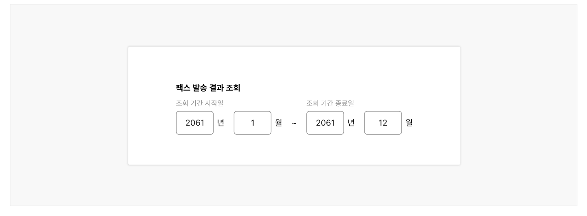
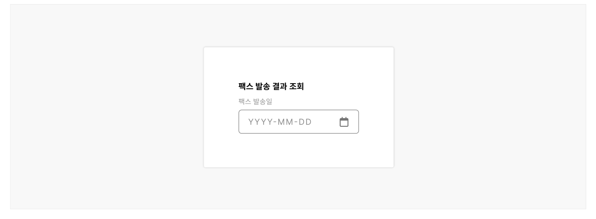

날짜 입력 필드는 사용자가 특정 날짜 또는 기간을 입력하거나 선택하는 데 사용되는 요소이다.

## 용례

### 사용하기 적합하지 않은 경우

### 특정 날짜로부터의 상대적인 날짜의 입력을 요청할 때

특정 날짜로부터 '5일 이내', '1일 후'와 같은 상대적인 날짜의 입력이 필요한 경우에는 짧은 텍스트 입력 컴포넌트를 사용하여 사용자가 직접 값을 입력하도록 하거나 셀렉트 컴포넌트로 선택 가능한 날짜 옵션을 제시해야 한다.
## 유형

### 다중 입력 필드

년, 월, 일 정보를 개별 입력 필드를 통해 입력하는 방식으로 필요한 날짜 데이터 유형에 따라 년이나 일 입력 필드가 생략될 수 있다.

대부분의 상황에서 사용할 수 있으나 연속된 입력 필드 간 이동 동작이 필요하기 때문에 가장 효율성이 낮은 입력 방식이다. 날짜 정보를 정확하게 입력해야 하거나 문서에 표시된 날짜 형식과 일치하는 형식으로 작성이 필요한 경우에 사용한다.

예) 카드 유효기간, 여권 발급 일자, 생년월일

### 단일 입력 필드

하나의 입력 필드에 전체 날짜 데이터를 입력하는 방식으로 다중 입력 필드에 비해 유연하다. 사용자가 이미 알고 있는 날짜를 입력받는 데 유용하며, 사용자가 기억하지 못하는 과거나 미래의 날짜를 요청해야 한다면 날짜 선택기를 함께 제공해야 한다.

예) 주민등록번호 앞자리, 생년월일
### 범위 입력 필드

단일 입력 필드를 2개를 사용하여 시작일과 종료일을 입력할 때 사용한다. 날짜의 범위 정보가 필요한 상황 외에도 사용자가 대략적인 날짜만 알고 있는 상황에서 유용하다. 단일 입력 필드와 마찬가지로 사용자가 기억하지 못하는 날짜 범위의 입력을 요청해야 한다면 날짜 선택기를 함께 제공해야 한다.

예) 필터링/조회 패턴에서 표시할 날짜 메타 데이터 범위를 설정할 때

### 날짜 선택기가 있는 입력 필드

단일 입력 필드, 범위 입력 필드는 날짜 선택기와 함께 이용할 수 있다. 서비스 이용 시점으로부터 멀리 떨어진 과거 날짜나 미래 날짜를 입력해야 하거나, 요일 정보가 중요한 상황, 인접한 날짜를 비교하여 선택해야 하는 상황에 사용하기 적합하다.

예) 예약일, 방문/관람일
## 구조

- 1 레이블: 사용자가 어떤 텍스트를 입력해야 하는지를 안내하는 문구
- 2 입력 필드: 날짜 텍스트가 입력되는 영역으로 배경과 입력 필드를 구분하여 사용자가 날짜 입력 필드임을 인지할 수 있게 함
- 3 달력 아이콘 버튼(선택): 날짜 선택을 위한 달력 컴포넌트 레이어 표시/숨기기에 사용되는 아이콘 버튼
- 4 도움말(선택): 입력 방식에 대한 도움말 또는 오류 메시지를 제공함
- 5 플레이스홀더(선택): 날짜를 어떤 양식으로 입력해야 하는지에 대한 힌트 또는 예시를 제공함

## 사용성 가이드라인

- 01 입력 필드에 레이블을 제공하고 어떤 날짜를 입력해야 하는지 명확하게 설명한다.
- 02 도움말 텍스트를 활용하여 날짜 입력 형식을 안내한다.
- 03 문서에 표시된 날짜를 정확하게 요청할 때 입력 필드의 구성을 원본 형식과 일치시킨다.
- 04 사용자가 대략적인 날짜를 입력할 수 있도록 한다.
- 05 사용자가 자주, 반복적으로 입력하는 날짜는 자동 완성될 수 있도록 구현한다.

### 입력 필드에 레이블을 제공하고 어떤 날짜를 입력해야 하는지 명확하게 설명한다.

모든 날짜 입력 필드에는 입력 내용을 적절하게 설명하는 레이블을 제공해야 한다.

다중 입력 필드에는 '년', '월', '일'이라는 레이블을 제공하고 입력 필드 상단에 입력이 필요한 날짜에 대한 설명을 제공하면 된다.

### 도움말 텍스트를 활용하여 날짜 입력 형식을 안내한다.

입력 필드 하단의 도움말 텍스트를 사용하여 입력해야 할 날짜의 양식을 정확하게 안내해야 한다. 플레이스홀더는 사용자가 입력을 시작하면 사라지기 때문에 입력 필드 하단의 도움말 텍스트를 사용하는 것이 바람직하다. 플레이스홀더에는 'YYYY-MM-DD'와 같은 형식에 대한 자리 표시자를 제공하고 도움말 텍스트에는 입력 자릿수에 대한 안내 문구와 작성 예시를 제공한다.

[모범 사례]

[피해야 할 사례]



**사례 텍스트 보완**

```text
생년월일
생년월일을 8자리로 입력해 주세요.
YYYYMMDD
```


**사례 텍스트 보완**

```text
생년월일
YYYYMMDD
```

### 문서에 표시된 날짜를 정확하게 요청할 때 입력 필드의 구성을 원본 형식과 일치시킨다.

여권, 신용카드 유효 기간 등 원본이 존재하는 날짜는 원본의 형식과 입력 필드를 일치시켜 사용자가 혼동을 느끼지 않도록 하고 필요한 경우 날짜 텍스트를 복사하여 쉽게 붙여넣을 수 있도록 한다.

[모범 사례]

[피해야 할 사례]



**사례 텍스트 보완**

```text
카드 유효 기간
월
년
MM
/
YY
```


**사례 텍스트 보완**

```text
카드 유효 기간
월/년
MM YY
```

### 사용자가 대략적인 날짜를 입력할 수 있도록 한다.

사용자가 기억하기 어려운 날짜나 특정일을 지정하기 어려운 정보를 요청할 때, 범위로 날짜를 입력할 수 있도록 입력 필드를 구성해야 한다.

예를 들어, '여권 분실 일자'는 특정일이 아니라 '2023년 12월'과 같이 달을 범위로 입력할 수 있도록 입력 필드를 구성할 수 있다. 신청 결과 목록에서 사용자가 신청 일자를 기억하지 못하는 상황을 고려하여 범위 입력 필드를 통해 목록 조회의 기간을 설정할 수 있도록 구성해야 한다.

- [모범 사례 1]



**사례 텍스트 보완**

```text
팩스 발송 결과 조회
팩스 발송일
2061
년
월
```
- [모범 사례 2]


**사례 텍스트 보완**

```text
팩스 발송 결과 조회
조회 기간 시작일
조회 기간 종료일
2061
년
월
~
```
### [피해야 할 사례]



**사례 텍스트 보완**

```text
팩스 발송 결과 조회
팩스 발송일
YYYYMMDD
```

### 사용자가 자주, 반복적으로 입력하는 날짜는 자동 완성될 수 있도록 구현한다

사용자에게 개인 정보를 입력받는 입력 필드(생년월일 등)에 프로그램(웹 브라우저)을 통해 사용자가 기존에 입력한 정보를 활용할 수 있는 기술을 적용한다. 이를 통해 정보 입력에 필요한 사용자의 인지적, 신체적 노력을 최소화할 수 있다.


## 접근성 가이드라인

### 키보드를 이용하여 조회 날짜를 선택하거나 입력할 수 있도록 제공한다.

날짜 선택기를 사용하는 경우에도 입력 필드를 사용 불가나 읽기전용 상태로 변경하지 않고 키보드를 이용하여 사용자가 직접 날짜를 입력할 수 있도록 한다. 날짜 선택기의 접근성이 보장되어 있지 않거나 달력 링크를 탐색하기 어려운 사용자에게는 직접 입력 필드가 필요할 수 있다.

- KWCAG 2.2 키보드 사용 보장
- WCAG 2.1 Keyboard (A)
- WCAG 2.1 No Keyboard Trap (A)

### 입력 필드에 레이블을 명확하게 지정한다.

일, 월, 연도와 같이 날짜 입력 필드의 레이블은 정확한 내용으로 제공해야 하며 프로그램적으로 입력 필드와 적절하게 연결되어 있어야 한다.

- KWCAG 2.2 레이블 제공
- WCAG 2.1 Info and Relationships (A)
- WCAG 2.1 Headings and Labels (AA)

### 날짜 입력 형식이 지정되어 있는 경우 사용자에게 입력 방식을 명확하게 안내한다.

입력 필드 하단의 도움말 텍스트를 사용하여 입력해야 할 날짜의 양식을 정확하게 안내한다. 이를 통해 콘텐츠 이해, 정보 입력에 어려움을 겪는 사용자가 날짜를 정확하게 입력하는 것을 도울 수 있다.

- WCAG 2.1 Labels or Instructions (A)


## 상호작용 가이드라인

### 데이터 입력

| 구분 | 설명 |
|---|---|
| Click | 레이블 또는 입력 필드를 Click 하면 입력 필드에 커서가 활성화되면서 텍스트를 입력할 수 있게 된다. |
| Tab, Shift + Tab | 입력 필드는 사용 불가인 상태를 제외하고 Tab, Shift + Tab 키를 눌렀을 때 접근할 수 있어야 한다. |
