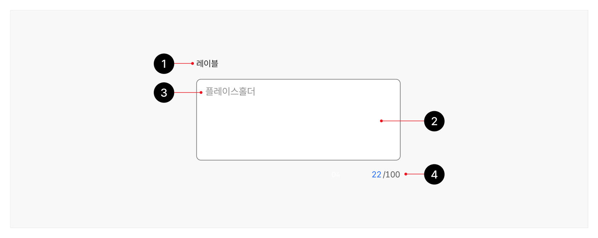
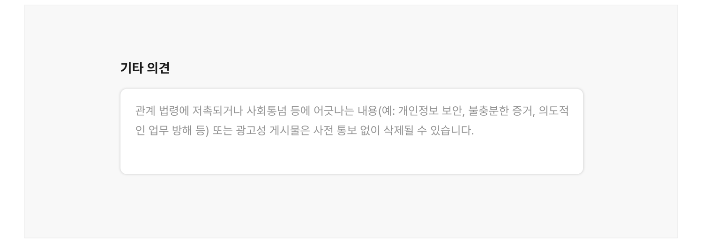
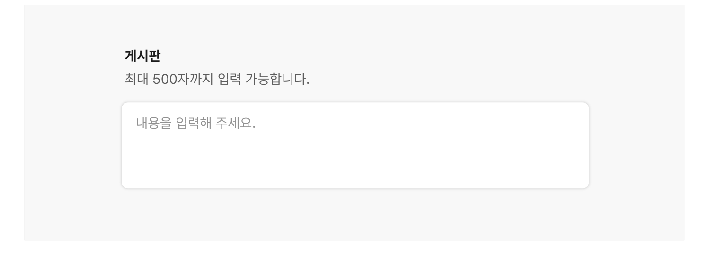

텍스트 영역은 사용자가 키보드로 글자, 숫자, 기호 등이 조합된 여러 줄의 텍스트를 입력하는 경우에 사용하는 요소이다.

## 용례

### 사용하기 적합한 경우

- 입력값이 여러 줄의 텍스트로 예상되는 경우

텍스트 입력 필드가 아니라 텍스트 영역을 사용해야 한다.

### 사용하기 적합하지 않은 경우

- 여러 가지 질문에 대한 응답을 받기 위한 경우

질문을 여러 개로 분할하고, 가능하다면 응답을 라디오 버튼이나 체크박스로 구성하여 사용자가 텍스트를 직접 입력하지 않고도 빠르게 질문에 응답할 수 있게 해야 한다.
## 구조

- 1 레이블: 사용자가 어떤 텍스트를 입력해야 하는지를 알려줌
- 2 입력 영역: 텍스트가 입력되는 영역으로 배경과 입력 영역을 구분하여 사용자가 텍스트 영역임을 인지할 수 있게 함
- 3 플레이스홀더(선택): 어떤 값을 입력해야 하는지에 대한 힌트 또는 예시를 제공함
- 4 입력된 글자 수: 입력 가능한 글자 수와 입력된 글자 수를 안내하는 텍스트



## 사용성 가이드라인

- 01 입력 영역은 텍스트의 길이를 고려하여 적절한 크기로 제공한다.
- 02 모든 텍스트 영역에는 레이블을 제공한다.
- 03 플레이스홀더가 레이블이나 도움말의 대체 수단으로 사용되어서는 안 된다.
- 04 복사, 붙여넣기를 제한하지 않는다.
- 05 입력 가능한 글자 수에 제한이 있는 경우 사용자에게 글자 수 정보를 제공한다.
### 01. 입력 영역은 텍스트의 길이를 고려하여 적절한 크기로 제공한다.

입력 영역의 높이는 사용자가 입력할 것으로 예상되는 최대 텍스트 길이에 비례하도록 제공하여 사용자가 별도의 스크롤 동작 없이도 한 번에 적절한 양의 텍스트를 확인할 수 있게 만든다.

### 02. 모든 텍스트 영역에는 레이블을 제공한다.

텍스트 입력 영역에 레이블이 제공되지 않으면 사용자는 어떤 정보를 입력해야 하는지 알 수 없다. 레이블을 생략하고자 하는 경우에는 레이블 없이도 사용자가 값을 선택하는 데 문제가 없다는 근거가 명확해야 한다.
### 03. 플레이스홀더가 레이블이나 도움말의 대체 수단으로 사용되어서는 안 된다.

플레이스홀더는 사용자가 값을 입력하기 시작하는 순간 사라진다. 플레이스홀더가 레이블이나 도움말의 대체 수단으로 활용되는 경우, 사용자는 값을 입력하는 도중 어떤 값을 입력하는 중이었는지, 어떤 형식으로 입력해야 하는지 다시 확인할 수 없다. 또한 거의 모든 웹 브라우저가 플레이스홀더 텍스트의 기본 색상을 최소 명도 대비 기준보다 낮게 제공하므로 읽기 어렵다. 이와 같이 플레이스홀더는 다양한 사용자 그룹에서 여러 사용성 문제를 야기하므로 단순히 사용자의 행동을 유도하기 위한 수단으로 사용해야 한다.

[모범 사례]



**사례 텍스트 보완**

```text
기타 의견
관계 법령에 저촉되거나 사회통념 등에 어긋나는 내용(예: 개인정보 보안, 불충분한 증거, 의도적인 업무 방해 등) 또는 광고성 게시물은 사전 통보 없이 삭제될 수 있습니다.
내용을 입력해 주세요.
```
[피해야 할 사례]


**사례 텍스트 보완**

```text
기타 의견
관계 법령에 저촉되거나 사회통념 등에 어긋나는 내용(예: 개인정보 보안, 불충분한 증거, 의도적 인 업무 방해 등) 또는 광고성 게시물은 사전 통보 없이 삭제될 수 있습니다.
```
### 04. 복사, 붙여넣기를 제한하지 않는다.

사용자가 다른 웹사이트나 플랫폼에서 텍스트를 복사하여 붙여 넣어야 하는 경우가 있을 수 있으므로 복사, 붙여넣기 기능을 제한하지 않는 것이 바람직하다.
### 05. 입력 가능한 글자 수에 제한이 있는 경우 사용자에게 글자 수 정보를 제공한다.

입력폼 주변에 레이블 다음 또는 입력 영역 다음 요소로 최대 글자 수와 남은 입력 가능 글자 수 정보를 제공한다. 남은 입력 가능 글자 수는 사용자의 입력에 따라 동적으로 업데이트하여 사용자가 입력폼을 제출하기 전에 입력 제약 사항에 대해 예측할 수 있도록 해야 한다.

[모범 사례]



**사례 텍스트 보완**

```text
게시판
최대 500자까지 입력 가능합니다.
내용을 입력해 주세요.
```


## 접근성 가이드라인

### 01. 입력 영역과 인접 배경 간 명도 대비를 3:1 이상으로 제공한다.

입력 영역의 테두리 또는 채움 색상이 인접한 배경과 3:1 이상의 명도 대비를 갖도록 스타일을 제공하는 것을 권장한다. 인접한 배경과의 명도 대비가 충분한 경우 사용자가 텍스트 영역임을 보다 명확하게 인지할 수 있다.

- KWCAG 2.2 텍스트 콘텐츠의 명도 대비
- WCAG 2.1 Non-text Contrast (AA)

### 02. 텍스트 영역에 접근 가능한 이름을 제공한다.

스크린 리더 사용자가 텍스트 영역의 용도를 확인할 수 있도록 &lt;label&gt;, title, aria-label, aria-labelledby 중 1가지 방식을 이용하여 레이블을 제공해야 한다.

- KWCAG 2.2 레이블 제공
- WCAG 2.1 Info and Relationships (A)
- WCAG 2.1 Name, Role, Value (A)


## 상호작용 가이드라인

### 마우스

### 키보드

| 구분 | 설명 |
|---|---|
| Click | 레이블 또는 입력 영역을 Click 하면 입력 영역에 커서가 활성화되면서 텍스트를 입력할 수 있게 된다. |
| Scroll | 사용자가 많은 양의 텍스트를 작성하여 영역의 기본 높이를 초과하는 경우 영역에 세로 스크롤이 생성되며, 작성한 콘텐츠를 상/하로 탐색할 수 있다. |

| 구분 | 설명 |
|---|---|
| Tab, Shift + Tab | 모든 텍스트 필드는 사용 불가인 상태를 제외하고 Tab, Shift + Tab 키를 눌렀을 때 접근할 수 있어야 한다. |
| 방향키 ↑, ↓ | 사용자가 많은 양의 텍스트를 작성하여 영역의 기본 높이를 초과하는 경우 영역에 세로 스크롤이 생성되며, 작성한 콘텐츠를 상/하로 탐색할 수 있다. |
