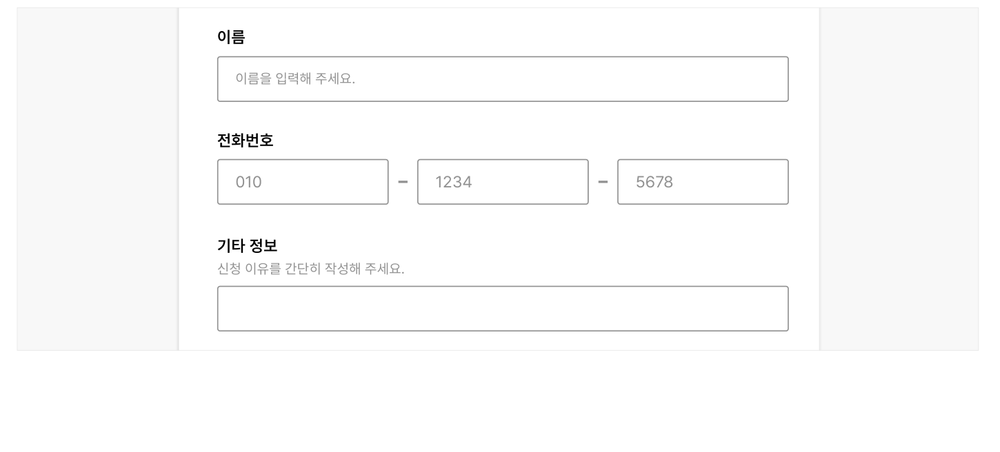
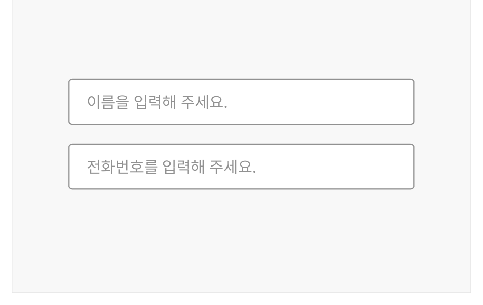

텍스트 입력 필드는 사용자가 키보드로 글자, 숫자, 기호 등이 조합된 한 줄의 짧은 텍스트를 입력하는 경우에 사용하는 요소이다.

## 용례

### 사용하기 적합한 경우

- 입력값이 한 줄의 텍스트로 예상되는 경우

사용자가 입력해야 하는 정보가 명확하고 텍스트의 길이가 고정된 경우에는 텍스트 입력 필드를 사용하는 것이 적합하다.

- 이름
- 전화번호
- 생년월일
- 최소/최대 입력값이 정해진 숫자

- 예상할 수 없는 임의의 값을 입력받고자 하는 경우

사용자의 응답을 예측할 수 없거나 사용자가 자유롭게 텍스트를 입력할 수 있게 하는 경우에는 라디오 버튼, 셀렉트가 아닌 텍스트 입력 필드를 사용하는 것이 적합하다.
### 사용하기 적합하지 않은 경우

- 입력값이 여러 줄의 텍스트로 예상되는 경우

텍스트 입력 필드가 아니라 텍스트 영역을 사용해야 한다.

- 입력값의 내용, 양식이 정해져 있는 경우

라디오 버튼, 체크박스, 셀렉트와 같은 컴포넌트를 사용해야 한다.
## 구조

1 레이블: 사용자가 어떤 텍스트를 입력해야 하는지를 안내하는 문구 2 입력 필드: 텍스트가 입력되는 영역으로 배경과 입력 필드를 구분하여 사용자가 텍스트 입력 필드임을

인지할 수 있게 함 3 도움말(선택): 입력 내용, 입력 방식에 대한 도움말 또는 오류 메시지를 제공함 4 플레이스홀더(선택): 어떤 값을 입력해야 하는지에 대한 힌트 또는 예시를 제공함

## 사용성 가이드라인

- 01 입력 필드는 텍스트의 길이를 고려하여 적절한 크기로 제공한다.
- 02 모든 텍스트 입력 필드에는 레이블을 제공한다.
- 03 플레이스홀더가 레이블이나 도움말의 대체 수단으로 사용되어서는 안 된다.
- 04 복사, 붙여넣기를 제한하지 않는다.
- 05 사용자가 자주, 반복적으로 입력하는 값은 자동 완성될 수 있도록 구현한다.
### 01. 입력 필드는 텍스트의 길이를 고려하여 적절한 크기로 제공한다.

기본적으로 텍스트 입력 필드의 크기를 그리드, 화면 크기에 따라 유동적이나 전체 섹션 영역을 차지하도록 구현한다. 그러나 이름, 우편번호, 전화번호 등 입력값의 길이를 예측할 수 있는 경우 최대 길이에 맞추어 입력 필드의 너비를 고정하고, 사용자가 더 작은 크기의 화면에서도 잘림 없이 입력값을 확인할 수 있는지를 점검해야 한다.

[모범 사례]



**사례 텍스트 보완**

```text
이름
이름을 입력해 주세요.
전화번호
1234
5678
기타 정보
신청 이유를 간단히 작성해 주세요.
```
[피해야 할 사례]


**사례 텍스트 보완**

```text
이름
이름을 입력해 주세요.
전화번호
1234
5678
기타 정보
신청 이유를 간단히 작성해 주세요.
```
### 02. 모든 텍스트 입력 필드에는 레이블을 제공한다.

텍스트 입력 필드에 레이블이 제공되지 않으면 사용자는 어떤 정보를 입력해야 하는지 알 수 없다. 레이블을 생략하고자 하는 경우에는 레이블 없이도 사용자가 값을 선택하는 데 문제가 없다는 근거가 명확해야 한다.
### 03. 플레이스홀더가 레이블이나 도움말의 대체 수단으로 사용되어서는 안 된다.

플레이스홀더는 사용자가 값을 입력하기 시작하는 순간 사라진다. 플레이스홀더가 레이블이나 도움말의 대체 수단으로 활용되는 경우, 사용자는 값을 입력하는 도중 어떤 값을 입력하는 중이었는지, 어떤 형식으로 입력해야 하는지 다시 확인할 수 없다. 또한 거의 모든 웹 브라우저가 플레이스홀더 텍스트의 기본 색상을 최소 명도 대비 기준보다 낮게 제공하므로 읽기 어렵다. 이와 같이 플레이스홀더는 다양한 사용자 그룹에서 여러 사용성 문제를 야기하므로 단순히 사용자의 행동을 유도하기 위한 수단으로 사용해야 한다.
[모범 사례]

[피해야 할 사례]



**사례 텍스트 보완**

```text
이름
이름을 입력해 주세요.
전화번호
전화번호를 입력해 주세요.
```


**사례 텍스트 보완**

```text
이름을 입력해 주세요.
전화번호를 입력해 주세요.
```
### 04. 복사, 붙여넣기를 제한하지 않는다.

사용자가 다른 웹사이트나 플랫폼에서 텍스트를 복사하여 붙여 넣어야 하는 경우가 있을 수 있으므로 복사, 붙여넣기 기능을 제한하지 않는 것이 바람직하다.

### 05. 사용자가 자주, 반복적으로 입력하는 값은 자동 완성될 수 있도록 구현한다.

사용자에게 개인 정보를 입력받는 입력 필드에 프로그램(웹 브라우저)을 통해 사용자가 기존에 입력한 정보를 활용할 수 있는 기술을 적용한다. 이를 통해 정보 입력에 필요한 사용자의 인지적, 신체적 노력을 최소화할 수 있다.


## 접근성 가이드라인

### 01. 모든 입력 필드의 초점은 시각적으로 확인할 수 있도록 표현한다.

입력 필드의 초점이 표시되지 않으면 키보드 사용자는 조작하고 있는 대상을 알 수 없으므로 초점은 시각적으로 확인할 수 있게 표현해야 한다. 특히 브라우저가 제공하는 기본 입력 필드 대신 입력 필드를 임의로 만들어 사용하는 경우, 초점 제공에 유의해야 한다.

- KWCAG 2.2 초점 이동과 표시
- WCAG 2.1 Focus Visible (AA)

### 02. 입력 필드와 인접 배경 간 명도 대비를 3:1 이상으로 표현한다.

입력 필드의 테두리 또는 채움 색상이 인접한 배경과 3:1 이상의 명도 대비를 갖도록 스타일을 제공하는 것을 권장한다. 인접한 배경과의 명도 대비가 충분한 경우, 사용자가 텍스트 입력 필드임을 보다 명확하게 인지할 수 있다.

- KWCAG 2.2 텍스트 콘텐츠의 명도 대비
- WCAG 2.1 Non-text Contrast (AA)

### 03. 텍스트 입력 필드에 접근 가능한 이름을 제공한다.

스크린 리더 사용자가 텍스트 입력 필드의 용도를 확인할 수 있도록 &lt;label&gt;, title, aria-label, arialabelledby 중 1가지 방식을 이용하여 레이블을 제공해야 한다. 이때, 가능하면 &lt;label&gt;을 이용하여 사용자가 레이블을 클릭하였을 때에도 값을 입력할 수 있도록 구현하는 것이 좋다.

- KWCAG 2.2 레이블 제공
- WCAG 2.1 Info and Relationships (A)
- WCAG 2.1 Name, Role, Value (A)


## 상호작용 가이드라인

### 데이터 입력

| 구분 | 설명 |
|---|---|
| Click | 레이블 또는 입력 필드를 Click 하면 입력 필드에 커서가 활성화되면서 텍스트를 입력할 수 있게 된다. |
| Tab, Shift + Tab | 모든 텍스트 필드는 사용 불가인 상태를 제외하고 Tab, Shift + Tab 키를 눌렀을 때 접근할 수 있어야 한다. |
