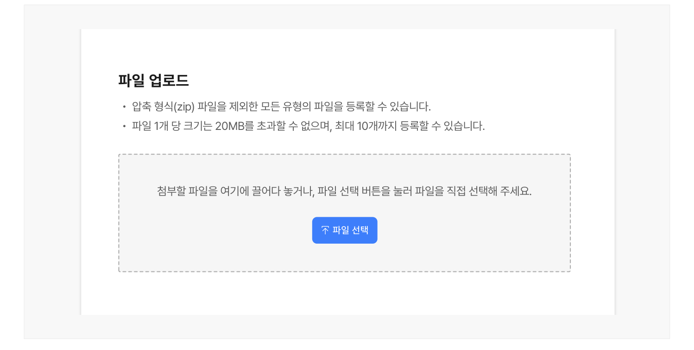
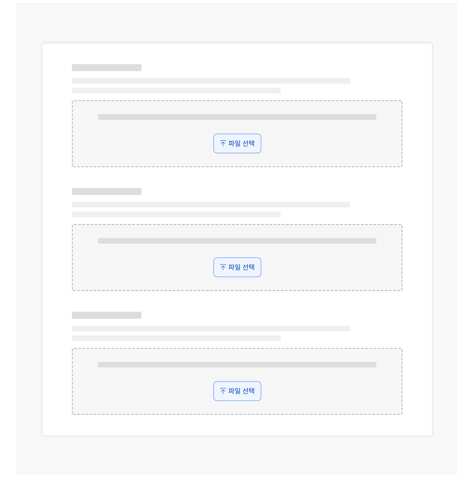
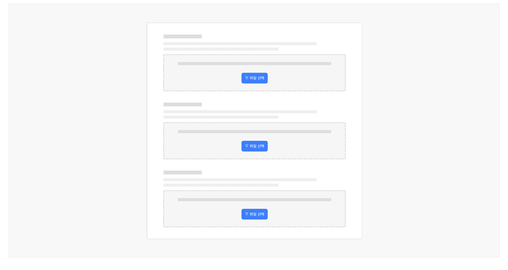
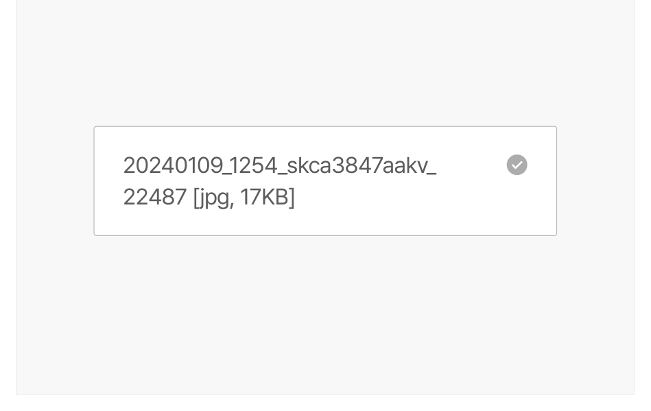
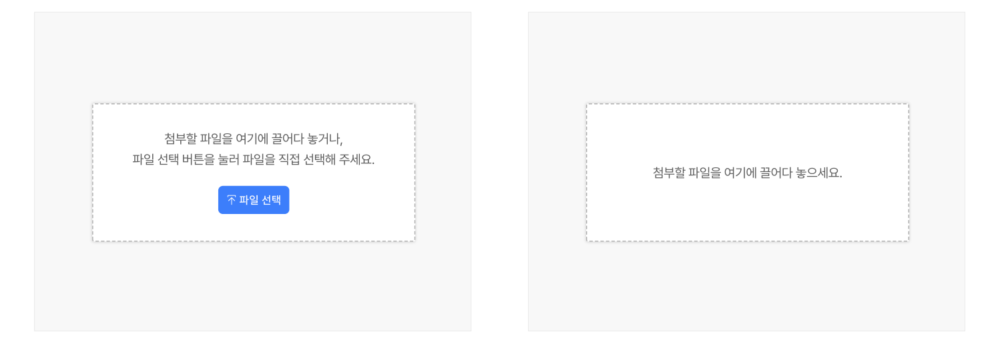

파일 업로드는 하나 이상의 디바이스의 로컬 파일을 선택하고 첨부하는 데 사용하는 입력 컴포넌트이다.

## 용례

### 사용하기 적합하지 않은 경우

- 모달 레이아웃에서의 다중 파일 업로드

업로드된 파일 목록이 수직으로 쌓이기 때문에 여러 파일을 업로드할 때는 모달 레이아웃을 사용하지 않는다.
## 유형

### 업로드 가능 파일 수

- 단일 파일 업로드

1개 파일의 업로드만 필요하거나 서로 관련이 없는 여러 개의 파일을 업로드해야 할 경우에 사용한다. 서로 관련 없는 파일은 섹션을 명확하게 구분하고 각 파일에 대해 개별적인 파일 업로드 컴포넌트를 제공하는 것이 적절하다.

- 다중 파일 업로드

한 번에 업로드할 파일을 여러 개 선택할 수 있도록 허용하는 경우에 사용한다. 모든 파일이 서로 관련되어 있는 경우(예 - 사진첩에서 여러 개의 사진을 선택하여 업로드)에 사용하기 적합하다.

### 업로드 수단

- 파일 업로더

파일 선택 대화 상자를 표시하는 작업 버튼을 클릭하여 하나 이상의 파일을 업로드할 수 있다.

- 드래그 앤 드롭

선택한 파일을 드롭 영역에 직접 끌어다 놓거나 드롭 영역 내부의 텍스트 링크를 클릭하여 파일 선택 대화 상자를 통해 파일을 업로드할 수 있다.
## 구조

- 1 레이블/제목: 파일 업로드 섹션을 설명하는 텍스트로 파일 용도 등 업로드 맥락을 제공함
- 2 설명(선택): 헤딩의 정보를 보완하는 텍스트 설명
- 3 도움말 텍스트: 업로드 프로세스 또는 요구 사항을 설명하고 파일 형식 및 크기에 대한 가이드라인을 제공
- 4 파일 선택 버튼: 업로드할 파일을 선택하는 파일 선택기를 실행하는 버튼
- 5 드롭 영역: 업로드할 파일을 끌어다 놓는 영역
- 6 카운터: 업로드 가능한 전체 파일 수와 업로드된 파일 수를 보여줌
- 7 파일 항목: 업로드가 진행 중이거나 완료된 파일의 이름, 확장자, 크기를 보여줌
- 8 삭제 버튼: 업로드된 파일을 제거하는 아이콘 버튼
- 9 업로드 상태 아이콘

a. 업로드 중: 파일이 업로드 중일 때 스피너 아이콘을 표시함 b. 성공: 문제없이 파일이 업로드되었음을 안내하는 아이콘. 성공 상태인 경우에 표시되었다 삭제

버튼으로 전환됨
도식 라벨: 1 2 5 6 7 3 4 8 9-a 9-b
## 사용성 가이드라인

- 01 파일 업로드는 필요한 경우에만 사용한다.
- 02 레이블을 제공한다.
- 03 파일 유형, 파일 크기, 파일 개수 제한에 대해 안내한다.
- 04 가능한 한 파일 형식을 제한하지 않는다.
- 05 가능한 한 파일 크기를 제한하지 않는다.
- 06 이미지 유형의 파일에 대해 파일 크기 자동 압축 기능을 제공한다.
- 07 파일이 업로드된 후에도 파일 선택 버튼을 기본 상태로 유지한다.
- 08 파일 선택 버튼을 적절한 강조 수준으로 표현한다.
- 09 파일을 자동으로 제출하지 않는다.
- 10 오류 상태에 대한 구체적인 오류 메시지를 제공한다.
- 11 업로드된 파일 이름 텍스트를 두 줄로 제공하지 않는다.
### 01. 파일 업로드는 필요한 경우에만 사용한다.

파일 업로드는 파일의 탐색과 선택이라는 복잡한 과업을 사용자에게 요구한다. 파일 업로드 컴포넌트를 사용하기 전에 파일의 첨부가 꼭 필요한지 확인하여 사용자에게 불필요한 입력을 요청하지 않아야 한다.

### 02. 레이블을 제공한다.

파일 업로더에 명확한 레이블을 제공하여 사용자가 파일의 제출 용도와 정확히 어떤 파일을 업로드해야 하는지 명확하게 알 수 있도록 한다.
### 03. 파일 유형, 파일 크기, 파일 개수 제한에 대해 안내한다.

업로드 가능한 문서 유형, 파일 크기, 파일 개수에 제한이 있는 경우 도움말 텍스트를 사용하여 제약 사항에 대한 정보를 강조하여 표시한다. 이를 통해 사용자가 잘못된 형식의 파일을 업로드하거나 너무 큰 파일을 업로드하여 오류가 발생하는 것을 방지할 수 있다.

[모범 사례]



**사례 텍스트 보완**

```text
파일 업로드
압축 형식(zip) 파일을 제외한 모든 유형의 파일을 등록할 수 있습니다.
파일 1개 당 크기는 20MB를 초과할 수 없으며, 최대 10개까지 등록할 수 있습니다.
첨부할 파일을 여기에 끌어다 놓거나, 파일 선택 버튼을 눌러 파일을 직접 선택해 주세요.
파일 선택
```
### 04. 가능한 한 파일 형식을 제한하지 않는다.

제출을 요구하는 파일의 일반적인 형식을 확인하여 사용자가 다양한 파일 형식을 업로드할 수 있도록 한다. 모든 사람이 동일한 소프트웨어에 접근할 수 있는 것이 아니므로 불필요한 소프트웨어 설치 요구 등을 피하기 위해 업로드 파일 형식을 유연하게 구성해야 한다. 이때, 파일의 확장자에도 부적절한 제한이 발생하지 않도록 한다(예 - JPEG 형식의 파일에 대해 .jpg, .jpeg, .jpe 등의 확장자를 허용함).

### 05. 가능한 한 파일 크기를 제한하지 않는다.

만약 업로드 가능한 파일 크기를 제한해야 한다면 제출을 요구하는 파일의 일반적인 크기를 확인하여 사용자가 원활하게 파일을 업로드할 수 있도록 해야 한다. 어떤 사용자는 파일의 크기를 줄이는 방법을 알지 못할 수 있으며, 파일 크기를 원하는 수준으로 줄이기 위해서는 다른 도구를 사용해야 한다.

### 06. 이미지 유형의 파일에 대해 파일 크기 자동 압축 기능을 제공한다.

이미지를 원하는 크기와 품질로 줄이는 과정에는 여러 번의 테스트가 필요하다. 만약 사용자의 이미지 파일 제출이 필요하고 용량을 제한해야 한다면 파일 크기를 필요한 수준으로 압축하는 기능을 제공하는 방안을 고려한다.
### 07. 파일이 업로드된 후에도 파일 선택 버튼을 기본 상태로 유지한다.

사용자가 파일을 선택한 후에도 새 파일을 추가하거나 변경할 수 있도록 파일 선택 버튼 또는 드롭 영역을 사용 가능한 기본 상태로 유지한다. 파일 업로드의 사용 불가 상태는 사용자의 입력 행위 자체를 제한할 때에 사용한다.
### 08. 파일 선택 버튼을 적절한 강조 수준으로 표현한다.

화면에 입력폼 제출 버튼과 같은 최상위 수준의 버튼이 존재하는 경우에는 하위 위계 수준의 버튼 강조 표현을 사용하여 핵심 작업과 파일 업로드 작업이 충돌하지 않도록 한다.

[모범 사례]



**사례 텍스트 보완**

```text
파일 선택
```
### [피해야 할 사례]



**사례 텍스트 보완**

```text
파일 선택
```
### 09. 파일을 자동으로 제출하지 않는다.

사용자가 입력폼을 제출할 때까지 파일을 서버에 업로드하거나 저장해서는 안 된다.

### 10. 오류 상태에 대한 구체적인 오류 메시지를 제공한다.

사용자가 어떤 종류의 오류가 발생했는지 명확히 이해할 수 있도록 구체적인 오류 메시지를 제공한다. 파일 업로드에 제공할 수 있는 오류 메시지는 다음과 같다. 기타 항목은 파일 업로더의 능력에 따라 선택적으로 제공할 수 있는 오류 상태이다.

- 선택한 파일이 없는 경우
- 잘못된 파일 형식인 경우
- 파일이 너무 큰 경우
- 파일이 비어있는 경우
- 문제가 발생하여 파일이 업로드되지 않은 경우
- 사용자가 선택할 수 있는 파일 수에 제한이 있는 경우
- 기타: 파일이 비밀번호로 보호되어 있는 경우, 파일에 바이러스가 포함된 경우 등
### 11. 업로드된 파일 이름 텍스트를 두 줄로 제공하지 않는다.

파일 이름이 길어 텍스트가 파일 항목 컨테이너를 벗어나는 경우 말줄임표를 사용한다.

[모범 사례]

[피해야 할 사례]



**사례 텍스트 보완**

```text
20240109_1254_skca… [jpg, 17KB
```


**사례 텍스트 보완**

```text
20240109_1254_skca3847aakv_ 22487 [jpg, 17KB
```
## 접근성 가이드라인

### 01. 파일 업로드에 적절한 레이블을 제공한다.

업로드가 필요한 파일의 용도를 이해할 수 있는 적절한 설명을 제공해야 한다.

- KWCAG 2.2 레이블 제공
- WCAG 2.1 Headings and Labels (AA)

### 02. 파일 항목과 항목 삭제 버튼을 하나의 그룹으로 제공한다.

사용자가 여러 개의 파일을 업로드하는 경우, 스크린 리더 사용자는 연속된 파일명과 파일 삭제 버튼 요소 간 관계를 인지하기 어려워진다. 단일 파일 업로드 형식에서는 항목을 &lt;p&gt;로, 다중 파일 업로드 형식에서는 &lt;ul&gt;, &lt;li&gt; 구조로 파일 항목과 삭제 버튼을 그룹화한다. 그런 다음 파일 항목 텍스트와 항목 삭제 버튼을 ariadescribedby 속성으로 연결하여 두 요소 간 컨트롤 관계가 보다 명확하게 스크린 리더로 전달될 수 있도록 한다.

- KWCAG 2.2 콘텐츠의 선형화
- WCAG 2.1 Info and Relationships (A)

### 03. 키보드 초점을 명확하게 표시한다.

파일 선택 버튼이 초점을 가진 상태에서 포커스링이 시각적으로 명확하게 표시되어야 한다.

- KWCAG 2.2 초점 이동과 표시
- WCAG 2.1 Focus Visible (AA)
- WCAG 2.1 Non-text Contrast (AA)
### 04. 드래그 앤 드롭 유형은 반드시 파일 업로더와 함께 사용한다.

경로 기반 동작을 수행할 수 없는 사용자 입력 인터페이스를 이용하는 사용자, 정교한 마우스 컨트롤이 어려운 사용자를 고려하여 단순 마우스 Click과 키보드 Enter 동작만으로도 파일을 업로드할 수 있게 해야 한다.

- KWCAG 2.2 키보드 사용 보장
- KWCAG 2.2 누르기 동작 지원
- WCAG 2.1 Keyboard (A)
- WCAG 2.1 No Keyboard Trap (A)
- WCAG 2.1 Pointer Gestures (A)

[모범 사례]



**사례 텍스트 보완**

```text
첨부할 파일을 여기에 끌어다 놓거나,
파일 선택 버튼을 눌러 파일을 직접 선택해 주세요.
파일 선택
```
[피해야 할 사례]


**사례 텍스트 보완**

```text
첨부할 파일을 여기에 끌어다 놓으세요.
```
### 05. 스크린 리더로 접근할 수 있도록 한다.

파일 업로드 컴포넌트의 역할이 스크린 리더로 전달될 수 있도록 시각적으로 숨겨진 &lt;input type="file"&gt;에 적절한 숨김 스타일을 사용해야 한다.

- WCAG 2.1 Name, Role, Value (A)
## 상호작용 가이드라인

### 탐색

### 파일 업로드

| 구분 | 설명 |
|---|---|
| Tab | 파일 선택 버튼/드롭 영역, 파일 삭제 버튼에 접근할 수 있다. |
| 방향키 ↑, ↓ | 파일 선택기가 활성화되었을 때 키보드의 방향키 ↑, ↓을 눌러 파일을 탐색할 수 있다. |

| 구분 | 설명 |
|---|---|
| Click | 파일 선택기가 활성화된 상태에서 파일을 선택하고 '열기' 버튼을 Click 하면 업로드를 시작할 수 있다. |
| Space, Enter | 파일 선택기가 활성화되었을 때 업로드할 파일 및 '열기' 버튼에 초점을 가진 상태에서 Space 또는 Enter 키를 눌러 파일 선택기를 활성화할 수 있다. |
| Drag & Drop | 파일이 첨부된 드롭 영역의 범위 내에서 마우스를 아무 곳으로나 Drag 하면 해당 영역 안에 파일을 Drop 하고 업로드를 시작할 수 있다. |
### 파일 삭제

| 구분 | 설명 |
|---|---|
| Click | 삭제 버튼을 Click 하면 파일이 삭제된다. |
| Space, Enter | 삭제 버튼이 초점을 가진 상태에서 Space 또는 Enter 키를 누르면 파일이 삭제된다. |
