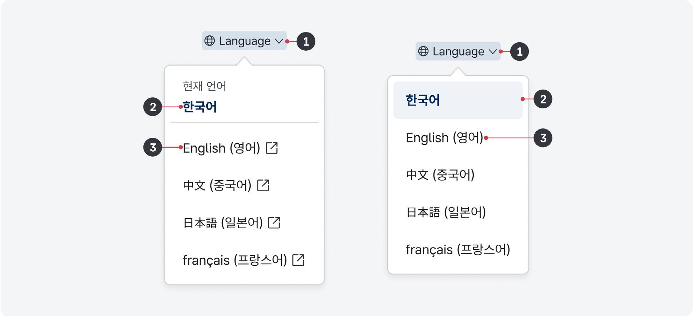
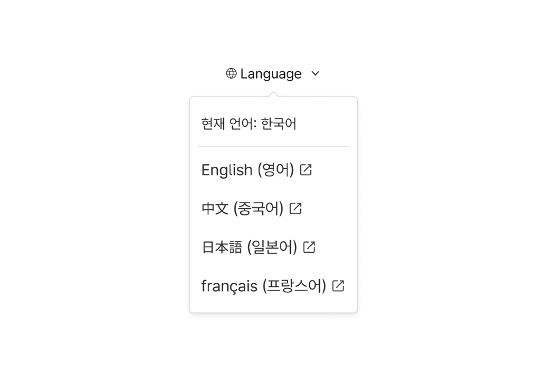
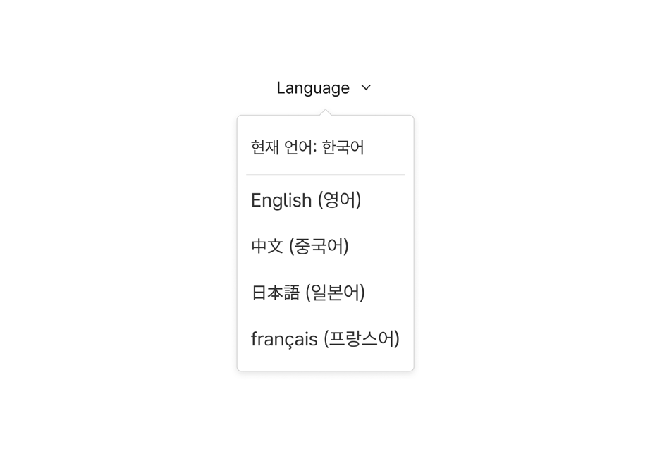
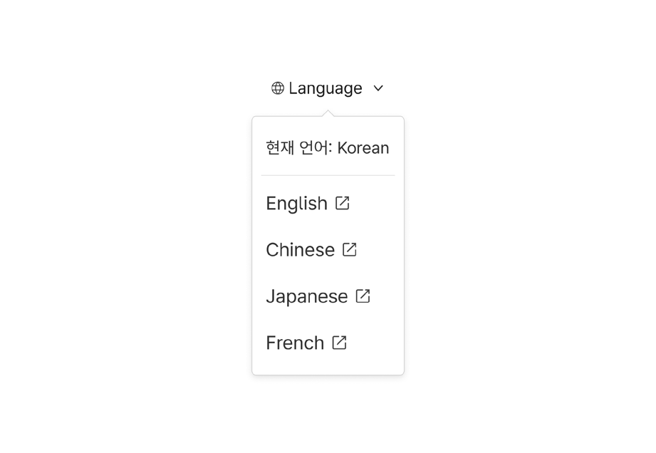
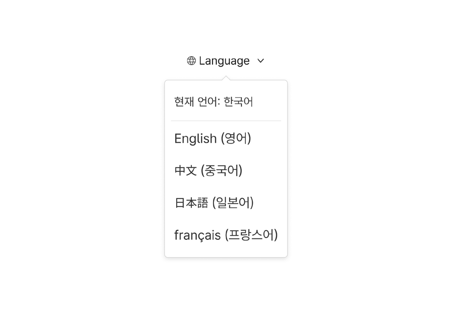

### 언어 변경

언어 변경은 서비스의 콘텐츠를 표시할 언어를 변경하거나 별도의 외국어 서비스로 이동하는 데 사용되는 요소이다. 한국어가 익숙하지 않은 사용자가 콘텐츠 표시 언어를 변경할 수 있는 수단을 발견하지 못한다면 서비스를 이용할 수 없게 되므로, 디지털 정부서비스로 직관적이고 일관된 방식으로 언어 변경을 제공하는 것이 매우 중요하다.

## 유형

### 링크

서비스가 2개의 언어를 지원하는 경우, 두 언어 간 표시를 전환할 때 사용한다.

### 드롭다운

서비스가 3개 이상의 언어를 지원하는 경우 사용한다.
## 구조

1 아이콘과 레이블: 언어 변경 옵션 목록을 실행하는 데 사용하는 버튼/링크의 이름 2 현재 언어: 현재 표시되고 있는 언어 이름 3 옵션: 사용자가 선택할 수 있는 표시 언어 옵션 값의 목록. 언어 이름을 ‘원어-현재 서비스를 표시하는 데

사용된 언어’로 작성함

## 사용성 가이드라인

- 01 링크 레이블에 아이콘을 제공한다.
- 02 링크 레이블은 전환되는 언어의 이름을 해당 언어로 작성한다.
- 03 링크 레이블을 언어 코드로 축약하지 않는다.
- 04 국가명은 필요한 경우에만 사용한다.
- 05 외국어 서비스로 이동하는 경우 링크를 새 창으로 실행하고, 새 창 열림 아이콘을 제공한다.

### 링크 레이블에 아이콘을 제공한다.

드롭다운 유형에서 레이블 왼쪽에 지구본 형태의 아이콘을 표시하여 사용자가 버튼의 용도를 직관적으로 인지할 수 있도록 표현한다. 언어 변경을 필요로 하는 사용자는 레이블 텍스트만으로 의미를 이해하는 것이 어려울 수 있으므로 사용자에게 익숙한 기호 체계를 활용하여 부가적인 단서를 제공해야 한다.

[모범 사례]

[피해야 할 사례]

### 링크 레이블은 전환되는 언어의 이름을 해당 언어로 작성한다.

사용자가 링크 레이블을 읽고 이해할 수 있어야 이용하기 적합한 언어로 전환하거나 관련 서비스로 이동할 수 있다. 만약 모든 언어 이름이 영어로 작성되어 있다면 영어를 읽을 수 없는 사용자는 자신에게 필요한 서비스가 제공되고 있더라도 사용할 수 없을 것이다.

특히 링크 유형의 언어 변경 방식을 사용할 때, 두 언어 간 링크 레이블을 반대로 제공하거나 하나의 언어로만 고정하여 제공하지 않도록 유의해야 한다. 예를 들어, 한국어, 영어로 표시되는 서비스가 있다면 한국어 화면에서 링크 레이블은 ‘English’, 영어 화면에서 링크 레이블은 ‘한국어’로 표시되어야 한다.

[모범 사례]

### [피해야 할 사례]

### 국가명은 필요한 경우에만 사용한다.

한 국가 내에서도 다양한 언어가 사용되므로 서비스 언어 변경을 위한 링크 레이블을 국가와 관련된 정보로 표현하는 것은 적절하지 않다. 만약 사용자의 국적이나 접속 국가에 따라 제공되는 서비스가 달라지거나 서비스 정책이 변경되는 경우에는 링크에 국가명을 보조적인 정보로 제공할 수 있다. 그러나 국가명을 보조적인 정보로 제공하는 경우에도 언어명이 가장 강조된 정보여야 한다.

### 외국어 서비스로 이동하는 경우 링크를 새 창으로 실행하고, 새 창 열림 아이콘을 제공한다.

이때, 외국어 서비스는 서비스 내 콘텐츠 전체 내용을 외국어로 번역하는 대신, 외국어 사용자들에게 가장 중요하고 필수적인 정보만을 선별하여 제공하는 간소화된 다국어 정보 플랫폼을 의미한다. 별도의 외국어 서비스를 제공하는 경우, 사용자가 언어 변경을 시도하게 되면 사용자가 탐색 중인 화면의 맥락과 상관없이 외국어 서비스의 대표 화면으로 이동하게 된다. 사용자가 이용 맥락의 변화로 인한 혼동을 겪지 않도록 링크를 새 창으로 실행하고, 새 창 열림 아이콘을 제공해야 한다.

- [모범 사례 1]

- [모범 사례 2]

플랫폼에 대한 고려 사항

### 화면 너비가 충분하지 않은 경우, 언어 변경 컴포넌트를 햄버거 메뉴 내부나 푸터에 배치한다.

외국어로 표시된 콘텐츠에 대한 이용 빈도가 높거나 언어 변경이 중요한 서비스인 경우 언어 변경 버튼을 푸터에 배치하여, 사용자가 숨겨진 콘텐츠 영역을 탐색하지 않고도 쉽게 기능을 발견할 수 있도록 하는 것이 좋다. 일반적인 서비스에서는 헤더의 복잡성을 줄이기 위해, ‘헤더’ 컴포넌트 가이드라인을 참조하여 햄버거 메뉴 내부에 언어 변경 버튼을 배치한다.
## 접근성 가이드라인

### 01. 링크에 lang 속성을 선언하고 레이블과 일치하는 언어 코드를 속성값으로 제공한다.

스크린 리더가 lang 속성값으로 제공된 언어 코드를 식별하여 해당 언어에 맞는 발음과 억양으로 레이블을 읽어주게 된다. 잘못된 발음은 링크 레이블의 내용 이해를 어렵게 만들며, 해석에 정신적 노력이 필요하므로 피로를 증가시킨다.

- WCAG 2.1 Language of Parts (AA)
## 상호작용 가이드라인

### 드롭다운 목록 확장 및 축소

### 드롭다운 목록 탐색

| 구분 | 내용 |
|---|---|
| Click | 컨테이너를 Click 했을 때, 옵션 목록이 확장되거나 축소된다.옵션 목록이 확장된 상태에서 레이블, 컨테이너, 옵션 목록이 아닌 영역을 Click 하면 옵션 목록은 축소되어야 한다. |
| Enter, Space | 컨테이너에 초점이 있는 경우, 옵션 목록이 확장되거나 축소된다. |
| Esc | 옵션 목록을 축소하고 컨테이너로 초점이 이동해야 한다. |

| 구분 | 내용 |
|---|---|
| Tab, Shift + Tab | Tab, Shift + Tab 키를 눌렀을 때 옵션에 접근할 수 있어야 한다. |
| Scroll | 옵션 목록에 스크롤이 생성된 경우 목록이 상/하로 이동한다. |
